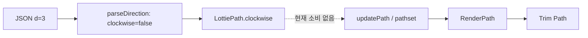

# #4072 — Lottie Path의 direction 적용

- **Link:** https://github.com/thorvg/thorvg/issues/4072
- **난이도:** 48/100
- **초심자 추천:** 조건부
- **관련 영역:** Lottie Path parser/model, RenderPath 역방향 변환, trim path
- **배울 수 있는 것:** cubic Bezier 역순, closed contour, trim 진행 방향
- **조사 기준:** `main@f989b27892bab31f224f810a54782055eba1e3bc`

## 이슈 요약

Lottie shape의 `d` direction 값은 trim path의 순차 drawing 방향을 정한다. Rect/Ellipse 등은 동작하지만 자유 Path에서는 적용되지 않는다는 compliance 이슈다.

## 난이도 산정

| 항목 | 점수 | 근거 |
|---|---:|---|
| 재현·증거 불확실성 (0-20) | 5 | parser에서 소비되지 않는 상태가 확인되고 최소 `d=1/3` fixture를 만들기 쉽다. |
| 변경 범위 (0-25) | 9 | Lottie 자유 Path의 model/builder와 focused test로 좁혀진다. |
| 구현 복잡도 (0-25) | 14 | line/cubic, open/closed와 여러 subpath를 의미 보존하며 뒤집어야 한다. |
| 교차 영향 위험 (0-20) | 13 | trim/modifier/expression과 fill winding·stroke cap에 영향이 있을 수 있다. |
| 검증 부담 (0-10) | 7 | command별 reverse 및 animated/multi-subpath render test가 필요하다. |
| **합계** | **48** |  |

- **실현 가능성: 높음.** 원인 경계가 선명하고 public API/ABI 변경이 없지만, 단순 point array reverse로 구현하면 cubic과 contour를 깨뜨리므로 기하 test가 필요하다.

## main 코드 조사

- `src/loaders/lottie/tvgLottieParser.cpp::parsePath()`는 현재 `parseDirection(path,key)`를 호출하므로 `d` 값은 `LottieShape::clockwise`에 이미 저장된다.
- Rect/Ellipse builder는 이 bool을 `appendRect/appendCircle(..., clockwise)`에 전달한다.
- `LottieBuilder::updatePath()`는 `LottiePathSet::pathset()` 결과를 그대로 RenderPath에 넣고 `path->clockwise`를 사용하지 않는다.
- 즉 parser 지원은 들어왔지만 자유 path를 역방향으로 만드는 builder/model 단계가 빠져 있다.

```text
원래 cubic:  P0 --(C1, C2)--> P1
역방향:      P1 --(C2, C1)--> P0

MoveTo는 contour 시작점으로 다시 만들고 Close는 같은 contour에 유지해야 한다.
```



## 원인 가설

**강한 코드 단서:** Path의 direction 상태가 저장된 뒤 소비되지 않는다. counter-clockwise일 때 각 contour의 command/point 순서와 cubic control point 순서를 뒤집어야 trim 길이 진행이 반대가 된다.

## 수정 방향과 실현 가능성

1. 동일 path의 `d=1/3`과 trim 0→50% fixture를 추가한다.
2. line/cubic/open/closed contour별 RenderPath reverse helper를 설계한다.
3. animated PathSet 생성 후 modifier/trim 전에 direction을 적용하고 Rect/Ellipse 결과와 비교한다.
4. reverse를 Lottie 전용 helper로 둘지 공통 `RenderPath` 연산으로 둘지는 다른 caller 필요성이 확인된 뒤 결정한다.

## 위험/검증

Cubic 역순에서는 control1/control2가 교환되어야 한다. 여러 subpath, fill rule, open cap, expression/modifier를 검사해야 한다. 원인 범위가 선명하고 기하 학습 가치가 높아 초심자에게 추천한다.

## 참고 자료

- `src/loaders/lottie/tvgLottieParser.cpp` — `parseDirection()`, `parsePath()`
- `src/loaders/lottie/tvgLottieModel.h` — `LottieShape::clockwise`, `LottiePath`
- `src/loaders/lottie/tvgLottieProperty.h` — `LottiePathSet` frame 평가
- `src/loaders/lottie/tvgLottieBuilder.cpp` — `updatePath()`와 Rect/Ellipse 비교
- `src/renderer/tvgRender.h` — `RenderPath` command/point 표현
- `test/testLottie.cpp` — Lottie regression test
- Issue 본문에 저장된 Lottie Path spec URL과 비교 이미지
