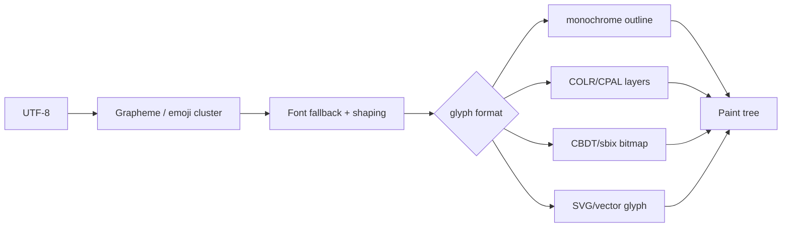

# #4092 — ThorVG Text emoji 지원

- **Link:** https://github.com/thorvg/thorvg/issues/4092
- **난이도:** 98/100
- **초심자 추천:** 비추천
- **관련 영역:** Unicode segmentation/shaping, font fallback, color font/SVG emoji
- **배울 수 있는 것:** ZWJ·variation selector, COLR/CPAL/CBDT/SVG font tables, glyph fallback
- **조사 기준:** `main@f989b27892bab31f224f810a54782055eba1e3bc`

## 이슈 요약

단일 Unicode emoji, skin-tone/ZWJ sequence, color emoji font 또는 vector mapping을 ThorVG Text pipeline에 지원하자는 대규모 기능 제안이다.

## 난이도 산정

| 항목 | 점수 | 근거 |
|---|---:|---|
| 재현·증거 불확실성 (0-20) | 18 | “emoji format”이 표준 color font, fallback, bundled vector 중 어느 목표인지 확정되지 않았다. |
| 변경 범위 (0-25) | 25 | Unicode cluster, font fallback, SFNT color tables, Text model/API, renderer와 packaging 전반이다. |
| 구현 복잡도 (0-25) | 25 | ZWJ/variation sequence shaping과 다색/bitmap/vector glyph 합성을 새로 설계해야 한다. |
| 교차 영향 위험 (0-20) | 20 | text metrics/layout, public API/ABI, font ownership, 메모리와 모든 backend에 영향이 있다. |
| 검증 부담 (0-10) | 10 | Unicode corpus, 여러 font format/OS/backend, metrics와 binary-size 검증이 필요하다. |
| **합계** | **98** |  |

- **실현 가능성: 낮음(전체 제안).** “BMP 밖 단색 outline emoji 한 글자”처럼 범위를 자르면 별도 중간 난이도 작업이지만, 본문 목표 전체는 신규 text subsystem에 가깝다.

## main 코드 조사

- `src/renderer/tvgText.h`는 하나의 `FontLoader`에서 UTF-8 glyph path를 얻어 내부 Shape로 렌더한다.
- `src/loaders/sfnt/tvgSfntReader.cpp`는 cmap 4/6/12/13으로 Unicode codepoint→glyph를 찾는다.
- SFNT loader에는 COLR/CPAL, CBDT/CBLC, sbix, SVG color glyph table parser가 보이지 않는다.
- font fallback chain, grapheme/ZWJ sequence shaping과 여러 색 layer를 반환하는 Text 모델도 없다.

| 능력 | current main |
|---|---|
| UTF-8 codepoint decode | 있음, `SfntLoader::_codepoints()` |
| cmap lookup | format 4/6/12/13 |
| 한 font의 outline glyph→path | 있음 |
| font fallback chain | 없음 |
| grapheme/ZWJ shaping | 없음 |
| COLR/CPAL, CBDT/CBLC, sbix, SVG color glyph parser | 저장소 SFNT reader에서 확인되지 않음 |
| 한 Text가 다색 paint group 반환 | 현재 `TextImpl`은 내부 `Shape` 하나 |

## 원인 가설

**확인된 구조:** 현재 pipeline은 단색 outline glyph 하나를 전제로 하므로 codepoint가 cmap에 있어도 color emoji/sequence를 올바르게 만들 수 없다. “custom format”보다 먼저 지원할 표준 font format과 fallback API를 정해야 한다.

## 수정 방향과 실현 가능성

1. 목표를 monochrome emoji fallback, COLR/CPAL, bitmap emoji, SVG emoji 중 하나로 분리한다.
2. grapheme/ZWJ cluster와 font fallback 선택 API를 설계한다.
3. Text가 단일 Shape가 아닌 다색 paint group을 생성할 수 있는지 검토한다.
4. cursor/glyph metrics가 cluster 단위를 어떻게 노출할지 C++/C API RFC를 먼저 작성한다.
5. font format 하나의 MVP를 선택하고 SW/GL/WG가 공통 Paint tree를 소비하도록 renderer-specific emoji 코드를 피한다.

## 위험/검증

Unicode/emoji spec 변화, 라이선스, 대형 font 메모리와 C/C++ cursor metrics ABI가 크다. 플랫폼 간 일관성과 binary size를 검증해야 하며 초심자 이슈가 아니다.

## 참고 자료

- `src/renderer/tvgText.h`, `tvgText.cpp` — 한 FontLoader/Shape 기반 Text 구현
- `src/loaders/sfnt/tvgSfntLoader.cpp` — UTF-8 decode, layout와 glyph path 생성
- `src/loaders/sfnt/tvgSfntReader.cpp` — cmap 4/6/12/13 dispatch
- `src/loaders/sfnt/tvgTtfReader.cpp`, `tvgOtfReader.cpp` — outline glyph reader
- `inc/thorvg.h`, `src/bindings/capi/thorvg_capi.h` — Text/metrics 공개 API
- Issue 본문에 저장된 Unicode Emoji, Noto Color Emoji, OpenMoji 참고 링크
