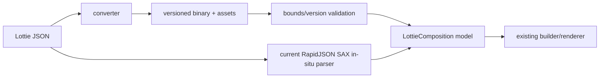

# #4097 — Lottie 대응 신규 binary format

- **Link:** https://github.com/thorvg/thorvg/issues/4097
- **난이도:** 100/100
- **초심자 추천:** 비추천
- **관련 영역:** format/schema versioning, Lottie model/parser, converter/tooling
- **배울 수 있는 것:** binary serialization, forward compatibility, zero-copy와 보안
- **조사 기준:** `main@f989b27892bab31f224f810a54782055eba1e3bc`

## 이슈 요약

JSON Lottie보다 작고 빠르게 load되는 ThorVG 전용 binary schema, parser, JSON converter를 만들자는 장기 기능 제안이다.

## 난이도 산정

| 항목 | 점수 | 근거 |
|---|---:|---|
| 재현·증거 불확실성 (0-20) | 20 | baseline profile, size/load/RSS 목표와 Lottie 호환·version 범위가 정해지지 않았다. |
| 변경 범위 (0-25) | 25 | schema, runtime loader/model, converter, file/MIME API, assets, build/CI와 배포 전반이다. |
| 구현 복잡도 (0-25) | 25 | extensible serialization, validation, allocation/zero-copy와 spec evolution을 함께 설계해야 한다. |
| 교차 영향 위험 (0-20) | 20 | 새 untrusted format, tool/runtime drift, public format contract와 장기 호환 책임이 생긴다. |
| 검증 부담 (0-10) | 10 | 대규모 corpus round-trip, malformed fuzz, version/endianness와 성능·size 측정이 필요하다. |
| **합계** | **100** |  |

- **실현 가능성: 낮음(단일 Issue).** profile/RFC/prototype/converter/runtime/fuzz를 독립 하위 프로젝트로 분리하면 단계별 실현은 가능하다.

## main 코드 조사

- 현재 `LottieLoader::prepare()`는 RapidJSON 기반 `LottieParser`로 text JSON을 내부 `LottieComposition` model로 만든다.
- LoaderMgr에는 이 binary schema를 식별할 magic/version/FileType이 없다.
- 저장소의 Lottie tool은 `lottie2gif`이며 binary converter/serializer는 없다.
- 관련 #2647의 전체 입력 복사 문제는 in-situ parser의 writable buffer 요구와도 연결되며, binary format 없이 read-only parser 개선으로 일부 해결 가능하다.



| 현재 진입점 | 확인 결과 |
|---|---|
| extension/MIME dispatch | `.lot`, `.json`, `lot`, `lottie+json`만 Lottie loader로 연결 |
| parser | RapidJSON iterative SAX + `kParseInsituFlag` |
| model | pointer/Array 중심 `LottieComposition` object graph |
| tool | `lottie2gif`, `svg2png`; binary converter 없음 |
| schema magic/version | current main에 전용 FileType/loader 없음 |

## 원인 가설

**추론:** 성능 문제를 schema 하나로 해결하려면 parse 시간, model allocation, image/font asset, compression 중 실제 병목을 먼저 분리해야 한다. dotLottie container 재사용과 자체 format의 유지보수 비용도 비교되지 않았다.

## 수정 방향과 실현 가능성

1. 대표 asset에서 JSON scan, model allocation, asset decode 시간/RSS를 profile한다.
2. dotLottie/압축 JSON/non-in-situ parser/자체 schema를 비교한다.
3. 자체 format이 필요하면 versioning, unknown field, endian, bounds validation과 converter reproducibility를 먼저 spec으로 만든다.
4. representative corpus의 JSON→binary→model/render round-trip과 tool/runtime version compatibility를 acceptance로 정의한다.
5. schema prototype은 기존 builder가 소비하는 model 경계를 유지하고, zero-copy는 pointer lifetime/endianness 검증 후 별도 단계로 둔다.

```text
profile에서 JSON scan이 병목 아님 ─▶ binary format 보류
JSON scan/복사가 병목            ─▶ read-only SAX/압축 JSON 먼저 비교
model allocation이 병목          ─▶ arena/flat model prototype 비교
전송 크기가 병목                 ─▶ dotLottie/압축 container 비교
모두 부족하고 목표 수치 충족 가능 ─▶ 자체 schema RFC
```

## 위험/검증

Lottie spec 진화마다 converter/runtime 동기화가 필요하고 malformed binary는 보안 위험이다. C/C++ loader API와 MIME, tooling 배포까지 포함한다.

## 이전 보류 해소

format·성능 목표와 호환 범위가 정량화되지 않아 구현 계획을 단일 issue 크기로 좁힐 수 없다는 사실은 그대로다. 이번에는 이를 보류 사유로 남기지 않고 다섯 난이도 요소의 최대 위험으로 반영해 100점으로 확정했다.

## 참고 자료

- `src/loaders/lottie/tvgLottieLoader.cpp` — current JSON load/prepare/model build
- `src/loaders/lottie/tvgLottieParserHandler.h` — RapidJSON iterative in-situ SAX parser
- `src/loaders/lottie/tvgLottieModel.h`, `tvgLottieProperty.h` — target object model
- `src/renderer/tvgLoaderMgr.cpp`, `src/renderer/tvgLoader.h` — FileType/extension/MIME dispatch
- `tools/lottie2gif/` — 현재 제공되는 Lottie tool
- `docs/issue/2647-84.md` — input copy/in-situ ownership 관련 분석
- Issue 본문에 저장된 #2647와 dotLottie 관련 설명 — alternative 비교 출발점
