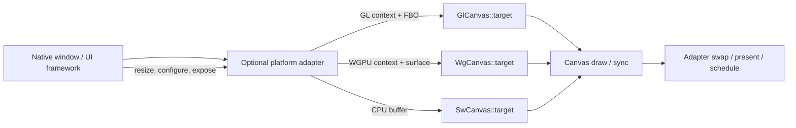

# #4098 Improve Support for Native Windowing Systems

- Link: https://github.com/thorvg/thorvg/issues/4098
- 난이도: 89/100
- 실현 가능성: 중간
- 초심자 추천: 비추천 — 한 플랫폼의 예제 보강은 가능하지만 전체 이슈는 수명·present·빌드 경계를 함께 설계해야 한다.
- 관련 영역: GL/WGPU canvas target, native surface, examples, optional platform integration
- 분석 기준: `main` working tree `f989b27892ba`
- 조사 상태: 보류 해제 — core의 책임 경계와 backend별 target/present 차이를 코드에서 확인했다.

## 이슈 요약

X11/Wayland, Win32, iOS, Android 같은 native window에 GL/WGPU canvas를 연결하는 계약과 예제를 제공하자는 요청이다. 현재 ThorVG는 **이미 생성된 GPU 자원**을 받는 injection point는 제공하지만, window 생성·event loop·buffer swap/present를 통합하는 계층은 제공하지 않는다.

전체 목표를 core API 하나로 해결하기보다는, core를 window-system agnostic 상태로 유지하면서 optional integration/example 계층을 두는 편이 현재 구조와 맞는다.

## 난이도 산정

| 항목 | 점수 | 근거 |
|---|---:|---|
| 재현·증거 불확실성 (0-20) | 14 | 단일 버그 재현이 아니라 플랫폼별 요구사항을 합의해야 하는 기능 이슈다. |
| 변경 범위 (0-25) | 24 | GL/WGPU, desktop/mobile, 예제, 문서, optional dependency와 CI를 건드린다. |
| 구현 복잡도 (0-25) | 22 | native handle 수명, resize, frame acquire/present, event loop 연결이 플랫폼마다 다르다. |
| 교차 영향 위험 (0-20) | 20 | public API나 core 의존성으로 넣으면 ABI와 모든 지원 플랫폼의 build에 영향을 준다. |
| 검증 부담 (0-10) | 9 | 여러 OS, HiDPI, resize, vsync, device/context loss를 실제 창에서 검증해야 한다. |
| 합계 | **89/100** | 전체 플랫폼 지원을 기준으로 한 점수다. |

## 현재 main 코드 조사

### 확인된 사실

- [`GlCanvas::target()`](https://github.com/thorvg/thorvg/blob/f989b27892bab31f224f810a54782055eba1e3bc/inc/thorvg.h)은 `display`, `surface`, `context`, FBO `id`를 `void*`/정수로 받는다. 문서도 EGL/WGL handle 또는 이미 current인 GL context를 전제로 한다.
- [`WgCanvas::Context`](https://github.com/thorvg/thorvg/blob/f989b27892bab31f224f810a54782055eba1e3bc/inc/thorvg.h)는 `instance`, `adapter`, `device`만 보관하고, `target()`은 외부에서 만든 `WGPUSurface` 또는 `WGPUTexture`를 받는다.
- [`tvgCanvas.cpp`](https://github.com/thorvg/thorvg/blob/f989b27892bab31f224f810a54782055eba1e3bc/src/renderer/tvgCanvas.cpp)는 rendering 중 target 교체를 막고 renderer에 위임한 뒤 viewport와 damage 상태만 갱신한다. window 생성이나 event dispatch는 없다.
- [`WgRenderer::surfaceConfigure()`](https://github.com/thorvg/thorvg/blob/f989b27892bab31f224f810a54782055eba1e3bc/src/renderer/gpu_engine/wg/tvgWgRenderer.cpp)는 alpha/present mode를 골라 surface를 configure하고, `sync()`에서 current texture를 얻어 blit command를 제출한다.
- 현재 `src/`에는 `wgpuSurfacePresent`, `eglSwapBuffers`, `glXSwapBuffers`, `SwapBuffers` 호출이 없다. 즉 presentation 완료 책임을 ThorVG가 일관되게 소유한다고 볼 수 없다.
- GL `sync()`는 target FBO로 blit하지만 native buffer swap은 하지 않는다. SW는 caller가 준 메모리 buffer에 그릴 뿐 window 개념이 없다.

backend별 경계는 다음과 같다.

| backend | caller가 제공하는 것 | ThorVG `sync()`가 하는 것 | integration 계층에 남는 것 |
|---|---|---|---|
| SW | pixel buffer, stride, 크기 | buffer에 rasterize | window upload, damage/present |
| GL | display/surface/context, FBO | offscreen 결과를 FBO에 blit | context current, swap, vsync, context loss |
| WG | instance/adapter/device, surface 또는 texture | surface texture acquire, blit, submit | native surface 생성, frame scheduling, present 정책 확인, device loss |



### 아직 가설인 부분

- 사용자가 반복 구현하는 가장 큰 원인이 API 부족인지, 문서·예제 부족인지 이슈 본문만으로는 확정할 수 없다.
- 모든 플랫폼에 공통 `NativeWindow` public class가 필요한지는 미정이다. 현재 코드는 이미 외부 handle 주입을 허용하므로 core API를 바꾸지 않고 예제로 해결될 가능성도 크다.
- WGPU native 구현별 surface present 요구와 브라우저 경로는 다를 수 있으므로 `sync()` 뒤 caller 행동을 플랫폼별로 실측해야 한다.

## 수정 방향과 실현 가능성

실현 가능성은 **중간**이다. 한 플랫폼 vertical slice는 현실적이지만, 이슈 전체를 한 PR로 끝내면 검토와 CI 범위가 과도하다.

1. 먼저 ownership 표를 문서화한다: window, GL/WGPU context, surface, frame texture를 누가 create/destroy하고 언제 target을 다시 설정하는지 정의한다.
2. core public API를 바로 확장하지 말고 `examples/native/<platform>` 또는 별도 optional integration 계층에서 `create → resize → draw → present → destroy` vertical slice를 만든다.
3. Linux 한 window system과 GL부터 시작하고, 같은 lifecycle interface로 WG를 추가한다. X11과 Wayland도 surface 생성 절차가 다르므로 구현 파일은 분리한다.
4. mobile은 UIView/CALayer, SurfaceView/TextureView의 UI-thread 및 lifecycle 규칙을 각각 adapter에 둔다.
5. offscreen은 native window가 없는 독립 target 경로로 유지한다. “headless”를 가짜 window handle로 표현하지 않는다.
6. 필요성이 확인된 뒤에만 platform-neutral descriptor 또는 callback API를 public ABI 후보로 검토한다.

예제의 최소 계약은 다음처럼 작게 유지할 수 있다.

```cpp
struct FrameHost {
    virtual bool resize(uint32_t w, uint32_t h) = 0;
    virtual bool makeCurrentOrAcquire() = 0;
    virtual bool present() = 0;
    virtual ~FrameHost() = default;
};
```

이 인터페이스는 제안용이며 core에 그대로 넣으라는 뜻은 아니다. 플랫폼 adapter가 책임져야 할 lifecycle을 검증하는 기준으로 먼저 사용하는 편이 안전하다.

## 위험과 검증 계획

- resize 중 in-flight frame, 0×0/minimized window, HiDPI logical/physical size를 확인한다.
- Wayland `configure` 전 attach, Android/iOS surface 재생성, Win32 context 재바인딩 순서를 검증한다.
- GL context 및 WGPU device/surface가 canvas보다 먼저 파괴되는 경우를 sanitizer와 validation layer로 확인한다.
- vsync on/off가 실제 `presentMode` 및 host event loop와 일치하는지 프레임 timestamp로 측정한다.
- platform SDK가 없는 build에서 core와 기본 examples가 그대로 빌드되는지 확인한다.
- target 교체 전 `Canvas::sync()` 요구와 resize 시 paint 재prepare가 문서·예제에서 지켜지는지 검사한다.

## 참고 자료

- [GL/WGPU public canvas API](https://github.com/thorvg/thorvg/blob/f989b27892bab31f224f810a54782055eba1e3bc/inc/thorvg.h)
- [Canvas target delegation](https://github.com/thorvg/thorvg/blob/f989b27892bab31f224f810a54782055eba1e3bc/src/renderer/tvgCanvas.cpp)
- [WGPU surface configure, acquire and blit](https://github.com/thorvg/thorvg/blob/f989b27892bab31f224f810a54782055eba1e3bc/src/renderer/gpu_engine/wg/tvgWgRenderer.cpp)
- [GL target and sync](https://github.com/thorvg/thorvg/blob/f989b27892bab31f224f810a54782055eba1e3bc/src/renderer/gpu_engine/gl/tvgGlRenderer.cpp)
- [관련 로컬 분석 #1605](1605-93.md)

