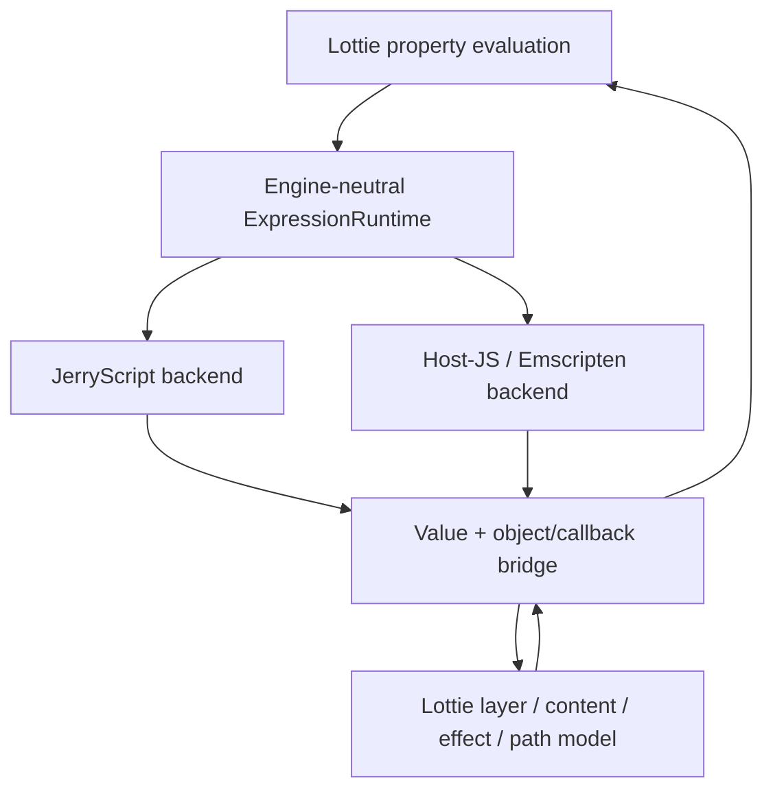

# #4099 Lottie Expressions: use the host JavaScript engine on Web

- Link: https://github.com/thorvg/thorvg/issues/4099
- 난이도: 96/100
- 실현 가능성: 중간
- 초심자 추천: 비추천
- 관련 영역: Lottie expressions, JerryScript, WASM/JavaScript bridge, thread context
- 분석 기준: `main` working tree `f989b27892ba`
- 조사 상태: 보류 해제 — JerryScript 의존이 evaluator 한 함수가 아니라 expression object model 전체에 퍼져 있음을 확인했다.

## 이슈 요약

Web build에서 내장 JerryScript 대신 브라우저/host JavaScript engine으로 Lottie expression을 실행해 WASM 크기와 중복 VM 비용을 줄이자는 요청이다. native build는 기존 JerryScript backend를 유지해야 한다.

핵심 난점은 expression 문자열을 `eval()`하는 일이 아니다. expression이 `thisComp`, `thisLayer`, `content()`, effect/property/path를 통해 C++ Lottie model을 다시 탐색하므로 **동기 양방향 object bridge**가 필요하다.

## 난이도 산정

| 항목 | 점수 | 근거 |
|---|---:|---|
| 재현·증거 불확실성 (0-20) | 18 | 목표는 분명하지만 host engine의 동기성·worker·sandbox 계약이 아직 정의되지 않았다. |
| 변경 범위 (0-25) | 25 | parser property, expression runtime, JerryScript build, WASM export/JS glue, tests가 연결된다. |
| 구현 복잡도 (0-25) | 25 | VM value와 native object의 수명·callback·exception을 양방향으로 marshaling해야 한다. |
| 교차 영향 위험 (0-20) | 19 | native expression 호환성과 Web thread/reentrancy를 동시에 보존해야 한다. |
| 검증 부담 (0-10) | 9 | 동일 fixture를 Jerry/host backend, main thread/worker에서 비교해야 한다. |
| 합계 | **96/100** | backend 추상화가 없는 현재 구조를 기준으로 한다. |

## 현재 main 코드 조사

### 확인된 사실

- [`tvgLottieExpressions.h`](https://github.com/thorvg/thorvg/blob/f989b27892bab31f224f810a54782055eba1e3bc/src/loaders/lottie/tvgLottieExpressions.h)는 `THORVG_LOTTIE_EXPRESSIONS_SUPPORT`일 때 곧바로 `jerryscript.h`를 include한다.
- public-like `result<T>()` template조차 `jerry_value_t`, `jerry_object_get_native_ptr()`, `jerry_value_free()`를 직접 사용해 number, vector, color, gradient, path, text 결과를 변환한다.
- `Context`는 Jerry 전용 `global`, `comp`, `thisComp`, `thisLayer`, `thisProperty` value와 thread별 `jerry_context_t`를 보관한다.
- [`tvgLottieExpressions.cpp`](https://github.com/thorvg/thorvg/blob/f989b27892bab31f224f810a54782055eba1e3bc/src/loaders/lottie/tvgLottieExpressions.cpp)는 `jerry_function_external()`과 native pointer를 사용해 layer/content/effect/path/property callback graph를 만든다. 단순 `jerry_eval()` 교체로 끝나지 않는다.
- [`src/loaders/lottie/meson.build`](https://github.com/thorvg/thorvg/blob/f989b27892bab31f224f810a54782055eba1e3bc/src/loaders/lottie/meson.build)는 `lottie_exp`가 켜지면 JerryScript subproject를 항상 포함한다. evaluator/backend 선택 계층은 없다.
- [`test/testLottie.cpp`](https://github.com/thorvg/thorvg/blob/f989b27892bab31f224f810a54782055eba1e3bc/test/testLottie.cpp)와 `test/resources/slot.lot`에는 expression 및 slot fixture가 있지만, 동일 expression을 두 engine에서 비교하는 conformance harness는 없다.

현재 결합은 다음과 같다.

```cpp
auto value = evaluate(frameNo, exp);                  // jerry_value_t
if (auto prop = static_cast<Property*>(
        jerry_object_get_native_ptr(value, nullptr))) {
    out = (*prop)(frameNo);                           // JS -> C++ callback
} else {
    out = toFloat(value);                             // VM value -> C++ value
}
jerry_value_free(value);
```

필요한 목표 구조는 evaluator와 model bridge를 분리하는 것이다.



### 아직 가설인 부분

- host JS 사용이 실제 최종 WASM 크기와 frame time을 얼마나 줄이는지는 측정값이 없다.
- `EM_JS` 호출이 현재 build/thread 모델에서 항상 동기적으로 C++ callback에 재진입할 수 있는지는 Emscripten 설정별 검증이 필요하다.
- browser global `eval()`만으로 issue가 요구하는 sandbox와 결정성을 만족할 수 있다는 근거는 없다.
- JerryScript와 browser JavaScript 사이의 coercion, error, property enumeration 차이가 실제 Lottie expression 호환성에 얼마나 영향을 주는지는 corpus 비교 전에는 알 수 없다.

## 수정 방향과 실현 가능성

실현 가능성은 **중간**이다. 기술적으로 가능하지만 backend interface를 먼저 만들지 않으면 Jerry-specific code를 JS glue로 복제하게 된다.

1. `ExpressionValue`, object handle, function callback, evaluate/error를 포함하는 최소 engine-neutral runtime 계약을 정의한다.
2. 현재 JerryScript 구현을 첫 backend로 이동한다. 이 단계에서는 출력이 byte/pixel 수준으로 바뀌지 않아야 한다.
3. `result<T>()`에서 Jerry type을 제거하고 number/vector/color/path/text 변환을 runtime interface 뒤로 옮긴다.
4. host-JS backend는 raw C++ pointer를 JS number로 노출하지 말고 generation이 있는 handle table을 사용한다.
5. `thisComp`/`thisLayer`/`content()` callback은 같은 evaluation stack 안에서 동기적으로 C++에 돌아오는 계약을 명시한다.
6. JS exception을 `undefined + diagnostic` 같은 기존 실패 정책으로 변환하고 C++/JS 양쪽 임시 handle을 scope 종료 시 해제한다.
7. Meson에서 `jerry`, `host-js`, `none`을 명시적으로 선택하고 native에서 host-js가 선택되지 않도록 validation한다.

제안 interface의 모양은 다음 정도면 시작점이 된다.

```cpp
struct ExpressionRuntime {
    virtual EvalResult evaluate(const char* code, EvalScope& scope) = 0;
    virtual void release(ValueHandle value) = 0;
    virtual ~ExpressionRuntime() = default;
};
```

## 위험과 검증 계획

- Jerry와 host backend에서 number, array, color, path, text와 `thisLayer/content/effect` fixture 결과를 비교한다.
- main thread와 pthread/worker build를 나누어 재진입, thread affinity, context isolation을 검사한다.
- animation 반복 재생 중 JS/C++ handle 수가 증가하지 않는지 memory instrumentation으로 확인한다.
- malformed expression, thrown JS exception, timeout/무한 loop 정책을 명시하고 테스트한다.
- UTF-8 string ownership, WASM memory growth 뒤 pointer 무효화, 32/64-bit handle 표현을 검증한다.
- expression on/off와 Jerry/host build의 binary size와 frame time을 같은 corpus로 측정한다.

## 참고 자료

- [Jerry-coupled expression interface](https://github.com/thorvg/thorvg/blob/f989b27892bab31f224f810a54782055eba1e3bc/src/loaders/lottie/tvgLottieExpressions.h)
- [Expression object/callback implementation](https://github.com/thorvg/thorvg/blob/f989b27892bab31f224f810a54782055eba1e3bc/src/loaders/lottie/tvgLottieExpressions.cpp)
- [Lottie loader Meson source list](https://github.com/thorvg/thorvg/blob/f989b27892bab31f224f810a54782055eba1e3bc/src/loaders/lottie/meson.build)
- [Lottie expression/slot tests](https://github.com/thorvg/thorvg/blob/f989b27892bab31f224f810a54782055eba1e3bc/test/testLottie.cpp)
- [Meson feature option](https://github.com/thorvg/thorvg/blob/f989b27892bab31f224f810a54782055eba1e3bc/meson_options.txt)

