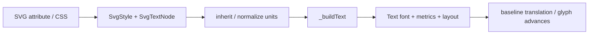

# #4107 SVG text improvements

- Link: https://github.com/thorvg/thorvg/issues/4107
- 난이도: 84/100
- 실현 가능성: 중간
- 초심자 추천: 조건부 — 한 속성의 parser/model test는 가능하지만 umbrella 전체 구현은 비추천이다.
- 관련 영역: SVG text parser, CSS inheritance, font metrics, spacing, font selection
- 분석 기준: `main` working tree `f989b27892ba`
- 조사 상태: 보류 해제 — 완료 항목과 남은 속성별 구조적 제약을 current main에서 분리했다.

## 이슈 요약

SVG text의 남은 `alignment-baseline`, `dominant-baseline`, `font-weight`, `letter-spacing`, `word-spacing` 지원을 보완하는 umbrella 이슈다. `tspan`, `text-anchor`, `dx`, `dy`는 이미 구현되어 있으므로 신규 기여는 남은 다섯 속성을 독립 작업으로 나누는 편이 좋다.

## 난이도 산정

| 항목 | 점수 | 근거 |
|---|---:|---|
| 재현·증거 불확실성 (0-20) | 10 | 작은 inline SVG로 재현 가능하지만 keyword/단위별 기대 결과를 정해야 한다. |
| 변경 범위 (0-25) | 22 | SVG style/model/builder와 Text layout·font lookup까지 이어진다. |
| 구현 복잡도 (0-25) | 23 | baseline metrics, CSS 상속, absolute spacing, weight face selection이 서로 다른 문제다. |
| 교차 영향 위험 (0-20) | 20 | Text public semantics와 기존 SVG 위치·fallback을 깨뜨릴 수 있다. |
| 검증 부담 (0-10) | 9 | nested tspan, mixed size/font, 단위와 fallback 조합을 이미지로 검증해야 한다. |
| 합계 | **84/100** | 남은 다섯 항목 전체를 기준으로 한 점수다. |

## 현재 main 코드 조사

### 확인된 사실

| 기능 | main 상태 | 코드 근거 |
|---|---|---|
| `tspan` | 지원 | `_createTspanNode()`와 builder의 tspan 배치 경로가 있다. |
| `text-anchor` | 지원 | style flag와 `textAnchor` 값, glyph advance 기반 위치 보정이 있다. |
| `dx`, `dy` | 지원 | `SvgTextNode` 필드와 parser `textTags`, builder translate에 연결된다. |
| baseline 두 속성 | 미지원 | model/style flag/parser 분기가 없고 ascent 하나로 위치를 계산한다. |
| `font-weight` | 미지원 | SVG model에 weight가 없고 `Text::font()`은 문자열 key 하나만 받는다. |
| spacing 두 속성 | 미지원 | SVG model/parser에 필드가 없고 word spacing을 전달할 Text API가 없다. |

- [`SvgTextNode`](https://github.com/thorvg/thorvg/blob/f989b27892bab31f224f810a54782055eba1e3bc/src/loaders/svg/tvgSvgCommon.h)는 `text`, `fontFamily`, `x/y`, `dx/dy`, `fontSize`만 가진다.
- [`styleTags`](https://github.com/thorvg/thorvg/blob/f989b27892bab31f224f810a54782055eba1e3bc/src/loaders/svg/tvgSvgLoader.cpp)는 text 관련 style로 `text-anchor`만 등록한다. 남은 속성은 presentation attribute와 CSS style 양쪽에서 model에 보존되지 않는다.
- [`_buildText()`](https://github.com/thorvg/thorvg/blob/f989b27892bab31f224f810a54782055eba1e3bc/src/loaders/svg/tvgSvgBuilder.cpp)는 `y + dy - tm.ascent`로 origin을 이동한다. baseline keyword별 offset은 없다.
- [`Text::spacing()`](https://github.com/thorvg/thorvg/blob/f989b27892bab31f224f810a54782055eba1e3bc/inc/thorvg.h)은 letter와 line을 **glyph 기본 advance의 scale factor**로 정의한다. SVG `letter-spacing`의 길이 값을 그대로 넣으면 단위 의미가 달라진다.
- public Text API에는 별도 word spacing 또는 weight/style face 선택 인자가 없다.



현재 baseline은 사실상 다음 한 식으로 고정된다.

```cpp
translateR(&textTransform, {
    textNode->x + textNode->dx,
    textNode->y + textNode->dy - metrics.ascent
});
```

### 아직 가설인 부분

- baseline 지원을 SVG builder 내부 translation만으로 충분히 구현할 수 있는지, Text layout에 baseline API가 필요한지는 mixed-font/tspan fixture로 확인해야 한다.
- `font-weight`를 family alias lookup으로 해결할지, loader에 style metadata와 face 선택을 추가할지는 #4174의 naming 정책과 함께 결정해야 한다.
- absolute letter spacing을 내부-only FontMetrics 필드로 둘지 public `Text` API를 확장할지는 아직 제품/API 선택이다.
- 기존 `fontSize * 0.75f` 변환과 SVG CSS px/pt 단위가 모든 fixture에서 맞는지도 이 이슈와 별도로 주의가 필요하다.

## 수정 방향과 실현 가능성

실현 가능성은 **중간**이다. 다섯 속성을 한 PR로 묶지 않고 다음 세 축으로 분리하면 각 단계는 검토 가능하다.

1. **Baseline PR**: 지원할 keyword subset을 열거형으로 model에 저장하고 상속한 뒤, ascent/descent/line metrics를 사용해 offset으로 정규화한다.
2. **Spacing PR**: SVG length를 px 기준 absolute delta로 정규화한다. glyph마다 `advance + letterDelta`, whitespace에는 추가 `wordDelta`를 적용하는 내부 layout 계약을 먼저 만든다.
3. **Weight PR**: font loader가 family/full-name/style/weight 후보를 구분한 뒤 SVG의 numeric/keyword weight를 가장 가까운 face에 매핑한다. 파일명 key만 바꾸는 임시 구현은 피한다.
4. 각 PR은 presentation attribute, inline style, class style, inherited parent, nested `tspan`을 같은 test table로 검증한다.

spacing의 의미 차이는 다음처럼 명시해야 한다.

```text
ThorVG Text::spacing(letter=1.2): advance = defaultAdvance × 1.2
SVG letter-spacing=2px:           advance = defaultAdvance + 2px
SVG word-spacing=3px:             whitespaceAdvance += 3px
```

## 위험과 검증 계획

- `alphabetic`, `middle`, `central`, `hanging` 등 채택한 baseline keyword별 fixture를 만든다.
- parent `<text>`와 child `<tspan>`의 상속/override, 서로 다른 font size와 family를 확인한다.
- px, pt, em, percentage 및 `normal` 값을 parser 단계에서 어떻게 정규화하는지 테스트한다.
- LTR text의 start/middle/end anchor와 spacing 적용 순서를 확인한다.
- font가 없거나 요청 weight가 없을 때 fallback이 기존 파일명 lookup을 깨지 않는지 검사한다.
- SW/GL/WG는 최종 Text path를 공유하지만 raster 차이는 있을 수 있으므로 동일 geometry bounds와 backend별 pixel snapshot을 함께 비교한다.

## 참고 자료

- [SVG text model](https://github.com/thorvg/thorvg/blob/f989b27892bab31f224f810a54782055eba1e3bc/src/loaders/svg/tvgSvgCommon.h)
- [SVG style/text parser](https://github.com/thorvg/thorvg/blob/f989b27892bab31f224f810a54782055eba1e3bc/src/loaders/svg/tvgSvgLoader.cpp)
- [SVG text builder](https://github.com/thorvg/thorvg/blob/f989b27892bab31f224f810a54782055eba1e3bc/src/loaders/svg/tvgSvgBuilder.cpp)
- [ThorVG Text spacing and metrics API](https://github.com/thorvg/thorvg/blob/f989b27892bab31f224f810a54782055eba1e3bc/inc/thorvg.h)
- [Text implementation](https://github.com/thorvg/thorvg/blob/f989b27892bab31f224f810a54782055eba1e3bc/src/renderer/tvgText.h)
- [SVG 2 text layout specification](https://www.w3.org/TR/SVG2/text.html)

