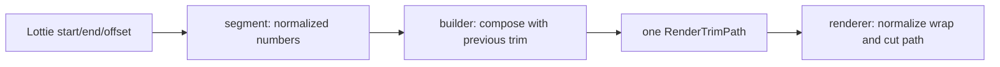

# #4124 Lottie multiple trim path offset is incorrect

- Link: https://github.com/thorvg/thorvg/issues/4124
- 난이도: 67/100
- 실현 가능성: 높음
- 초심자 추천: 조건부 — 수학적 regression test부터 시작한다면 적합하다.
- 관련 영역: Lottie trim path, cyclic interval, modifier composition, RenderTrimPath
- 분석 기준: `main` working tree `f989b27892ba`
- 조사 상태: 부분 해제 — 합성 코드의 정보 손실 후보를 확인했지만 첨부 `Multi-Trim-path.json`은 로컬에 없다.

## 이슈 요약

한 shape에 Trim Paths가 여러 개 적용되고 뒤쪽 trim에 offset이 있을 때 결과 구간이 잘못되는 문제다. 단일 trim의 wrap 처리는 renderer에 있지만, builder가 여러 trim을 하나의 `[begin, end]`로 합성할 때 원형 구간의 방향과 wrap 정보를 잃을 수 있다.

## 난이도 산정

| 항목 | 점수 | 근거 |
|---|---:|---|
| 재현·증거 불확실성 (0-20) | 16 | 첨부는 없지만 관련 함수와 수치 unit test를 독립적으로 구성할 수 있다. |
| 변경 범위 (0-25) | 10 | Lottie model/builder와 RenderTrimPath test로 비교적 좁다. |
| 구현 복잡도 (0-25) | 18 | cyclic interval의 wrap·방향·순차 합성을 올바르게 정의해야 한다. |
| 교차 영향 위험 (0-20) | 15 | 단일/multiple, simultaneous/individual, dash와 animation 결과가 바뀔 수 있다. |
| 검증 부담 (0-10) | 8 | offset·reverse·subpath·keyframe 조합을 수치 및 pixel test해야 한다. |
| 합계 | **67/100** | 재현 자산 부재와 구간 합성 수학을 함께 반영했다. |

## 현재 main 코드 조사

### 확인된 사실

- [`LottieTrimpath::segment()`](https://github.com/thorvg/thorvg/blob/f989b27892bab31f224f810a54782055eba1e3bc/src/loaders/lottie/tvgLottieModel.cpp)은 start/end를 0..1로 clamp하고 정렬한 뒤 `fmod(offset, 360) / 360`을 둘 다에 더한다. 결과가 1을 넘는 것은 허용한다.
- [`LottieBuilder::updateTrimpath()`](https://github.com/thorvg/thorvg/blob/f989b27892bab31f224f810a54782055eba1e3bc/src/loaders/lottie/tvgLottieBuilder.cpp)은 기존 stroke trim이 있으면 새 구간 길이 `abs(begin-end)`로 기존 begin/end를 선형 축소·이동한다.
- 이 합성식은 wrap된 원형 구간의 실제 길이가 아니라 숫자축의 `abs(begin-end)`를 사용한다.
- [`RenderTrimPath::_get()`](https://github.com/thorvg/thorvg/blob/f989b27892bab31f224f810a54782055eba1e3bc/src/renderer/tvgRender.cpp)은 begin/end가 0..1 밖일 때 각각 한 번 보정하고 필요하면 swap한다. renderer 자체는 `begin >= end`인 wrap 구간을 두 조각으로 trim할 수 있다.
- 따라서 single trim의 wrap 처리 능력과 multiple trim 합성의 interval 의미가 서로 다른 계층에 있다.

현재 합성식은 다음과 같다.

```cpp
length = abs(newBegin - newEnd);
base = newBegin;
composedBegin = length * oldBegin + base;
composedEnd   = length * oldEnd   + base;
```

문제 후보를 수치로 보면 더 분명하다.

```text
새 trim:  start=0.80, end=0.20  (원 위에서는 wrap 구간, 길이 0.40)
숫자축:   abs(0.80 - 0.20) = 0.60
현재 합성: 실제 선택 길이와 다른 0.60을 다음 trim의 scale로 사용 가능
```



### 아직 가설인 부분

- 첨부의 정확한 두 trim 값과 적용 순서를 보지 못했으므로 위 예가 실제 failure와 동일하다고 확정할 수 없다.
- 단순히 circular length 계산만 고치면 되는지, 두 disjoint interval을 하나의 `RenderTrimPath`로 표현할 수 없어 구조를 바꿔야 하는지는 fixture 결과에 달렸다.
- Lottie의 multiple Trim Paths가 순차 intersection인지 재매핑인지, Simultaneous/Individual에서 동일한지는 reference renderer와 확인해야 한다.

## 수정 방향과 실현 가능성

실현 가능성은 **높음**이다. 관련 코드가 좁고 renderer에 wrap 절단 기능이 이미 있으므로, 먼저 pure interval test로 계약을 고정할 수 있다.

1. `segment()`와 multiple composition을 렌더링과 분리한 pure function으로 테스트한다.
2. interval을 `start + directedLength` 또는 최대 두 개의 `[lo, hi]` 조각으로 정규화해 wrap 정보를 보존한다.
3. trim을 Lottie child 순서대로 합성하고, 최종 표현이 한 interval로 축약되지 않으면 `RenderTrimPath` 확장 또는 builder의 path materialization을 검토한다.
4. 단일 trim fast path와 기존 0/100/0° 결과는 그대로 유지한다.
5. 첨부를 확보할 수 없더라도 아래 수치 matrix와 생성형 path fixture로 regression을 먼저 추가한다.

검증 matrix:

```text
start/end: 0/100, 20/80, 80/20
offset:    -450, -96, 0, 96, 360, 450 degrees
count:     one trim, two trims, three trims
mode:      Simultaneous, Individual
path:      open, closed, two subpaths
```

## 위험과 검증 계획

- start=end, full range+offset, 음수 offset, 360도 이상 offset을 확인한다.
- reverse path와 closed/open path의 시작점 차이를 확인한다.
- multiple subpath에서 Simultaneous/Individual가 각 길이를 어떻게 배분하는지 검사한다.
- animated keyframe 사이에서 wrap 경계를 지날 때 한 frame 튀는 현상이 없는지 본다.
- dash offset과 trim offset을 혼동하지 않도록 stroke fixture를 별도로 둔다.
- 기존 single-trim unit/pixel 결과를 baseline으로 유지한다.

## 참고 자료

- [Lottie trim segment normalization](https://github.com/thorvg/thorvg/blob/f989b27892bab31f224f810a54782055eba1e3bc/src/loaders/lottie/tvgLottieModel.cpp)
- [Multiple trim composition in builder](https://github.com/thorvg/thorvg/blob/f989b27892bab31f224f810a54782055eba1e3bc/src/loaders/lottie/tvgLottieBuilder.cpp)
- [RenderTrimPath wrap and path cutting](https://github.com/thorvg/thorvg/blob/f989b27892bab31f224f810a54782055eba1e3bc/src/renderer/tvgRender.cpp)
- [RenderTrimPath model](https://github.com/thorvg/thorvg/blob/f989b27892bab31f224f810a54782055eba1e3bc/src/renderer/tvgRender.h)
- [Shape trimpath API test](https://github.com/thorvg/thorvg/blob/f989b27892bab31f224f810a54782055eba1e3bc/test/testShape.cpp)

