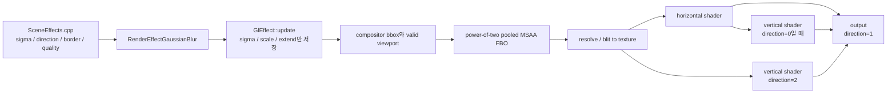
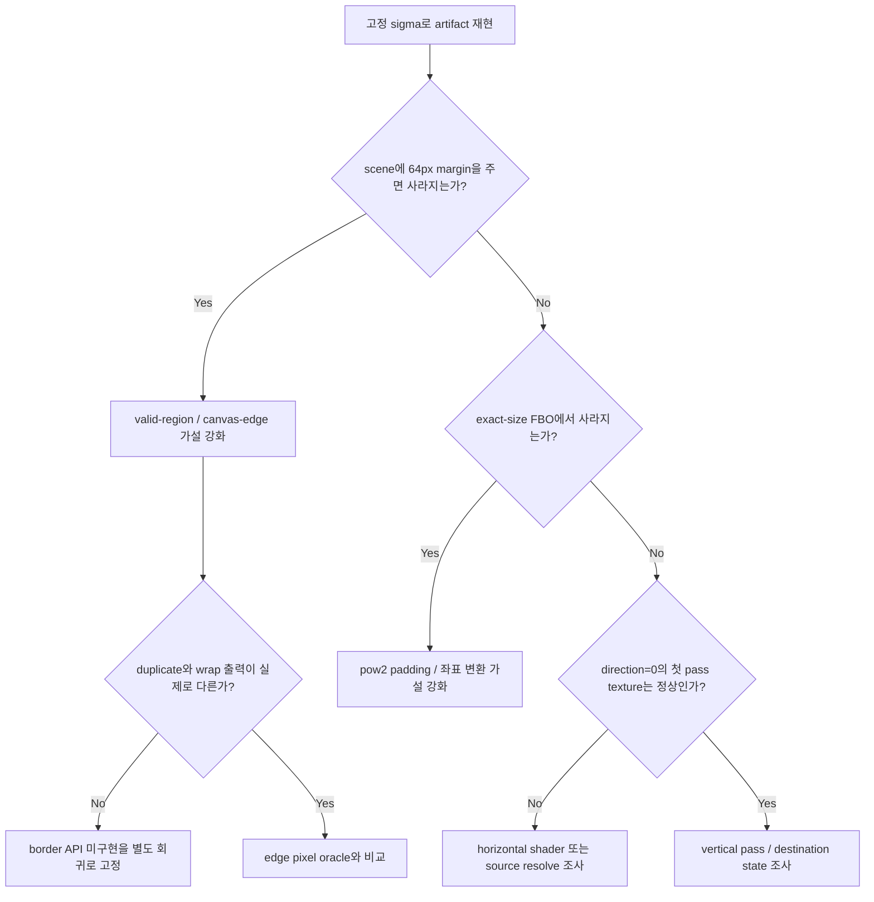

# Issue #4132 — WebGL Gaussian blur artifacts in the playground

- 링크: https://github.com/thorvg/thorvg/issues/4132
- 상태: **Open / Reopened** — v1.0.7에서도 관찰된다는 보고로 2026-07-18 재오픈
- 분석 기준: ThorVG 로컬 `main` @ [`6d5933c`](https://github.com/thorvg/thorvg/commit/6d5933c9d1aca94635c6ad8129f3530ae554d423), `thorvg.example` @ [`7850375`](https://github.com/thorvg/thorvg.example/commit/7850375b3f06cb3adfb119ad207802cef0316d33)
- 난이도: **73/100**
- 실현 가능성: **중간** — 최소 재현은 이미 작지만, 남은 원인을 확정하려면 브라우저/GPU별 픽셀 증거가 필요하다
- 초심자 추천: **조건부 추천** — 재현·픽셀 differential test는 추천, shader/FBO 수정은 GL 경험자의 검토 권장
- 관련 영역: GL/WebGL2 renderer, scene effects, separable Gaussian blur, pooled MSAA FBO, texture/fragment 좌표, shader portability
- 배울 수 있는 것: 2-pass convolution, 유효 영역과 물리 texture 크기의 차이, border semantics, GPU별 회귀 test 설계

## 난이도 산정

| 요소 | 점수 | 근거 |
|---|---:|---|
| 재현·증거 불확실성 | 15/20 | 정확한 example과 재오픈 이미지는 있지만, 재오픈한 브라우저·GPU·OS 정보와 최초 mismatch frame은 없다 |
| 변경 범위 | 14/25 | 중심은 GL effect/shader지만 pooled render target, blur task, DropShadow 공유 경로와 test까지 확인해야 한다 |
| 구현 복잡도 | 18/25 | `gl_FragCoord`, 정규화 UV, 실제 FBO 크기, 유효 viewport, separable pass를 같은 좌표계로 맞춰야 한다 |
| 교차 영향 위험 | 16/20 | blur shader는 GaussianBlur와 DropShadow가 공유하며, 수정은 native GL/GLES/WebGL의 화질과 성능에 모두 영향을 준다 |
| 검증 부담 | 10/10 | 방향·sigma·border·FBO 경계·브라우저·GPU 조합의 픽셀 검증이 필요하다 |
| **합계** | **73/100** | 단순한 shader 한 줄 수정이 아니라, 이전 수정의 해결 범위와 남은 device-dependent 현상을 분리해야 한다 |

## 핵심 결론

1. [PR #4425](https://github.com/thorvg/thorvg/pull/4425)는 실제 결함 하나를 수정했다. power-of-two로 커진 중간 FBO에서 유효 scene 영역 밖을 blur kernel이 읽는 문제를 막았다.
2. 재오픈 기준인 [v1.0.7](https://github.com/thorvg/thorvg/releases/tag/v1.0.7)의 shader와 effect 코드에는 #4425 변경이 들어 있다. 따라서 **“release에 수정이 빠졌다”는 가설은 배제**할 수 있다.
3. 그러나 #4425의 검증은 Ubuntu 24.04.4 + Chrome 148 한 환경의 수동 확인뿐이었다. [v1.0.7에서도 관찰된다는 재오픈 보고](https://github.com/thorvg/thorvg/issues/4132#issuecomment-5010166046)는 그 수정이 #4132 전체를 닫을 근거로는 부족했음을 보여준다.
4. 현재 GL 경로는 공개 인자인 `border`와 `quality`를 shader에 전달하지 않는다. 특히 #4425의 “영역 밖 tap 제거 후 재정규화”는 API의 `border=duplicate`를 명시적으로 구현한 것이 아니다.
5. 다만 이 API 불일치가 재오픈 이미지의 정확한 원인이라고 아직 확정할 수는 없다. **유효 영역 경계 정책**을 첫 가설로, **fragment마다 달라지는 동적 loop 범위**와 **frame/FBO 상태**를 다음 가설로 검증해야 한다.

## 이슈와 수정 이력

| 시점 | 사건 | 판단 |
|---|---|---|
| 2026-02-02 | [#4132 최초 보고](https://github.com/thorvg/thorvg/issues/4132) | 세로 blur 상단에 직사각형 모양의 오염이 보인다 |
| 2026-02-05 | [PR #4137](https://github.com/thorvg/thorvg/pull/4137) merge | model transform을 CPU에 bake해 UBO pressure를 줄인 대규모 최적화다. #4132의 직접 root cause를 증명한 수정은 아니다 |
| 2026-06-01 | [PR #4425](https://github.com/thorvg/thorvg/pull/4425) merge | pooled FBO의 padding을 kernel이 읽지 않도록 valid region을 shader에 전달했다 |
| 2026-06-01 | [Ubuntu/Chrome에서 해결 확인](https://github.com/thorvg/thorvg/issues/4132#issuecomment-4591191688) 후 close | 한 환경의 수동 확인이다. 자동 pixel test나 GPU matrix는 없었다 |
| 2026-07-18 | [v1.0.7에서 재현되어 reopen](https://github.com/thorvg/thorvg/issues/4132#issuecomment-5010166046) | #4425가 포함된 release에서도 남은 현상이 있다 |

[관련 이슈 #4407](https://github.com/thorvg/thorvg/issues/4407)도 SW/GL/WG/lottie-web 사이 Gaussian blur 결과가 다르다고 보고하며 아직 Open이다. #4132는 그중 WebGL의 눈에 띄는 artifact와 portability에 초점을 둔다.

## 정확한 재현 입력

Playground 화면은 [`thorvg.example/src/SceneEffects.cpp`](https://github.com/thorvg/thorvg.example/blob/7850375b3f06cb3adfb119ad207802cef0316d33/src/SceneEffects.cpp#L34-L101)에서 온다. 세 tiger scene은 같은 입력에 blur 방향만 바꾸며, `sigma`는 2.5초 동안 0에서 10까지 왕복한다.

```cpp
auto progress = tvgexam::progress(elapsed, 2.5f, true);

for (int i = 0; i < 3; ++i) {
    blur[i]->add(tvg::SceneEffect::Clear);
    blur[i]->add(tvg::SceneEffect::GaussianBlur,
                 10.0 * double(progress), i, 0, 100);
}
```

| 인자 | 값 | 의미 |
|---|---:|---|
| `sigma` | `0 ... 10` | 매 frame 변화 |
| `direction` | `0`, `1`, `2` | both, horizontal, vertical |
| `border` | `0` | duplicate |
| `quality` | `100` | 최고 품질 요청 |

정지 screenshot만 비교하면 방향성 blur 자체의 정상적인 줄무늬와 비정상적인 직사각형 band를 혼동하기 쉽다. 고정된 `sigma`에서 같은 frame을 반복 렌더링하고 픽셀을 비교하는 재현으로 바꿔야 한다.

## main 코드 역추적



### 1. 공개 API에는 네 인자가 모두 있다

[`SceneEffect::GaussianBlur`](https://github.com/thorvg/thorvg/blob/6d5933c9d1aca94635c6ad8129f3530ae554d423/inc/thorvg.h#L263-L280)는 `sigma`, `direction`, `border`, `quality`를 공개 계약으로 선언한다. 내부 [`RenderEffectGaussianBlur`](https://github.com/thorvg/thorvg/blob/6d5933c9d1aca94635c6ad8129f3530ae554d423/src/renderer/tvgRender.h#L482-L498)에도 네 값이 보존된다.

```cpp
struct RenderEffectGaussianBlur : RenderEffect
{
    float sigma;
    uint8_t direction; // 0: both, 1: horizontal, 2: vertical
    uint8_t border;    // 0: duplicate, 1: wrap
    uint8_t quality;   // 0 ~ 100
};
```

### 2. GL uniform에는 `border`와 `quality`가 사라진다

[`GlEffect::update()`](https://github.com/thorvg/thorvg/blob/6d5933c9d1aca94635c6ad8129f3530ae554d423/src/renderer/gpu_engine/gl/tvgGlEffect.cpp#L35-L67)는 아래 네 float만 만든다.

```cpp
struct GlGaussianBlur {
    float sigma{};
    float scale{};
    float extend{};
    float dummy0{};
};

blur->sigma = effect->sigma;
blur->scale = std::sqrt(transform.e11 * transform.e11 +
                        transform.e12 * transform.e12);
blur->extend = 2 * blur->sigma * blur->scale;
```

`direction`은 task 선택에만 쓰이고, `border`와 `quality`는 GL blur 계산에 들어가지 않는다. 참고 구현인 [SW blur](https://github.com/thorvg/thorvg/blob/6d5933c9d1aca94635c6ad8129f3530ae554d423/src/renderer/cpu_engine/tvgSwPostEffect.cpp#L39-L219)는 `border`로 duplicate/wrap 좌표를 선택하고, `quality`로 box-filter pass 수를 정한다.

`border`가 계산에서 사라지는 것은 **확인된 API semantics 불일치**다. `quality`는 backend별 선택적 품질 힌트로 볼 여지가 있지만, 적어도 GL에서는 값에 따른 계산 차이가 없다. 또한 example이 이미 `quality=100`이므로 quality 무시는 #4132의 device 차이를 단독으로 설명하지 못한다.

### 3. 논리 영역보다 큰 pooled texture를 쓴다

[`GlRenderTargetPool::getRenderTarget()`](https://github.com/thorvg/thorvg/blob/6d5933c9d1aca94635c6ad8129f3530ae554d423/src/renderer/gpu_engine/gl/tvgGlRenderTarget.cpp#L102-L137)은 scene viewport를 다음 power-of-two 크기로 올린다.

```cpp
auto width = vp.w();
auto height = vp.h();

if (width >= maxWidth) width = maxWidth;
else width = alignPow2(width);

if (height >= maxHeight) height = maxHeight;
else height = alignPow2(height);
```

예를 들어 유효 영역이 `420 x 420`이면 실제 texture는 `512 x 512`가 될 수 있다. shader의 UV는 `512 x 512` 전체를 기준으로 하지만, blur가 읽어야 할 논리 범위는 `0 ... 420`이다.

### 4. PR #4425는 이 두 크기를 분리했다

현재 [`GlEffect::render()`](https://github.com/thorvg/thorvg/blob/6d5933c9d1aca94635c6ad8129f3530ae554d423/src/renderer/gpu_engine/gl/tvgGlEffect.cpp#L70-L101)는 texture-local valid viewport를 별도 UBO로 보낸다.

```cpp
float viewport[4]{0.0f, 0.0f, (float)vp.sw(), (float)vp.sh()};
```

[`GAUSSIAN_VERTICAL`](https://github.com/thorvg/thorvg/blob/6d5933c9d1aca94635c6ad8129f3530ae554d423/src/renderer/gpu_engine/gl/tvgGlShaderSrc.cpp#L1088-L1130)은 fragment마다 유효한 tap 범위를 다시 계산한다. horizontal shader도 같은 구조다.

```glsl
int radius = int(uGaussian.extend);
int first = max(-radius,
                int(ceil(uViewport.vp.y - gl_FragCoord.y)));
int last = min(radius,
               int(ceil(uViewport.vp.w - gl_FragCoord.y)) - 1);

for (int y = first; y <= last; ++y) {
    float weight = gaussian(float(y), sigma);
    colorSum += texture(uSrcTexture, coord) * weight;
    weightSum += weight;
    coord += texelStep;
}
FragColor = weightSum > 0.0
          ? colorSum / weightSum
          : texture(uSrcTexture, vUV);
```

이 코드는 padding sample을 제거한다. 그러나 영역 밖 좌표를 가장자리 texel로 remap하는 `duplicate`도, 반대편으로 remap하는 `wrap`도 아니다. **tap 제거 + 남은 weight 재정규화라는 제3의 경계 정책**이다.

### 5. 방향에 따라 pass 구조가 다르다

[`GlGaussianBlurTask::run()`](https://github.com/thorvg/thorvg/blob/6d5933c9d1aca94635c6ad8129f3530ae554d423/src/renderer/gpu_engine/gl/tvgGlRenderTask.cpp#L573-L625)은 destination을 중간 texture로 resolve한 뒤 방향별로 다음 경로를 사용한다.

- `direction=0`: horizontal을 중간 FBO에 쓰고, 그 결과를 vertical이 destination에 쓴다.
- `direction=1`: resolve texture를 horizontal이 읽어 destination에 바로 쓴다.
- `direction=2`: resolve texture를 vertical이 읽어 destination에 바로 쓴다.

따라서 both만 정상이고 단일 방향에서 artifact가 난다면 kernel 수학뿐 아니라 “중간 single-sample FBO를 한 번 더 거치는가”도 독립 변수다.

### 6. 현재 test는 픽셀을 보지 않는다

[`GL Scene Effects` test](https://github.com/thorvg/thorvg/blob/6d5933c9d1aca94635c6ad8129f3530ae554d423/test/testGlEngine.cpp#L376-L464)는 세 방향을 모두 호출하지만 `add()`, `draw()`, `sync()`의 `Result::Success`만 확인한다.

```cpp
REQUIRE(scene->add(SceneEffect::GaussianBlur, 1.5, 2, 0, 75)
        == Result::Success);
REQUIRE(canvas->draw() == Result::Success);
REQUIRE(canvas->sync() == Result::Success);
```

shader가 성공적으로 실행하면서 잘못된 픽셀을 만들면 이 test는 통과한다. #4425 PR도 자동 pixel test 없이 수동 렌더링만 확인했다.

## 기존 PR 리뷰

### Phase 1 — ThorVG coding convention

[PR #4425의 전체 diff](https://github.com/thorvg/thorvg/pull/4425/files)는 두 파일이다.

- `tvgGlEffect.cpp:80`: 새 viewport 선언의 `(float)vp.sw()`, `(float)vp.sh()` 두 곳은 ThorVG General 규칙의 `static_cast<T>()` 사용 원칙과 맞지 않는다. 각각 `static_cast<float>(...)`가 맞다.
- `tvgGlShaderSrc.cpp`: 추가된 GLSL loop와 comment에서 별도의 convention 위반은 확인되지 않았다. comment는 valid viewport 밖 tap을 생략하는 비직관적 이유를 설명하므로 유효하다.

### Phase 2 — ThorVG-specific correctness

- **경계 semantics 미완성:** valid region 밖 tap을 제거하고 재정규화하지만, 공개 `border=duplicate/wrap` 값을 받지 않는다. padding bleed는 고쳐도 API가 요구하는 두 edge mode를 구분하지 못한다.
- **회귀 검증 누락:** device-dependent WebGL artifact 수정인데 direction별 pixel test와 브라우저/GPU matrix가 없다. 한 Chrome 환경의 수동 확인으로 #4132까지 닫았고, 이후 v1.0.7에서 재오픈됐다.
- 파일별 판단: `tvgGlEffect.cpp`의 local viewport 전환은 pooled texture 좌표계에 맞는 변경이다. `tvgGlShaderSrc.cpp`의 범위 clamp도 PR이 명시한 padding bleed 문제에는 타당하지만 #4132 전체를 보증하지 않는다.
- [PR #4137](https://github.com/thorvg/thorvg/pull/4137)은 18개 파일의 GPU pipeline 최적화이며 여기서는 #4132 관련 이력으로만 다룬다. UBO overflow는 당시의 추정이었고 blur artifact root cause로 증명되지 않았다.

### Phase 3 — commit/PR message

기존 제목 `gl_engine: clamp Gaussian blur sampling to valid region`은 module 형식과 목적이 적절하다. 다만 commit 본문에는 관련 issue 번호가 없고, PR 본문의 `Maintain FPS consistency`도 측정값이 없다. 재작성한다면 다음처럼 원인·제한·검증 대상을 명시하는 편이 낫다.

```text
gl_engine: prevent pooled blur textures from bleeding at region edges

Power-of-two intermediate targets can be larger than the scene's
valid render region. Pass texture-local bounds to the Gaussian blur
shaders and reject taps that address the padded area.

Add directional pixel regressions for Gaussian blur and drop shadow
at power-of-two boundaries. This change does not yet implement the
public duplicate/wrap border modes.

Issues: #4407, #4132
```

| Review score 항목 | 적발 수 | 소계 |
|---|---:|---:|
| Convention · General | 2 | 40 |
| Convention · Class/Structure | 0 | 0 |
| Convention · Methods/Functions | 0 | 0 |
| Convention · Conditions/Loops | 0 | 0 |
| Convention · Comments | 0 | 0 |
| ThorVG-specific correctness | 2 | 20 |
| **PR review score** |  | **60** |

이 점수는 PR 품질 점수가 아니라 ThorVG review rubric에서 찾아낸 항목의 가중 합이다. 위의 **이슈 난이도 73/100과는 별개**다.

## 원인 상태: 사실과 가설 분리

| 분류 | 판단 | 근거 / 다음 확인 |
|---|---|---|
| 확인 | #4425는 v1.0.7에 포함됨 | [v1.0.7 shader](https://github.com/thorvg/thorvg/blob/v1.0.7/src/renderer/gpu_engine/gl/tvgGlShaderSrc.cpp#L1118-L1173)와 [effect viewport](https://github.com/thorvg/thorvg/blob/v1.0.7/src/renderer/gpu_engine/gl/tvgGlEffect.cpp#L70-L99)에 변경이 존재한다 |
| 확인 | GL은 `border`, `quality`를 소비하지 않음 | GL UBO는 `sigma/scale/extend`만 가진다 |
| 확인 | 자동 test가 pixel correctness를 검사하지 않음 | API 성공 여부만 검사한다 |
| 1순위 가설 | valid-region edge 처리와 `border=duplicate` 불일치 | 최초 artifact가 viewport 상단이고, #4425도 바로 그 경계를 수정했다. margin/border differential test가 필요하다 |
| 2순위 가설 | fragment마다 다른 `first/last` 동적 loop의 driver portability | 환경별 결과 차이와 맞지만, shader source만으로 driver 문제를 확정할 수 없다 |
| 3순위 가설 | 단일 pass와 2-pass의 resolve/FBO 상태 차이 | 방향별 task 구조가 다르므로 같은 고정 sigma에서 pass별 texture를 캡처해야 한다 |
| 우선순위 낮춤 | UBO overflow 단독 원인 | #4137 이후에도 issue가 남았고 Gaussian UBO 자체는 16-byte std140 block이다 |
| 배제 | example가 잘못된 인자를 전달함 | 공개 API와 example의 네 인자는 유효하다 |
| 배제 | #4425가 release에서 누락됨 | v1.0.7 source에 변경이 존재한다 |

재오픈 comment에는 실행 환경이 없으므로 현시점에 “원인은 특정 shader 한 줄”이라고 확정하면 안 된다.

## 판별 실험 계획



한 번에 하나의 변수만 바꾼다.

1. animation을 멈추고 `sigma = {0.5, 1, 5, 10}`을 각각 여러 번 그려 동일 frame의 출력 안정성을 확인한다.
2. 같은 scene을 canvas 모서리 `(0, 0)`와 64px 안쪽에 배치한다. margin에서만 사라지면 canvas clip/valid-region 경로가 핵심이다.
3. scene 크기를 `255/256/257`, `511/512/513`으로 바꿔 pooled FBO의 power-of-two 전환과 상관관계를 본다.
4. `direction=0/1/2`를 분리하고, both에서는 horizontal 중간 texture와 vertical 최종 texture를 각각 캡처한다.
5. 비대칭 edge fixture로 `border=0`과 `border=1`을 비교한다. 현재 GL 결과가 같다면 적어도 public border 옵션 미구현은 자동으로 증명된다.
6. Chrome/Firefox와 native GLES/desktop GL에서 동일 fixture를 돌리고 OS, GPU, driver, browser, ANGLE backend를 함께 기록한다.

### 추천 pixel matrix

| 축 | 최소 값 | 알아낼 수 있는 것 |
|---|---|---|
| sigma | `0.5`, `1`, `5`, `10` | loop 반경/시간 변화 의존성 |
| direction | `0`, `1`, `2` | 2-pass와 1-pass 차이 |
| border | `0`, `1` | duplicate/wrap 구현 여부 |
| quality | `1`, `50`, `100` | API 값이 실제 출력·비용에 반영되는지 |
| scene margin | `0`, `64px` | canvas/valid-region 경계 의존성 |
| size | `255/256/257`, `511/512/513` | pooled FBO 전환 의존성 |
| update | 고정 frame 반복, 매 frame Clear+add | shader 계산과 state lifetime 분리 |

GPU와 SW는 blur 알고리즘이 달라 완전한 bitwise equality를 oracle로 삼기 어렵다. 대신 다음 불변식을 먼저 검사한다.

- 같은 backend에서 같은 고정 입력을 반복하면 매번 같은 픽셀이어야 한다.
- horizontal blur는 세로 방향으로 새로운 불연속 band를 만들지 않아야 한다.
- vertical blur는 가로 방향으로 새로운 불연속 band를 만들지 않아야 한다.
- 유효 영역의 마지막 행/열에서 밝기나 alpha가 직사각형으로 급변하지 않아야 한다.
- `weightSum`은 모든 실행 fragment에서 유한하고 0보다 커야 한다.

## 초심자 기여 가이드

초심자에게 가장 안전하고 가치 있는 범위는 **수정을 추측하기 전에 실패하는 pixel regression을 만드는 것**이다.

```cpp
// 의사 코드: 실제 test helper/API에 맞게 조정한다.
for (auto direction : {0, 1, 2}) {
    for (auto sigma : {0.5, 1.0, 5.0, 10.0}) {
        auto scene = makeAsymmetricEdgeFixture();
        scene->add(SceneEffect::GaussianBlur,
                   sigma, direction, 0, 100);

        renderGl(scene, pixels);
        REQUIRE(noRectangularBand(pixels));
        REQUIRE(repeatedRenderIsStable(scene, pixels));
    }
}
```

그다음 다음 로그를 첫 mismatch에만 남긴다.

```text
browser / GPU / driver / ANGLE backend
sigma / direction / border / quality
logical viewport: x, y, w, h
physical FBO: width, height
fragment or first mismatching pixel: x, y, expected, actual
pass: source resolve / horizontal / vertical / final blit
```

최종 수정은 실험 결과에 따라 범위를 정한다.

- edge remap이 원인이면 `border`를 GL params에 전달하고 valid subregion 기준 duplicate/wrap을 명시적으로 구현한다.
- 동적 loop가 원인이면 해당 GPU에서 실패를 재현한 뒤 고정 상한 loop, precomputed weights 등 최소 대안을 성능 측정과 함께 비교한다.
- FBO flow가 원인이면 shader를 건드리지 말고 resolve/source/destination 단계에서 처음 오염되는 지점을 수정한다.
- 어느 경우든 GaussianBlur뿐 아니라 같은 shader를 쓰는 DropShadow 회귀를 함께 확인한다.

## 영향 파일 후보

| 파일 | 역할 | 수정 조건 |
|---|---|---|
| `src/renderer/gpu_engine/gl/tvgGlEffect.cpp` | CPU params, valid viewport UBO | border/quality 또는 좌표 정보가 shader에 더 필요할 때 |
| `src/renderer/gpu_engine/gl/tvgGlShaderSrc.cpp` | horizontal/vertical kernel | shader 실험으로 root cause가 확인됐을 때 |
| `src/renderer/gpu_engine/gl/tvgGlRenderTask.cpp` | resolve와 방향별 pass | 중간 texture 캡처에서 처음 오염될 때 |
| `src/renderer/gpu_engine/gl/tvgGlRenderTarget.cpp` | pooled FBO 크기 | power-of-two 경계와 artifact가 직접 연동될 때 |
| `test/testGlEngine.cpp` | GL scene effect test | 반드시 API 성공 검사에서 pixel regression으로 확장 |

## 위험과 완료 조건

- 단일 Chrome/GPU에서 눈으로 좋아 보이는 것만으로 닫지 않는다.
- padding을 피하면서 `duplicate/wrap` 의미를 바꾸지 않아야 한다.
- `sigma=0` 부근, 큰 sigma, canvas edge, non-power-of-two scene을 모두 검사한다.
- blur loop 변경은 fragment당 texture fetch 수를 바꾸므로 FPS/GPU time을 함께 측정한다.
- DropShadow는 같은 Gaussian shader를 사용하므로 별도 snapshot이 필요하다.
- 완료 조건은 “artifact가 덜 보임”이 아니라 고정 fixture의 pixel test 통과와 보고 환경 재확인이다.

## 참고 자료

- [Issue #4132](https://github.com/thorvg/thorvg/issues/4132)
- [v1.0.7 재오픈 보고](https://github.com/thorvg/thorvg/issues/4132#issuecomment-5010166046)
- [PR #4425 — valid region clamp](https://github.com/thorvg/thorvg/pull/4425)
- [PR #4425 commit](https://github.com/thorvg/thorvg/commit/41265721fb5891b19bf910be748a8cd1c2c48d23)
- [Issue #4407 — backend 간 Gaussian blur 불일치](https://github.com/thorvg/thorvg/issues/4407)
- [Issue #4134 — GPU uniform/batching 최적화 제안](https://github.com/thorvg/thorvg/issues/4134)
- [PR #4137 — CPU-side transform bake](https://github.com/thorvg/thorvg/pull/4137)
- [SceneEffects example](https://github.com/thorvg/thorvg.example/blob/7850375b3f06cb3adfb119ad207802cef0316d33/src/SceneEffects.cpp#L34-L101)
- [GL Gaussian effect params와 viewport](https://github.com/thorvg/thorvg/blob/6d5933c9d1aca94635c6ad8129f3530ae554d423/src/renderer/gpu_engine/gl/tvgGlEffect.cpp#L35-L101)
- [GL Gaussian shaders](https://github.com/thorvg/thorvg/blob/6d5933c9d1aca94635c6ad8129f3530ae554d423/src/renderer/gpu_engine/gl/tvgGlShaderSrc.cpp#L1088-L1174)
- [GL 방향별 blur task](https://github.com/thorvg/thorvg/blob/6d5933c9d1aca94635c6ad8129f3530ae554d423/src/renderer/gpu_engine/gl/tvgGlRenderTask.cpp#L573-L625)
- [GL pooled render target](https://github.com/thorvg/thorvg/blob/6d5933c9d1aca94635c6ad8129f3530ae554d423/src/renderer/gpu_engine/gl/tvgGlRenderTarget.cpp#L102-L137)
- [SW Gaussian border/quality 처리](https://github.com/thorvg/thorvg/blob/6d5933c9d1aca94635c6ad8129f3530ae554d423/src/renderer/cpu_engine/tvgSwPostEffect.cpp#L39-L219)
- [GL Scene Effects test](https://github.com/thorvg/thorvg/blob/6d5933c9d1aca94635c6ad8129f3530ae554d423/test/testGlEngine.cpp#L376-L464)
- [WebGL 2.0 specification — GLSL ES 3.00 / std140](https://registry.khronos.org/webgl/specs/latest/2.0/)
