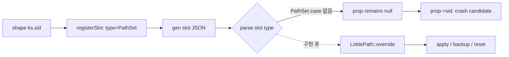

# #4151 Lottie slots: support Bezier Shape PathSet override

- Link: https://github.com/thorvg/thorvg/issues/4151
- 난이도: 61/100
- 실현 가능성: 높음
- 초심자 추천: 조건부 — parser 분기보다 PathSet deep-copy 수명 검증이 핵심이다.
- 관련 영역: Lottie slots, PathSet parser, polymorphic override, ownership
- 분석 기준: `main` working tree `f989b27892ba`
- 조사 상태: 보류 해제 — 누락된 type dispatch, override, copy 계약과 현재 crash 후보를 확인했다.

## 이슈 요약

Bezier shape의 `ks.sid`를 slot JSON의 path payload로 교체할 수 있게 `PathSet` slot을 지원하는 요청이다. slot infrastructure와 일반 shape path parser는 이미 있지만, 둘을 연결하는 분기와 `LottiePath`의 override/backup 구현이 빠져 있다.

## 난이도 산정

| 항목 | 점수 | 근거 |
|---|---:|---|
| 재현·증거 불확실성 (0-20) | 6 | 이슈 본문에 원본 shape와 slot payload가 있어 작은 fixture를 만들 수 있다. |
| 변경 범위 (0-25) | 10 | Lottie parser/property/model과 slot tests로 국소적이다. |
| 구현 복잡도 (0-25) | 19 | static/animated PathSet의 여러 heap buffer를 안전하게 copy/reset해야 한다. |
| 교차 영향 위험 (0-20) | 17 | shallow copy 시 double-free/use-after-free, reset 시 원본 손상이 가능하다. |
| 검증 부담 (0-10) | 9 | topology가 다른 keyframe, 반복 apply/delete/reset과 ASan 검증이 필요하다. |
| 합계 | **61/100** | 기능 범위는 좁지만 ownership 위험을 높게 반영했다. |

## 현재 main 코드 조사

### 확인된 사실

- [`LottieProperty::Type`](https://github.com/thorvg/thorvg/blob/f989b27892bab31f224f810a54782055eba1e3bc/src/loaders/lottie/tvgLottieProperty.h)에는 이미 `PathSet`이 있다.
- shape의 `ks.sid`는 [`registerSlot()`](https://github.com/thorvg/thorvg/blob/f989b27892bab31f224f810a54782055eba1e3bc/src/loaders/lottie/tvgLottieParser.cpp)에서 property type과 대상 `LottieObject`를 `LottieSlot`에 등록한다. 따라서 path slot은 type discovery 단계까지 도달한다.
- [`LottieParser::parse(LottieSlot*)`](https://github.com/thorvg/thorvg/blob/f989b27892bab31f224f810a54782055eba1e3bc/src/loaders/lottie/tvgLottieParser.cpp)의 switch는 Float/Scalar/Vector/Opacity/Color/ColorStop/TextDoc/Image만 처리하며 `PathSet` case가 없다.
- 이 함수는 `default` 뒤에도 무조건 `prop->sid = slot->sid`를 실행한다. `PathSet` 입력이면 `prop == nullptr` 상태의 null 역참조 후보가 된다.
- 일반 shape parser의 [`getPathSet()`](https://github.com/thorvg/thorvg/blob/f989b27892bab31f224f810a54782055eba1e3bc/src/loaders/lottie/tvgLottieParser.cpp)은 static path object와 animated keyframe array를 이미 읽을 수 있다. 그러나 generic `parseSlotProperty()`는 `k`가 object인 PathSet schema에 그대로 쓸 수 없다.
- [`LottiePath`](https://github.com/thorvg/thorvg/blob/f989b27892bab31f224f810a54782055eba1e3bc/src/loaders/lottie/tvgLottieModel.h)는 `property()`만 구현하고 `override()`를 구현하지 않았다. base 구현은 “Unsupported slot type”을 기록하고 null을 반환한다.
- [`LottiePathSet::release()`](https://github.com/thorvg/thorvg/blob/f989b27892bab31f224f810a54782055eba1e3bc/src/loaders/lottie/tvgLottieProperty.h)은 static `cmds/pts`, 각 keyframe의 `cmds/pts`, frames storage와 expression을 모두 해제한다. 반면 `LottiePathSet` 전용 copy constructor/copy 함수는 없다.

현재 끊긴 흐름은 다음과 같다.



필요한 ownership 관계:

```text
original PathSet --deep copy--> backup owned by LottieSlot::Pair
slot PathSet     --deep copy--> LottiePath::pathset
reset            --release-->  overridden buffers
backup           --restore-->  LottiePath::pathset
```

### 아직 가설인 부분

- 이슈 payload가 static path만 요구하는지 animated PathSet slot도 spec 범위인지 확정되지 않았다. 다만 property type이 animated storage를 가지므로 처음부터 둘 다 안전하게 다루는 편이 좋다.
- slot path와 원본 path의 point count가 달라도 animation/tween 과정에서 허용할지는 정책이 필요하다.
- expressions가 연결된 path를 slot으로 교체할 때 expression을 복제할지 slot expression으로 대체할지 기존 property 규칙과 확인해야 한다.

## 수정 방향과 실현 가능성

실현 가능성은 **높음**이다. 기존 slot 패턴과 path parser가 있어 새로운 renderer 기능은 필요하지 않다.

1. `parse(LottieSlot*)`에 `PathSet` 전용 case를 추가하고 slot의 `p` object 안에서 기존 `getPathSet(nullptr, pathset)` 로직을 재사용한다.
2. 모든 unsupported type에서 `prop == nullptr`이면 즉시 `nullptr`를 반환하도록 방어해 현재 null 역참조 후보도 제거한다.
3. `LottiePathSet`에 명시적 deep-copy/transfer 함수를 구현한다. static path와 모든 frame의 `cmds`, `pts`, count, frame metadata를 복제한다.
4. `LottiePath::override()`에서 첫 apply 시 backup을 만들고, 재apply/reset에서는 현재 buffer를 release한 뒤 copy한다.
5. 기존 `LottieSlot::apply/reset` lifecycle을 바꾸지 말고 PathSet이 그 계약을 따르게 한다.

제안 분기는 개념적으로 다음과 같다.

```cpp
case LottieProperty::Type::PathSet: {
    auto path = new LottiePathSet;
    // Parse slot {"p": {"a": ..., "k": ...}} with PathSet-aware logic.
    parseSlotPath(*path);
    prop = path;
    break;
}
default:
    return nullptr;
```

## 위험과 검증 계획

- 이슈 본문의 static open/closed path로 apply 전후 geometry를 검사한다.
- static→static, animated→animated, point count가 다른 path를 각각 테스트한다.
- `gen → apply → apply another → delete slot → reset` 순서를 반복하고 원본 path가 복구되는지 본다.
- 같은 sid를 여러 shape가 공유할 때 buffer가 서로 alias하지 않는지 확인한다.
- expression이 있는 path와 없는 path를 나누어 lifetime을 확인한다.
- ASan/LSan에서 double-free, use-after-free, leak이 없는지 검증한다.
- invalid/unsupported slot type이 crash 없이 실패 id/result로 돌아오는 regression test를 추가한다.

## 참고 자료

- [Lottie property types and PathSet ownership](https://github.com/thorvg/thorvg/blob/f989b27892bab31f224f810a54782055eba1e3bc/src/loaders/lottie/tvgLottieProperty.h)
- [Slot registration, PathSet parsing and slot dispatch](https://github.com/thorvg/thorvg/blob/f989b27892bab31f224f810a54782055eba1e3bc/src/loaders/lottie/tvgLottieParser.cpp)
- [LottiePath and LottieSlot model](https://github.com/thorvg/thorvg/blob/f989b27892bab31f224f810a54782055eba1e3bc/src/loaders/lottie/tvgLottieModel.h)
- [Slot apply/reset lifecycle](https://github.com/thorvg/thorvg/blob/f989b27892bab31f224f810a54782055eba1e3bc/src/loaders/lottie/tvgLottieModel.cpp)
- [Existing slot tests](https://github.com/thorvg/thorvg/blob/f989b27892bab31f224f810a54782055eba1e3bc/test/testLottie.cpp)
- [Existing slot fixture](https://github.com/thorvg/thorvg/blob/f989b27892bab31f224f810a54782055eba1e3bc/test/resources/slot.lot)

