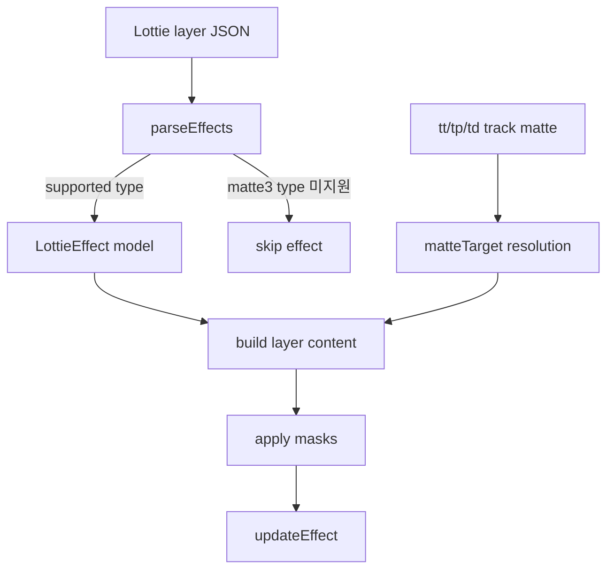

# #4158 Lottie matte3 effects compliance

- Link: https://github.com/thorvg/thorvg/issues/4158
- 난이도: 87/100
- 실현 가능성: 중간
- 초심자 추천: 비추천
- 관련 영역: Lottie layer effects, Set Matte3, layer reference, mask composition
- 분석 기준: `main` working tree `f989b27892ba`
- 조사 상태: 부분 해제 — unsupported effect 경계는 확인했지만 첨부 `branding.json`이 로컬에 없어 parameter semantics는 확정하지 않았다.

## 이슈 요약

`matte3` 계열 layer effect가 들어간 text animation이 reference와 다르게 보이는 호환성 이슈다. 이 effect는 Lottie layer의 일반 `tt/tp/td` track matte와 별도 effect stack 항목일 가능성이 높으므로, 단순히 기존 matte flag 하나로 치환해서는 안 된다.

## 난이도 산정

| 항목 | 점수 | 근거 |
|---|---:|---|
| 재현·증거 불확실성 (0-20) | 18 | 첨부 JSON이 로컬에 없어 exact effect type/parameter를 재검증할 수 없다. |
| 변경 범위 (0-25) | 20 | effect parser/model, composition layer resolution, builder와 mask rendering에 걸친다. |
| 구현 복잡도 (0-25) | 23 | source layer, channel, invert, transform와 effect 순서를 표현해야 한다. |
| 교차 영향 위험 (0-20) | 18 | source visibility, precomp, 순환 참조와 기존 track matte에 영향을 줄 수 있다. |
| 검증 부담 (0-10) | 8 | reference renderer와 여러 matte option/backend snapshot이 필요하다. |
| 합계 | **87/100** | parser 누락보다 renderer semantics의 불확실성이 큰 작업이다. |

## 현재 main 코드 조사

### 확인된 사실

- 로컬 [`issues.json`](issues.json)의 #4158 본문은 두 screenshot과 `branding.json` attachment 링크만 포함하며, 실제 attachment 파일은 workspace에 없다.
- [`LottieEffect::Type`](https://github.com/thorvg/thorvg/blob/f989b27892bab31f224f810a54782055eba1e3bc/src/loaders/lottie/tvgLottieModel.h)은 Custom(5), Tint(20), Fill(21), Stroke(22), Tritone(23), DropShadow(25), GaussianBlur(29)만 정의한다. 28에 해당하는 전용 effect model은 없다.
- [`LottieParser::getEffect()`](https://github.com/thorvg/thorvg/blob/f989b27892bab31f224f810a54782055eba1e3bc/src/loaders/lottie/tvgLottieParser.cpp)은 위 type만 생성하며 그 밖의 type은 `nullptr`를 반환한다. `parseEffects()`는 unsupported effect object의 나머지를 skip한다.
- generic `LottieFxCustom`은 expression에서 effect property를 노출하기 위한 model이지만, [`LottieBuilder::updateEffect()`](https://github.com/thorvg/thorvg/blob/f989b27892bab31f224f810a54782055eba1e3bc/src/loaders/lottie/tvgLottieBuilder.cpp)의 rendering switch에는 Custom case가 없다.
- 일반 layer matte는 parser의 `tt`(method), `tp`(source index), `td`(source marker)를 `LottieLayer::matteTarget`으로 resolve한다.
- [`updateMatte()`](https://github.com/thorvg/thorvg/blob/f989b27892bab31f224f810a54782055eba1e3bc/src/loaders/lottie/tvgLottieBuilder.cpp)은 source layer scene을 먼저 update하고 `Scene::mask(targetScene, matteType)`로 적용한다. effect parameter가 가리키는 source layer를 처리하는 경로는 없다.
- `updateEffect()`는 layer contents와 masks를 만든 뒤 실행된다. Set Matte3를 effect로 구현할 때 적용 순서가 기존 track matte와 다를 수 있다.



일반 track matte와 effect matte의 예상 차이를 먼저 분리해야 한다.

| 항목 | 기존 layer matte | Matte3 effect에서 확인할 것 |
|---|---|---|
| source 지정 | 위 layer 또는 `tp` index | effect property 안의 layer reference |
| 적용 위치 | layer build 초반 | effect stack 순서 |
| channel | `MaskMethod` alpha/luma/inverse | attachment parameter로 확정 필요 |
| source 표시 | `matteSrc`로 일반 draw 제외 | 원 source visibility 유지 여부 확인 필요 |

### 아직 가설인 부분

- 기존 로컬 분석은 attachment가 effect type 28, match name `ADBE Set Matte3`를 가진다고 기록했지만 원본 파일이 없으므로 이번 조사에서는 **이슈 입력에 대한 가설**로 유지한다.
- Matte3의 parameter index, alpha/luma/invert/stretch/composite option은 attachment 또는 명세 fixture 없이는 확정할 수 없다.
- 기존 `Scene::mask()`만으로 모든 option을 표현할 수 있는지, 별도 offscreen composition이 필요한지는 미정이다.
- text 자체의 layout 문제가 아니라 누락 effect가 직접 원인이라는 판단도 attachment 재현 전에는 확정할 수 없다.

## 수정 방향과 실현 가능성

실현 가능성은 **중간**이다. source layer mask라는 primitive는 이미 있지만, parameter와 effect-order 계약을 먼저 확보해야 한다.

1. attachment를 프로젝트 fixture로 반입할 수 없다면, issue 정보와 공개 Lottie schema를 바탕으로 최소 Matte3 JSON을 별도로 작성하고 reference frame을 고정한다.
2. exact `ty`, `mn`, property `ty/ix/nm/mn`과 기본값을 table로 기록한 뒤 parser를 작성한다. 숫자 index를 추측해 구현하지 않는다.
3. `LottieFxSetMatte` 같은 전용 model에 source layer reference와 실제 지원 channel/flags만 저장한다.
4. composition build 단계에서 같은 precomp scope의 layer만 resolve하고 missing/self/cyclic reference를 안전하게 거부한다.
5. 기존 `updateMatte()`의 scene-mask primitive를 재사용할 수 있는 option부터 vertical slice로 구현한다.
6. effect stack 순서를 유지하도록 `updateEffect()`에서 matte 적용 위치를 명시하고, source layer를 일반 draw에서 숨길지 별도 flag로 결정한다.

제안 model은 parameter 조사 뒤 최소 필드만 가져야 한다.

```cpp
struct LottieFxSetMatte : LottieEffect {
    LottieInteger sourceLayer;
    // channel/invert/composite fields are added only after fixture confirmation.
};
```

## 위험과 검증 계획

- source가 앞/뒤 layer, missing layer, self reference, cycle인 경우를 테스트한다.
- same composition과 nested precomp 경계를 구분한다.
- source layer transform/opacity/size가 target과 다를 때 좌표계를 확인한다.
- source layer가 화면에도 보여야 하는지와 matte 전용으로 숨겨지는지를 reference와 비교한다.
- alpha/luma/inverse 및 effect enable animation을 지원 범위별로 검사한다.
- track matte와 Matte3 effect가 함께 있을 때 적용 순서를 확인한다.
- SW/GL/WG에서 mask texture의 premultiplied alpha 및 pixel snapshot을 비교한다.

## 참고 자료

- [Lottie effect models](https://github.com/thorvg/thorvg/blob/f989b27892bab31f224f810a54782055eba1e3bc/src/loaders/lottie/tvgLottieModel.h)
- [Effect parser and unsupported-type handling](https://github.com/thorvg/thorvg/blob/f989b27892bab31f224f810a54782055eba1e3bc/src/loaders/lottie/tvgLottieParser.cpp)
- [Layer matte and effect builder](https://github.com/thorvg/thorvg/blob/f989b27892bab31f224f810a54782055eba1e3bc/src/loaders/lottie/tvgLottieBuilder.cpp)
- [Local issue metadata](issues.json)

