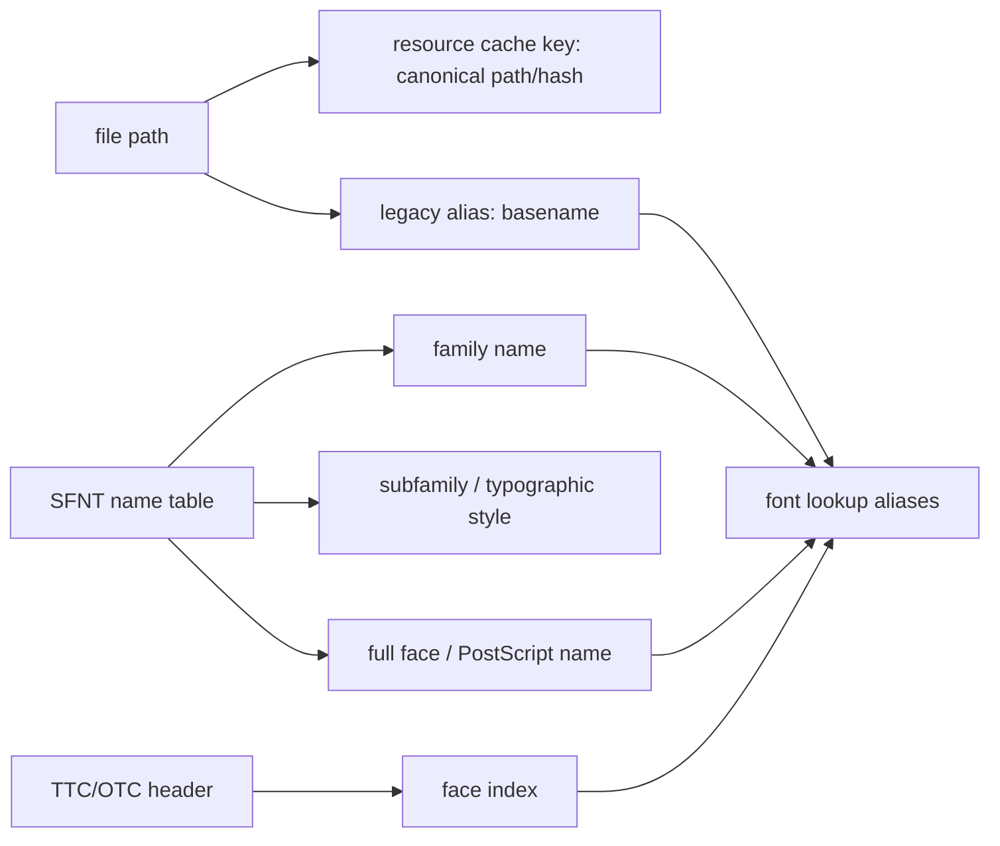

# #4174 Use actual font face name instead of file name

- Link: https://github.com/thorvg/thorvg/issues/4174
- 난이도: 85/100
- 실현 가능성: 중간
- 초심자 추천: 비추천
- 관련 영역: SFNT/OpenType name table, font identity/cache, aliases, TTC/OTC collections
- 분석 기준: `main` working tree `f989b27892ba`
- 조사 상태: 보류 해제 — filename lookup, missing name-table parser, collection dispatch mismatch를 확인했다.

## 이슈 요약

font 파일명 대신 font 내부의 실제 family/full face/PostScript name을 읽어 등록·조회하고, 같은 family의 여러 face와 font collection을 구분하자는 요청이다.

이 작업은 문자열 하나를 바꾸는 일이 아니다. 현재 **resource cache key**, **legacy lookup alias**, **font 내부 identity**가 사실상 한 `name` 필드에 겹쳐 있으므로 호환 정책과 collection face index를 분리해야 한다.

## 난이도 산정

| 항목 | 점수 | 근거 |
|---|---:|---|
| 재현·증거 불확실성 (0-20) | 10 | 자체 test font로 재현 가능하지만 name record 우선순위 정책이 필요하다. |
| 변경 범위 (0-25) | 22 | SFNT reader/loader, LoaderMgr cache, Text/C API lookup과 tests가 연결된다. |
| 구현 복잡도 (0-25) | 23 | bounds-safe name parsing, encoding/language, aliases, collection face 선택이 필요하다. |
| 교차 영향 위험 (0-20) | 20 | 기존 filename 및 memory-font explicit name lookup을 깨뜨리면 API 호환성 회귀가 난다. |
| 검증 부담 (0-10) | 10 | TTF/OTF/TTC/OTC, encoding, collision, malformed input을 폭넓게 검사해야 한다. |
| 합계 | **85/100** | naming만이 아니라 identity와 collection 지원까지 포함한 점수다. |

## 현재 main 코드 조사

### 확인된 사실

- [`SfntLoader::open(path)`](https://github.com/thorvg/thorvg/blob/f989b27892bab31f224f810a54782055eba1e3bc/src/loaders/sfnt/tvgSfntLoader.cpp)은 reader 생성 후 `name = tvg::filename(path)`로 설정한다. `filename()`은 경로와 확장자를 제거한 basename을 반환한다.
- memory font는 [`LoaderMgr::loader(name, data, ...)`](https://github.com/thorvg/thorvg/blob/f989b27892bab31f224f810a54782055eba1e3bc/src/renderer/tvgLoaderMgr.cpp)에서 caller가 준 `name`을 명시적 alias로 저장한다.
- [`LoaderMgr::font(name)`](https://github.com/thorvg/thorvg/blob/f989b27892bab31f224f810a54782055eba1e3bc/src/renderer/tvgLoaderMgr.cpp)은 `_activeLoaders` linked list를 순회하며 cached `FontLoader::name`과 문자열 비교한다. 이 경로는 issue 표현과 달리 별도 font hash map이 아니다.
- [`TextImpl::font()`](https://github.com/thorvg/thorvg/blob/f989b27892bab31f224f810a54782055eba1e3bc/src/renderer/tvgText.h)은 그 단일 문자열 lookup을 사용한다. 테스트도 `PublicSans-Regular`, `DMSans` 같은 파일 basename으로 조회한다.
- [`SfntReader::header()`](https://github.com/thorvg/thorvg/blob/f989b27892bab31f224f810a54782055eba1e3bc/src/loaders/sfnt/tvgSfntReader.cpp)은 head/hhea/maxp/cmap/hmtx를 읽지만 SFNT `name` table을 읽지 않는다.
- [`OtfReader::name()`](https://github.com/thorvg/thorvg/blob/f989b27892bab31f224f810a54782055eba1e3bc/src/loaders/sfnt/tvgOtfReader.cpp)은 CFF Name INDEX를 출력하는 debug 성격 함수이며 호출도 주석 처리되어 있다. SFNT name table parser가 아니다.
- path dispatch는 `.ttc`/`.otc`를 SFNT loader로 보낸다. 그러나 `SfntLoader::gen()`은 `0x00010000`, `true`, `OTTO`만 받고 `ttcf` collection header를 처리하지 않는다.

현재 하나로 섞인 key를 분리해야 한다.



권장 identity 예:

```text
resource: /fonts/MyBundle.ttc
face:     index 2
family:   Example Sans
style:    Bold Italic
full:     Example Sans Bold Italic
legacy:   MyBundle
```

### 아직 가설인 부분

- public `Text::font("name")`이 family를 선택해야 하는지 full face를 선택해야 하는지는 현재 API 문서와 이슈만으로 단일 답이 없다.
- 같은 family에 여러 style이 있을 때 weight/style API 없이 어떤 face를 default로 고를지는 정책 선택이다.
- TTC/OTC의 모든 face를 한 load 호출로 등록할지 face index를 API로 노출할지는 ABI 설계가 필요하다.
- 내부 이름을 “renderer hash”에 저장하자는 제안이 실제 hash container 도입까지 의미하는지는 불명확하다. correctness를 먼저 구현하고 lookup 성능은 별도 측정해야 한다.

## 수정 방향과 실현 가능성

실현 가능성은 **중간**이다. 단일-face TTF/OTF의 name metadata와 alias 지원은 단계적으로 가능하지만 collection과 style selection은 후속 API가 필요할 수 있다.

1. `name` table header/record/string storage의 offset과 length를 `SfntReader::validate()`로 검사하는 bounds-safe parser를 추가한다.
2. Unicode/Windows record를 우선하고 UTF-16BE를 UTF-8로 변환한다. name ID와 language 우선순위, fallback 순서를 test table로 고정한다.
3. `FontLoader`에 resource key와 alias set, family/subfamily/full/PostScript name을 분리한다.
4. 기존 file basename과 memory-font caller name은 legacy alias로 계속 조회되게 해 호환성을 유지한다.
5. alias collision은 “첫 등록 wins”처럼 숨기지 말고 deterministic 정책 또는 ambiguity error를 정의한다.
6. collection은 `ttcf` header와 face offset array를 먼저 파싱하고 각 face를 `(resource, faceIndex)`로 식별한다. public face 선택은 별도 단계로 검토한다.

lookup은 최소한 다음 순서를 명시해야 한다.

```text
explicit caller alias
  -> full face / PostScript name
  -> family default face
  -> legacy file basename
  -> fallback font
```

실제 우선순위는 호환성 테스트 후 확정해야 한다.

## 위험과 검증 계획

- Windows Unicode UTF-16BE, Unicode platform, Mac legacy encoding과 잘못된 surrogate를 검사한다.
- name table offset/length overflow, truncated record, duplicate record를 fuzz한다.
- 같은 family의 Regular/Bold/Italic, 같은 full name의 서로 다른 파일 collision을 테스트한다.
- path load의 basename alias와 memory load의 explicit alias가 기존대로 동작하는지 확인한다.
- TTF/OTF single face와 TTC/OTC multi-face를 구분해 테스트한다.
- unload가 alias 하나가 아니라 정확한 resource/face와 sharing count를 회수하는지 검사한다.
- C/C++ API 및 SVG/Lottie font lookup regression을 확인한다.

## 참고 자료

- [SFNT loader and current filename naming](https://github.com/thorvg/thorvg/blob/f989b27892bab31f224f810a54782055eba1e3bc/src/loaders/sfnt/tvgSfntLoader.cpp)
- [SFNT table reader](https://github.com/thorvg/thorvg/blob/f989b27892bab31f224f810a54782055eba1e3bc/src/loaders/sfnt/tvgSfntReader.cpp)
- [CFF reader's unrelated Name INDEX helper](https://github.com/thorvg/thorvg/blob/f989b27892bab31f224f810a54782055eba1e3bc/src/loaders/sfnt/tvgOtfReader.cpp)
- [LoaderMgr font lookup and memory-font alias](https://github.com/thorvg/thorvg/blob/f989b27892bab31f224f810a54782055eba1e3bc/src/renderer/tvgLoaderMgr.cpp)
- [Text font lookup](https://github.com/thorvg/thorvg/blob/f989b27892bab31f224f810a54782055eba1e3bc/src/renderer/tvgText.h)
- [Current text tests and basename expectations](https://github.com/thorvg/thorvg/blob/f989b27892bab31f224f810a54782055eba1e3bc/test/testText.cpp)
- [OpenType naming table specification](https://learn.microsoft.com/en-us/typography/opentype/spec/name)

