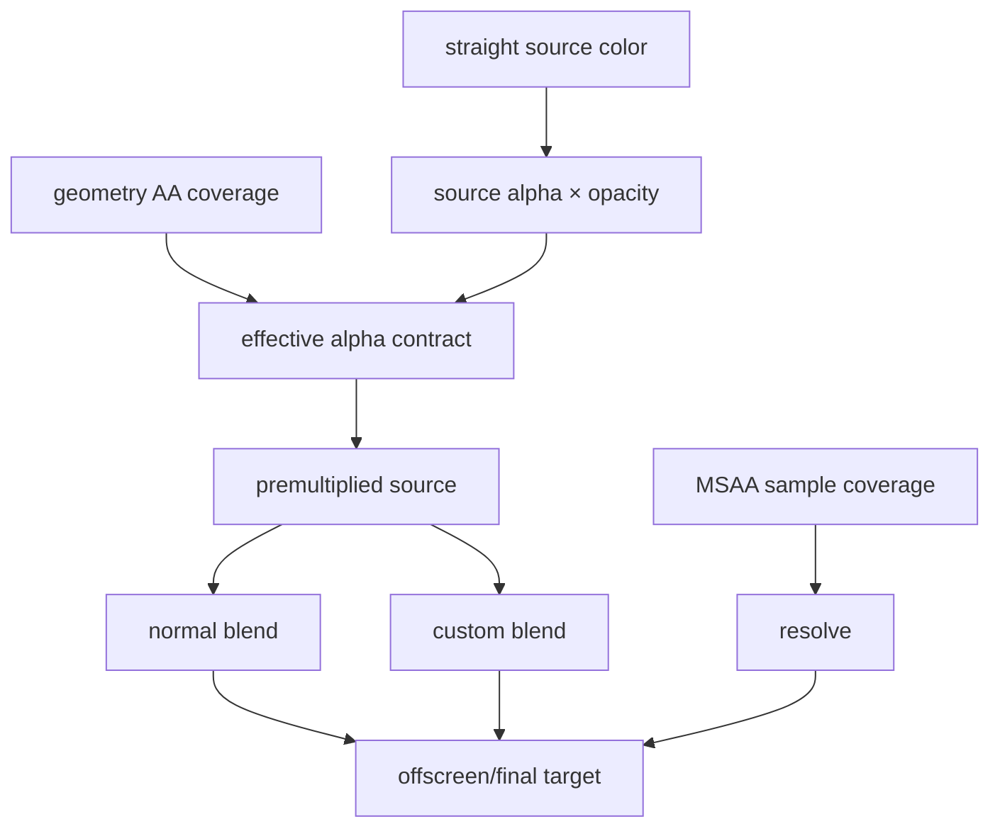

# #4197 Correct premultiplication of AA parts in all engines

- Link: https://github.com/thorvg/thorvg/issues/4197
- 난이도: 96/100
- 실현 가능성: 중간
- 초심자 추천: 비추천
- 관련 영역: SW/GL/WGPU, AA coverage, all blend modes, offscreen composition
- 분석 기준: `main` working tree `f989b27892ba`
- 조사 상태: 부분 해제 — engine별 적용 지점은 확인했지만 screenshot의 원본 scene이 없어 결함 위치는 확정하지 않았다.

## 이슈 요약

AA가 만든 부분 coverage 픽셀을 SW, GL, WGPU와 모든 blending equation에서 같은 premultiplied-alpha 의미로 처리하자는 범엔진 정합성 이슈다.

#4113이 특정 GPU reproduction을 좁히는 작업이라면, #4197은 solid/gradient/image/scene과 normal/custom blend 전체에 공통 불변식과 conformance test를 도입하는 상위 작업이다.

## 난이도 산정

| 항목 | 점수 | 근거 |
|---|---:|---|
| 재현·증거 불확실성 (0-20) | 17 | 본문은 screenshot뿐이고 scene/expected pixel이 없어 경로를 특정할 수 없다. |
| 변경 범위 (0-25) | 25 | SW raster/SIMD, GL/WG shader와 pipeline, mask/effect/offscreen까지 포함한다. |
| 구현 복잡도 (0-25) | 25 | coverage, alpha, opacity, premultiplication과 blend function의 순서를 모든 source type에 맞춰야 한다. |
| 교차 영향 위험 (0-20) | 19 | 전체 BlendMethod와 backend 출력이 바뀔 수 있는 핵심 rendering 계약이다. |
| 검증 부담 (0-10) | 10 | backend×source×blend×coverage matrix와 pixel conformance가 필요하다. |
| 합계 | **96/100** | 범엔진 전체 정합성을 기준으로 한다. |

## 현재 main 코드 조사

### 확인된 사실

- SW의 [`SwSpan`](https://github.com/thorvg/thorvg/blob/f989b27892bab31f224f810a54782055eba1e3bc/src/renderer/cpu_engine/tvgSwCommon.h)은 8-bit `coverage`를 가진다. [`ALPHA_BLEND()`](https://github.com/thorvg/thorvg/blob/f989b27892bab31f224f810a54782055eba1e3bc/src/renderer/cpu_engine/tvgSwCommon.h)은 packed 32-bit RGBA 전체 채널을 한 번에 scale한다.
- SW normal premultiplied source-over는 `s + dst × (1 - alpha(s))` 형태지만, custom blend의 partial coverage는 여러 경로에서 `INTERPOLATE(blender(src,dst), dst, coverage)`로 적용된다.
- solid, gradient, scaled/direct image와 matte 경로가 서로 다른 함수에서 coverage와 opacity를 결합한다. SIMD 구현도 별도로 존재한다.
- [`tvgSwBlendOp.cpp`](https://github.com/thorvg/thorvg/blob/f989b27892bab31f224f810a54782055eba1e3bc/src/renderer/cpu_engine/tvgSwBlendOp.cpp)의 custom blend 일부는 destination을 unpremultiply하고 계산 후 source/destination alpha로 다시 premultiply한다.
- GL/WG는 모두 4× MSAA target을 사용하고 normal blend는 `One / OneMinusSrcAlpha`이다. shader output이 premultiplied여야 한다.
- GL/WG custom blend는 destination texture를 sampling하는 별도 solid/gradient/image/scene shader와 pipeline을 사용한다. normal shader 하나의 수정으로 전체를 고칠 수 없다.
- GL에는 subpixel stroke 폭을 alpha로 낮추는 추가 보정이 있고 WG와 적용 위치가 다르다.

공통 기준식:

```text
As = sourceAlpha × objectOpacity × analyticCoverage
Cs = straightSourceRgb × As

normal source-over:
Co = Cs + Cd × (1 - As)
Ao = As + Ad × (1 - As)

항상: 0 <= Cs.r, Cs.g, Cs.b <= As <= 1
```

현재 조사해야 할 분기 폭:

| 경로 | SW | GL | WG |
|---|---|---|---|
| AA 표현 | RLE 8-bit coverage | 4× MSAA + thin-stroke alpha | 4× MSAA |
| normal blend | packed integer source-over | fixed-function | pipeline blend state |
| custom blend | function pointer + interpolation | dst-copy sampling shader | dst texture sampling shader |
| source 종류 | solid/gradient/image | solid/gradient/image/scene | solid/gradient/image/scene |
| offscreen | compositor surface | MSAA FBO resolve/blit | multisample texture resolve/blit |



### 아직 가설인 부분

- screenshot의 결함이 SW에도 있는지, GPU만의 문제인지 local input이 없어 확정할 수 없다.
- 특정 경로가 coverage를 alpha에만 적용하거나 RGB에 두 번 적용한다는 것은 유력한 범주이지 아직 특정 line의 확정 원인은 아니다.
- custom blend에서 “blend 결과와 dst를 coverage로 interpolate”하는 현재 SW 방식이 모든 W3C/Porter-Duff 의미에서 잘못됐다고 단정할 수 없다. source alpha와 coverage를 분리한 reference equation으로 mode별 검증해야 한다.
- sRGB/linear target, straight-alpha export와 premultiplied internal surface 중 어느 경계에서 screenshot이 달라지는지도 미정이다.

## 수정 방향과 실현 가능성

실현 가능성은 **중간**이다. 한 번의 전역 alpha 변경은 위험하지만, reference equation과 conformance harness를 먼저 만들고 작은 PR로 나누면 진행할 수 있다.

1. internal color가 straight인지 premultiplied인지, coverage가 analytic alpha인지 MSAA sample mask인지 각 engine 단계별 표로 문서화한다.
2. CPU double-precision reference compositor를 test-only로 만들고 normal 및 모든 `BlendMethod`의 expected RGBA를 생성한다.
3. 1-pixel/edge fixture를 solid→gradient→image→scene 순으로 추가한다.
4. SW scalar path를 먼저 reference와 맞추고 AVX/NEON은 동일 vector contract로 후속 수정한다.
5. GL/WG normal pipeline을 맞춘 뒤 custom blend shader를 source type별로 점검한다.
6. mask/matte/group opacity와 offscreen resolve는 마지막 단계에서 conformance matrix에 추가한다.
7. #4113 최소 GPU scene을 이 harness의 한 fixture로 흡수한다.

test vector 예:

```text
src straight RGBA = (1.0, 0.2, 0.0, 0.5)
object opacity     = 0.5
coverage           = 0.25
effective alpha    = 0.0625
premult src RGB    = (0.0625, 0.0125, 0.0)
```

## 위험과 검증 계획

- coverage 0/1/127/254/255와 alpha/opacity 경계를 정수·float backend에서 비교한다.
- 모든 `BlendMethod`를 transparent/opaque destination에 적용한다.
- solid/linear/radial/image/scene 및 fill/stroke를 교차한다.
- mask/matte, group opacity, effects, clip, offscreen resolve와 final blit을 확인한다.
- SW scalar/AVX/NEON 결과의 1-LSB tolerance를 정의한다.
- GL/GLES/WG는 GPU/driver별 tolerance와 `rgb <= alpha + epsilon` invariant를 함께 검사한다.
- performance benchmark로 extra unpremultiply/premultiply 또는 offscreen copy 비용을 감시한다.

## 참고 자료

- [SW packed color helpers and coverage model](https://github.com/thorvg/thorvg/blob/f989b27892bab31f224f810a54782055eba1e3bc/src/renderer/cpu_engine/tvgSwCommon.h)
- [SW raster coverage paths](https://github.com/thorvg/thorvg/blob/f989b27892bab31f224f810a54782055eba1e3bc/src/renderer/cpu_engine/tvgSwRaster.cpp)
- [SW custom blend functions](https://github.com/thorvg/thorvg/blob/f989b27892bab31f224f810a54782055eba1e3bc/src/renderer/cpu_engine/tvgSwBlendOp.cpp)
- [GL shader sources](https://github.com/thorvg/thorvg/blob/f989b27892bab31f224f810a54782055eba1e3bc/src/renderer/gpu_engine/gl/tvgGlShaderSrc.cpp)
- [GL MSAA target](https://github.com/thorvg/thorvg/blob/f989b27892bab31f224f810a54782055eba1e3bc/src/renderer/gpu_engine/gl/tvgGlRenderTarget.cpp)
- [WGPU pipeline/MSAA/blend state](https://github.com/thorvg/thorvg/blob/f989b27892bab31f224f810a54782055eba1e3bc/src/renderer/gpu_engine/wg/tvgWgPipelines.cpp)
- [WGPU shader sources](https://github.com/thorvg/thorvg/blob/f989b27892bab31f224f810a54782055eba1e3bc/src/renderer/gpu_engine/wg/tvgWgShaderSrc.cpp)
- [좁은 GPU 재현 분석 #4113](4113-82.md)

