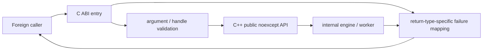

# #4202 C API safe exception handling

- Link: https://github.com/thorvg/thorvg/issues/4202
- 난이도: 88/100
- 실현 가능성: 중간
- 초심자 추천: 비추천
- 관련 영역: C ABI, exception boundary, `noexcept`, allocator failure, compiler flags
- 분석 기준: `main` working tree `f989b27892ba`
- 조사 상태: 보류 해제 — blanket `try/catch`가 해결하지 못하는 build/ABI 경계를 확인했다.

## 이슈 요약

Delphi 같은 C API caller가 ThorVG DLL 내부 실패 때문에 process crash를 겪지 않도록 C boundary에서 안전한 실패값으로 변환하자는 요청이다.

의도는 타당하지만 “모든 C API body를 `try/catch`로 감싼다”는 제안만으로는 해결되지 않는다. 기본 build에는 C++ exception/unwind가 꺼져 있고, public C++ 메서드 다수가 `noexcept`이며, access violation·invalid foreign pointer·worker failure는 표준 C++ catch와 다른 문제다.

## 난이도 산정

| 항목 | 점수 | 근거 |
|---|---:|---|
| 재현·증거 불확실성 (0-20) | 18 | Delphi crash의 exception class, call, compiler/build option과 stack trace가 없다. |
| 변경 범위 (0-25) | 20 | 164개 C entry point, C++ public layer, allocator/build flags와 worker 경계를 검토해야 한다. |
| 구현 복잡도 (0-25) | 22 | return type별 mapping, `noexcept`, unwind/SEH, allocation failure 정책이 다르다. |
| 교차 영향 위험 (0-20) | 19 | C ABI 동작·성능·binary flags와 전체 language binding에 영향을 준다. |
| 검증 부담 (0-10) | 9 | GCC/Clang/MSVC, shared DLL, foreign caller와 fault injection matrix가 필요하다. |
| 합계 | **88/100** | 실제 crash 분류가 없는 상태에서 전체 C ABI hardening을 기준으로 한다. |

## 현재 main 코드 조사

### 확인된 사실

- [`tvgCapi.cpp`](https://github.com/thorvg/thorvg/blob/f989b27892bab31f224f810a54782055eba1e3bc/src/bindings/capi/tvgCapi.cpp)에는 현재 164개의 `TVG_API` definition이 있고 공통 `try/catch` boundary는 없다.
- 이 중 다수는 `Tvg_Result`를 반환하지만 pointer handle, `bool`, integer count, `const char*`를 반환하는 API도 있다. 하나의 catch macro가 모두 `TVG_RESULT_UNKNOWN`을 반환할 수 없다.
- [`thorvg_capi.h`](https://github.com/thorvg/thorvg/blob/f989b27892bab31f224f810a54782055eba1e3bc/src/bindings/capi/thorvg_capi.h)는 `FAILED_ALLOCATION`, `MEMORY_CORRUPTION`, `UNKNOWN`을 포함한 result enum을 이미 제공한다.
- [`inc/thorvg.h`](https://github.com/thorvg/thorvg/blob/f989b27892bab31f224f810a54782055eba1e3bc/inc/thorvg.h)에는 `noexcept` public 선언이 138개 있다. `noexcept` 함수 밖으로 C++ exception이 나가면 caller-side wrapper가 잡기 전에 terminate될 수 있다.
- [`src/meson.build`](https://github.com/thorvg/thorvg/blob/f989b27892bab31f224f810a54782055eba1e3bc/src/meson.build)는 sanitizer가 아닌 GCC/Clang build에 `-fno-exceptions`, `-fno-unwind-tables`, `-fno-asynchronous-unwind-tables`를 추가하고 clang-cl에는 `cpp_eh=none`을 준다. exception 가용성은 compiler/build mode별로 다르다.
- [`tvgInitializer.cpp`](https://github.com/thorvg/thorvg/blob/f989b27892bab31f224f810a54782055eba1e3bc/src/renderer/tvgInitializer.cpp)의 global throwing-form `operator new/new[]` replacement는 `tvg::malloc()` 결과를 그대로 반환한다. allocation failure를 표준 `std::bad_alloc`로 변환하는 code는 없다.
- C wrapper는 opaque foreign pointer를 `reinterpret_cast`한 뒤 멤버를 호출한다. null은 검사해도 stale/wrong pointer의 유효성을 표준 catch로 보장할 수 없다.

실패 종류를 먼저 분리해야 한다.

| 실패 | blanket C++ `catch (...)` | 필요한 대응 |
|---|---|---|
| wrapper 내부 C++ exception, unwind 활성 | 잡을 수 있음 | return category별 error mapping |
| `noexcept` 내부 exception | 보통 terminate가 먼저 | 내부에서 예외를 만들지 않거나 noexcept 계약 재설계 |
| `-fno-exceptions` build | catch 구현 자체가 사용 불가/무의미 | explicit result/null propagation |
| allocation이 null 반환 | exception이 아님 | 모든 allocation site의 null-safe 계약 또는 allocator 정책 |
| invalid pointer/segfault/Windows SEH | 표준적으로 보장되지 않음 | handle validation, platform crash diagnostics; C++ catch에 의존 금지 |
| worker thread failure | 호출 thread catch 밖 | worker entry에서 상태 전달/종료 정책 |



### 아직 가설인 부분

- 보고된 Delphi “exception”이 C++ exception인지 Windows access violation/SEH인지 확인되지 않았다.
- crash가 null/stale handle, OOM, async worker, DLL CRT mismatch 중 어디서 시작했는지 stack trace가 없다.
- MSVC DLL에서 실제 exception/unwind option이 무엇인지 issue의 build command가 없어 알 수 없다.
- 모든 entry에 catch를 넣는 것이 성능이나 binary size에 미치는 영향도 측정되지 않았다.

## 수정 방향과 실현 가능성

실현 가능성은 **중간**이다. 먼저 최소 crash를 분류하면 해당 경계는 강화할 수 있다. 반대로 blanket catch부터 넣으면 실제 access violation을 숨기지도 못하고 compiler 정책과 충돌할 수 있다.

1. reporter에게 ThorVG commit/build type/compiler/runtime, 호출한 C API, arguments, stack trace와 exception code/class를 받아 최소 Delphi 또는 C harness로 재현한다.
2. C API return을 `Tvg_Result`, pointer, boolean, integer/string의 category로 나누고 각 category의 실패 sentinel을 문서화한다.
3. exception-enabled build만 지원할 boundary helper를 조건부로 만들고 `bad_alloc → FAILED_ALLOCATION`, 기타 engine exception → UNKNOWN 같은 mapping을 정의한다.
4. `noexcept` 내부와 exception-disabled build는 explicit result/null propagation으로 고친다. catch를 위해 public ABI의 `noexcept`를 무작정 제거하지 않는다.
5. opaque handle에는 가능한 범위에서 type/magic/generation validation을 도입하되, arbitrary invalid address dereference를 완전히 안전하게 만들 수 있다고 약속하지 않는다.
6. worker task entry에서 failure를 canvas/saver sync result로 전달할 수 있는지 별도 설계한다.
7. allocator failure contract를 표준 throwing new, nothrow-like internal allocation, explicit `Result::FailedAllocation` 중 하나로 일관되게 정리한다.

return category별 wrapper 개념:

```cpp
// exception-enabled builds only; real implementation needs build guards.
template<typename Fn>
Tvg_Result capiResult(Fn&& fn) noexcept {
    try { return static_cast<Tvg_Result>(fn()); }
    catch (const std::bad_alloc&) { return TVG_RESULT_FAILED_ALLOCATION; }
    catch (...) { return TVG_RESULT_UNKNOWN; }
}
```

이 helper는 pointer/bool/count API, `-fno-exceptions`, `noexcept` 내부 terminate, SEH를 해결하지 않는다. 적용 범위를 그 한계와 함께 리뷰해야 한다.

## 위험과 검증 계획

- exception on/off, GCC/Clang/clang-cl/MSVC, static/shared build matrix를 만든다.
- C와 Delphi/다른 FFI caller에서 null, wrong type, double destroy, stale handle을 테스트한다.
- allocation fault injection으로 constructor, loader, canvas add/draw/sync의 반환을 확인한다.
- sync/worker 중 실패가 process terminate가 아니라 문서화된 상태로 전달되는지 본다.
- C ABI symbol/signature와 enum numeric value가 바뀌지 않는지 확인한다.
- catch helper 도입 전후 binary size와 hot-call overhead를 측정한다.
- ASan/UBSan 및 Windows crash dump를 병행하되 sanitizer crash를 “catch 성공”으로 오해하지 않는다.

## 참고 자료

- [C API implementation](https://github.com/thorvg/thorvg/blob/f989b27892bab31f224f810a54782055eba1e3bc/src/bindings/capi/tvgCapi.cpp)
- [C API result values and declarations](https://github.com/thorvg/thorvg/blob/f989b27892bab31f224f810a54782055eba1e3bc/src/bindings/capi/thorvg_capi.h)
- [Public C++ noexcept API](https://github.com/thorvg/thorvg/blob/f989b27892bab31f224f810a54782055eba1e3bc/inc/thorvg.h)
- [Compiler exception/unwind flags](https://github.com/thorvg/thorvg/blob/f989b27892bab31f224f810a54782055eba1e3bc/src/meson.build)
- [Global new/delete replacement](https://github.com/thorvg/thorvg/blob/f989b27892bab31f224f810a54782055eba1e3bc/src/renderer/tvgInitializer.cpp)
- [Allocator helpers](https://github.com/thorvg/thorvg/blob/f989b27892bab31f224f810a54782055eba1e3bc/src/common/tvgAllocator.h)

