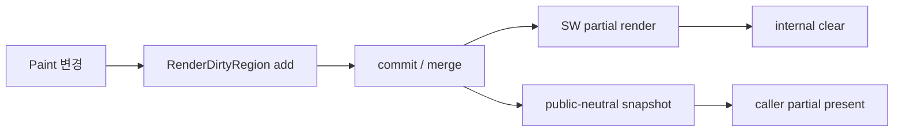

# #4214 — Smart Rendering 후 갱신 영역을 조회하는 공개 API

- **Link:** https://github.com/thorvg/thorvg/issues/4214
- **난이도:** 78/100
- **초심자 추천:** 비추천(API 수명·ABI 설계 경험 필요)
- **관련 영역:** SmartRender, SW renderer, Canvas/C API, partial present
- **배울 수 있는 것:** dirty-region 병합, double buffering, frame lifecycle, API ownership
- **조사 기준:** `main@f989b27892bab31f224f810a54782055eba1e3bc`

## 이슈 요약

Smart Rendering이 실제로 다시 그린 영역을 애플리케이션이 알아내 framebuffer의 일부만 전송하려는 요청이다. 내부에는 여러 rect가 있지만 `draw()`가 끝난 뒤 읽을 수 있는 공개 표현과 수명 계약이 없다. 단순 getter보다 “무엇을, 언제까지, 어느 backend에서 보장하는가”를 정하는 일이 핵심이다.

## 난이도 산정

| 항목 | 점수 | 근거 |
|---|---:|---|
| 재현·증거 불확실성 (0-20) | 10 | 내부 clear 시점은 확인됐지만 caller가 단일 AABB와 rect 목록 중 무엇을 원하는지 미정이다. |
| 변경 범위 (0-25) | 21 | Canvas, renderer, C++/C API, 문서와 partial-render test가 연결된다. |
| 구현 복잡도 (0-25) | 18 | partition 결과를 안정된 snapshot으로 바꾸고 frame/resize 수명을 관리해야 한다. |
| 교차 영향 위험 (0-20) | 20 | public ABI, render thread, GPU 비지원 동작과 present correctness에 영향이 있다. |
| 검증 부담 (0-10) | 9 | 이동·삭제·겹침·no-op·resize와 여러 rect의 pixel 결과를 검증해야 한다. |
| **합계** | **78** |  |

- **실현 가능성: 중간.** SW 전용 snapshot은 구현 가능하지만 공개 C/C++ 계약과 장기 ABI를 먼저 합의해야 한다.

## main 코드 조사

### 확인된 증거

- `RenderDirtyRegion`은 16개 partition 각각에 `Array<RenderRegion> list[2]`를 두고 `current`를 뒤집는다.
- `SwRenderer::preRender()`가 `dirtyRegion.commit()` 후 `get(idx)`의 rect만 clear한다.
- `SwRenderer::postRender()`가 `dirtyRegion.clear()`를 호출한다. 따라서 현재 구조에서는 `Canvas::draw()` 반환 후 같은 목록을 그대로 노출할 수 없다.
- GL/WG canvas는 SmartRender 요청에 `NonSupport`를 반환한다. 공개 API는 SW만 유효한지, GPU에서는 전체 target을 반환할지 명시해야 한다.

```text
frame N 변경 수집 -> commit() -> committed rect로 clear/draw -> postRender() -> clear()
                         |                                      |
                    내부에서 유효                     public draw() 반환 전 소멸
```

### 아직 확인되지 않은 부분

- window system이 원하는 값이 rect 목록인지 모든 rect의 union AABB인지 이슈 본문만으로 확정되지 않는다.
- 비동기 `draw()`/`sync()` 조합에서 조회 가능 시점을 어디로 둘지 정해지지 않았다.
- 첨부 fixture가 없는 API 요청이므로 실제 partial-present 통합 비용은 소비자 측 test가 필요하다.

## 원인 가설

- **확인됨:** dirty region은 renderer 내부의 임시 최적화 자료이고 공개 조회 수명을 갖지 않는다.
- **설계 가설:** `postRender()`의 clear 전에 renderer-neutral rect snapshot을 Canvas가 복사해 다음 성공한 draw까지 소유하는 방식이 가장 단순하다.
- **위험 가설:** 내부 partition 배열을 포인터로 노출하면 다음 frame에서 무효화되고 내부 병합 정책까지 ABI로 고정된다.



## 수정 방향과 실현 가능성

1. `updatedRegions()`의 결과를 단일 AABB 또는 count+copy rect 목록 중 하나로 결정하고 좌표계를 target pixel로 고정한다.
2. `postRender()` 전에 snapshot을 만들고 “다음 draw/target 변경까지 Canvas 소유” 같은 수명을 문서화한다.
3. C API에는 caller buffer와 필요 count를 받는 2-pass 형태를 검토해 내부 포인터를 노출하지 않는다.
4. SmartRender off/no change/full redraw/resize와 GL·WG의 `NonSupport` 규칙을 명시한다.
5. rect union 영역 밖 pixel이 바뀌지 않는 회귀 test와 native partial-present 예제를 추가한다.

## 위험과 검증

- old/new bounds가 다른 이동은 두 영역을 모두 포함해야 하며 clip/mask/filter 팽창도 누락하면 안 된다.
- async renderer가 snapshot을 쓰는 동안 caller가 target을 교체하는 경쟁을 막아야 한다.
- rect 개수 제한·병합으로 전송량이 오히려 전체 present보다 커지는 경우도 측정한다.

## 참고 자료

- `src/renderer/tvgRender.h` — `RenderDirtyRegion`, 16 partition과 이중 목록
- `src/renderer/tvgRender.cpp` — `commit()`, `clear()`, 영역 병합
- `src/renderer/cpu_engine/tvgSwRenderer.cpp` — `preRender()`/`postRender()` 수명
- `src/renderer/tvgCanvas.cpp`, `inc/thorvg.h` — SmartRender backend/public 계약
- https://github.com/thorvg/thorvg/issues/4214 — 로컬에 저장된 원 이슈 설명
