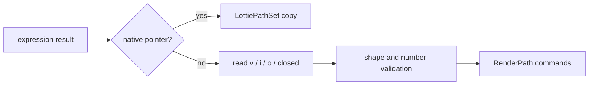

# #4222 — Lottie expression Bezier path 호환

- **Link:** https://github.com/thorvg/thorvg/issues/4222
- **난이도:** 64/100
- **초심자 추천:** 조건부(JS bridge와 path 의미를 함께 학습할 경우)
- **관련 영역:** Lottie expressions, JerryScript, RenderPath, Bezier
- **배울 수 있는 것:** native pointer bridge, JS array validation, 상대 tangent, ownership
- **조사 기준:** `main@f989b27892bab31f224f810a54782055eba1e3bc`

## 이슈 요약

expression이 일반 JavaScript 객체 `{v, i, o}`로 반환한 path를 ThorVG `RenderPath`로 변환하지 못하는 호환 문제다. 엔진이 만든 native path 객체는 처리하지만 사용자 expression이 조립한 배열 객체를 읽는 역방향 bridge가 없다.

## 난이도 산정

| 항목 | 점수 | 근거 |
|---|---:|---|
| 재현·증거 불확실성 (0-20) | 11 | 누락 경로는 확인됐지만 첨부 JSON은 로컬에 없고 closed/quadratic 의미를 fixture로 확정해야 한다. |
| 변경 범위 (0-25) | 14 | expression result 변환, JerryScript helper와 Lottie 회귀 test가 주 범위다. |
| 구현 복잡도 (0-25) | 18 | JS value 수명, 중첩 배열 검증과 상대 tangent→cubic 변환이 필요하다. |
| 교차 영향 위험 (0-20) | 13 | expression-enabled build와 기존 native fast path에 회귀 가능성이 있다. |
| 검증 부담 (0-10) | 8 | open/closed, line/cubic, invalid/NaN/large 배열을 검사해야 한다. |
| **합계** | **64** |  |

- **실현 가능성: 중간.** 누락된 변환 지점은 좁지만 JerryScript API의 모든 error/ownership 경로를 안전하게 처리해야 한다.

## main 코드 조사

### 확인된 증거

- `LottieExpressions::result(..., RenderPath&)`는 반환 object에 native `LottiePathSet*`가 연결된 경우만 path를 복사한다.
- ordinary JS object의 `v`, `i`, `o` property를 읽는 분기가 없어 `{v,i,o}`가 반환돼도 path는 비어 있을 수 있다.
- `_buildPath()`는 native path에 `points`, `pointOnPath`, `tangentOnPath`를 제공하지만 `inTangents`, `outTangents`, `isClosed`는 TODO다.

```cpp
// 필요한 변환 개념: Lottie tangent는 각 vertex 기준 상대 좌표다.
moveTo(v[0]);
for (size_t n = 1; n < v.size(); ++n) {
    cubicTo(v[n - 1] + o[n - 1], v[n] + i[n], v[n]);
}
```

### 아직 확인되지 않은 부분

- 원 첨부 `bezier_expression-opt.json`은 URL만 저장되어 있어 현재 checkout에서 직접 재생·pixel 비교하지 못했다.
- expression 결과가 optional `c`/`closed`를 쓰는지, quadratic을 어떤 배열 형태로 나타내는지는 fixture/spec test로 고정해야 한다.

## 원인 가설

- **확인됨:** native object→C++ fast path만 있고 plain JS path object→`RenderPath` 변환이 없다.
- **구현 가설:** `v/i/o`를 같은 길이의 point 배열로 읽어 vertex-relative control point를 만들면 일반 cubic path를 복원할 수 있다.
- **위험 가설:** property read 중 exception이나 일부 배열만 유효할 때 Jerry value를 빠뜨리면 leak 또는 빈 path의 조용한 성공이 생긴다.



## 수정 방향과 실현 가능성

1. native fast path 다음에 plain object parser를 두고 `v/i/o`의 배열 길이·각 point의 2개 유한 수를 검증한다.
2. 상대 tangent를 absolute cubic control point로 변환하고 open/closed 마지막 segment를 분기한다.
3. property/array access를 작은 RAII helper로 감싸 모든 Jerry value를 해제한다.
4. line, cubic, zero tangent, closed path와 길이 불일치·sparse·NaN 입력 test를 추가한다.
5. expressions 비활성 Meson build도 그대로 컴파일되는지 확인한다.

## 위험과 검증

- `v/i/o` 길이를 최소값으로 잘라 그리면 잘못된 expression을 숨기므로 명시적 failure 정책이 필요하다.
- 매우 큰 JS 배열은 frame마다 할당·변환되므로 상한 또는 reuse 여부를 측정한다.
- self-intersection보다 먼저 path command 자체를 golden point test로 검증해 raster 차이와 분리한다.

## 참고 자료

- `src/loaders/lottie/tvgLottieExpressions.h` — `result(... RenderPath&)` 변환
- `src/loaders/lottie/tvgLottieExpressions.cpp` — `_buildPath()` 공개 method와 TODO
- `src/loaders/lottie/tvgLottieModel.h` — `LottiePathSet`/path model
- https://github.com/user-attachments/files/26043017/bezier_expression-opt.json — 원 이슈에 기록된 fixture URL(이번 조사에서는 내려받지 않음)
- https://github.com/thorvg/thorvg/issues/4222 — 로컬에 저장된 원 이슈 설명
