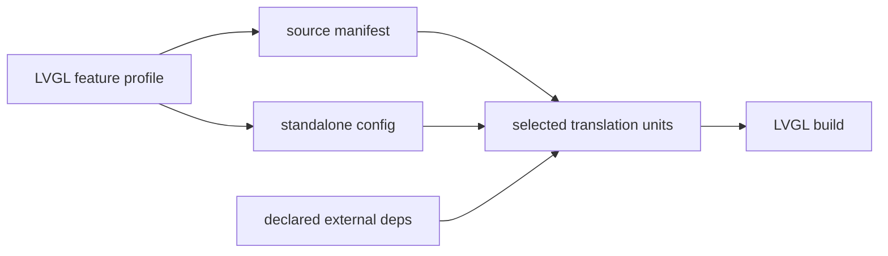

# #4225 — LVGL 통합을 위한 ThorVG source glob 지원

- **Link:** https://github.com/thorvg/thorvg/issues/4225
- **난이도:** 80/100
- **초심자 추천:** 비추천(build matrix와 optional dependency 이해 필요)
- **관련 영역:** Meson, internal include, generated config, LVGL vendoring
- **배울 수 있는 것:** include search path, translation unit selection, feature manifest, CI portability
- **조사 기준:** `main@f989b27892bab31f224f810a54782055eba1e3bc`

## 이슈 요약

LVGL이 Meson 없이 ThorVG source를 glob해 vendoring할 수 있도록 내부 include를 자급적으로 만들자는 요청이다. 그러나 실패 원인은 basename include만이 아니다. Meson이 제공하는 generated `config.h`, feature별 source 선택, include directory, 외부 dependency까지 대체해야 하므로 upstream이 지원할 “standalone source 계약”을 설계하는 과제다.

## 난이도 산정

| 항목 | 점수 | 근거 |
|---|---:|---|
| 재현·증거 불확실성 (0-20) | 12 | basename include 실패는 명확하나 LVGL이 원하는 engine/loader/compiler 조합이 고정되지 않았다. |
| 변경 범위 (0-25) | 23 | 수백 include, 모든 source 하위 영역, config generation과 CI build에 걸친다. |
| 구현 복잡도 (0-25) | 20 | glob에서 optional translation unit과 외부 dependency를 안정적으로 제외해야 한다. |
| 교차 영향 위험 (0-20) | 17 | 파일 이동, basename 충돌, Windows/embedded/WASM과 Meson 유지보수에 영향이 있다. |
| 검증 부담 (0-10) | 8 | 여러 feature matrix와 Meson 외 compiler smoke test가 필요하다. |
| **합계** | **80** |  |

- **실현 가능성: 중간-낮음.** 최소 LVGL profile manifest는 가능하지만 모든 `.cpp` 무조건 glob을 일반 계약으로 만드는 것은 현재 feature 구조와 맞지 않는다.

## main 코드 조사

### 확인된 증거

- 현재 checkout에는 `src` 아래 `.cpp`가 303개이고 `#include "tvg*.h"` 형태의 project basename include가 415곳 있다.
- 예를 들어 renderer 파일이 common header를 basename으로 include하며 Meson의 누적 include directory에 의존한다.
- `src/common/tvgCommon.h`는 build directory에서 생성되는 `config.h`를 include한다.
- GL/WG, PNG/JPG/WebP, JerryScript 등은 Meson option과 dependency 존재 여부에 따라 source·define이 선택된다.

```text
단순 glob
  find src -name '*.cpp'
          |
          +-- generated config.h 없음
          +-- 선택하지 않은 GL/WG/codec source도 포함
          +-- 외부 header/library 없음
          `-- basename include directory 없음
```

### 아직 확인되지 않은 부분

- “LVGL profile”이 SW+SVG만인지 Lottie/PNG/font까지 포함하는지 이슈에서 정해지지 않았다.
- 415는 현재 main의 정적 검색 수치이며 preprocessor 분기 후 실제 include graph와 동일하지 않다.
- 원 제안의 `g++ -c $(find ...)`는 link는 물론 generated file/feature define을 표현하지 못한다.

## 원인 가설

- **확인됨:** ThorVG source tree는 Meson이 include path와 feature selection을 제공한다는 전제다.
- **설계 가설:** 모든 include를 `../../` 상대 경로로 바꾸는 것보다 versioned source manifest와 standalone `config.h` template을 제공하는 편이 유지 가능하다.
- **위험 가설:** 무조건 glob이 성공하도록 stub을 늘리면 optional backend 오류가 compile-time에서 runtime으로 이동한다.



## 수정 방향과 실현 가능성

1. LVGL과 함께 최소 지원 profile(SW, SVG 등), compiler 표준과 필요한 dependency를 먼저 문서화한다.
2. 현재 Meson source list에서 기계 생성할 수 있는 manifest를 제공해 두 목록이 drift하지 않게 한다.
3. generated config의 standalone template/defines를 만들고 unsupported source를 manifest에서 제외한다.
4. include 정책은 root-qualified include와 source-local relative include를 비교하고 basename collision 검사부터 추가한다.
5. Linux/Windows의 Meson 외 compile smoke CI와 정상 Meson build를 함께 돌린다.

## 위험과 검증

- 상대 경로는 디렉터리 재구성 때 대량 churn을 만들고 generated header는 source tree에 복사하면 stale해질 수 있다.
- codec/GL/WG source를 compile만 통과시키고 link symbol을 누락하지 않는지 확인해야 한다.
- C/C++ flag, visibility, threading, exception/RTTI 설정도 LVGL build가 Meson과 같아야 한다.

## 참고 자료

- `meson.build`, `meson_options.txt` — global option과 generated configuration
- `src/meson.build`, `src/**/meson.build` — source/include/dependency 선택
- `src/common/tvgCommon.h` — generated `config.h` 의존
- `src/renderer/tvgAccessor.cpp` — basename include 사례
- https://github.com/lvgl/lvgl/tree/master/src/libs/thorvg — 원 이슈에 기록된 LVGL vendoring 위치
- https://github.com/thorvg/thorvg/issues/4225 — 로컬에 저장된 원 이슈 설명
