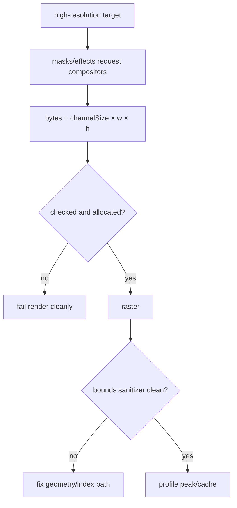

# #4284 — CPU WASM 고해상도 Lottie memory access out of bounds

- **Link:** https://github.com/thorvg/thorvg/issues/4284
- **난이도:** 89/100
- **초심자 추천:** 비추천(WASM 진단·메모리 안전·렌더 graph 경험 필요)
- **관련 영역:** WASM32, CPU renderer, compositor surface, Lottie mask/effect
- **배울 수 있는 것:** checked multiplication, OOM 전파, peak memory, 최소 재현
- **조사 기준:** `main@f989b27892bab31f224f810a54782055eba1e3bc`

## 이슈 요약

복잡한 Lottie를 CPU WASM에서 고해상도로 그리면 `RuntimeError: memory access out of bounds`가 발생한다. 이 메시지는 OOM 뒤 null 접근, 32-bit 크기 overflow, 실제 raster bounds 오류를 모두 포함할 수 있다. 원 JSON·실패 stack·WASM memory 옵션이 checkout에 없어 현 단계에서는 메모리 압박 경로를 확인했을 뿐 단일 원인으로 확정할 수 없다.

## 난이도 산정

| 항목 | 점수 | 근거 |
|---|---:|---|
| 재현·증거 불확실성 (0-20) | 19 | 첨부와 stack, 해상도·Emscripten memory 설정이 로컬에 없어 세 원인 후보를 분리하지 못했다. |
| 변경 범위 (0-25) | 20 | allocator, SW compositor, Lottie mask/effect와 WASM build/test가 연결된다. |
| 구현 복잡도 (0-25) | 23 | 32-bit overflow/OOM/bounds를 계측해 실패를 render graph 위로 안전하게 전파해야 한다. |
| 교차 영향 위험 (0-20) | 19 | allocation cleanup과 cached surface 변경은 모든 CPU composition에 영향을 준다. |
| 검증 부담 (0-10) | 8 | native ASan, WASM SAFE_HEAP, memory growth/해상도 matrix가 필요하다. |
| **합계** | **89** |  |

- **실현 가능성: 낮음-중간.** 방어적 size check는 바로 가능하지만 실제 결함 수정은 fixture와 fault stack을 확보해야 선택할 수 있다.

## main 코드 조사

### 확인된 증거

- `SwRenderer::request()`는 offscreen compositor마다 `channelSize * w * h` byte를 `tvg::malloc<pixel_t>()`에 전달한다.
- 이 식은 `int`/`uint32_t` 산술 뒤 `size_t`가 되어 WASM32에서 overflow할 수 있고 반환 null도 검사하지 않는다.
- mask/effect/post-processing은 full target 크기 surface를 요구할 수 있으며 `compositors` cache는 frame 동안 여러 surface를 보유한다.
- global `operator new/new[]`도 `tvg::malloc()` 결과를 직접 반환한다. 표준 throwing-new 의미와 달리 allocation 실패 진단이 약하다.

```text
예: 4096 x 4096 x 4 bytes = 64 MiB / surface
mask + matte + effect + target 여러 장 -> WASM linear memory peak 급증
allocation 실패/overflow -> null 또는 작은 block -> 후속 raster write -> OOB trap
```

### 아직 확인되지 않은 부분

- 첨부 `test.json`과 동영상은 URL만 있고 로컬 fixture가 없어 177-layer라는 기존 기록도 이번 checkout에서 재검증하지 못했다.
- trap 직전 함수·주소가 없어 allocation failure인지 scanline/clip의 잘못된 index인지 미확정이다.
- `ALLOW_MEMORY_GROWTH`, initial/maximum memory, threads, target 해상도가 기록되지 않았다.

## 원인 가설

| 후보 | 현재 근거 | 확정 방법 |
|---|---|---|
| OOM 후 null 사용 | unchecked compositor allocation, 고해상도 조건 | allocation log와 null fail-fast |
| 32-bit size overflow | `channelSize * w * h`가 32-bit 연산 가능 | checked `size_t` 계산과 경계 unit test |
| raster bounds bug | WASM trap의 일반적 형태 | 동일 frame native ASan/WASM SAFE_HEAP stack |



## 수정 방향과 실현 가능성

1. 재현 JSON, failing frame, output size, Emscripten version/options와 symbolized stack을 확보한다.
2. layer/mask/effect를 이분 제거해 최소 fixture를 만들고 compositor count·크기·peak bytes를 기록한다.
3. `checkedImageBytes(w,h,channelSize,size_t&)`를 만들고 overflow/구현 상한/allocation 실패를 `nullptr`로 상위 호출자까지 전파한다.
4. native ASan/UBSan과 WASM `SAFE_HEAP`에서 같은 frame을 실행해 OOM과 bounds 분기를 확정한다.
5. 원인이 peak memory면 bbox-sized surface/reuse 가능성을 별도 최적화로 측정한다.

## 위험과 검증

- heap만 늘리면 overflow 또는 out-of-bounds를 숨길 수 있으므로 수정으로 간주하지 않는다.
- `request()`가 실패할 때 이미 생성한 `SwSurface`/`SwCompositor`를 cache에 넣지 않고 모두 정리해야 한다.
- 0·최대 dimension, square post-process, 반복 frame, memory growth on/off와 32/64-bit native를 검증한다.

## 참고 자료

- `src/renderer/cpu_engine/tvgSwRenderer.cpp` — `request()`, compositor cache와 byte 계산
- `src/common/tvgAllocator.h` — raw malloc wrapper
- `src/renderer/tvgInitializer.cpp` — global `operator new/new[]`
- https://github.com/user-attachments/files/26424010/test.json — 원 이슈 fixture URL(이번 조사에서는 내려받지 않음)
- https://github.com/thorvg/thorvg/issues/4284 — 로컬에 저장된 원 이슈 설명
