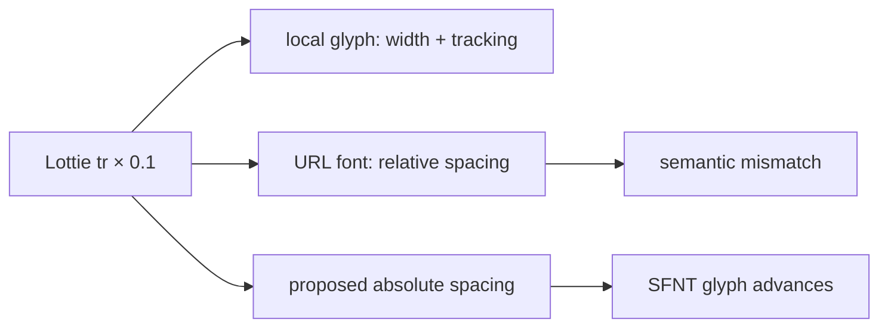

# #4311 — URL font Lottie text tracking 단위 불일치

- **Link:** https://github.com/thorvg/thorvg/issues/4311
- **난이도:** 59/100
- **초심자 추천:** 조건부(재현 test부터 분리 가능)
- **관련 영역:** Lottie text, URL font, SFNT layout, tracking
- **배울 수 있는 것:** absolute offset와 relative scale, glyph advance, dual text pipeline
- **조사 기준:** `main@f989b27892bab31f224f810a54782055eba1e3bc`

## 이슈 요약

Lottie의 `tr`은 각 glyph 사이에 같은 절대 거리를 추가해야 하지만 URL font 경로는 이를 `Text::spacing()`의 상대 배율로 바꾼다. 폭이 다른 `W`와 `I`에서는 추가 간격도 서로 달라진다. 내장 glyph 경로는 이미 절대값을 advance에 더하므로 두 pipeline의 의미가 다르다.

## 난이도 산정

| 항목 | 점수 | 근거 |
|---|---:|---|
| 재현·증거 불확실성 (0-20) | 5 | parser와 두 layout 공식의 단위 불일치가 코드에서 직접 확인된다. |
| 변경 범위 (0-25) | 13 | Lottie builder와 Text/SFNT 내부 spacing 계약, test가 영향 범위다. |
| 구현 복잡도 (0-25) | 17 | kerning/ligature/wrap을 유지하면서 절대 letter spacing을 넣어야 한다. |
| 교차 영향 위험 (0-20) | 16 | 공용 Text layout을 바꾸면 SVG/API text와 줄바꿈에도 영향이 갈 수 있다. |
| 검증 부담 (0-10) | 8 | 다양한 glyph 폭, font size, wrap, 음수 tracking을 비교해야 한다. |
| **합계** | **59** |  |

- **실현 가능성: 중간-높음.** 원인은 명확하며 내부 absolute-spacing 계약을 좁게 추가하면 수정할 수 있다.

## main 코드 조사

### 확인된 증거

- parser는 `tr`을 `doc.tracking = value * 0.1f`로 저장한다.
- `updateLocalFont()`는 `(glyph->width + doc.tracking) * capScale`로 동일 길이를 advance에 더한다.
- `updateURLFont()`는 `1 + tracking * size / metrics.ascent`를 `Text::spacing()`에 전달한다.
- public 문서는 `Text::spacing(letter, line)`의 letter가 glyph advance width에 곱하는 **상대 scale factor**라고 명시한다.

```text
기대(Lottie):  advance(W) + T, advance(I) + T       -> 같은 T
현재 URL font: advance(W) × S, advance(I) × S       -> (S-1) 추가량이 다름
현재 local:    (width(W)+T), (width(I)+T)           -> 같은 T
```

### 아직 확인되지 않은 부분

- 원 `text_tracking.json`은 로컬에 없어 실제 font의 kerning/ligature와 pixel 결과를 재실행하지 못했다.
- tracking을 마지막 glyph 뒤에도 적용하는지와 text animator가 tracking을 바꿀 때의 순서는 기준 renderer test로 고정해야 한다.

## 원인 가설

- **확인됨:** URL 경로가 절대 tracking을 상대 배율로 근사한 것이 의미 불일치의 직접 원인이다.
- **구현 가설:** SFNT layout 내부에 Lottie 전용 또는 일반 absolute letter-spacing 값을 전달하면 shaping 결과의 각 advance 뒤에 동일 delta를 더할 수 있다.
- **위험 가설:** Lottie builder에서 UTF-8 문자를 직접 쪼개 glyph별 `Text`를 만들면 ligature·kerning·bidi를 잃을 수 있다.



## 수정 방향과 실현 가능성

1. `WIWIWI`, 동일폭 glyph, 공백과 음수 `tr`의 glyph origin 기대값을 test로 만든다.
2. public API 변경 없이 loader/layout 내부에 absolute letter spacing을 전달할 수 있는 최소 계약을 설계한다.
3. shaping/kerning 후 각 inter-glyph advance에 동일 값을 적용하고 마지막 glyph·줄 끝 규칙을 명시한다.
4. URL/local font가 같은 origin delta를 내는지 비교하고 wrap width 계산에도 같은 값을 사용한다.
5. 기존 `Text::spacing()`의 상대 의미와 일반 사용자 동작은 변경하지 않는다.

## 위험과 검증

- grapheme와 glyph는 1:1이 아니므로 tracking 단위를 code point로 임의 처리하지 않는다.
- font ascent가 0일 때 현재 나눗셈도 방어해야 하지만 별도 failure로 분리한다.
- justification, text range animator, multi-line/box wrap과 0/양수/음수 tracking을 검증한다.

## 참고 자료

- `src/loaders/lottie/tvgLottieParser.cpp` — `tr` 파싱과 0.1 변환
- `src/loaders/lottie/tvgLottieBuilder.cpp` — `updateURLFont()`/`updateLocalFont()` 공식
- `src/renderer/tvgText.h`, `inc/thorvg.h` — spacing 구현과 상대 배율 계약
- https://github.com/user-attachments/files/26674076/text_tracking.json — 원 이슈 fixture URL(이번 조사에서는 내려받지 않음)
- https://github.com/thorvg/thorvg/issues/4311 — 로컬에 저장된 원 이슈 설명
