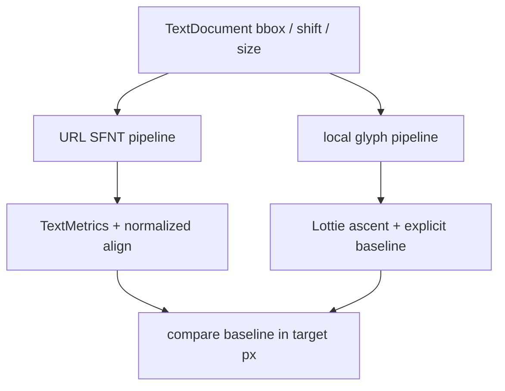

# #4334 — URL font Lottie text Y 정렬 불일치

- **Link:** https://github.com/thorvg/thorvg/issues/4334
- **난이도:** 65/100
- **초심자 추천:** 조건부(font metric 좌표계를 먼저 이해할 경우)
- **관련 영역:** Lottie text, URL/local font, baseline, TextMetrics
- **배울 수 있는 것:** ascent/descent, baseline과 box align, font별 metric 차이
- **조사 기준:** `main@f989b27892bab31f224f810a54782055eba1e3bc`

## 이슈 요약

box와 가운데 정렬을 쓰는 Lottie text가 URL font 경로에서 기준 renderer와 다른 Y 위치에 그려진다. 현재 URL/SFNT 경로는 `Text::align()`의 normalized vertical alignment를 쓰지만 내장 Lottie glyph 경로는 ascent와 `doc.shift`로 baseline을 직접 계산한다. 두 좌표계의 대응이 명시돼 있지 않다.

## 난이도 산정

| 항목 | 점수 | 근거 |
|---|---:|---|
| 재현·증거 불확실성 (0-20) | 11 | 서로 다른 공식은 확인됐지만 첨부 font/JSON을 로컬에서 재생하지 못했다. |
| 변경 범위 (0-25) | 14 | Lottie URL text와 Text metric/alignment, regression fixture가 연결된다. |
| 구현 복잡도 (0-25) | 17 | Lottie ascent/shift, SFNT ascent/descent와 box 좌표를 한 baseline으로 변환해야 한다. |
| 교차 영향 위험 (0-20) | 15 | Text align 자체를 바꾸면 일반 text/SVG/multiline layout이 회귀할 수 있다. |
| 검증 부담 (0-10) | 8 | 여러 font와 top/center/bottom, box/no-box, multiline 비교가 필요하다. |
| **합계** | **65** |  |

- **실현 가능성: 중간.** Lottie builder 안에서 보정하면 범위를 제한할 수 있지만 fixture metric을 계측해 좌표식을 먼저 확정해야 한다.

## main 코드 조사

### 확인된 증거

- `updateURLFont()`는 font size를 설정하고 `TextMetrics`를 얻은 뒤 box가 있으면 `valign=0.0f`, box가 없으면 `ascent/(ascent-descent)`를 넘긴다.
- URL 경로는 `paint->translate(doc.bbox.pos)`와 `paint->align(doc.justify, valign)`에 baseline 결정을 맡긴다.
- `updateLocalFont()`는 `ascent = font->ascent * scale`을 box 높이로 제한하고 `bbox.y + ascent - doc.shift`를 line scene 위치로 쓴다.
- 즉 같은 `TextDocument`가 font origin에 따라 다른 vertical layout 식을 탄다.

```text
URL font : bbox.y -> Text::align(valign=0 for box) -> SFNT metrics 내부 baseline
local glyph: bbox.y + min(fontAscent×scale, boxHeight) - doc.shift -> baseline
```

### 아직 확인되지 않은 부분

- 원 `right_center.json`과 Abel Regular TTF가 checkout에 없어 실제 metric 값과 offset px를 측정하지 못했다.
- 기준 renderer가 Lottie font의 `ascent` 필드와 TTF OS/2/hhea 중 어느 metric을 우선하는지 이번 로컬 조사만으로 확정되지 않는다.

## 원인 가설

- **확인됨:** URL과 local glyph pipeline의 baseline 공식이 일치하지 않는다.
- **원인 가설:** box가 있을 때 무조건 `valign=0`을 주는 URL 경로가 Lottie의 ascent/shift를 잃어 Y offset을 만든다.
- **반증 조건:** metric을 출력했을 때 두 baseline이 같다면 font size의 `75.0f` scale 또는 font 자체의 ascent source를 조사해야 한다.



## 수정 방향과 실현 가능성

1. fixture를 URL/local 두 경로로 최소화하고 bbox top, ascent, descent, shift, 최종 baseline을 log한다.
2. 모든 값을 target pixel 좌표로 표준화해 기대 baseline 식을 먼저 test에 고정한다.
3. `Text::align()` 전역 의미를 바꾸지 말고 Lottie URL builder의 translation/align에 필요한 offset을 적용한다.
4. top/center/bottom justify, box 없음/작은 box, 여러 줄과 서로 다른 ascent/descent font를 golden test로 만든다.
5. Abel 하나에 맞춘 상수 offset 대신 metric 기반 계산임을 검증한다.

## 위험과 검증

- ascent를 box 높이로 clamp하는 local 경로 자체가 기준과 다를 가능성도 있어 한쪽을 무조건 정답으로 삼지 않는다.
- descent 부호와 zero metric, line gap, fallback font가 바뀔 때 NaN/점프가 없어야 한다.
- #4311 tracking 수정과 같은 URL text path를 건드리므로 두 회귀 test를 함께 실행한다.

## 참고 자료

- `src/loaders/lottie/tvgLottieBuilder.cpp` — `updateURLFont()`와 `updateLocalFont()`
- `src/loaders/lottie/tvgLottieParser.cpp` — `TextDocument` 값 파싱
- `inc/thorvg.h`, `src/renderer/tvgText.h` — `TextMetrics`, align/layout 계약
- https://github.com/user-attachments/files/26673538/right_center.json — 원 이슈 fixture URL(이번 조사에서는 내려받지 않음)
- https://github.com/thorvg/thorvg/issues/4334 — 로컬에 저장된 원 이슈 설명
