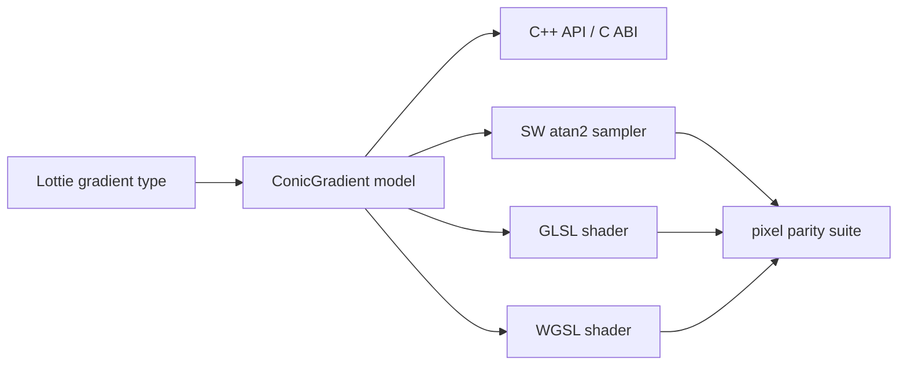

# #4347 — Lottie conic gradient 지원

- **Link:** https://github.com/thorvg/thorvg/issues/4347
- **난이도:** 94/100
- **초심자 추천:** 비추천(public API와 3개 renderer를 아우르는 기능)
- **관련 영역:** Lottie 1.1, Fill API/C ABI, CPU, GL, WebGPU
- **배울 수 있는 것:** gradient 좌표 모델, angular sampling, shader parity, ABI 설계
- **조사 기준:** `main@f989b27892bab31f224f810a54782055eba1e3bc`

## 이슈 요약

Lottie 1.1에 추가된 conic gradient를 ThorVG에서 지원하는 기능 요청이다. 현재 core 표현과 공개 타입이 linear/radial 두 종류뿐이라 parser 한 곳의 분기를 추가하는 작업이 아니다. 모델·복제·C/C++ API에서 시작해 SW/GL/WG의 색상 sampling과 seam 규칙까지 새 형식을 end-to-end로 구현해야 한다.

## 난이도 산정

| 항목 | 점수 | 근거 |
|---|---:|---|
| 재현·증거 불확실성 (0-20) | 14 | 미구현은 확실하지만 Lottie 1.1 각도/방향/spread와 public API 범위를 결정해야 한다. |
| 변경 범위 (0-25) | 25 | model, parser, C++/C API, duplication, CPU·GL·WG와 test 전부에 걸친다. |
| 구현 복잡도 (0-25) | 25 | transform된 중심 주위 각도, stop/spread/seam을 세 renderer에서 동일하게 구현해야 한다. |
| 교차 영향 위험 (0-20) | 20 | enum/ABI·binding과 shader layout/dispatch가 바뀌며 기존 gradient도 영향받을 수 있다. |
| 검증 부담 (0-10) | 10 | pixel parity, seam, transform, focal singularity와 backend matrix가 필요하다. |
| **합계** | **94** |  |

- **실현 가능성: 낮음(단일 작은 PR 기준).** CPU-only prototype은 가능하지만 release 품질의 공용 기능은 API→backend 순으로 나눈 여러 PR이 현실적이다.

## main 코드 조사

### 확인된 증거

- public `Type`과 `Fill` subclass는 `LinearGradient`, `RadialGradient`뿐이다.
- `Fill::duplicate()`와 Lottie model의 gradient 생성도 이 두 타입만 분기한다.
- C API에는 linear/radial 생성·좌표 함수만 있어 새 public 형식은 binding 표면도 추가해야 한다.
- SW raster, GL `BlendSource`/uniform block, WG shader type/render data가 각각 두 형식만 처리한다.

| 계층 | 현재 구현 | conic에 필요한 핵심 |
|---|---|---|
| Model/API | linear, radial | center, start angle/direction, 새 type |
| SW | 선형 dot / 방사 거리 | `atan2(y-cy, x-cx)` 기반 offset |
| GL | 전용 blend source/shader | GLSL angular shader + uniform |
| WG | shader type/render data | WGSL angular shader + packed data |

### 아직 확인되지 않은 부분

- 원 이슈가 연결한 개발 중 Lottie spec은 이번 요청에 따라 재크롤링하지 않았다. 시작각·시계방향·spread의 정확한 normative 의미를 구현 직전에 저장된 spec/version과 고정해야 한다.
- Lottie 전용 내부 fill로 제한할지 `ConicGradient`를 공개 API로 노출할지 maintainer 결정이 없다.
- saver/serialization가 새 type을 어떻게 처리할지도 범위에 따라 달라진다.

## 원인 가설

- **확인됨:** 렌더 버그가 아니라 core 표현 자체가 없는 미구현 기능이다.
- **설계 가설:** Lottie에서 radial로 미리 변환하는 근사는 angular stop과 seam을 보존할 수 없으므로 독립 fill type이 필요하다.
- **위험 가설:** backend마다 각도의 원점·Y축 방향·`fract()` 경계가 다르면 seam 위치가 한 픽셀 이상 어긋난다.

## 수정 방향과 실현 가능성

1. spec version을 고정하고 center, zero-angle, direction, spread, transform과 degenerate case를 test vector로 정의한다.
2. internal prototype으로 stop offset `u = normalizedAngle(point-center)`와 CPU golden output을 만든다.
3. public `ConicGradient`/type/C API 여부를 결정하고 private impl, duplicate, transform, colorStops를 연결한다.
4. GL과 WG에 같은 좌표 정규화·spread·premultiplied interpolation을 구현한다.
5. 중심, seam 양쪽, 회전/비균일 scale, opacity stop을 SW 기준과 backend pixel tolerance로 비교한다.
6. API, binding generator/언어 binding, saver/type switch에서 exhaustive 분기를 점검한다.

## 위험과 검증

- `atan2` 중심은 정의되지 않으므로 center pixel 규칙을 명시해야 한다.
- 0/1 stop 경계와 repeat/reflect에서 부동소수점 `fract` 차이가 visible seam을 만들 수 있다.
- enum 값을 중간에 삽입하지 말고 ABI 호환성을 지키며 모든 type switch의 default 은폐를 검사한다.

## 참고 자료

- `inc/thorvg.h`, `inc/thorvg_capi.h` — gradient public/C ABI 표면
- `src/renderer/tvgFill.*` — private impl과 duplicate
- `src/loaders/lottie/tvgLottieModel.cpp`, `tvgLottieParser.cpp` — Lottie gradient 모델/파싱
- `src/renderer/cpu_engine/tvgSwFill.cpp`, `tvgSwRaster.cpp` — SW gradient 준비/샘플링
- `src/renderer/gpu_engine/gl/tvgGlRenderer.cpp` — GL gradient dispatch
- `src/renderer/gpu_engine/wg/tvgWgShaderTypes.cpp`, `tvgWgRenderData.cpp` — WG gradient data
- https://lottie.github.io/lottie-spec/dev/specs/values/#gradient-types — 원 이슈에 기록된 spec 링크(이번 조사에서는 열지 않음)
- https://github.com/lottie/lottie-spec/pull/167/changes — 원 이슈에 기록된 Lottie 1.1 변경 링크
- https://github.com/thorvg/thorvg/issues/4347 — 로컬에 저장된 원 이슈 설명
