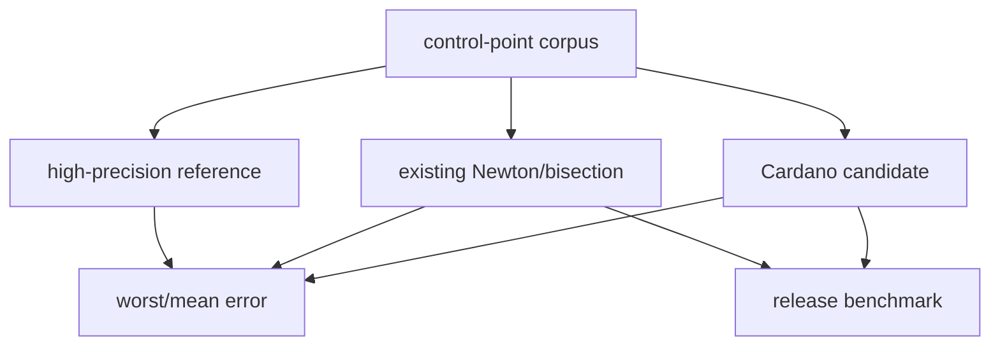

# #4349 — Lottie cubic Bezier interpolator 재검토

- **Link:** https://github.com/thorvg/thorvg/issues/4349
- **난이도:** 61/100
- **초심자 추천:** 조건부(상수 정렬과 solver 교체를 분리할 경우)
- **관련 영역:** Lottie easing, 수치해석, 성능, third-party provenance
- **배울 수 있는 것:** Newton-Raphson, bisection, Cardano, 오차/benchmark 설계
- **조사 기준:** `main@f989b27892bab31f224f810a54782055eba1e3bc`

## 이슈 요약

현재 cubic easing의 Newton 선택 임계값 `0.02`를 lottie-web 계열의 `0.001`과 맞추거나 Cardano 폐형식 solver로 교체하자는 제안이다. 상수 차이는 확인되지만 이것이 실제 frame 불일치인지, JavaScript에서 보고된 약 2배 성능이 ThorVG C++에서도 성립하는지는 아직 증거가 없다. 정확도 정렬과 알고리즘 교체를 별도 결정으로 다뤄야 한다.

## 난이도 산정

| 항목 | 점수 | 근거 |
|---|---:|---|
| 재현·증거 불확실성 (0-20) | 13 | 상수는 확인됐으나 실패 fixture와 C++ benchmark가 없고 JS 수치를 그대로 적용할 수 없다. |
| 변경 범위 (0-25) | 10 | interpolator와 numerical test/benchmark로 비교적 국소적이다. |
| 구현 복잡도 (0-25) | 16 | 퇴화 cubic과 여러 실근에서 안정적인 root 선택·clamp가 필요하다. |
| 교차 영향 위험 (0-20) | 14 | 모든 Lottie easing frame 값과 플랫폼별 float 결과가 바뀐다. |
| 검증 부담 (0-10) | 8 | dense 오차 corpus, 실제 animation과 release benchmark가 필요하다. |
| **합계** | **61** |  |

- **실현 가능성: 중간.** 임계값 변경은 쉽지만 정당화가 필요하고, Cardano 교체는 별도 수치 검증 뒤에만 가능하다.

## main 코드 조사

### 확인된 증거

- `LottieInterpolator`는 sample table로 초기 `t`를 잡고 slope가 `0.02f` 이상이면 Newton 4회, 작으면 binary subdivision 최대 10회를 사용한다.
- binary precision은 `1e-7f`이며 progress는 찾은 `t`에 y cubic을 평가한다.
- 이슈 본문에 저장된 lottie-web/`gre/bezier-easing` v2 비교값은 `0.001`이다.
- 제시된 Cardano 속도 수치는 JavaScript reference benchmark이며 현재 C++ 코드에 대한 측정이 아니다.

```text
sample x table -> initial t -> slope
                             ├─ >= 0.02 : Newton ×4
                             ├─ == 0    : initial t
                             `─ otherwise: bisection ≤10
```

### 아직 확인되지 않은 부분

- `[0.001, 0.02)`에서 두 분기가 실제 pixel/frame 차이를 만드는 Lottie fixture가 없다.
- Cardano source의 license/provenance와 ThorVG에 맞는 독립 구현 조건을 검토해야 한다.
- x control point가 단조라는 Lottie 입력 전제 밖의 invalid curve 처리 정책이 없다.

## 원인 가설

- **확인됨:** ThorVG와 이슈가 비교한 lottie-web 계열의 Newton 분기 임계값은 다르다.
- **미확정 가설:** 임계값 정렬이 reference frame 오차를 줄인다. 두 방식 모두 허용 오차 안이면 결과보다 성능 분기만 달라질 수 있다.
- **미확정 가설:** Cardano가 C++에서도 빠르다. `cbrt`, 삼각함수와 branch 비용 때문에 JS 결과가 재현되지 않을 수 있다.



## 수정 방향과 실현 가능성

1. linear, near-flat, repeated root, x=0/1과 random valid control points의 double/long-double reference corpus를 만든다.
2. 먼저 `0.02`와 `0.001`만 비교해 max `|x(t)-x|`, progress 차이, 분기 횟수와 CPU 시간을 측정한다.
3. 상수 정렬이 compliance에 필요하면 solver rewrite와 분리한 작은 patch/test로 제출한다.
4. Cardano 후보는 license를 확인한 독립 C++ 구현으로 root 개수·[0,1] root 선택·clamp/NaN을 명시한다.
5. 실제 Lottie frame benchmark와 binary size에서 기존 solver보다 유의미할 때만 교체한다.

## 위험과 검증

- 평균 오차/속도만 보면 seam처럼 드문 worst case를 놓치므로 maximum과 percentile을 함께 기록한다.
- 컴파일러 fast-math, ARM/x86/WASM `float` 차이와 deterministic frame 결과를 비교한다.
- solver가 반환한 `t`를 무조건 clamp하면 잘못된 root 선택을 숨길 수 있어 residual도 assertion/test한다.

## 참고 자료

- `src/loaders/lottie/tvgLottieInterpolator.cpp`, `.h` — 현재 sample/Newton/subdivision 구현
- https://github.com/mozilla-firefox/firefox/blob/ef76ed5b20062173274397a5aeeca1ce47114d81/dom/smil/SMILKeySpline.cpp#L14 — 원 이슈에 저장된 기원 비교
- https://github.com/airbnb/lottie-web/blob/bede03d25d232826e0c9dca1733d542d8a7754fb/player/js/3rd_party/BezierEaser.js#L30 — 원 이슈의 lottie-web 비교
- https://github.com/gre/bezier-easing/pull/63 — 원 이슈의 Cardano 제안
- https://github.com/gre/bezier-easing/blob/v3.0.0/src/index.js — 원 이슈의 candidate source
- https://github.com/thorvg/thorvg/issues/4349 — 로컬에 저장된 원 이슈 설명
