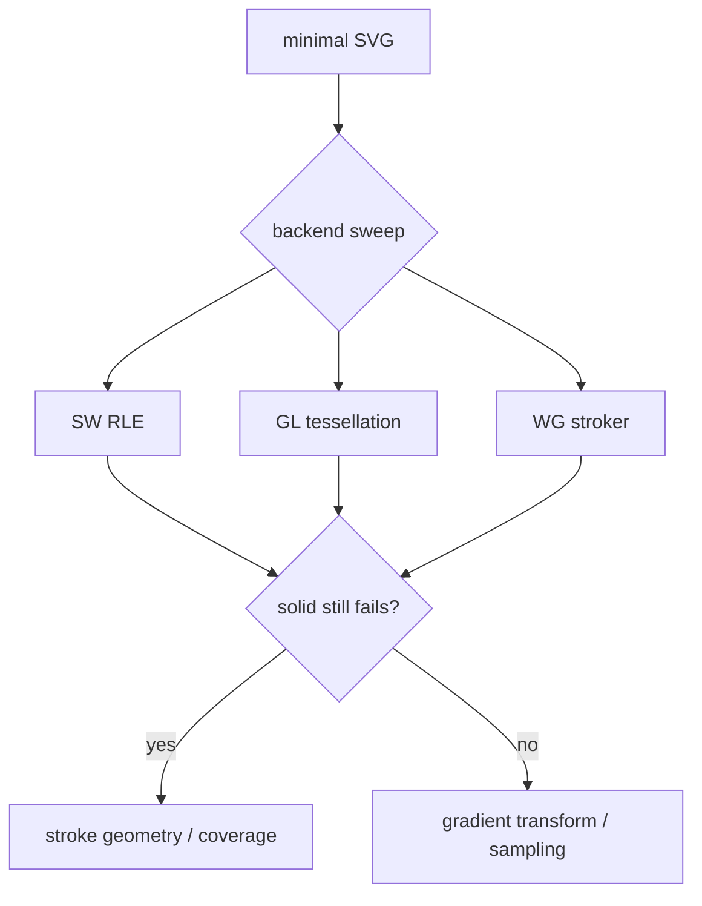

# #4375 — 특정 scale에서 SVG stroke rasterization 불균일

- **Link:** https://github.com/thorvg/thorvg/issues/4375
- **난이도:** 69/100
- **초심자 추천:** 조건부(backend 분리 실험부터 가능)
- **관련 영역:** SVG, stroke, round cap, subpixel AA, SW/GL/WG
- **배울 수 있는 것:** coverage, stroke outline/tessellation, gradient와 geometry 분리
- **조사 기준:** `main@f989b27892bab31f224f810a54782055eba1e3bc`

## 이슈 요약

16×16 SVG를 1.5배로 rasterize할 때 같은 Y 경계의 fill과 폭 2 round-cap stroke가 고르지 않고 gradient의 경계색이 새어 보이는 문제다. 입력은 충분히 작지만 어느 ThorVG backend에서 재현됐는지 이슈에 명시되지 않았다. SW는 coverage RLE, GL/WG는 별도 stroke mesh를 만들므로 먼저 backend와 geometry/gradient 단계를 분리해야 한다.

## 난이도 산정

| 항목 | 점수 | 근거 |
|---|---:|---|
| 재현·증거 불확실성 (0-20) | 13 | 최소 SVG는 있으나 Godot 경유 backend·target format·transform 방식이 기록되지 않았다. |
| 변경 범위 (0-25) | 14 | 원인이 확정되면 한 backend의 stroke/AA 경로와 image regression이 주 범위다. |
| 구현 복잡도 (0-25) | 19 | transformed stroke edge, cap과 subpixel coverage의 반올림을 추적해야 한다. |
| 교차 영향 위험 (0-20) | 15 | edge rounding 수정은 많은 기존 SVG의 antialias pixel을 바꿀 수 있다. |
| 검증 부담 (0-10) | 8 | scale/cap/orientation/backend별 pixel 비교가 필요하다. |
| **합계** | **69** |  |

- **실현 가능성: 중간.** 최소 fixture가 있어 진단 가능하지만 문제 backend를 확정한 뒤에야 수정 범위를 좁힐 수 있다.

## main 코드 조사

### 확인된 증거

- 이슈 SVG는 `rect y=9 height=7`과 `line y=10 stroke-width=2 round`에 같은 user-space linear gradient를 적용한다.
- SW는 stroke outline을 만든 뒤 `rleRender()`로 coverage를 만들고 gradient는 그 `strokeRle`을 통해 raster한다.
- GL은 `GlGeometry::tesselateStroke()`, WG는 `WgStroker`가 독립적으로 stroke mesh/round cap을 만든다.
- 따라서 gradient color가 경계 밖에 보이는 것만으로 gradient stop 계산 결함이라고 단정할 수 없다. 잘못 포함된 coverage pixel에 올바른 gradient가 sampling된 결과일 수 있다.

| 분리 실험 | SW | GL | WG | 판별 의미 |
|---|---|---|---|---|
| 단색+round cap | RLE coverage | GL mesh | WG mesh | stroke geometry/AA |
| gradient+butt cap | RLE sampling | shader | shader | gradient 좌표/stop |
| 1.0/1.5/2.0 scale | pixel quantization | viewport mesh | qualityScale mesh | fractional-scale 민감도 |

### 아직 확인되지 않은 부분

- 이슈는 Godot 4.7 beta1/ThorVG 1.0.3을 언급하지만 실제로 SW/GL/WG 중 무엇을 썼는지 저장된 본문에 없다.
- 이번 조사에서는 새 fixture 파일을 만들거나 renderer를 실행하지 않아 현재 main에서도 같은 pixel이 나오는지 미확정이다.
- 스크린샷이 nearest 확대인지 색 공간/alpha가 개입했는지도 알 수 없다.

## 원인 가설

- **1순위 가설:** 1.5 transform 뒤 수평 stroke의 위/아래 edge 또는 round cap coverage가 서로 다른 pixel-center 규칙으로 양자화된다.
- **대안 가설:** user-space gradient transform과 stroke transform scale이 다르게 적용돼 stop 위치가 어긋난다.
- **반증:** 단색 stroke에서도 같은 윤곽이 보이면 gradient 가설은 제거되고, 한 backend만 실패하면 공용 SVG parser보다 해당 tessellator/raster가 우선이다.

```text
SVG line center y=10, half width=1
user edge y=[9,11] --scale 1.5--> device edge y=[13.5,16.5]
                                     ^ half-pixel coverage 규칙이 핵심 관찰점
```



## 수정 방향과 실현 가능성

1. 본문의 SVG를 고정 fixture로 만들고 direct ThorVG에서 SW/GL/WG, 1.0/1.25/1.5/2.0 scale을 capture한다.
2. gradient를 단색으로, round를 butt/square로 바꾼 축소 matrix로 최초 divergence 단계를 찾는다.
3. SW면 exported outline과 RLE span coverage, GL/WG면 tessellated edge/round-cap vertex를 device 좌표로 dump한다.
4. pixel-center와 ceil/floor 규칙을 한 곳에서 수정하고 수평/수직·양/음 좌표·비균일 scale을 test한다.
5. 기존 image corpus의 diff 범위를 검토하고 새 회귀 이미지는 문제 edge를 작게 crop해 고정한다.

## 위험과 검증

- screenshot에 맞춘 epsilon은 다른 scale에서 crack/overdraw를 만들 수 있으므로 기하 규칙으로 설명돼야 한다.
- premultiplied alpha edge는 RGB만 보면 “누출”처럼 보일 수 있어 alpha/coverage channel도 함께 비교한다.
- backend parity는 exact match보다 명시된 tolerance와 동일한 silhouette/stop 경계를 검증한다.

## 참고 자료

- `src/renderer/cpu_engine/tvgSwShape.cpp`, `tvgSwStroke.cpp`, `tvgSwRaster.cpp` — SW outline/RLE/gradient stroke
- `src/renderer/gpu_engine/gl/tvgGlGeometry.cpp`, `tvgGlRenderer.cpp` — GL stroke tessellation/render
- `src/renderer/gpu_engine/wg/tvgWgTessellator.cpp`, `tvgWgRenderData.cpp` — WG stroker/mesh
- `src/loaders/svg/tvgSvgLoader.cpp`, `tvgSvgBuilder.cpp` — SVG cap/gradient parsing과 build
- https://github.com/thorvg/thorvg/issues/4375 — 최소 SVG와 비교 이미지가 저장된 원 이슈
