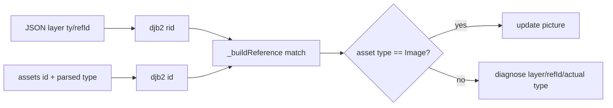

# #4394 — Lottie test에서 `Expected image data.` 로그

- **Link:** https://github.com/thorvg/thorvg/issues/4394
- **난이도:** 60/100
- **초심자 추천:** 조건부(asset/refId 최소 재현을 만들 수 있을 경우)
- **관련 영역:** Lottie asset parser, reference linking, diagnostics, type invariant
- **배울 수 있는 것:** hash reference, tagged polymorphism, safe downcast, invalid-input 정책
- **조사 기준:** `main@f989b27892bab31f224f810a54782055eba1e3bc`

## 이슈 요약

외부 `thorvg.test-suite/lottie/d` 실행 중 `Expected image data.`가 두 번 출력된다는 보고다. 로그 위치와 invariant는 확인됐지만 정확한 두 JSON 파일이 이 checkout에 없어 유효 입력을 잘못 분류한 것인지, 잘못된 test data를 올바르게 진단한 것인지 확정할 수 없다. 로그를 숨기는 작업이 아니라 `layer type → refId → asset type` 연결을 추적해야 한다.

## 난이도 산정

| 항목 | 점수 | 근거 |
|---|---:|---|
| 재현·증거 불확실성 (0-20) | 18 | test-suite 디렉터리와 파일명·render 결과가 로컬에 없어 두 발생 입력을 특정할 수 없다. |
| 변경 범위 (0-25) | 10 | 원인이 정해지면 parser/reference builder/diagnostic과 소수 test에 국한될 가능성이 높다. |
| 구현 복잡도 (0-25) | 14 | asset 분류와 hash reference 불변식을 유지하며 invalid input 정책을 구분해야 한다. |
| 교차 영향 위험 (0-20) | 10 | image/audio/precomp resolver와 잘못된 입력 진단에 영향이 있다. |
| 검증 부담 (0-10) | 8 | embedded/external image, audio, missing/wrong refId를 모두 검사해야 한다. |
| **합계** | **60** |  |

- **실현 가능성: 중간.** 정확한 두 fixture가 확보되면 연결 trace로 빠르게 좁힐 수 있으나 현재는 수정안을 선택할 증거가 부족하다.

## main 코드 조사

### 확인된 증거

- `_buildReference()`는 layer의 hashed `rid`와 asset `id`가 같으면 Image/Audio layer의 `children`에 해당 asset pointer를 넣는다. 여기서는 layer type과 asset object type을 대조하지 않는다.
- `updateImage()`는 첫 child를 먼저 `static_cast<LottieImage*>`한 뒤 base `type`이 Image인지 검사하고 해당 로그를 낸다.
- `parseAsset()`은 `data:image/` 또는 width/height가 있으면 `LottieImage`, `data:audio/` 또는 `!embedded`면 `LottieAudio`, `layers`가 있으면 precomp를 만든다.
- 즉 로그는 image layer가 참조한 object가 존재하지만 `LottieObject::Image`가 아니라는 invariant 위반을 뜻한다.

```cpp
// 진단과 cast 순서는 base pointer에서 type을 확인한 뒤 좁히는 편이 안전하다.
auto asset = layer->children.first();
if (asset->type != LottieObject::Type::Image) { /* layer/refId/type log */ return; }
auto image = static_cast<LottieImage*>(asset);
```

### 아직 확인되지 않은 부분

- 원 이슈에는 test directory URL과 로그 두 줄만 있고 파일명, layer name/refId, 기대 화면이 없다.
- 외부 test-suite는 현재 workspace에 없어 로컬 문서만으로 두 asset의 JSON 구조를 대조할 수 없다.
- hash collision, duplicate asset id, malformed asset, spec상 허용된 data URI 중 어느 경우인지 미확정이다.

## 원인 가설

| 후보 | 발생 경로 | 우선 확인 |
|---|---|---|
| 잘못된 test data | image `ty:2`가 precomp/audio id 참조 | layer `refId`와 asset keys |
| parser 오분류 | 유효 image MIME/size 조합을 audio/none으로 분류 | `p/u/e/w/h` 값과 object type |
| duplicate/hash 문제 | 같은 id 또는 충돌 asset이 먼저 match | raw id와 hash, asset 순서 |
| 진단 정책 문제 | 화면 영향 없는 unsupported asset | render pixel과 resolver 호출 |



## 수정 방향과 실현 가능성

1. test harness에서 로그 직전 source filename, layer name/index, raw refId와 parsed asset type을 임시 trace해 두 fixture를 특정한다.
2. 해당 JSON의 layer `ty/refId`와 asset `id/p/u/e/w/h/layers`를 표로 비교한다.
3. 유효 Lottie면 `parseAsset()` 분류 또는 `_buildReference()` 연결을 수정하고 최소 JSON 회귀 test를 추가한다.
4. 무효 입력이면 log를 없애지 말고 actual type/refId를 포함한 actionable message와 severity 정책을 정한다.
5. type 검사 전에 derived pointer로 cast하지 않도록 순서를 바꾸고 Image/Audio/Precomp mismatch test를 추가한다.

## 위험과 검증

- 단순히 `TVGERR`를 `TVGLOG`로 낮추면 실제 missing image를 은폐한다.
- asset id가 없거나 중복될 때 첫 match 규칙, resolver 미호출과 picture lifetime도 확인한다.
- embedded data URI, external URL/path, audio, precomp와 malformed MIME에서 crash/leak가 없어야 한다.

## 참고 자료

- `src/loaders/lottie/tvgLottieBuilder.cpp` — `updateImage()`와 `_buildReference()`
- `src/loaders/lottie/tvgLottieParser.cpp` — `parseAsset()`, `refId` hash 파싱
- `src/loaders/lottie/tvgLottieModel.h`, `.cpp` — object type, Image/Audio model
- `src/common/tvgCompressor.cpp` — `djb2Encode()`
- https://github.com/thorvg/thorvg.test-suite/tree/main/lottie/d — 원 이슈에 기록된 외부 test directory(이번 조사에서는 열지 않음)
- https://github.com/thorvg/thorvg/issues/4394 — 로컬에 저장된 원 이슈 설명
