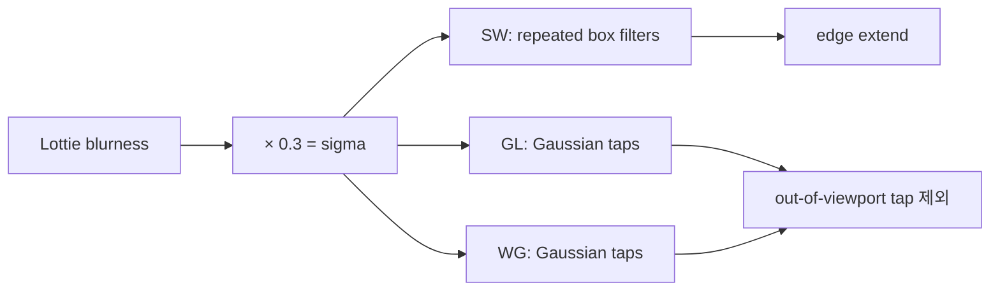

# #4407 engines: inconsistency of Gaussian Blur effect

- Link: https://github.com/thorvg/thorvg/issues/4407
- 난이도: 84/100
- 실현 가능성: 중간
- 초심자 추천: 비추천
- 관련 영역: Lottie effect, SW/GL/WG post effect, 픽셀 정확도
- 분석 기준: `main` commit `f989b27892bab31f224f810a54782055eba1e3bc`
- 조사 범위: 로컬 소스와 `docs/issue/issues.json`; 첨부 JSON·비교 이미지는 저장소에 없어 다시 실행하지 못했다.

## 난이도 산정

| 항목 | 점수 | 근거 |
|---|---:|---|
| 재현·증거 불확실성 | 15/20 | 차이가 난다는 비교 결과는 있으나 원본 asset과 픽셀 diff가 로컬에 없다. |
| 변경 범위 | 20/25 | Lottie 파라미터 의미와 SW, GL, WG 세 구현을 함께 맞춰야 한다. |
| 구현 복잡도 | 22/25 | box 근사와 실제 Gaussian의 kernel·radius·경계 규칙을 하나의 계약으로 설계해야 한다. |
| 교차 영향 위험 | 18/20 | blur 품질, 성능, effect bounds와 기존 golden output이 모두 바뀔 수 있다. |
| 검증 부담 | 9/10 | 세 엔진, 여러 sigma/scale/direction/border/quality 조합의 픽셀 검증이 필요하다. |
| **합계** | **84/100** | **원인은 여러 갈래로 확인됐지만 어떤 결과를 정답으로 삼을지가 남아 있다.** |

## 이슈 요약

동일한 Lottie Gaussian Blur가 SW, GL, WG, lottie-web에서 서로 다르게 보인다. 현재 `main`에는 실제로 같은 `sigma`가 서로 다른 알고리즘과 경계 규칙으로 소비되는 구조가 남아 있다.

## main 코드 조사

### 확인된 공통 진입점

`LottieBuilder::updateEffect()`는 blurness를 공통 sigma로 변환한다.

```cpp
constexpr float BLUR_TO_SIGMA = 0.3f;
layer->scene->add(SceneEffect::GaussianBlur,
                  (double)(effect->blurness(frameNo) * BLUR_TO_SIGMA),
                  effect->direction(frameNo) - 1,
                  effect->wrap(frameNo), quality);
```

`RenderEffectGaussianBlur`에는 `sigma`, `direction`, `border`, `quality`가 모두 보존된다. 문제는 이후 백엔드가 이를 같은 방식으로 사용하지 않는다는 점이다.

### 백엔드별 확인 결과

| 관점 | SW | GL | WG |
|---|---|---|---|
| kernel | Kovesi 방식의 1~3회 box filter 근사 | separable Gaussian | separable Gaussian |
| radius/extent | box 크기 합 | `2 * sigma * scale` | shader radius는 `2 * sigma * scale` |
| 경계 | 현재 호출은 기본 template 인자라 edge extend | viewport 밖 tap 제외 후 재정규화 | UV 밖 tap의 weight를 0으로 만든 뒤 재정규화 |
| `quality` | pass 수에 반영 | 사용하지 않음 | 사용하지 않음 |
| `border/wrap` | helper는 있으나 현재 Gaussian 호출에서 선택하지 않음 | 사용하지 않음 | 사용하지 않음 |

SW의 핵심은 Gaussian tap이 아니라 이동 평균이다.

```cpp
auto iarr = 1.0f / (dimension + dimension + 1);
dst[i++] = static_cast<uint8_t>(acc[0] * iarr);
```

GL/WG는 tap마다 Gaussian weight를 만들고 마지막에 다시 정규화한다.

```glsl
float weight = gaussian(float(x), sigma);
colorSum += texture(uSrcTexture, coord) * weight;
weightSum += weight;
FragColor = colorSum / weightSum;
```



## 원인 가설과 확인 방법

| 우선순위 | 상태 | 가설 | 확인 방법 |
|---:|---|---|---|
| 1 | 확인됨 | SW와 GPU의 kernel 자체가 다르다. | impulse image 한 점을 blur해 1차원 weight를 추출한다. |
| 2 | 확인됨 | surface 가장자리의 표본 처리 규칙이 다르다. | 경계에 불투명 한 점을 두고 중심과 총 alpha 합을 비교한다. |
| 3 | 확인됨 | 같은 `quality`가 SW pass 수만 바꾼다. | quality 1/34/67/100을 고정 sigma로 비교한다. |
| 4 | 미확정 | lottie-web과의 주된 차이가 `0.3f` 변환일 수 있다. | 원본 asset 확보 후 blurness별 유효 sigma를 fitting한다. |

## 수정 방향 계획

1. 먼저 정답 계약을 문서화한다: blurness→sigma, cutoff radius, edge duplicate/wrap/transparent, quality의 의미를 정한다.
2. 외부 asset과 별개로 9×9 impulse, edge stripe, 투명 색상 fixture를 추가한다.
3. CPU 근사를 유지할지 정확 Gaussian으로 바꿀지 성능/오차 표로 결정한다. 근사를 유지한다면 허용 오차를 명시한다.
4. GL/WG에서 `border`와 `quality`를 지원하지 않을 것이라면 API 입력을 무시하지 않도록 공통 fallback 또는 명시적 정책을 둔다.
5. direction 0/1/2와 scale, 작은 surface, 큰 sigma에 대해 세 엔진 golden diff를 자동화한다.

## 실현 가능성 판단

기술적으로는 가능하지만 단일 함수 수정으로 끝나지 않는다. 재현 asset이 없어도 synthetic kernel test로 구현 차이는 좁힐 수 있으나, lottie-web을 기준으로 한 최종 시각 호환성은 원본 fixture를 확보해야 확정할 수 있다. 따라서 구현 가능성은 **중간**이다.

## 위험/검증

- blur extent를 줄이면 가장자리가 잘리고, 늘리면 임시 surface와 fill-rate가 증가한다.
- premultiplied alpha에서 RGB와 alpha를 각각 blur한 결과가 halo를 만들지 확인해야 한다.
- SW의 `quality` 동작을 바꾸면 기존 성능 특성이 크게 달라질 수 있다.
- GL/WG의 sampler 자체 clamp 동작에 기대지 말고 weight와 좌표 정책을 함께 검증해야 한다.

## 참고 자료

- `src/loaders/lottie/tvgLottieBuilder.cpp` — Lottie blurness 변환과 effect 생성
- `src/renderer/tvgRender.h` — `RenderEffectGaussianBlur`의 공통 파라미터
- `src/renderer/cpu_engine/tvgSwPostEffect.cpp` — SW box-filter 근사와 extent
- `src/renderer/gpu_engine/gl/tvgGlEffect.cpp` — GL sigma/scale/extent
- `src/renderer/gpu_engine/gl/tvgGlShaderSrc.cpp` — GLSL Gaussian shader
- `src/renderer/gpu_engine/wg/tvgWgShaderTypes.cpp` — WG effect 파라미터
- `src/renderer/gpu_engine/wg/tvgWgShaderSrc.cpp` — WGSL Gaussian shader
- `docs/issue/issues.json` — 로컬에 저장된 issue 본문과 비교 이미지 링크
