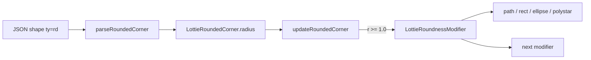

# #4414 lottie: rounded corner spec revision

- Link: https://github.com/thorvg/thorvg/issues/4414
- 난이도: 63/100
- 실현 가능성: 중간
- 초심자 추천: 조건부
- 관련 영역: Lottie parser/builder, path modifier, geometry compliance
- 분석 기준: `main` commit `f989b27892bab31f224f810a54782055eba1e3bc`
- 조사 범위: 외부 spec PR을 크롤링하지 않았으며, 로컬 issue snapshot과 현재 구현만 분석했다.

## 난이도 산정

| 항목 | 점수 | 근거 |
|---|---:|---|
| 재현·증거 불확실성 | 16/20 | 로컬에는 변경된 spec 문구와 공식 fixture가 없어 목표 동작이 아직 불완전하다. |
| 변경 범위 | 12/25 | parser보다 `LottieRoundnessModifier` 중심이지만 여러 shape와 modifier chain에 걸친다. |
| 구현 복잡도 | 16/25 | 직선·Bezier의 corner 분류와 radius 제한을 기하적으로 맞춰야 한다. |
| 교차 영향 위험 | 12/20 | trim/repeater/offset 및 기존 Lottie 결과가 영향을 받을 수 있다. |
| 검증 부담 | 7/10 | open/closed, 직선/곡선, animated radius와 modifier 순서 fixture가 필요하다. |
| **합계** | **63/100** | **코드 위치는 좁혀졌지만 외부 스펙의 acceptance criteria가 로컬에 없다.** |

## 이슈 요약

Lottie spec 1.1의 Rounded Corners 개정에 ThorVG가 맞는지 확인하고 필요한 경우 수정하는 compliance 작업이다. 현재 저장소에는 issue가 가리키는 spec PR의 본문이나 fixture가 없으므로, 이 문서에서는 구현의 실제 범위와 검증 가능한 의심 지점을 분리한다.

## main 코드 조사

현재 데이터 흐름은 명확하다.



parser는 `r`을 animation 가능한 property로 읽는다.

```cpp
if (KEY_AS("r")) parseProperty(corner->radius);
```

builder에는 1.0 미만을 무시하는 정책이 있다.

```cpp
auto r = roundedCorner->radius(frameNo, tween, exps);
if (r < LottieRoundnessModifier::ROUNDNESS_EPSILON) return;
ctx->update(new LottieRoundnessModifier(r));
```

실제 기하는 `LottieRoundnessModifier::modify()`가 담당한다. 조사 중 확인된 경계는 다음과 같다.

- `ROUNDNESS_EPSILON`은 `1.0f`이다. spec이 0보다 큰 작은 radius를 허용한다면 시각적으로 불연속이 생긴다.
- line corner는 인접 segment 길이의 절반과 요청 radius 중 작은 값을 사용한다.
- curve corner는 `_sharpCorner()` 판정과 control point 보간을 사용한다.
- 소스에 `// TODO: the line case is omitted.`가 남아 있어 command 표현에 따른 적용 범위를 fixture로 확인해야 한다.
- `path`, `polystar`, `rect`, `ellipse`가 같은 modifier interface를 공유하지만 각 구현은 별도다.

## 원인 가설과 확인 방법

| 상태 | 후보 | 확인 방법 |
|---|---|---|
| 확인됨 | radius `0 < r < 1`은 builder에서 완전히 무시된다. | 0.5와 1.0의 동일 path를 비교해 불연속을 측정한다. |
| 확인됨 | 일반 path와 rect/polystar는 서로 다른 기하 함수를 탄다. | 같은 사각형을 `rc`와 `sh`로 작성해 결과를 비교한다. |
| 미확정 | spec 1.1이 sharp curve 또는 open path의 적용 범위를 바꿨다. | spec 문구/공식 fixture가 확보되면 현재 분기표와 대조한다. |
| 미확정 | modifier 적용 순서가 새 규칙과 다르다. | round→trim과 trim→round를 표현하는 최소 asset을 비교한다. |

## 수정 방향 계획

1. 외부 spec을 가져오지 않는 현재 단계에서는 구현 분기표와 최소 fixture부터 만든다.
2. 공식 spec 자료가 작업 입력으로 제공되면 “적용 shape, radius clamp, open/closed, modifier order” 네 항목을 acceptance checklist로 고정한다.
3. parser와 model은 현재 radius를 손실 없이 보존하므로, 우선 modifier와 `ROUNDNESS_EPSILON`만 대상으로 좁힌다.
4. 동일 기하를 `rect`, line-only path, cubic-encoded path, polystar로 각각 표현해 동등성 테스트를 추가한다.
5. animated radius가 epsilon을 통과할 때 popping이 없는지 frame 단위로 확인한다.

## 실현 가능성 판단

구현 지점은 잘 격리되어 있어 수정 자체는 가능성이 높다. 다만 “spec revision”의 정확한 정답이 로컬 자료에 없으므로 지금 즉시 패치를 작성하면 추측 구현이 된다. 공식 변경 문구 또는 fixture가 입력으로 주어진다는 전제에서 실현 가능성은 **중간**이다.

## 위험/검증

- epsilon 제거는 아주 작은 radius에서 path point 수와 렌더 비용을 늘릴 수 있다.
- 짧은 segment와 coincident point에서는 0 길이 나눗셈 및 퇴화 curve를 확인해야 한다.
- modifier chain 순서를 바꾸면 roundness 외의 trim/repeater/offset 결과도 달라진다.
- 이전 Lottie 파일의 결과 변경은 의도된 spec migration인지 별도 golden으로 기록해야 한다.

## 참고 자료

- `src/loaders/lottie/tvgLottieParser.cpp` — `parseRoundedCorner()`
- `src/loaders/lottie/tvgLottieModel.h` — `LottieRoundedCorner`
- `src/loaders/lottie/tvgLottieBuilder.cpp` — `updateRoundedCorner()`
- `src/loaders/lottie/tvgLottieModifier.h` — epsilon과 modifier interface
- `src/loaders/lottie/tvgLottieModifier.cpp` — line/curve/shape별 roundness 기하
- `docs/issue/issues.json` — 로컬 issue 본문과 spec PR 링크
