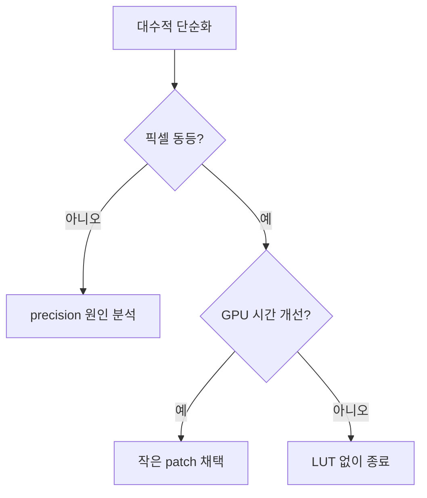

# #4426 gl_engine: blur shader optimization

- Link: https://github.com/thorvg/thorvg/issues/4426
- 난이도: 48/100
- 실현 가능성: 높음(작은 최적화), 성능 효과는 미확정
- 초심자 추천: 조건부
- 관련 영역: GLSL, Gaussian blur, loop invariant, GPU benchmark
- 분석 기준: `main` commit `f989b27892bab31f224f810a54782055eba1e3bc`
- 조사 범위: 로컬 GL source와 issue snapshot만 사용했다.

## 난이도 산정

| 항목 | 점수 | 근거 |
|---|---:|---|
| 재현·증거 불확실성 | 10/20 | 반복 계산은 보이지만 driver compiler가 이미 최적화하는지와 실제 병목 여부는 모른다. |
| 변경 범위 | 8/25 | 수직·수평 GL shader와 성능 test가 주 범위다. |
| 구현 복잡도 | 9/25 | 수학적 단순화는 작지만 precision과 compiler output을 확인해야 한다. |
| 교차 영향 위험 | 12/20 | 모든 GL blur pixel에 적용되며 작은 수치 차이가 누적될 수 있다. |
| 검증 부담 | 9/10 | 여러 GPU/driver에서 timer와 pixel diff를 모두 측정해야 한다. |
| **합계** | **48/100** | **코드 변경은 작고 명확하지만 최적화 이득을 입증하는 부담이 크다.** |

## 이슈 요약

GL Gaussian blur가 모든 fragment의 모든 tap에서 `sigma²`와 정규화 계수를 계산한다. LUT 또는 CPU 사전 계산이 제안됐지만, 현재 수식에는 LUT보다 먼저 적용할 수 있는 더 작은 대수적 단순화가 있다.

## main 코드 조사

수직·수평 shader에 동일한 함수가 각각 들어 있다.

```glsl
float gaussian(float x, float sigma) {
    float exponent = -x * x / (2.0 * sigma * sigma);
    return exp(exponent) / (sqrt(2.0 * 3.141592) * sigma);
}
```

그러나 출력은 weight 합으로 다시 나눈다.

```glsl
colorSum += texture(uSrcTexture, coord) * weight;
weightSum += weight;
FragColor = weightSum > 0.0 ? colorSum / weightSum
                            : texture(uSrcTexture, vUV);
```

공통 정규화 상수 `k = 1 / (sqrt(2π)σ)`는 아래처럼 정확히 상쇄된다.

```text
Σ(colorᵢ × k × expᵢ)     Σ(colorᵢ × expᵢ)
--------------------  =  ------------------
Σ(k × expᵢ)              Σ(expᵢ)
```

따라서 첫 후보는 LUT가 아니라 다음 형태다.

```glsl
float invTwoSigmaSq = -0.5 / (sigma * sigma);
float tap = float(x);
float weight = exp(tap * tap * invTwoSigmaSq);
```

이 방식은 texture lookup과 uniform upload를 추가하지 않는다. 다만 shader compiler가 기존 `sigma` 항을 loop 밖으로 이미 hoist했을 수 있어 성능 향상은 소스만 보고 확정할 수 없다.

## 원인 가설과 확인 방법

| 상태 | 판단 |
|---|---|
| 확인됨 | 정규화 계수는 최종 비율에서 상쇄되므로 제거 가능하다. |
| 확인됨 | 수직/수평 shader에 같은 계산이 중복된다. |
| 미확정 | `sigma * sigma`와 상수 계산이 실제 machine code에서 tap마다 실행된다. |
| 미확정 | LUT가 ALU보다 빠르다. texture/cache 비용 때문에 오히려 느릴 수 있다. |

확인은 대표 driver에서 shader compiler output 또는 pipeline executable 통계가 가능하면 확인하고, 반드시 GPU timestamp로 전체 pass를 측정해야 한다.

## 수정 방향 계획

1. GL 수직/수평 shader에서 Gaussian 정규화 계수를 제거한다.
2. `invTwoSigmaSq`를 loop 전에 한 번 계산하고 tap에서는 `exp(x² * invTwoSigmaSq)`만 수행한다.
3. 기존 shader와 수정 shader의 pixel diff가 허용 오차 안인지 확인한다.
4. radius 1, 4, 16, 큰 radius에서 warm-up 후 GPU timestamp median/p95를 비교한다.
5. 유의미한 이득이 없으면 복잡한 LUT는 도입하지 않는다. 이득이 있더라도 WG 확장은 별도 측정 후 결정한다.



## 실현 가능성 판단

대수적 변경은 작고 현재 shader 구조와 잘 맞으므로 구현 가능성은 **높음**이다. 단, issue의 목적이 “실제 성능 개선”이라면 benchmark에서 유의미한 차이를 보여야 완료로 볼 수 있다.

## 위험/검증

- `sigma == 0`은 effect validation에서 걸러지지만 매우 작은 양수의 precision을 확인한다.
- `x * x`의 정수 연산 overflow를 피하려면 float 변환 순서를 명시한다.
- compile time과 runtime 결과를 혼동하지 않고 driver/GPU 이름을 기록한다.
- edge에서 tap 수가 줄어드는 경우에도 정규화 후 결과가 동일한지 본다.

## 참고 자료

- `src/renderer/gpu_engine/gl/tvgGlShaderSrc.cpp` — 수직/수평 Gaussian GLSL
- `src/renderer/gpu_engine/gl/tvgGlEffect.cpp` — sigma, scale, extent uniform 구성
- `src/renderer/gpu_engine/gl/tvgGlRenderTask.cpp` — direction별 pass 실행
- `src/renderer/gpu_engine/wg/tvgWgShaderSrc.cpp` — 비교용 WGSL 구현
- `docs/issue/issues.json` — 로컬에 저장된 최적화 제안 본문
