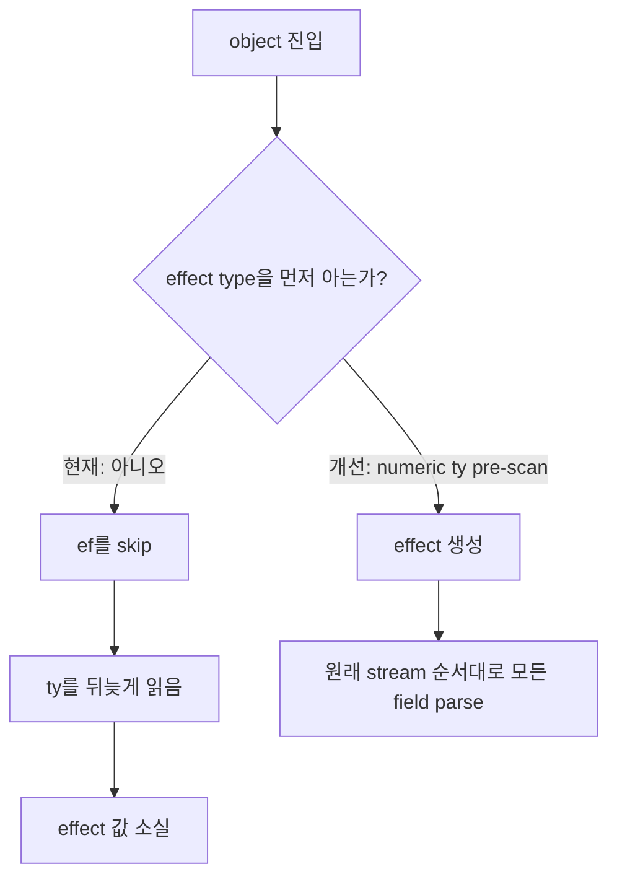

# #4446 lottie: layer effect dropped by JSON key order

- Link: https://github.com/thorvg/thorvg/issues/4446
- 난이도: 43/100
- 실현 가능성: 높음
- 초심자 추천: 조건부
- 관련 영역: Lottie streaming parser, JSON object order, effect ownership
- 분석 기준: `main` commit `f989b27892bab31f224f810a54782055eba1e3bc`
- 조사 범위: 로컬 source와 issue snapshot; 외부 fixture는 저장소에 없다.

## 난이도 산정

| 항목 | 점수 | 근거 |
|---|---:|---|
| 재현·증거 불확실성 | 4/20 | 실패 조건과 원인이 현재 코드에서 직접 확인된다. |
| 변경 범위 | 9/25 | effect object parser와 작은 회귀 fixture가 중심이다. |
| 구현 복잡도 | 14/25 | one-pass parser에서 `ty` 이전의 중첩 `ef`를 잃지 않도록 해야 한다. |
| 교차 영향 위험 | 9/20 | 모든 layer effect와 unsupported/duplicate type 처리에 영향을 준다. |
| 검증 부담 | 7/10 | key permutation과 effect 종류별 nested property를 확인해야 한다. |
| **합계** | **43/100** | **원인은 확정됐고 기존 pre-scan 패턴도 있지만 parser 상태 처리는 신중해야 한다.** |

## 이슈 요약

JSON object member 순서는 의미가 없어야 하지만, layer effect object에서 `ef`가 `ty`보다 먼저 나오면 ThorVG가 `ef`를 건너뛴다. `main`에서도 그대로 재현되는 구조다.

## main 코드 조사

현재 코드는 `ty`를 만나야 effect instance를 만든다.

```cpp
LottieEffect* effect = nullptr;
while (auto key = nextObjectKey()) {
    if (KEY_AS("ty")) effect = getEffect(getInt());
    else if (effect && KEY_AS("ef")) parseEffect(effect);
    else skip();
}
```

따라서 두 입력은 JSON 의미상 같지만 parser 결과가 다르다.

```text
현재 성공: { "ty": 29, "ef": [...] }
현재 실패: { "ef": [...], "ty": 29 }
                     ^ skip() 후 되돌릴 수 없음
```

`LookaheadParserHandler`는 RapidJSON iterative in-situ stream을 한 방향으로 소비한다. `skip()`한 nested array는 복구할 수 없다. 단순히 `if` 순서를 바꾸는 것으로 해결되지 않는 이유다.

한편 같은 parser에는 shape object의 문자열 `ty`가 뒤에 있을 때 raw object를 미리 훑는 `captureType()`이 이미 있다.



`captureType()`은 문자열 type 전용이므로 effect의 정수 `ty`에 그대로 쓸 수는 없지만, “stream 위치를 바꾸지 않는 object-level pre-scan”이라는 구현 선례는 재사용할 수 있다.

## 원인 가설과 확인 방법

- **확정 원인:** `effect == nullptr`인 동안 `ef`, `nm`, `mn`, `ix`, `en`을 모두 `skip()`한다.
- **확정 제약:** handler는 consumed token을 rewind하지 않는다.
- **추가 확인:** `ty`가 nested `ef` 내부에도 존재할 수 있으므로 pre-scan은 현재 object depth 0만 찾아야 한다.
- **추가 확인:** duplicate `ty`, unsupported type, malformed numeric type에서 allocation과 parser state가 안전해야 한다.

## 수정 방향 계획

1. 같은 effect의 top-level `ty/ef/nm/en` 순서를 바꾼 permutation fixture를 먼저 추가한다.
2. `enterObject()` 직후 현재 object의 depth 0 정수 `ty`만 읽는 작은 pre-scan helper를 만든다. stream은 전진시키지 않는다.
3. type을 먼저 알아낸 뒤 effect를 한 번 생성하고, 기존 `while (nextObjectKey())`가 원래 순서로 모든 field를 파싱하게 한다.
4. 실제 `ty` token에서는 이미 생성된 type과 일치하는지 검증하고 중복 allocation을 막는다.
5. unsupported `ty`는 object 전체를 안전하게 skip하고 `layer->effects`에 넣지 않는다.

대안인 field buffering은 raw scanner보다 일반적이지만 nested `ef` representation과 소유권이 늘어나므로, 현재 parser 설계에서는 제한된 numeric pre-scan이 더 작은 변경이다.

## 실현 가능성 판단

원인과 수정 경계가 명확하고, 같은 파일에 유사한 pre-scan 선례가 있어 실현 가능성은 **높음**이다. 다만 수동 raw JSON scan은 string escape와 nested depth를 잘못 처리하기 쉬워 fixture가 없는 즉흥 patch는 피해야 한다.

## 위험/검증

- nested property 안의 `ty`를 top-level effect type으로 잘못 잡지 않는다.
- whitespace, key escape, negative/large number, duplicate key를 처리한다.
- 지원 effect 전 종류와 custom effect의 내부 `ty`를 테스트한다.
- unsupported effect에서 leak과 double delete가 없는지 sanitizer로 확인한다.
- 기존 `ty`-first 입력의 결과가 byte/pixel 수준으로 유지되는지 확인한다.

## 참고 자료

- `src/loaders/lottie/tvgLottieParser.cpp` — `parseEffects()`, `getEffect()`, `captureType()`
- `src/loaders/lottie/tvgLottieParser.h` — parser helper 선언
- `src/loaders/lottie/tvgLottieParserHandler.h` — iterative parser state와 `Error()`
- `src/loaders/lottie/tvgLottieParserHandler.cpp` — `skip()`과 token 소비 규칙
- `src/loaders/lottie/tvgLottieModel.h` — effect type과 소유 object
- `docs/issue/issues.json` — 로컬 issue 본문과 두 key-order 비교 기록
