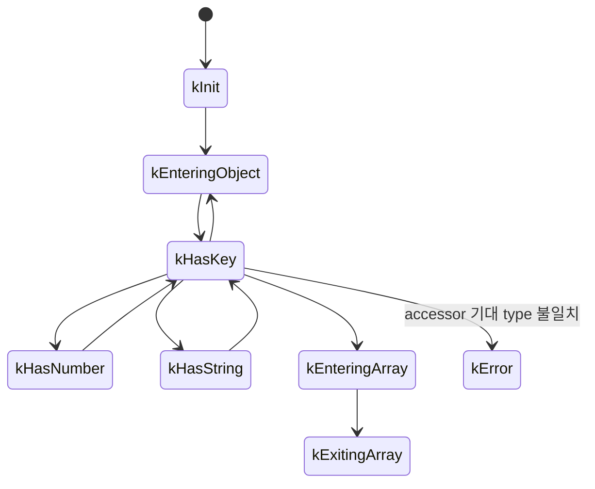

# #4452 lottie: compliance issue

- Link: https://github.com/thorvg/thorvg/issues/4452
- 난이도: 70/100
- 실현 가능성: 중간
- 초심자 추천: 비추천
- 관련 영역: RapidJSON iterative parser, Lottie field typing, diagnostics
- 분석 기준: `main` commit `f989b27892bab31f224f810a54782055eba1e3bc`
- 조사 범위: 로컬에는 네 첨부 파일이 없고 `docs/issue/issues.json`에 파일명과 일반 오류만 남아 있다. JSON 유효성이나 최초 실패 field는 재검증하지 못했다.

## 난이도 산정

| 항목 | 점수 | 근거 |
|---|---:|---|
| 재현·증거 불확실성 | 20/20 | 네 입력이 로컬에 없어 오류 위치와 공통 원인을 전혀 확정할 수 없다. |
| 변경 범위 | 13/25 | handler 진단과 실제로 실패한 Lottie field parser를 함께 볼 가능성이 높다. |
| 구현 복잡도 | 14/25 | iterative state를 보존하면서 합법적 schema 변형만 수용해야 한다. |
| 교차 영향 위험 | 14/20 | 느슨한 coercion이나 오류 복구 변경은 모든 Lottie 입력에 영향을 준다. |
| 검증 부담 | 9/10 | 네 원본, 최소 fixture, malformed corpus와 오류 복구를 모두 확인해야 한다. |
| **합계** | **70/100** | **현재 가장 어려운 부분은 parser가 실패 위치를 숨기고 재현 입력도 없다는 점이다.** |

## 이슈 요약

네 Lottie 파일이 viewer에서 `Invalid JSON: unexpected or misaligned data fields.`를 출력하며 재생되지 않는다. 이 문구는 JSON 문법 오류만 뜻하지 않는다. ThorVG parser가 예상한 token type과 실제 token type이 다를 때도 같은 메시지가 나온다.

## main 코드 조사

`LookaheadParserHandler`는 token을 다음 state 중 하나로 유지한다.



예를 들어 `getInt()`는 “숫자 token인가”만 보고 그렇지 않으면 모두 같은 `Error()`로 보낸다.

```cpp
int LookaheadParserHandler::getInt()
{
    if (state == kHasNumber) {
        auto result = val.GetInt();
        parseNext();
        return result;
    }
    Error();
    return 0;
}
```

`getFloat`, `getString`, `getBool`, `getNull`, `enterObject`, `enterArray`도 같은 패턴이다. `Error()`는 key, byte offset, 기대/실제 type을 출력하지 않고 token 하나를 더 전진시키려 한다.

```cpp
void Error()
{
    TVGERR("LOTTIE", "Invalid JSON: unexpected or misaligned data fields.");
    state = kError;
    reader.IterativeParseNext<PARSE_FLAGS>(iss, *this);
}
```

따라서 현재 로그 두 줄만으로는 다음을 구분할 수 없다.

```text
JSON 문법 오류
  vs 숫자/문자열 type 변형
  vs object/array 형태 변형
  vs parser가 앞 field에서 token을 하나 덜/더 소비한 state misalignment
```

## 원인 가설과 확인 방법

| 우선순위 | 가설 | 현재 상태 | 확인 방법 |
|---:|---|---|---|
| 1 | 특정 Lottie field의 object/array 또는 number/string 변형 | 미확정 | 최초 오류 key와 `peekType()`을 기록한다. |
| 2 | 앞 parser 함수가 nested value를 끝까지 소비하지 않아 다음 key에서 어긋남 | 미확정 | token offset을 함수 진입/종료마다 비교한다. |
| 3 | 합법적 JSON이지만 ThorVG가 지원하지 않는 Lottie schema | 미확정 | 최소 asset으로 줄인 뒤 spec 허용 여부를 별도 확인한다. |
| 4 | 실제 malformed JSON | 미확정 | 원본 확보 후 독립 parser와 RapidJSON parse error offset을 확인한다. |

어떤 가설도 첨부를 보지 않고 확정해서는 안 된다. 기존 문서의 “일반 JSON parser로 유효하다”는 주장도 이번 로컬-only 조사에서는 재현되지 않았으므로 확정 근거에서 제외했다.

## 수정 방향 계획

1. 네 파일을 작업 입력으로 저장소 또는 별도 로컬 fixture에 제공받아 checksum을 기록한다.
2. production 동작을 바꾸기 전에 조사용으로 current key stack, byte offset, expected state, actual state를 `Error()`에 연결한다.
3. 네 파일의 **첫 번째** 오류만 모아 같은 field인지 네 개의 독립 문제인지 분류한다.
4. 각 입력을 delta-debugging해 최소 JSON을 만든다.
5. spec에서 허용된 표현만 해당 field parser에 명시적으로 추가한다. 모든 type을 암묵적으로 coercion하지 않는다.
6. 진단 개선과 schema 지원 patch를 분리하고, malformed input이 빠르게 실패하는지도 유지한다.

조사용 로그의 목표 형태는 다음과 같다.

```text
Lottie parse mismatch: offset=1234 path=layers[2].ks.o.k expected=number actual=array
```

## 실현 가능성 판단

parser 구조는 작고 계측 지점도 명확하므로 입력만 확보되면 원인 추적은 가능하다. 하지만 현재는 네 파일 중 어느 field가 문제인지도 알 수 없어 수정 계획의 후반부를 확정할 수 없다. 실현 가능성은 **중간**이다.

## 위험/검증

- `Error()`가 token을 추가로 전진시키는 현재 복구 동작을 바꿀 때 무한 loop와 중복 오류를 확인한다.
- integer accessor에 float/uint64가 들어온 경우를 무조건 truncate하지 않는다.
- malformed nested array/object에서 skip depth가 음수가 되거나 object 밖으로 넘어가지 않아야 한다.
- 정상 corpus의 load 성공률과 frame/bounds가 그대로인지 확인한다.
- sanitizer와 fuzz corpus로 out-of-bounds, leak, excessive loop를 확인한다.

## 참고 자료

- `src/loaders/lottie/tvgLottieParserHandler.h` — parser state, callback, 공통 `Error()`
- `src/loaders/lottie/tvgLottieParserHandler.cpp` — typed accessor, `skip()`, object/array 전이
- `src/loaders/lottie/tvgLottieParser.cpp` — field별 기대 type을 결정하는 parser
- `test/testAnimation.cpp` — raw Lottie load test를 추가할 위치
- `test/testLottie.cpp` — Lottie 기능 test를 추가할 위치
- `docs/issue/issues.json` — 로컬 issue 본문과 `test1.json`~`test4.json` 링크
