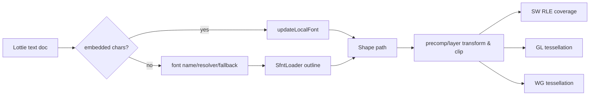

# #4468 cpu: text is not properly visible

- Link: https://github.com/thorvg/thorvg/issues/4468
- 난이도: 76/100
- 실현 가능성: 중간 이하
- 초심자 추천: 비추천
- 관련 영역: Lottie text/font resolution, precomp clip, small-scale SW coverage
- 분석 기준: `main` commit `f989b27892bab31f224f810a54782055eba1e3bc`
- 조사 범위: 로컬 issue 본문에는 `37750.json` 링크와 viewer 124×124 조건만 있고 asset은 없다. 기존 문서가 기록한 font/precomp 세부사항은 이번 조사에서 재검증할 수 없었다.

## 난이도 산정

| 항목 | 점수 | 근거 |
|---|---:|---|
| 재현·증거 불확실성 | 20/20 | asset, frame, font 환경과 backend 비교가 로컬에 없다. |
| 변경 범위 | 15/25 | Lottie text branch, font loader, layout/clip, SW shape coverage가 모두 후보다. |
| 구현 복잡도 | 15/25 | “글리프가 생성되지 않음”과 “생성됐지만 픽셀 coverage가 0”을 분리해야 한다. |
| 교차 영향 위험 | 17/20 | text layout/font fallback/raster 변경은 여러 format과 모든 backend에 영향을 줄 수 있다. |
| 검증 부담 | 9/10 | font를 고정하고 여러 scale/frame/backend 및 glyph별 bounds를 비교해야 한다. |
| **합계** | **76/100** | **CPU label만으로 원인 층을 정할 수 없고 재현 환경 의존성도 크다.** |

## 이슈 요약

124×124 viewer에서 `LTE`가 완전히 보이지 않고 흔히 `T`만 보인다는 문제다. 일부 글자가 보인다는 사실은 font가 완전히 없는 경우와 맞지 않을 수 있지만, fallback font, clip, animation frame, 저해상도 coverage 중 무엇이 원인인지는 아직 확정되지 않았다.

## main 코드 조사

Lottie builder는 font origin과 embedded glyph 유무에 따라 두 경로를 선택한다.

```cpp
if (text->font && text->font->origin == LottieFont::Origin::Local &&
    !text->font->chars.empty()) {
    updateLocalFont(layer, frameNo, text, doc);
} else {
    updateURLFont(layer, frameNo, text, doc);
}
```

두 경로의 차이는 크다.

| 경로 | glyph 생성 | 환경 의존성 | follow/range 처리 |
|---|---|---|---|
| `updateLocalFont()` | Lottie embedded glyph path를 `Shape`로 조립 | 낮음 | glyph별 자체 처리 |
| `updateURLFont()` | `Text`가 `SfntLoader`를 통해 font outline 생성 | font 설치/resolver에 의존 | range 일부만 적용, 별도 text layout |

URL/system font가 이름으로 열리지 않으면 resolver를 부르고, 그것도 실패하면 `paint->font(nullptr)`로 “아무 사용 가능한 font”를 선택한다. 따라서 같은 JSON도 머신마다 glyph metrics와 line wrap이 달라질 수 있다.

```cpp
if (!resolver || !resolver->func(paint, src, resolver->data)) {
    paint->font(nullptr);  // fallback to any available font
}
```

`TextImpl::load()`는 backend 진입 전에 font outline을 `Shape` path로 만든다. 이후 SW에서는 일반 shape와 마찬가지로 `shapeGenRle()`와 coverage raster를 탄다. 즉 가능한 손실 지점은 다음처럼 나뉜다.



## 원인 가설과 확인 방법

| 우선순위 | 가설 | 판별 신호 |
|---:|---|---|
| 1 | font resolver/fallback으로 glyph metrics가 달라짐 | 로드된 font 이름과 glyph bounds가 머신마다 다름 |
| 2 | precomp/layer clip이 L/E bounds를 자름 | clip 제거 시 세 backend 모두 정상 |
| 3 | 특정 frame의 selector/opacity/transform | frame별 shape opacity 또는 matrix가 0/화면 밖 |
| 4 | 작은 scale에서 SW coverage가 소실 | path/bounds는 같고 GL/WG만 보이며 SW span만 비어 있음 |
| 5 | glyph 자체가 embedded chars에서 누락 | `_searchGlyph()`가 L/E에서 `nullptr` 반환 |

### GL/WG/SW 비교 해석

| 결과 | 결론에 가까운 범위 |
|---|---|
| 세 엔진 모두 L/E 누락 | Lottie text build, font, layout, clip |
| SW만 누락 | SW flatten/RLE/AA coverage |
| GL과 WG만 같은 누락 | 공유 GPU path 최적화 또는 tessellation |
| 실행마다 달라짐 | resolver/font cache/animation frame/partial update 상태 |

## 수정 방향 계획

1. 원본 asset, 정확한 frame, font resolver 설정, viewer scale 방식을 고정한다.
2. 실제 선택된 local/URL path와 font 이름/fallback 여부를 로그로 남긴다.
3. `L`, `T`, `E` 각각에 대해 builder 직후 path point 수, local bounds, world bounds, opacity를 기록한다.
4. 동일 scene을 SW/GL/WG로 렌더하고 glyph별 crop diff를 만든다.
5. clip과 animation을 제거한 최소 `LTE` fixture로 축소한다.
6. 최초 손실 층에만 수정과 회귀 test를 둔다. font 문제를 raster patch로 우회하지 않는다.

## 실현 가능성 판단

소스상 진단 checkpoint는 명확하지만, 원본 font와 asset 없이 어느 계층을 고칠지 정할 수 없다. 공개 재배포 가능한 font 또는 embedded glyph로 최소 재현을 만들 수 있다면 해결 가능성은 올라간다. 현재 자료 기준 실현 가능성은 **중간 이하**다.

## 위험/검증

- proprietary/system font에 기대는 test는 CI에서 재현되지 않는다.
- fallback 정책을 바꾸면 기존 text layout과 line break가 전역적으로 달라진다.
- 아주 작은 글자를 강제로 살리는 coverage 보정은 획 굵기와 색 농도를 왜곡할 수 있다.
- precomp clip 완화는 다른 layer가 viewport 밖으로 새게 만들 수 있다.
- full/partial rendering과 여러 frame 순서에서 결과가 안정적인지 확인한다.

## 참고 자료

- `src/loaders/lottie/tvgLottieBuilder.cpp` — `updateText()`, local/URL font 경로
- `src/loaders/lottie/tvgLottieModel.h` — `LottieFont`, `LottieText`
- `src/renderer/tvgText.h` — font outline을 shape로 만드는 `TextImpl`
- `src/loaders/sfnt/tvgSfntLoader.cpp` — font metrics, outline transform
- `src/renderer/cpu_engine/tvgSwRenderer.cpp` — SW shape prepare/coverage 경로
- `src/renderer/cpu_engine/tvgSwShape.cpp` — shape RLE 생성
- `docs/issue/issues.json` — 로컬 issue 본문과 124×124 재현 조건
