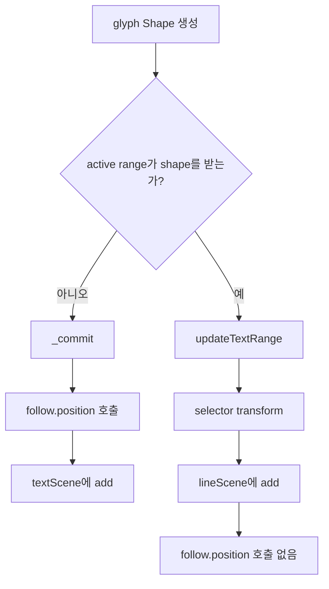

# #4481 lottie/text: follow path and range selector are not composed

- Link: https://github.com/thorvg/thorvg/issues/4481
- 난이도: 58/100
- 실현 가능성: 중간 이상
- 초심자 추천: 조건부
- 관련 영역: embedded Lottie text, follow path, range selector, matrix composition
- 분석 기준: `main` commit `f989b27892bab31f224f810a54782055eba1e3bc`
- 조사 범위: 외부 fixture는 로컬에 없지만, 기능 조합이 끊기는 분기는 현재 코드에서 직접 확인했다.

## 난이도 산정

| 항목 | 점수 | 근거 |
|---|---:|---|
| 재현·증거 불확실성 | 7/20 | 원인 분기는 확정적이지만 기대 matrix order와 원본 fixture는 확인하지 못했다. |
| 변경 범위 | 13/25 | local glyph commit, range grouping, follow-path model에 걸친다. |
| 구현 복잡도 | 18/25 | glyph별 path transform과 selector/group transform을 올바른 순서로 합성해야 한다. |
| 교차 영향 위험 | 13/20 | chars/words/lines grouping, anchor, spacing과 기존 text animation이 바뀔 수 있다. |
| 검증 부담 | 7/10 | 기능 단독/조합, open/closed path, animated selector를 비교해야 한다. |
| **합계** | **58/100** | **누락 지점은 명확하지만 올바른 transform 합성이 핵심 난점이다.** |

## 이슈 요약

embedded glyph text가 path를 따르는 기능과 range selector를 함께 사용하면 follow-path 배치가 무시된다. 현재 구현은 두 기능을 하나의 glyph commit 단계에서 합성하지 않고 서로 다른 출력 경로로 보낸다.

## main 코드 조사

`updateLocalFont()`는 follow path를 먼저 준비한다.

```cpp
ctx.follow = (text->follow &&
              ((uint32_t)text->follow->maskIdx < layer->masks.count))
           ? text->follow : nullptr;
ctx.firstMargin = ctx.follow
                ? ctx.follow->prepare(layer->masks[ctx.follow->maskIdx], ...)
                : 0.0f;
```

range selector가 실제로 shape를 처리하면 caller는 `_commit()`을 호출하지 않는다.

```cpp
auto shape = textShape(text, frameNo, doc, glyph, ctx);
if (!updateTextRange(text, frameNo, shape, doc, ctx)) {
    _commit(glyph, shape, ctx);
}
```

두 경로를 나누면 누락이 선명하다.



`_commit()`만 `ctx.follow->position()`을 호출한다.

```cpp
auto pos = ctx.follow->position(ctx.cursor.x + width + ctx.firstMargin, angle);
matrix.e11 = matrix.e22 = ctx.capScale;
matrix.e13 = pos.x - width * matrix.e11;
matrix.e23 = pos.y - width * matrix.e21;
```

반면 `updateTextRange()`는 selector translation/scale/rotation을 shape와 `lineScene`에 적용하고 직접 add한다. 이 경로에는 `ctx.follow` 참조가 없다. 따라서 원인은 가설이 아니라 **확인된 제어 흐름 누락**이다.

추가로 `_commit()`은 `position()`에서 tangent `angle`을 받아오지만 현재 matrix에는 이를 적용하지 않는다. 이는 “range와 함께 쓰면 위치도 무시됨”의 직접 원인은 아니지만, 기대 결과가 path tangent 회전까지 요구할 경우 함께 명세해야 할 인접 문제다.

## 원인 가설과 확인 방법

- **확정:** active range가 `true`를 반환하면 follow-path 전용 `_commit()`을 건너뛴다.
- **확정:** `updateTextRange()` 내부에는 follow position 계산이 없다.
- **미확정:** selector transform을 path tangent의 local space에서 적용해야 하는지 world space에서 적용해야 하는지 로컬 자료만으로 정답을 확정할 수 없다.
- **미확정:** chars/word/line grouping마다 follow를 glyph 단위로 쪼개야 하는 범위가 다를 수 있다.

## 수정 방향 계획

1. follow only, range only, follow+range 세 최소 fixture의 glyph matrix를 기록한다.
2. 공통 glyph placement를 `base glyph → selector local transform → path position/tangent → line/text layout` 단계로 명시한다.
3. `_commit()`과 `updateTextRange()`가 공유하는 helper를 만들어 follow 계산이 어느 branch에서도 빠지지 않게 한다.
4. selector가 group 단위일 때도 path position은 glyph별이어야 하므로 필요하면 glyph별 scene을 도입하되 ownership을 명확히 한다.
5. tangent `angle` 적용 여부는 기대 renderer와 별도 fixture로 확정한다.
6. 단독 기능 결과를 golden으로 고정해 조합 수정이 기존 follow/range를 깨지 않게 한다.

합성 순서는 행렬 곱으로 명시해 review해야 한다.

```text
M_final = M_layout × M_follow(position, tangent) × M_selector × M_glyph
          ^ 실제 기대 순서는 fixture로 확정해야 함
```

## 실현 가능성 판단

누락 지점은 분명해 수정 가능성은 높다. 그러나 단순히 `updateTextRange()` 안에서 `_commit()`을 한 번 더 부르면 scene 중복 add와 transform 덮어쓰기가 생긴다. 공통 commit 구조와 기대 matrix order를 정해야 하므로 전체 실현 가능성은 **중간 이상**이다.

## 위험/검증

- matrix 곱 순서를 바꾸면 anchor, pivot, letter spacing, scale 중심이 달라진다.
- follow path의 내부 cursor가 순차 상태를 가지므로 glyph를 두 번 평가하지 않는다.
- open/closed path, 음수/큰 first margin, path 끝 밖의 글자를 확인한다.
- range based mode(chars/spaces/words/lines)와 grouping mode를 교차 검증한다.
- animated selector와 animated mask path에서 frame 순서에 독립적인지 확인한다.

## 참고 자료

- `src/loaders/lottie/tvgLottieBuilder.cpp` — `updateLocalFont()`, `updateTextRange()`, `_commit()`
- `src/loaders/lottie/tvgLottieBuilder.h` — `RenderText`와 text helper 선언
- `src/loaders/lottie/tvgLottieModel.h` — `LottieTextFollowPath`, `LottieTextRange`
- `src/loaders/lottie/tvgLottieModel.cpp` — path length/position/tangent 계산
- `src/loaders/lottie/tvgLottieParser.cpp` — text range와 follow-path parsing
- `docs/issue/issues.json` — 로컬 issue 본문과 현재/기대 이미지 링크
