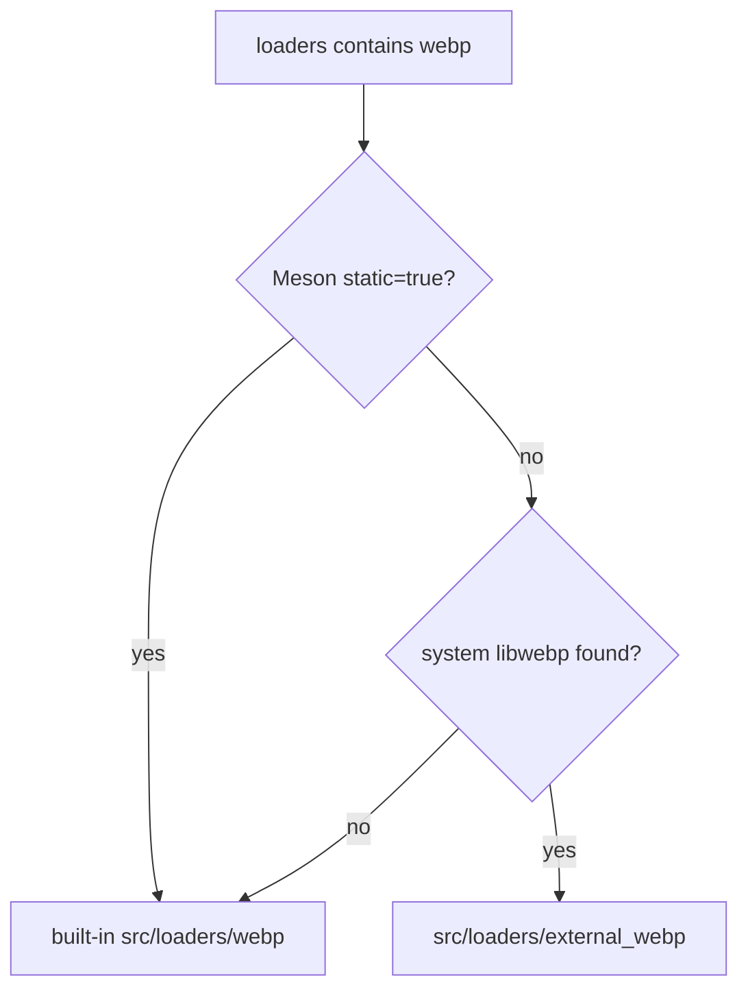

# #4485 webp: upgrade the webp decoder with libwebp 1.6.0

- Link: https://github.com/thorvg/thorvg/issues/4485
- 난이도: 87/100
- 실현 가능성: 중간
- 초심자 추천: 비추천
- 관련 영역: vendored dependency, decoder security, Meson, portability
- 분석 기준: `main` commit `f989b27892bab31f224f810a54782055eba1e3bc`
- 조사 범위: upstream repository를 크롤링하지 않았다. target version과 관련 commit 정보는 로컬 issue snapshot에 기록된 내용만 사용했다.

## 난이도 산정

| 항목 | 점수 | 근거 |
|---|---:|---|
| 재현·증거 불확실성 | 19/20 | 현재 vendored provenance와 upstream 전체 delta가 로컬에 없다. |
| 변경 범위 | 22/25 | 54개 vendored 파일, allocator/build adaptation, public decode ABI가 걸린다. |
| 구현 복잡도 | 20/25 | 단순 복사보다 ThorVG fork 수정과 upstream 변경을 재적용해야 한다. |
| 교차 영향 위험 | 18/20 | malformed input 보안, endian/SIMD/32-bit/OOM 동작과 모든 WebP decode에 영향이 있다. |
| 검증 부담 | 8/10 | corpus, fuzz/sanitizer, static/system libwebp build를 모두 검증해야 한다. |
| **합계** | **87/100** | **보안 성격의 대규모 vendor rebase라서 작은 hotfix보다 검증과 provenance가 어렵다.** |

## 이슈 요약

ThorVG의 내장 WebP decoder를 libwebp 1.6.0 계열로 갱신해 issue에 기록된 Huffman table OOB 관련 수정과 이후 hardening을 함께 반영하려는 작업이다. 부분 보안 patch만 손으로 옮기는 것보다 추적 가능한 vendor upgrade가 유지보수에 유리하다는 요청이다.

## main 코드 조사

### 현재 vendor 규모와 버전 단서

`src/loaders/webp`에는 Meson 파일과 라이선스를 포함해 54개 파일이 있으며 `dec`, `dsp`, `utils`, 공개 `webp` header 일부를 직접 포함한다.

```cpp
// src/loaders/webp/dec/vp8i.h
#define DEC_MAJ_VERSION 0
#define DEC_MIN_VERSION 4
#define DEC_REV_VERSION 3
```

`WebPGetDecoderVersion()`은 위 macro로 `0.4.3`을 보고한다. 공개 header의 ABI는 다음과 같다.

```cpp
#define WEBP_DECODER_ABI_VERSION 0x0205
```

이 macro만으로 모든 vendored 파일이 정확히 어느 upstream commit에서 왔는지는 증명할 수 없다. 오히려 정확한 provenance를 먼저 복원해야 하는 근거다.

현재 `VP8LBuildHuffmanTable()`과 `ReadHuffmanCodes()`는 caller가 계산한 table 크기와 raw pointer 이동을 사용한다. issue가 언급한 OOB hardening을 일부 줄만 옮기면 allocation size, table API, caller 계약 중 하나를 빠뜨릴 위험이 있다.

### build 선택 구조



즉 upgrade 후 두 구현을 모두 검증해야 한다.

| 구성 | decoder | 핵심 위험 |
|---|---|---|
| `-Dstatic=true` | vendored source | upgrade 대상 자체 |
| non-static + system libwebp 발견 | external loader | system ABI/동작과 loader adapter |
| non-static + system libwebp 없음 | vendored fallback | fallback build 누락 |

vendored 파일에는 `tvg::malloc/calloc/free`, `tvgCommon.h` 같은 ThorVG adaptation이 들어 있다. upstream 파일을 그대로 덮어쓰는 방식으로는 빌드되지 않을 가능성이 높다.

## 원인 가설과 확인 방법

- **확인된 성격:** 오래된 vendored decoder를 유지하는 dependency lifecycle 문제다.
- **로컬 확인:** version macro는 0.4.3, ABI macro는 `0x0205`, vendor 파일은 54개다.
- **issue 기록:** 목표는 1.6.0이며 Huffman table OOB fix와 관련 후속 commit이 언급된다.
- **미확정:** 현재 각 파일의 정확한 upstream base와 ThorVG-only patch 목록은 아직 없다.
- **미확정:** issue의 특정 malformed WebP가 현재 `main`에서 어떤 sanitizer report를 내는지는 재현 파일이 없다.

## 수정 방향 계획

1. 현재 vendor tree를 여러 upstream tag와 파일 hash/diff로 비교해 base commit과 ThorVG-only patch를 목록화한다.
2. target 1.6.0의 decoder-only dependency closure를 Meson source list와 함께 만든다. 생성 파일과 public header를 빠뜨리지 않는다.
3. 깨끗한 upstream import commit과 ThorVG allocator/include/build adaptation commit을 분리한다.
4. API/ABI macro, `WebPGetDecoderVersion()`, colorspace, alpha, animation 지원 범위를 명시적으로 확인한다.
5. valid corpus와 issue sample, truncated/malformed/OOM corpus를 ASan/UBSan으로 실행한다.
6. built-in static, vendored fallback, external system libwebp 세 build를 CI에서 확인한다.
7. vendor provenance와 갱신 절차를 문서화해 다음 upgrade 비용을 낮춘다.

## 실현 가능성 판단

정상적인 upstream source와 test corpus가 작업 입력으로 준비되면 기술적으로 가능하다. 다만 보안 관련 파일을 로컬 추측만으로 재구성해서는 안 되며, source provenance와 전체 dependency closure 확인이 선행돼야 한다. 실현 가능성은 **중간**이다.

## 위험/검증

- 보안 fix 한두 줄만 backport하면 caller/callee 계약의 나머지를 놓칠 수 있다.
- ThorVG allocator adaptation에서 size overflow와 OOM return 처리를 보존해야 한다.
- endian, unaligned access, 32-bit `size_t`, SSE/NEON 조건부 build를 확인한다.
- alpha decode, lossy/lossless, scaling/cropping, malformed stream을 모두 검증한다.
- `LICENSE`와 upstream notice, 수정 provenance를 함께 갱신해야 한다.

## 참고 자료

- `src/loaders/webp/dec/vp8i.h` — 내장 decoder version macro
- `src/loaders/webp/webp/decode.h` — 공개 decoder ABI
- `src/loaders/webp/utils/huffman.cpp` — 현재 Huffman table builder
- `src/loaders/webp/dec/vp8l.cpp` — table allocation과 lossless decoder caller
- `src/loaders/webp/meson.build` — 내장 vendor root
- `src/loaders/external_webp/meson.build` — system libwebp dependency
- `src/loaders/meson.build` — static/external/fallback 선택
- `src/loaders/webp/LICENSE` — vendored license
- `docs/issue/issues.json` — 로컬 issue에 저장된 target version과 관련 commit 링크
