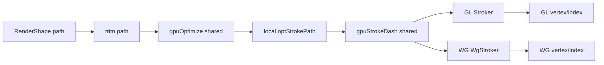

# #4488 gpu: stroke rendering accuracy

- Link: https://github.com/thorvg/thorvg/issues/4488
- 난이도: 83/100
- 실현 가능성: 중간
- 초심자 추천: 비추천
- 관련 영역: shared GPU path optimization, GL/WG stroke tessellation, curve quality
- 분석 기준: `main` commit `f989b27892bab31f224f810a54782055eba1e3bc`
- 조사 범위: 첨부 JSON과 이미지는 로컬에 없다. issue snapshot의 “GL/WGPU가 같은 부정확한 결과”라는 비교와 현재 source만 사용했다.

## 난이도 산정

| 항목 | 점수 | 근거 |
|---|---:|---|
| 재현·증거 불확실성 | 19/20 | 문제 path/cap/join/scale과 mesh가 없어 원인을 특정할 수 없다. |
| 변경 범위 | 20/25 | shared optimizer와 두 backend stroker, bounds/mesh upload까지 후보가 걸린다. |
| 구현 복잡도 | 20/25 | curve flattening, join/cap, transform-space 폭을 수치적으로 맞춰야 한다. |
| 교차 영향 위험 | 16/20 | tolerance 변경은 모든 GPU stroke의 모양, vertex 수와 성능에 영향을 준다. |
| 검증 부담 | 8/10 | analytic fixture, mesh diff, GL/WG pixel/perf 비교가 필요하다. |
| **합계** | **83/100** | **두 backend가 공유하는 수학은 확인됐지만 실제 실패 primitive가 없다.** |

## 이슈 요약

첨부 Lottie의 stroke가 GL과 WG에서 기대보다 부정확하다. 현재 source를 보면 두 backend는 이름과 buffer type은 다르지만 stroke 기하 수학을 거의 동일하게 복제하고, 그 앞의 path optimization과 dash도 공유한다. 두 결과가 같다는 관찰은 driver보다 공통/복제된 CPU-side mesh 생성 로직을 우선 조사하게 한다.

## main 코드 조사

### 공통 전처리

`gpuOptimize()`는 transformed path를 단순화하고 stroke용 local path에도 같은 결정을 반영한다. dash는 `gpuStrokeDash()`가 공통 생성한다.



### GL/WG 기하가 사실상 같은 부분

두 tessellator 모두 cubic을 line segment로 평탄화한다.

```cpp
Bezier curve{mState.prevPt, cnt1, cnt2, end};
auto count = curve.segments(mQualityScale);
auto step = 1.0f / count;
for (uint32_t i = 0; i <= count; ++i) {
    lineTo(curve.at(step * i));
}
```

둘 다 다음 공통 함수를 쓴다.

- `Bezier::segments(scale)`: tolerance `0.5f / scale`, 최대 1024 segment
- `gpuArcSegmentsCnt()`: 0.25 pixel sagitta 근사
- `gpuStrokeDash()`: dash/trim path 생성
- `scaling(matrix)`: world stroke 품질 scale

backend 차이는 주로 buffer 표현과 render pipeline이다.

| 단계 | GL | WG | 판단 |
|---|---|---|---|
| optimized local path | `GlGeometry::prepare()` | `WgRenderDataShape::update()` | 공통 `gpuOptimize()` 사용 |
| stroker | `Stroker` | `WgStroker` | 수학은 거의 동일한 복제 코드 |
| vertex storage | float xy array | `Point` array | 표현 차이 |
| shader/raster | OpenGL | WebGPU | mesh가 같다면 후순위 후보 |
| CPU/SW 기준 | SW stroker/RLE | SW stroker/RLE | 별도 구현이라 비교 기준이 될 수 있음 |

## 원인 가설과 확인 방법

| 우선순위 | 가설 | 확인 방법 |
|---:|---|---|
| 1 | cubic flattening tolerance가 문제 scale에서 너무 거칠다. | 원 curve와 polyline의 최대 거리, segment 수를 dump한다. |
| 2 | `gpuOptimize()`가 stroke에 필요한 점/curve를 제거한다. | 원 path와 `optStrokePath` command/point를 비교한다. |
| 3 | round join/cap arc subdivision이 부족하다. | round만 남긴 analytic fixture의 sagitta error를 잰다. |
| 4 | local width와 non-uniform transform 합성이 부정확하다. | scaleX≠scaleY, rotation/skew fixture의 world-space 외곽선을 비교한다. |
| 5 | GL/WG raster pipeline 차이 | 두 backend mesh가 같은데 pixel만 다를 때 조사한다. 현재 관찰상 우선순위는 낮다. |

첨부 없이 “curve flattening이 원인”이라고 단정할 수는 없다. 우선 mesh를 비교해야 shader/raster 문제와 분리된다.

## 수정 방향 계획

1. 원본 asset을 확보하고 문제 stroke 하나만 남겨 path, width, cap, join, miter, transform을 기록한다.
2. original path → optimized path → dashed path → GL/WG vertex/index를 단계별 dump한다.
3. straight line, single cubic, round/miter/bevel join, 각 cap, closed/dash를 각각 analytic fixture로 만든다.
4. CPU 또는 기하 reference에서 stroke outline을 만들어 mesh 경계의 최대 오차를 수치화한다.
5. 최초 오차가 shared tolerance면 공통 함수를 수정하고, 복제 stroker 문제면 GL/WG를 동시에 고친다.
6. 픽셀 diff와 함께 vertex/index count, tessellation 시간, upload 크기를 기록한다.
7. 장기적으로 동일 stroker math를 공통화할 수 있는지 별도 refactor로 검토하되 bug fix와 섞지 않는다.

## 실현 가능성 판단

mesh 생성이 CPU source에 있어 관찰과 단위 검증은 가능하다. 하지만 원본 primitive가 없으면 여러 tolerance를 무작정 바꾸게 되고, 정확도 향상이 vertex 폭증으로 이어질 수 있다. asset 확보와 mesh instrumentation을 전제로 실현 가능성은 **중간**이다.

## 위험/검증

- tolerance를 낮추면 곡선마다 최대 1024 segment에 가까워져 CPU/메모리 비용이 급증할 수 있다.
- non-uniform scale에서 단일 `qualityScale`만 바꾸면 한 축은 과소/다른 축은 과대 tessellation될 수 있다.
- near-collinear, zero-length, 180도 reversal, 매우 큰 miter를 확인한다.
- thin stroke, dash seam, closed-path start join과 trim path를 회귀 검증한다.
- GL/WG가 같은 mesh와 bounds를 만들고 각 backend에서 동일한 pixel crop을 만드는지 확인한다.

## 참고 자료

- `src/renderer/gpu_engine/tvgGpuCommon.cpp` — `gpuOptimize()`, `gpuStrokeDash()`, arc segment 수
- `src/renderer/gpu_engine/tvgGpuCommon.h` — shared GPU path API
- `src/common/tvgMath.cpp` — `Bezier::segments()`와 flatten tolerance
- `src/renderer/gpu_engine/gl/tvgGlGeometry.cpp` — GL path prepare와 stroke 생성
- `src/renderer/gpu_engine/gl/tvgGlTessellator.cpp` — GL stroker 기하
- `src/renderer/gpu_engine/wg/tvgWgRenderData.cpp` — WG path/stroke mesh 생성
- `src/renderer/gpu_engine/wg/tvgWgTessellator.cpp` — WG stroker 기하
- `src/renderer/cpu_engine/tvgSwStroke.cpp` — 별도 SW stroke reference
- `docs/issue/issues.json` — 로컬 issue 본문과 expected/GL-WG 비교 링크
