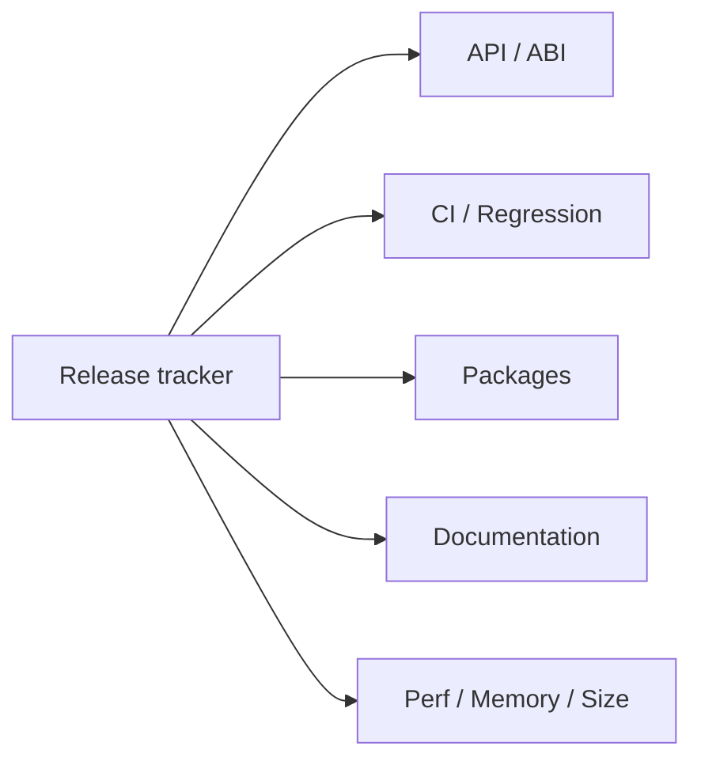

# Issue #4496 — ThorVG v1.1 release

- 링크: https://github.com/thorvg/thorvg/issues/4496
- 난이도: 75/100
- 초심자 추천: 비추천
- 관련 영역: release management, regression, packages, documentation
- 배울 수 있는 것: release gate와 성능·binary size 기준

## 난이도 산정

| 요소 | 점수 | 근거 |
|---|---:|---|
| 재현·증거 불확실성 | 5/20 | checklist는 명확하지만 외부 package 상태가 변한다 |
| 변경 범위 | 25/25 | API 문서, CI, packages, release note 전체를 포함한다 |
| 구현 복잡도 | 15/25 | 각 하위 작업은 다르며 coordination이 중심이다 |
| 교차 영향 위험 | 20/20 | 공개 API와 배포 생태계 전체에 영향을 준다 |
| 검증 부담 | 10/10 | 플랫폼 build, 회귀, 성능, memory, size gate가 필요하다 |
| **합계** | **75/100** | 하나의 구현 Issue가 아닌 release umbrella다 |

- 실현 가능성: **낮음** — 하위 Issue 단위로만 실행 가능하다.

## 이슈 요약

v1.1 release의 umbrella tracker다. API 문서, 패키지, 회귀 테스트, 성능, 메모리, binary size와 여러 하위 Issue를 한곳에서 관리한다.

## main 코드 조사

단일 수정 지점이 없다. `CONTRIBUTING.md`, `.github/workflows/`, `meson.build`, 공개 C++/C API, 외부 패키지 저장소 전체가 범위다. 미완료 bucket 중 #4041 같은 renderer bug와 문서·배포 작업도 섞여 있다.

## 원인 가설

**확인된 성격:** bug가 아니라 release coordination issue다. 한 사람이 작은 patch로 닫는 성격이 아니다.

## 수정 방향 계획

하위 미완료 작업을 각각 독립 Issue로 선택하고, release tracker 자체는 maintainer가 갱신하는 것이 맞다. 초심자는 여기서 테스트 방법과 성능 기준을 읽되 작업 대상으로 직접 선택하지 않는다.

## 위험/검증

release note와 외부 package update는 GitHub/배포 시스템 write 권한이 필요할 수 있다. 이번 분석 범위에서는 어떤 외부 상태도 변경하지 않았다.

## 참고 자료

- `CONTRIBUTING.md` — self-test와 API change 기록 규칙
- `.github/workflows/` — 플랫폼 build/regression gate
- `inc/thorvg.h`, `src/bindings/capi/thorvg_capi.h` — 공개 API 표면
