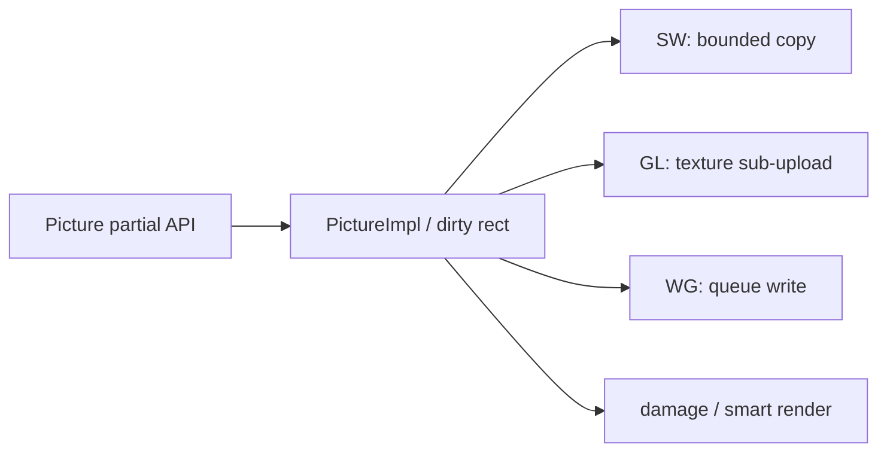

# Issue #4507 — Picture partial update support

- 링크: https://github.com/thorvg/thorvg/issues/4507
- 난이도: 83/100
- 초심자 추천: 비추천
- 관련 영역: public API/CAPI, Picture loader, CPU/GL/WG texture update
- 배울 수 있는 것: retained rendering과 dirty region, texture upload

## 난이도 산정

| 요소 | 점수 | 근거 |
|---|---:|---|
| 재현·증거 불확실성 | 6/20 | 요구 동작은 명확하지만 stride/copy contract가 미정이다 |
| 변경 범위 | 25/25 | API, CAPI, loader, CPU/GL/WG를 모두 건드린다 |
| 구현 복잡도 | 22/25 | subresource lifetime과 dirty propagation이 필요하다 |
| 교차 영향 위험 | 20/20 | 공개 ABI, borrowed buffer ownership, backend resource가 연결된다 |
| 검증 부담 | 10/10 | 세 backend, bounds, color space와 performance 검증이 필요하다 |
| **합계** | **83/100** | 작은 memcpy 변경이 아닌 cross-backend feature다 |

- 실현 가능성: **낮음** — API contract와 backend별 단계 분리가 선행돼야 한다.

## 이슈 요약

기존 Picture 크기를 유지하면서 변경된 pixel rectangle만 교체하고 renderer도 가능한 경우 해당 region만 upload하는 API 제안이다.

## main 코드 조사

`Picture::load(const uint32_t*, w, h, ColorSpace, copy)`는 `src/renderer/tvgPicture.cpp`에서 `PictureImpl::load()`와 `LoaderMgr`로 전체 surface를 교체한다. 공개 API는 `inc/thorvg.h`, C API는 `src/bindings/capi/thorvg_capi.h`, `src/bindings/capi/tvgCapi.cpp`에 대응한다. CPU는 `RenderUpdateFlag::Image`, GL/WG는 texture resource와 upload 경로까지 영향을 받는다.

## 원인 가설

**확인된 구조:** 현재 update model은 Picture resource 전체가 바뀐 것으로 표시하며 subresource rectangle과 stride/lifetime을 표현하는 상태가 없다.

## 수정 방향 계획

API 계약(copy 여부, bounds, stride, color space)을 먼저 설계하고 C++/C ABI를 함께 검토한다. 이후 CPU correctness 구현, dirty region propagation, GL `TexSubImage` 계열과 WebGPU queue write를 backend별로 단계화한다.

## 위험/검증

공개 ABI, 비동기 loader, borrowed buffer lifetime, smart rendering damage 계산과 세 backend가 얽힌다. 단순 memcpy 과제가 아니어서 초심자용이 아니다.

## 참고 자료

- `inc/thorvg.h` — Picture raw load API
- `src/renderer/tvgPicture.cpp`, `src/renderer/tvgPicture.h` — 전체 resource 교체 경로
- `src/renderer/tvgRender.h` — `RenderUpdateFlag::Image`
- `src/renderer/gpu_engine/{gl,wg}/` — backend texture upload
