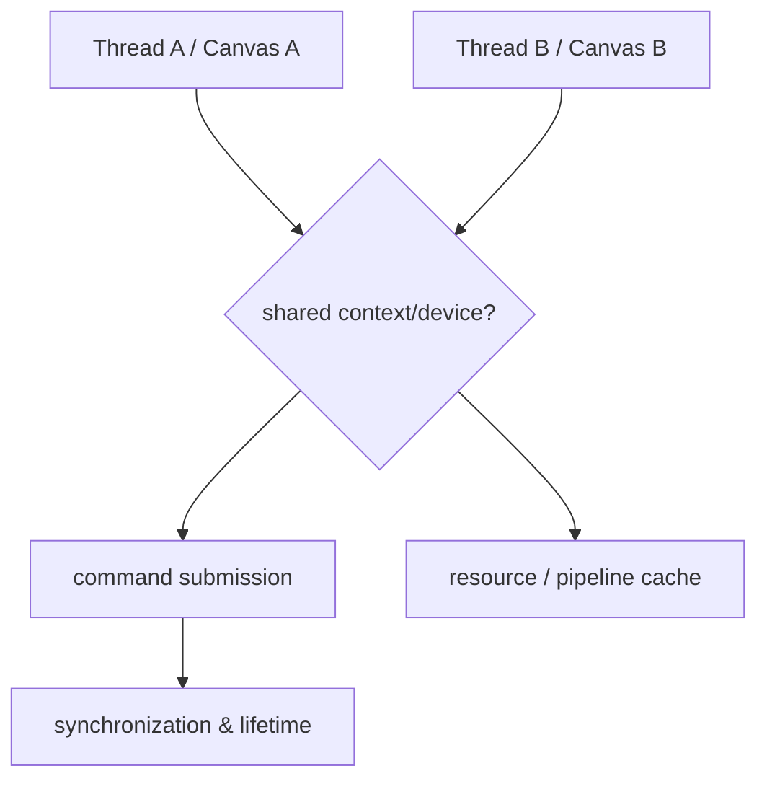

# Issue #4524 — GPU multi-threading optimization

- 링크: https://github.com/thorvg/thorvg/issues/4524
- 난이도: 88/100
- 초심자 추천: 비추천
- 관련 영역: GL/WG renderer, context ownership, synchronization
- 배울 수 있는 것: GPU command submission과 thread safety

## 난이도 산정

| 요소 | 점수 | 근거 |
|---|---:|---|
| 재현·증거 불확실성 | 8/20 | 목표는 있으나 허용할 concurrency model이 미정이다 |
| 변경 범위 | 25/25 | GL/WG renderer, Canvas와 resource cache에 걸친다 |
| 구현 복잡도 | 25/25 | context affinity, command ordering, synchronization 설계가 필요하다 |
| 교차 영향 위험 | 20/20 | deadlock, race, UAF와 backend driver 제약이 있다 |
| 검증 부담 | 10/10 | TSAN, GPU validation, 복수 device/driver와 성능 측정이 필요하다 |
| **합계** | **88/100** | GPU architecture 변경에 가깝다 |

- 실현 가능성: **낮음** — 먼저 지원할 thread model을 문서로 확정해야 한다.

## 이슈 요약

여러 scene/canvas가 GPU rendering work를 여러 thread에서 안전하게 submit하도록 하는 architecture proposal이다.

## main 코드 조사

`src/renderer/gpu_engine/gl/`은 GL context와 동적 function table/resource를, `src/renderer/gpu_engine/wg/`는 device/queue, command encoder, pipeline/cache를 공유한다. `Canvas::Impl`의 상태 머신과 renderer ref count도 함께 검토해야 한다. CPU `TaskScheduler`를 그대로 복사할 수 있는 구조가 아니다.

## 원인 가설

**추론:** GPU backend가 단일 rendering thread/context를 전제로 resource lifetime과 command ordering을 단순화한 설계다.

## 수정 방향 계획

지원할 concurrency model(한 device의 다중 canvas인지, context-per-thread인지)을 먼저 정한다. backend별 thread-affinity를 문서화하고 resource cache와 command submission의 소유권을 분리한 뒤 stress/TSAN/GPU validation test를 설계한다.

## 위험/검증

deadlock, use-after-free, driver별 context 제약과 성능 역행 위험이 크다. 장기 설계 과제다.

## 참고 자료

- `src/renderer/tvgCanvas.h` — Canvas 상태 머신
- `src/renderer/gpu_engine/gl/` — GL context/resource 경로
- `src/renderer/gpu_engine/wg/` — WebGPU device/queue/command 경로
- `src/renderer/tvgTaskScheduler.h` — CPU task model 비교 대상
