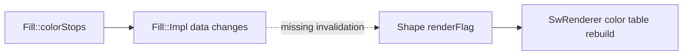

# Issue #4535 — retained mode gradient updates

- 링크: https://github.com/thorvg/thorvg/issues/4535
- 난이도: 57/100
- 초심자 추천: 조건부
- 관련 영역: Fill mutation, Shape update flags, CPU gradient color table
- 배울 수 있는 것: retained-mode invalidation과 update flag

## 난이도 산정

| 요소 | 점수 | 근거 |
|---|---:|---|
| 재현·증거 불확실성 | 4/20 | failure matrix와 update flag 단서가 구체적이다 |
| 변경 범위 | 14/25 | Fill, Shape invalidation과 CPU prepare가 연결된다 |
| 구현 복잡도 | 16/25 | owner 없는 Fill의 mutation 전파 방식을 설계해야 한다 |
| 교차 영향 위험 | 16/20 | observer/back-reference는 ownership과 duplicate 수명에 영향을 준다 |
| 검증 부담 | 7/10 | fill/stroke, 교체/복제와 backend parity가 필요하다 |
| **합계** | **57/100** | 원인은 좁지만 안전한 invalidation 설계가 어렵다 |

- 실현 가능성: **중간** — 회귀 테스트는 즉시 가능하고 fix는 ownership review가 필요하다.

## 이슈 요약

Shape에 이미 연결한 gradient의 color stops/alpha를 나중에 바꾸면 software renderer에서 갱신되지 않는 문제다. transform 변경은 보이지만 stop 변경이 누락되는 행이 제시돼 있다.

## main 코드 조사

`Fill::colorStops()`는 `tvgFill.cpp`에서 `Fill::Impl::update()`만 호출하며 owning Shape에 변경을 통지하지 않는다. 반면 `ShapeImpl::fill(Fill*)`와 `strokeFill(Fill*)`는 연결 시 각각 `Gradient`, `GradientStroke` flag를 mark한다. `SwRenderer::prepare()`는 이 flag가 있을 때만 fill/stroke color table을 재생성한다.

## 원인 가설

**강한 코드 단서:** 연결 이후 Fill 객체 자체를 mutate할 때 Shape의 `renderFlag`로 invalidation이 전파되지 않는 것이 강한 후보 원인이다. Fill은 owner back-reference를 갖지 않으므로 현재 구조에서 통지할 경로가 없다.

## 수정 방향 계획

1. 첨부 예제를 작은 unit/regression test로 줄여 CPU에서 실패를 고정한다.
2. Fill mutation을 Canvas update가 감지할 ownership/version 모델을 설계한다.
3. 단순히 매 frame gradient를 재생성하기보다 generation counter 또는 observer 연결의 수명 비용을 비교한다.
4. fill과 stroke, duplicate, Fill 교체/삭제를 모두 검증한다.

## 위험/검증

원인 위치는 비교적 명확하지만 ownership 변경은 dangling back-reference를 만들 수 있다. 초심자가 mentor와 invalidation test부터 맡기에는 좋지만 단독 fix는 보통 이상이다.

## 참고 자료

- `src/renderer/tvgFill.cpp`, `src/renderer/tvgFill.h`
- `src/renderer/tvgShape.h` — `Gradient`/`GradientStroke` mark
- `src/renderer/cpu_engine/tvgSwRenderer.cpp` — color table 재생성 조건
