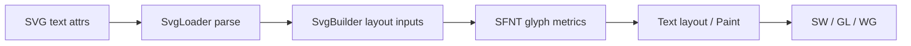

# Issue #4538 — SVG text compliance

- 링크: https://github.com/thorvg/thorvg/issues/4538
- 난이도: 90/100
- 초심자 추천: 비추천
- 관련 영역: SVG text parser/layout, SFNT, compliance
- 배울 수 있는 것: SVG text semantics와 font metrics

## 난이도 산정

| 요소 | 점수 | 근거 |
|---|---:|---|
| 재현·증거 불확실성 | 15/20 | 여러 실패가 한 이미지에 묶여 개별 case가 없다 |
| 변경 범위 | 25/25 | SVG parser, builder, SFNT와 Text layout 전체다 |
| 구현 복잡도 | 24/25 | baseline, anchor, fallback, whitespace와 glyph metric이 결합된다 |
| 교차 영향 위험 | 16/20 | public text behavior와 platform font 차이에 영향을 준다 |
| 검증 부담 | 10/10 | 고정 font 및 속성별 compliance matrix가 필요하다 |
| **합계** | **90/100** | umbrella를 하위 Issue로 분해해야 한다 |

- 실현 가능성: **낮음** — 속성 하나씩 최소 fixture로 분리하면 부분 과제는 가능하다.

## 이슈 요약

최신 compliance test에서 다수 SVG text 결과가 reference와 다르다는 umbrella 성격의 Issue다.

## main 코드 조사

SVG 속성 parsing은 `src/loaders/svg/tvgSvgLoader.cpp`, Paint 생성은 `src/loaders/svg/tvgSvgBuilder.cpp`, glyph/metric은 `src/loaders/sfnt/`, public text layout은 `src/renderer/tvgText.h`와 `src/renderer/tvgText.cpp`에 걸친다. 기존 `test/testText.cpp`는 API 동작 위주이며 SVG text compliance matrix와는 범위가 다르다.

## 원인 가설

baseline, anchor, dx/dy, font fallback, whitespace, glyph metrics 등 여러 독립 기능이 한 이미지에 섞여 있을 가능성이 높다. 하나의 root cause로 보기 어렵다.

## 수정 방향 계획

compliance case를 속성별 하위 Issue로 분리하고 최소 SVG + 고정 font fixture를 만든다. parsing 값, computed layout, final raster를 단계별로 비교한다.

## 위험/검증

font/platform 차이와 SVG spec 해석이 개입한다. umbrella Issue 전체는 초심자에게 너무 넓지만, 분리된 단일 속성 test 추가는 별도 쉬운 과제가 될 수 있다.

## 참고 자료

- `src/loaders/svg/tvgSvgLoader.cpp`, `src/loaders/svg/tvgSvgBuilder.cpp`
- `src/loaders/sfnt/`
- `src/renderer/tvgText.cpp`, `src/renderer/tvgText.h`
- `test/testText.cpp`
