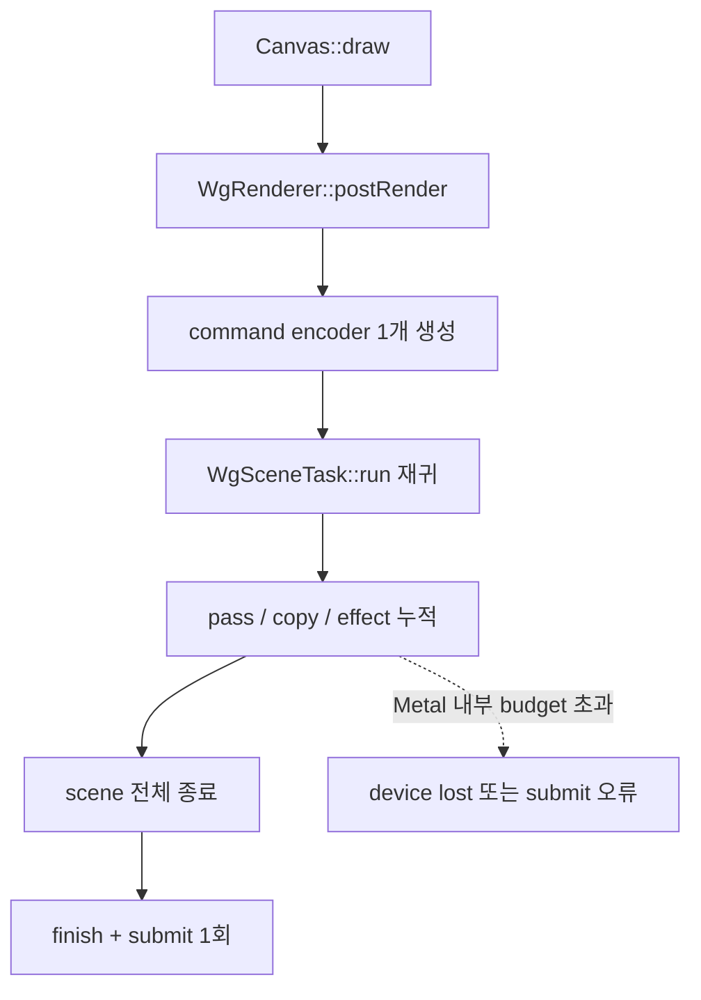

# Issue #4548 — wg_engine: macOS command-buffer limit crash

- 링크: https://github.com/thorvg/thorvg/issues/4548
- 상태: Open (2026-07-19 확인)
- 분석 기준: `main` @ [`6d5933c`](https://github.com/thorvg/thorvg/commit/6d5933c9d1aca94635c6ad8129f3530ae554d423)
- 난이도: 88/100
- 초심자 추천: 비추천
- 관련 영역: WG task tree, command encoder/queue submission, Metal portability, device loss
- 배울 수 있는 것: WebGPU 명령 기록·제출, backend 내부 한계, 안전한 encoder 분할 지점, device-loss 진단

## 난이도 산정

| 요소 | 점수 | 근거 |
|---|---:|---|
| 재현·증거 불확실성 | 14/20 | #4546에서 4096 한계와 오류는 확인됐지만 production fixture와 표준 capability는 없다 |
| 변경 범위 | 22/25 | `WgContext`, `WgRenderer`, render task, compositor, stress test에 걸친다 |
| 구현 복잡도 | 24/25 | 열린 pass 없이 encoder를 끊고 재개하면서 mask/effect 순서를 보존해야 한다 |
| 교차 영향 위험 | 18/20 | 모든 WG frame의 submit 수·순서·성능과 여러 native backend에 영향을 준다 |
| 검증 부담 | 10/10 | Metal 실기기 stress와 backend별 pixel/device-loss 검증이 필요하다 |
| **합계** | **88/100** | 표준에 드러나지 않는 backend 한계를 renderer 내부에서 우회해야 한다 |

- 실현 가능성: **중간 이하** — 재현은 있지만 encoder를 안전하게 나눌 내부 구조와 cross-backend 검증 환경이 필요하다.

## 이슈 요약

큰 WG scene을 한 번에 기록하면 macOS/Metal의 wgpu backend가 관리하는 command-buffer 수가 4096을 넘어 device loss 또는 submit 오류가 발생한다. [PR #4546](https://github.com/thorvg/thorvg/pull/4546)은 테스트를 여러 `draw()/sync()`로 나눠 회피했지만, 임의의 사용자 scene을 보호하는 engine 수정은 아니다.

중요한 점은 4096이 WebGPU의 공개 `WGPULimits` 항목이 아니라 wgpu Metal 구현 내부의 budget이라는 것이다. `wgpuDeviceGetLimits()`로 숫자를 조회하는 방식만으로는 해결되지 않는다.

## main 코드 조사

현재 [`WgRenderer::postRender()`](https://github.com/thorvg/thorvg/blob/6d5933c9d1aca94635c6ad8129f3530ae554d423/src/renderer/gpu_engine/wg/tvgWgRenderer.cpp#L270)는 frame 전체에 encoder 하나를 만들고, 재귀 task tree가 끝난 뒤 한 번만 제출한다.

```cpp
// 현재 코드의 핵심 흐름
WGPUCommandEncoder commandEncoder = mContext.createCommandEncoder();
WgSceneTask* sceneTaskRoot = mSceneTaskStack.last();
sceneTaskRoot->run(mContext, mCompositor, commandEncoder);
mContext.submitCommandEncoder(commandEncoder);
```

[`WgSceneTask::run()`](https://github.com/thorvg/thorvg/blob/6d5933c9d1aca94635c6ad8129f3530ae554d423/src/renderer/gpu_engine/wg/tvgWgRenderTask.cpp#L43)은 같은 encoder에 중첩 scene의 render pass, composition, mask, effect를 계속 기록한다. [`submitCommandEncoder()`](https://github.com/thorvg/thorvg/blob/6d5933c9d1aca94635c6ad8129f3530ae554d423/src/renderer/gpu_engine/wg/tvgWgCommon.cpp#L230)는 `void`여서 finish/submit 오류를 ThorVG 결과로 전달하지도 않는다.



## 원인 가설

한 frame의 모든 pass/copy를 encoder 하나에 누적하는 구조가 Metal backend의 내부 budget을 넘기는 직접 원인이라는 가설이다. 현재 확인된 사실과 남은 불확실성은 다음과 같다.

- **확인됨:** 현재 renderer는 scene 하나를 encoder 하나에 기록한다.
- **확인됨:** #4546의 WG test 분할은 crash를 피하지만 engine 경로를 고치지 않는다.
- **확인됨:** `WgCanvas::Context`는 호출자가 만든 device를 받지만 ThorVG는 현재 device-lost/error scope를 상태로 추적하지 않는다.
- **미확정:** pass, copy, effect 각각이 Metal 내부 command buffer를 얼마나 소비하는지 공개된 계산식은 없다.
- **미확정:** 고정 threshold가 모든 wgpu/Metal 버전에 충분한 안전 여유를 주는지 측정이 필요하다.

## 수정 방향 계획

1. `beginRenderPassMS`, 일반 pass, texture copy가 만들어지는 공통 지점에서 command 비용을 계수한다.
2. 열린 render pass를 끝낸 안전한 경계에서 encoder를 finish/submit하고 새 encoder로 교체한다.
3. 현재처럼 encoder handle을 값으로 깊게 전달하지 말고, 교체 가능한 command-stream/context를 task에 전달한다.
4. queue 제출 순서로 intermediate target의 write→read 의존성을 보존한다.
5. uncaptured-error/device-lost callback은 진단용으로 추가한다. 이미 lost 된 device를 회복하는 주 해결책으로 보아서는 안 된다.

## 초심자 시작 가이드

이 이슈를 바로 고치기보다는 다음 읽기 전용 추적부터 권한다.

1. `postRender()`에서 encoder 생성과 제출 위치를 표시한다.
2. `WgSceneTask::run()`에서 새 pass/copy가 생기는 지점을 센다.
3. 작은 test-only threshold(예: 8)로 분할 경로가 CI에서도 항상 실행될 수 있는 설계를 먼저 제안한다.
4. root scene, nested mask, blur/drop-shadow 각각의 target 의존성을 그림으로 그린 뒤 구현을 시작한다.

## 위험/검증

- 4096개 이상 pass/copy를 만드는 Metal stress test가 필요하다.
- test-only 작은 threshold로 Metal 외 Vulkan, DX12, browser WebGPU에서도 split 경로를 실행한다.
- normal/custom blend, 모든 mask, nested scene, blur/drop-shadow를 split 전후 pixel 비교한다.
- uncaptured-error와 device-lost callback을 test 상태에 기록해 오류가 없음을 확인한다.
- 제출 횟수 증가가 CPU/GPU 성능을 악화시키지 않는지 측정한다.

## 참고 자료

- [Issue #4548](https://github.com/thorvg/thorvg/issues/4548)
- [PR #4546의 재현과 test workaround](https://github.com/thorvg/thorvg/pull/4546)
- [wgpu #8574 — Metal의 outstanding command-buffer 보호](https://github.com/gfx-rs/wgpu/pull/8574)
- [WebGPU command buffers](https://gpuweb.github.io/gpuweb/#command-buffers)
- [WebGPU limits](https://gpuweb.github.io/gpuweb/#limits)
- [WebGPU C API error handling](https://webgpu-native.github.io/webgpu-headers/Errors.html)
- [Apple Metal command-buffer 권장 사항](https://developer.apple.com/library/archive/documentation/3DDrawing/Conceptual/MTLBestPracticesGuide/CommandBuffers.html)
