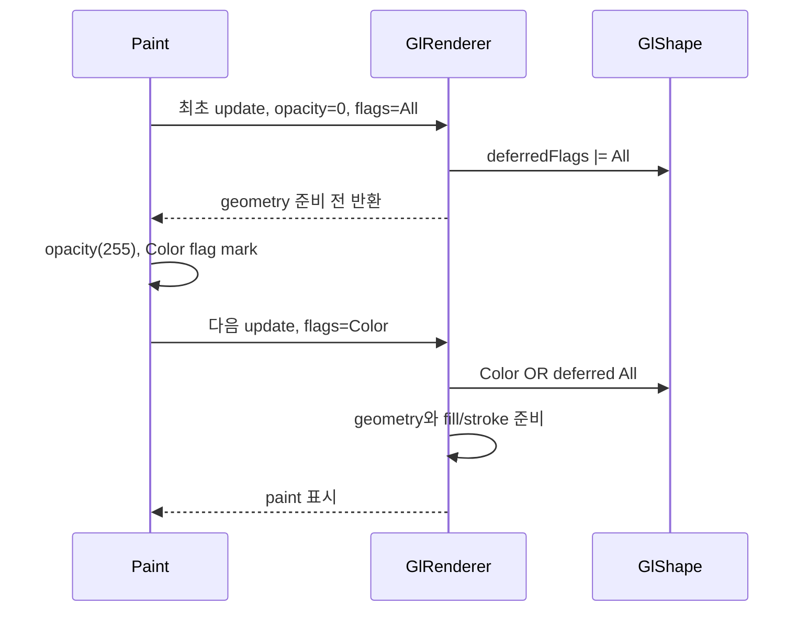

# Issue #4549 — gl_engine: initial zero-opacity paint disappears

- 링크: https://github.com/thorvg/thorvg/issues/4549
- 상태: Closed, [PR #4554](https://github.com/thorvg/thorvg/pull/4554)로 수정됨
- 분석 기준: `main` @ [`6d5933c`](https://github.com/thorvg/thorvg/commit/6d5933c9d1aca94635c6ad8129f3530ae554d423)
- 난이도: 38/100
- 초심자 추천: 추천 — 새 수정 대상이 아니라 dirty flag 회귀 분석 과제로 추천
- 관련 영역: GL render-data cache, update flags, tessellation, opacity lifecycle
- 배울 수 있는 것: deferred dirty state, 최초 생성과 증분 update의 차이, pixel regression test

## 난이도 산정

| 요소 | 점수 | 근거 |
|---|---:|---|
| 재현·증거 불확실성 | 2/20 | 이슈 절차와 현재 보정 코드가 정확히 대응한다 |
| 변경 범위 | 9/25 | GL render-data와 두 `prepare()` 경로, test에 집중된다 |
| 구현 복잡도 | 9/25 | bitmask 저장은 작지만 최초 `All` flag가 필요한 이유를 이해해야 한다 |
| 교차 영향 위험 | 11/20 | shape/image/clipper와 투명 상태 중 여러 변경을 보존해야 한다 |
| 검증 부담 | 7/10 | API 반환값이 아니라 실제 GL pixel을 검사해야 한다 |
| **합계** | **38/100** | root cause와 수정 패턴이 좁고 현재 코드에서 확인된다 |

- 실현 가능성: **높음** — 수정은 이미 반영됐으며, 남은 좋은 기여는 정확한 pixel regression test다.

## 이슈 요약

paint를 opacity 0으로 처음 canvas에 추가해 그린 뒤 opacity를 올리면 GL에서 나타나지 않던 문제다. 최초 geometry를 준비해야 할 update flag가 투명 paint 최적화의 조기 반환에서 소비된 것이 원인이었다.

이 이슈는 닫혔으므로 같은 수정을 다시 작성하면 안 된다. 초심자는 현재 수정이 왜 필요한지 재현하고 회귀 테스트의 빈틈을 확인하는 데 집중하면 좋다.

## main 코드 조사

현재 [`GlShape`](https://github.com/thorvg/thorvg/blob/6d5933c9d1aca94635c6ad8129f3530ae554d423/src/renderer/gpu_engine/gl/tvgGlCommon.h#L120)는 `deferredFlags`를 갖는다. shape와 image의 [`prepare()`](https://github.com/thorvg/thorvg/blob/6d5933c9d1aca94635c6ad8129f3530ae554d423/src/renderer/gpu_engine/gl/tvgGlRenderer.cpp#L1260)는 opacity 0일 때 flag를 저장하고, 다시 보이는 frame에서 합쳐 재생한다.

```cpp
// 현재 반영된 수정 패턴
if (opacity == 0 && !clipper) {
    sdata->opacity = 0;
    sdata->deferredFlags |= flags;
    return sdata;
}

flags |= sdata->deferredFlags;
sdata->deferredFlags = RenderUpdateFlag::None;
```



## 원인 가설

`Paint::opacity()`는 opacity 변경에 필요한 `Color` flag만 표시한다. 하지만 첫 render-data 생성 때 필요한 `Path/Transform`까지 포함한 `All` flag가 opacity 0 조기 반환에서 사라지면, 다음 frame의 `Color`만으로는 한 번도 만들어지지 않은 geometry를 복원할 수 없다.

`|=`가 중요한 이유도 여기에 있다. paint가 투명한 동안 path, transform, gradient가 여러 번 바뀌어도 모든 dirty bit의 합집합을 첫 visible frame까지 보존해야 한다. clipper는 보이지 않아도 geometry가 필요할 수 있어 `!clipper` 예외가 유지된다.

## 수정 방향 계획

이 이슈의 source fix는 이미 반영됐다. 같은 patch를 다시 만드는 대신 현재 test suite에 첫-frame GL pixel 회귀가 없다면 fill, stroke, image, clipper case를 추가하고 `deferredFlags`가 투명 상태의 여러 변경을 누적하는지 검증하는 것이 남은 방향이다.

## 초심자 검증 가이드

1. fill shape, stroke-only shape, bitmap picture를 각각 opacity 0으로 처음 add/draw한다.
2. opacity를 255로 바꾼 뒤 `update/draw/sync`하고 중심 pixel을 검사한다.
3. 투명 상태에서 path, transform, gradient를 여러 번 바꾼 뒤 reveal해 flag 누적을 확인한다.
4. 일반 paint와 opacity 0 clipper를 별도 case로 둔다.
5. 실패하던 revision과 현재 revision을 같은 fixture로 비교하면 deferred update 개념을 이해하기 쉽다.

## 위험/검증

일반 `Paint::opacity(0)` API test는 실제 첫-frame GL raster 결과를 보장하지 않는다. 회귀 테스트는 `Result::Success`만 보지 말고 pixel을 읽어야 한다. 이미 닫힌 이슈이므로 추가 코어 변경 전에 현재 test suite에 동일한 pixel case가 있는지 먼저 확인한다.

## 참고 자료

- [Issue #4549](https://github.com/thorvg/thorvg/issues/4549)
- [수정 PR #4554](https://github.com/thorvg/thorvg/pull/4554)
- [GL render-data 구조](https://github.com/thorvg/thorvg/blob/6d5933c9d1aca94635c6ad8129f3530ae554d423/src/renderer/gpu_engine/gl/tvgGlCommon.h#L120)
- [GL image/shape prepare 경로](https://github.com/thorvg/thorvg/blob/6d5933c9d1aca94635c6ad8129f3530ae554d423/src/renderer/gpu_engine/gl/tvgGlRenderer.cpp#L1260)
- [공통 RenderUpdateFlag](https://github.com/thorvg/thorvg/blob/6d5933c9d1aca94635c6ad8129f3530ae554d423/src/renderer/tvgRender.h)
