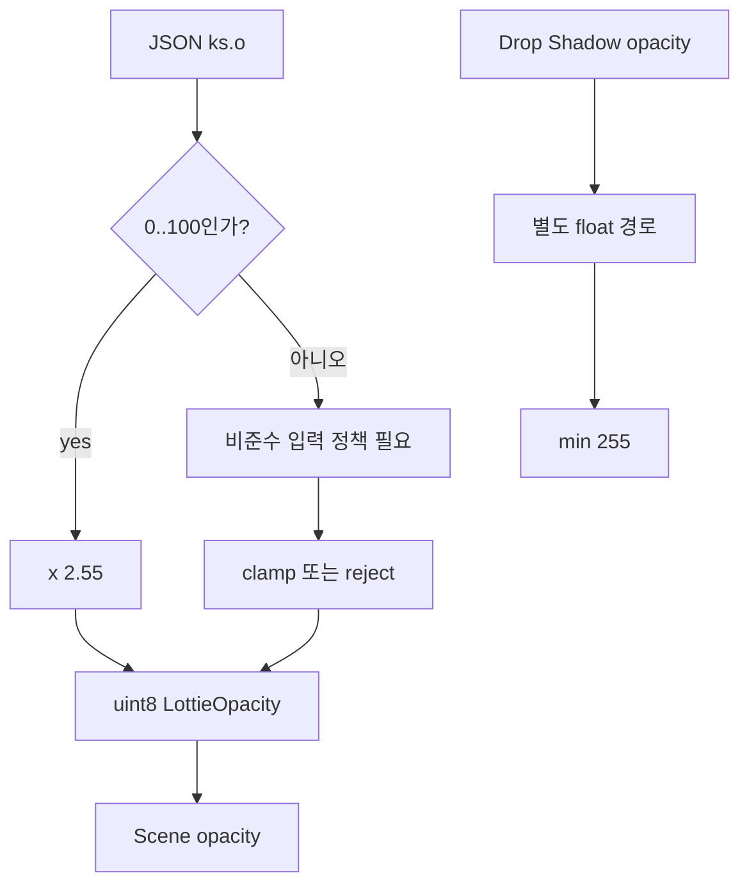

# Issue #4551 — lottie: compliance problem

- 링크: https://github.com/thorvg/thorvg/issues/4551
- 상태: Open (2026-07-19 확인)
- 분석 기준: `main` @ [`6d5933c`](https://github.com/thorvg/thorvg/commit/6d5933c9d1aca94635c6ad8129f3530ae554d423)
- 난이도: 40/100
- 초심자 추천: 조건부 — 최소 fixture 작성은 추천, 입력 정책 결정은 maintainer 확인 필요
- 관련 영역: Lottie parser, animated opacity, numeric conversion, invalid-input policy
- 배울 수 있는 것: 규격 준수와 강건성의 차이, 범위 밖 수치 변환, 최소 재현 데이터 만들기

## 난이도 산정

| 요소 | 점수 | 근거 |
|---|---:|---|
| 재현·증거 불확실성 | 8/20 | 첨부 데이터의 비정상 값은 확인되지만 reference renderer의 결과만으로 정답을 정할 수 없다 |
| 변경 범위 | 8/25 | layer opacity parser/property와 관련 test에 집중할 수 있다 |
| 구현 복잡도 | 8/25 | clamp 자체는 작지만 reject/clamp/호환 정책과 반올림을 정해야 한다 |
| 교차 영향 위험 | 10/20 | 기존 비준수 Lottie의 출력이 달라지고 다른 opacity 종류와 혼동할 수 있다 |
| 검증 부담 | 6/10 | 경계값과 animated/static, shadow 분리 test가 필요하다 |
| **합계** | **40/100** | 코드 위험은 좁지만 “정답 출력”보다 invalid-input 정책이 핵심이다 |

- 실현 가능성: **중간** — 최소 재현과 안전한 변환은 명확하지만 비준수 입력 처리 정책 합의가 선행되어야 한다.

## 이슈 요약

이슈의 ThorVG 결과는 여러 육각형이 어둡거나 사라지고 Skottie 결과는 모두 보인다. 그러나 [첨부 JSON](https://github.com/user-attachments/files/29995482/8b0807a480d0.json)을 직접 집계하면 403개 layer 중 400개 animated layer opacity가 한 번 이상 100을 넘으며, 최대값은 약 118이다.

- layer: 403개
- Drop Shadow effect: 400개
- animated layer opacity 값: 18,000개
- 100 초과 값: 8,171개
- 400개 animated 대상 모두 한 번 이상 100 초과

Lottie opacity의 정상 범위는 0..100%이므로 입력 자체가 비준수다. 따라서 “Skottie 그림이 정답이니 ThorVG가 compliance bug”라고 바로 결론 내릴 수는 없다. 다만 ThorVG parser에도 이 비정상 값을 안전하게 처리하지 못할 가능성이 매우 높은 별도 강건성 문제가 있다.

## main 코드 조사

[`LottieParser::getValue(uint8_t&)`](https://github.com/thorvg/thorvg/blob/6d5933c9d1aca94635c6ad8129f3530ae554d423/src/loaders/lottie/tvgLottieParser.cpp#L271)는 opacity percentage를 clamp하지 않고 2.55배한 뒤 `uint8_t`로 변환한다.

```cpp
bool LottieParser::getValue(uint8_t& val)
{
    if (peekType() == kArrayType) {
        enterArray();
        if (nextArrayValue()) val = (uint8_t)(getFloat() * 2.55f);
        while (nextArrayValue()) getFloat();
    } else {
        val = (uint8_t)(getFloat() * 2.55f);
    }
    return false;
}
```

118 × 2.55는 255를 넘는다. C++의 floating→integer 변환은 잘린 값이 목적 타입 범위에 들어오지 않으면 안전한 modulo 변환을 보장하지 않는다. 즉 단순히 “어떤 값으로 wrap된다”고 가정해서는 안 된다. 결과는 [`LottieOpacity`](https://github.com/thorvg/thorvg/blob/6d5933c9d1aca94635c6ad8129f3530ae554d423/src/loaders/lottie/tvgLottieProperty.h#L1002)에 `uint8_t`로 저장돼 scene opacity에 전달된다.

반면 Drop Shadow opacity는 별도 effect 값이다. [`LottieBuilder`](https://github.com/thorvg/thorvg/blob/6d5933c9d1aca94635c6ad8129f3530ae554d423/src/loaders/lottie/tvgLottieBuilder.cpp#L1524)가 float 값을 `min(255, ...)`로 처리하므로 layer transform opacity와 같은 parser 문제로 묶으면 안 된다.



## 원인 가설

**확인된 입력 문제:** 첨부 asset의 layer opacity가 규격 범위를 넘는다.

**강한 코드 가설:** 범위 검사 없는 fp→`uint8_t` 변환이 어두워지거나 사라지는 ThorVG 결과를 만든다. 이를 확정하려면 100 바로 아래·같음·바로 위 값을 가진 최소 Lottie로 parser 결과와 pixel을 비교해야 한다.

## 수정 방향 계획

1. static/animated opacity가 각각 99.9, 100, 100.1, 118인 최소 fixture를 만든다.
2. parser가 만든 내부 opacity와 최종 pixel을 기록해 경계에서만 문제가 생기는지 확인한다.
3. 비준수 값을 거부할지, 0..100으로 clamp해 관용적으로 재생할지 maintainer와 합의한다.
4. clamp 정책이라면 **float 상태에서 범위를 제한한 뒤** 정수로 변환한다. 반올림 방식도 기존 정상 입력 결과와 맞춘다.
5. Drop Shadow opacity 255 경로가 바뀌지 않는 별도 test를 둔다.

아래는 **정책 설명용 의사 코드**이며 현재 ThorVG 코드가 아니다.

```cpp
auto percent = readFloat();
percent = clamp(percent, 0.0f, 100.0f);  // reject 정책이면 여기서 오류
val = safePercentToByte(percent);
```

## 위험/검증

- 정상 0, 50, 100과 경계 99.9, 100.1, 음수, 큰 유한값을 분리한다.
- static value와 animated keyframe의 `s/e` 값을 모두 검사한다.
- layer/shape/fill/mask/effect opacity가 어느 parser overload를 쓰는지 감사한다.
- 비준수 asset의 시각 결과 변화는 compatibility decision으로 기록한다.
- ThorVG와 다른 renderer의 그림 비교는 보조 증거일 뿐, 규격 범위 밖 정답의 근거로 사용하지 않는다.

## 참고 자료

- [Issue #4551](https://github.com/thorvg/thorvg/issues/4551)
- [이슈 첨부 Lottie JSON](https://github.com/user-attachments/files/29995482/8b0807a480d0.json)
- [ThorVG uint8 opacity parser](https://github.com/thorvg/thorvg/blob/6d5933c9d1aca94635c6ad8129f3530ae554d423/src/loaders/lottie/tvgLottieParser.cpp#L271)
- [Lottie specification — transform/mask opacity](https://lottie.github.io/lottie-spec/latest/specs/helpers/)
- [C++ floating-integral conversions](https://eel.is/c++draft/conv.fpint)
