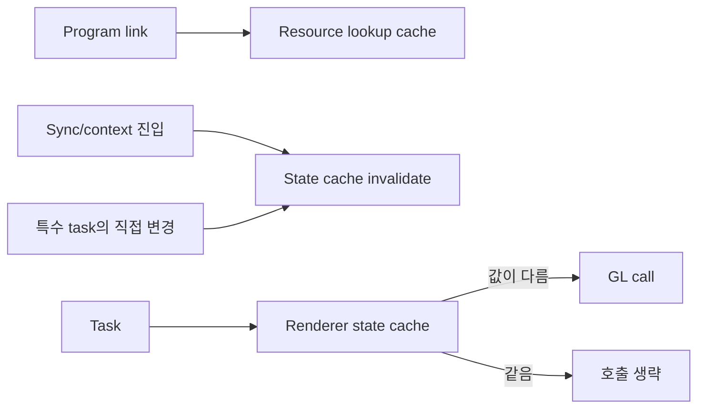

# Issue #4555 — gl_engine: redundant per-task resource/state setup

- 링크: https://github.com/thorvg/thorvg/issues/4555
- 상태: Open, reopen 상태 (2026-07-19 확인)
- 분석 기준: `main` @ [`6d5933c`](https://github.com/thorvg/thorvg/commit/6d5933c9d1aca94635c6ad8129f3530ae554d423)
- 난이도: 77/100
- 초심자 추천: 조건부 — GL 경험자와 함께 계측·uniform lookup cache부터 시작
- 관련 영역: `GlRenderTask`, `GlProgram`, GL state cache, GL/GLES/WebGL2
- 배울 수 있는 것: OpenGL 상태 머신, program resource cache, cache invalidation, 외부 GL state 소유권

## 난이도 산정

| 요소 | 점수 | 근거 |
|---|---:|---|
| 재현·증거 불확실성 | 9/20 | 중복 호출은 확인되지만 실제 병목의 비중은 측정 전 미확정이다 |
| 변경 범위 | 20/25 | program/task/renderer와 특수 composition/effect task를 함께 다룬다 |
| 구현 복잡도 | 21/25 | 위치 cache, UBO binding, vertex/texture/buffer state와 무효화가 필요하다 |
| 교차 영향 위험 | 18/20 | GL/GLES/WebGL2, 다중 context, 호출자 GL state와 충돌할 수 있다 |
| 검증 부담 | 9/10 | 호출 수·CPU 시간·pixel 결과·플랫폼 행렬 검증이 필요하다 |
| **합계** | **77/100** | 작은 cache처럼 보여도 renderer 전체의 GL state 계약을 바꾸는 과제다 |

- 실현 가능성: **중간** — resource lookup cache는 작게 분리할 수 있지만 renderer-wide state cache는 측정과 단계적 도입이 필요하다.

## 이슈 요약

GL draw task마다 바뀌지 않은 uniform 위치, uniform block binding, texture/buffer/attribute 상태를 반복 조회·설정하는 비용을 줄이자는 성능 이슈다. 중복 호출 자체는 코드에서 확인되지만 이것이 frame 성능 격차의 주원인이라는 증거는 아직 없다.

## main 코드 조사

[`GlRenderTask::run()`](https://github.com/thorvg/thorvg/blob/6d5933c9d1aca94635c6ad8129f3530ae554d423/src/renderer/gpu_engine/gl/tvgGlRenderTask.cpp#L40)는 task마다 다음 작업을 반복한다.

```cpp
int32_t vLoc = mProgram->getUniformLocation("uViewMatrix");
GL_CHECK(glGetIntegerv(GL_ARRAY_BUFFER_BINDING, &defaultArrayBuffer));

// 각 UBO resource마다 반복
GL_CHECK(glUniformBlockBinding(mProgram->getProgramId(),
                               binding.location, binding.bindPoint));
GL_CHECK(glBindBufferRange(GL_UNIFORM_BUFFER, binding.bindPoint,
                           binding.resourceId, binding.bufferOffset,
                           binding.bufferRange));
```

[`GlProgram`](https://github.com/thorvg/thorvg/blob/6d5933c9d1aca94635c6ad8129f3530ae554d423/src/renderer/gpu_engine/gl/tvgGlProgram.cpp#L78)은 현재 program의 `glUseProgram()`만 생략한다. uniform location과 uniform-block index 조회는 driver 호출을 반복한다. 반면 stencil, compose, blend, clip, effect task는 framebuffer/blend/depth/stencil 상태를 직접 바꾸므로 단순한 `unordered_map` 하나로 안전한 state cache가 되지 않는다.



## 원인 가설

task마다 반복되는 program resource 조회와 state setup이 CPU/driver submission 비용을 키운다는 가설이다. 중복 자체는 확인됐지만 전체 frame 병목의 비중은 아직 측정해야 한다.

- **확인됨:** `uDepth`, `uViewMatrix`, array-buffer binding, attribute, texture, UBO setup이 task 단위로 반복된다.
- **확인됨:** `GlProgram::mCurrentProgram`도 process-global static이어서 context 전환을 cache 경계에 포함해야 한다.
- **미확정:** 각 호출의 실제 CPU/driver 비용과 전체 frame에서 차지하는 비율이다.
- **미확정:** 호출자가 같은 context의 GL state를 ThorVG 전후에 유지할 수 있다고 기대하는지 명문화가 필요하다.

## 수정 방향 계획

1. 먼저 GL wrapper counter로 `glGet*`, bind, attribute 호출 수를 scene/task 수와 함께 기록한다.
2. linked-program 수명 동안만 유효한 uniform location과 uniform-block index cache를 `GlProgram`에 둔다.
3. 고정된 `glUniformBlockBinding()`은 program link/init 단계에서 한 번 설정한다.
4. renderer-owned state cache는 `sync()` 진입, context 변경, 외부 state 가능 지점에서 명시적으로 무효화한다.
5. composition/effect task의 직접 state 변경을 cache 경유 또는 `invalidate()` 호출로 통합한다.
6. 각 단계를 별도 성능 수치와 pixel 회귀로 검증한 뒤 다음 범위로 넓힌다.

## 초심자 시작 가이드

전체 state cache를 첫 과제로 잡지 않는 것이 좋다. 다음 순서가 안전하다.

1. 동일 scene에서 task 수와 `getUniformLocation()` 호출 수를 센다.
2. program 생성/삭제 수명을 그려 cache key가 program ID만으로 충분한지 확인한다.
3. uniform lookup cache만 독립적으로 제안하고 호출 수 감소와 pixel 동일성을 증명한다.
4. 그 다음 UBO binding, texture, vertex state를 하나씩 다룬다.

## 위험/검증

- solid/image/linear/radial, clip/stencil/blend/effect scene의 pixel hash와 GL error를 비교한다.
- GL, GLES, WebGL2에서 별도 실행한다.
- context 전환, renderer destroy/recreate, program relink 때 cache가 무효화되는지 확인한다.
- CPU submission time과 total frame time을 함께 기록한다. 호출 수 감소만으로 성능 개선을 단정하지 않는다.

## 참고 자료

- [Issue #4555](https://github.com/thorvg/thorvg/issues/4555)
- [GlRenderTask의 반복 state setup](https://github.com/thorvg/thorvg/blob/6d5933c9d1aca94635c6ad8129f3530ae554d423/src/renderer/gpu_engine/gl/tvgGlRenderTask.cpp#L40)
- [GlProgram resource lookup](https://github.com/thorvg/thorvg/blob/6d5933c9d1aca94635c6ad8129f3530ae554d423/src/renderer/gpu_engine/gl/tvgGlProgram.cpp#L78)
- [OpenGL `glGetUniformLocation`](https://registry.khronos.org/OpenGL-Refpages/gl4/html/glGetUniformLocation.xhtml)
- [OpenGL `glGetUniformBlockIndex`](https://registry.khronos.org/OpenGL-Refpages/gl4/html/glGetUniformBlockIndex.xhtml)
- [OpenGL `glUniformBlockBinding`](https://registry.khronos.org/OpenGL-Refpages/gl4/html/glUniformBlockBinding.xhtml)
- [OpenGL `glBindBufferRange`](https://registry.khronos.org/OpenGL-Refpages/gl4/html/glBindBufferRange.xhtml)
