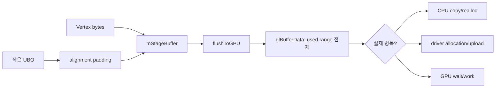

# Issue #4556 — gl_engine: staged-buffer overhead investigation

- 링크: https://github.com/thorvg/thorvg/issues/4556
- 상태: Open (2026-07-19 확인)
- 분석 기준: `main` @ [`6d5933c`](https://github.com/thorvg/thorvg/commit/6d5933c9d1aca94635c6ad8129f3530ae554d423)
- 난이도: 61/100
- 초심자 추천: 조건부 추천 — 구현보다 profiling 과제로 시작
- 관련 영역: `GlStageBuffer`, UBO alignment, CPU staging, `glBufferData()`
- 배울 수 있는 것: 가설 기반 profiling, alignment padding, CPU/driver/GPU 시간 분리

## 난이도 산정

| 요소 | 점수 | 근거 |
|---|---:|---|
| 재현·증거 불확실성 | 18/20 | staged buffer가 병목이라는 가설은 아직 확인되지 않았다 |
| 변경 범위 | 13/25 | 진단 계측은 좁지만 후속 수정 범위는 결과에 따라 달라진다 |
| 구현 복잡도 | 13/25 | byte accounting, realloc, CPU/driver/GPU 시간 분리가 필요하다 |
| 교차 영향 위험 | 8/20 | 계측은 저위험이지만 섣부른 buffer 재설계는 모든 GL draw에 영향을 준다 |
| 검증 부담 | 9/10 | workload·backend·cold/warm frame 행렬이 필요하다 |
| **합계** | **61/100** | 답을 구현하기보다 먼저 병목을 증명해야 하는 조사형 이슈다 |

- 실현 가능성: **높음(계측), 미정(최적화)** — 정확한 byte/time 계측은 가능하지만 최종 처방은 결과가 정한다.

## 이슈 요약

GL staged buffer의 CPU 복사, alignment padding, 재할당, 매-frame upload가 실제 성능 문제인지 조사하는 이슈다. 본문도 dominant cost를 찾기 전에는 buffer 분리, persistent mapping, `glBufferSubData()` 같은 구현을 미리 정하지 말라고 요구한다.

## main 코드 조사

vertex와 UBO data는 [`GlStageBuffer::reserve()`](https://github.com/thorvg/thorvg/blob/6d5933c9d1aca94635c6ad8129f3530ae554d423/src/renderer/gpu_engine/gl/tvgGlGpuBuffer.cpp#L121)의 같은 `mStageBuffer`에 들어간다. UBO allocation은 [`alignOffset()`](https://github.com/thorvg/thorvg/blob/6d5933c9d1aca94635c6ad8129f3530ae554d423/src/renderer/gpu_engine/gl/tvgGlGpuBuffer.cpp#L224)에서 `GL_UNIFORM_BUFFER_OFFSET_ALIGNMENT`만큼 padding을 만들고, [`flushToGPU()`](https://github.com/thorvg/thorvg/blob/6d5933c9d1aca94635c6ad8129f3530ae554d423/src/renderer/gpu_engine/gl/tvgGlGpuBuffer.cpp#L163)은 padding을 포함한 사용 범위 전체를 업로드한다.

```cpp
// 현재 동작의 핵심
if (alignGpuOffset) alignOffset(size);
auto offset = mStageBuffer.count;
mStageBuffer.count += size;

// flush에서는 count 전체가 GPU buffer로 전달된다.
mGpuBuffer.updateBufferData(GlGpuBuffer::Target::ARRAY_BUFFER,
                            mStageBuffer.count,
                            mStageBuffer.data);
```



## 원인 가설

padding과 사용 범위 전체 upload가 logical payload보다 전송량을 크게 만들거나, 반복 `glBufferData()`가 driver allocation 비용을 만든다는 가설이다. 가능성은 확인됐지만 CPU copy, driver allocation, GPU 작업 중 무엇이 지배적인지는 코드만으로 알 수 없다.

## 수정 방향 계획

아래는 **현재 코드가 아니라 제안용 계측 구조**다.

```cpp
struct StageStats {
    uint64_t logicalVertex;
    uint64_t logicalUniform;
    uint64_t alignmentPadding;
    uint64_t uploadedMain;
    uint64_t uploadedAux;
    uint64_t uploadedIndex;
    uint32_t growCount;
    uint32_t bufferDataCalls;
};
```

1. `reserve()` 호출 목적을 vertex/uniform으로 구분해 logical byte를 센다.
2. `alignOffset()`이 늘린 byte를 padding으로 별도 기록한다.
3. 각 GPU buffer의 upload byte, grow/realloc, `glBufferData` 호출 수를 frame별 기록한다.
4. CPU prepare, `flushToGPU`, driver submission, GPU timer를 분리한다.
5. batching 전후에는 draw call 수와 총 upload byte를 함께 본다.

## 초심자 시작 가이드

solid, image, linear gradient, radial gradient scene을 같은 primitive 수로 만들고 다음 표부터 채우면 좋다.

| workload | logical bytes | padding bytes | uploaded bytes | grow 수 | CPU flush | GPU time |
|---|---:|---:|---:|---:|---:|---:|
| static/warm |  |  |  |  |  |  |
| geometry update |  |  |  |  |  |  |

측정 결과가 없으면 “buffer를 분리하면 빠르다” 같은 결론을 내리지 않는다. 성능 이슈에서 가장 유용한 첫 기여는 재현 가능한 benchmark와 수치다.

## 위험/검증

- static scene과 매 frame geometry가 바뀌는 scene을 나눈다.
- cold allocation과 warm steady-state frame을 나눈다.
- desktop GL, GLES, WebGL2 결과를 별도 기록한다.
- 계측 자체가 hot path를 크게 느리게 하지 않도록 compile-time option 또는 test instrumentation으로 제한한다.
- 후속 최적화가 정해지면 pixel hash와 GL error도 반드시 비교한다.

## 참고 자료

- [Issue #4556](https://github.com/thorvg/thorvg/issues/4556)
- [GlStageBuffer reserve/flush](https://github.com/thorvg/thorvg/blob/6d5933c9d1aca94635c6ad8129f3530ae554d423/src/renderer/gpu_engine/gl/tvgGlGpuBuffer.cpp#L121)
- [OpenGL `glBufferData`](https://registry.khronos.org/OpenGL-Refpages/gl4/html/glBufferData.xhtml)
- [OpenGL UBO range/alignment](https://registry.khronos.org/OpenGL-Refpages/gl4/html/glBindBufferRange.xhtml)
- [OpenGL query objects](https://registry.khronos.org/OpenGL-Refpages/gl4/html/glBeginQuery.xhtml)
- [Khronos Buffer Object Streaming](https://wikis.khronos.org/opengl/Buffer_Object_Streaming)
