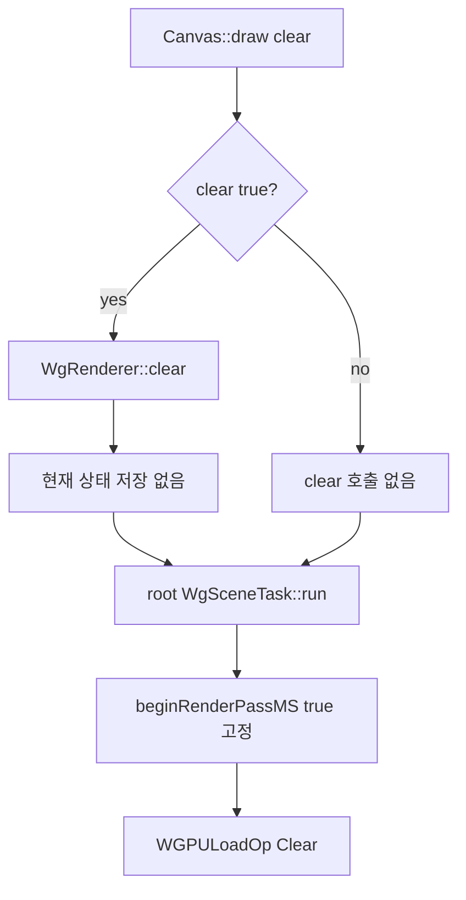

# Issue #4557 — wg_engine: preserve the canvas buffer on `draw(false)`

- 링크: https://github.com/thorvg/thorvg/issues/4557
- 상태: Open, WG 범위로 합의됨 (2026-07-19 확인)
- 분석 기준: `main` @ [`6d5933c`](https://github.com/thorvg/thorvg/commit/6d5933c9d1aca94635c6ad8129f3530ae554d423)
- 난이도: 46/100
- 초심자 추천: 조건부 — WebGPU render-pass 경험 또는 멘토 권장
- 관련 영역: Canvas clear contract, WG root render target, MSAA load/store, nested compositor
- 배울 수 있는 것: `WGPULoadOp`, frame persistence, root target과 pooled target의 수명 차이

## 난이도 산정

| 요소 | 점수 | 근거 |
|---|---:|---|
| 재현·증거 불확실성 | 2/20 | public contract와 hardcoded clear가 직접 대응한다 |
| 변경 범위 | 10/25 | renderer state, root task, compositor 연결과 WG test가 필요하다 |
| 구현 복잡도 | 12/25 | root만 보존하고 재사용되는 nested target은 계속 clear해야 한다 |
| 교차 영향 위험 | 14/20 | 모든 WG frame, MSAA resolve, mask/effect target 재사용에 영향을 준다 |
| 검증 부담 | 8/10 | 다중 frame pixel, root/nested, surface/texture target을 검사해야 한다 |
| **합계** | **46/100** | 원인은 좁지만 clear flag를 잘못 전파하면 pooled target 잔상이 생긴다 |

- 실현 가능성: **높음** — 직접 원인이 확인됐고 GL working reference도 있지만 root와 intermediate target을 구분해야 한다.

## 이슈 요약

[`Canvas::draw(false)`](https://github.com/thorvg/thorvg/blob/6d5933c9d1aca94635c6ad8129f3530ae554d423/inc/thorvg.h#L975)는 기존 target buffer를 지우지 않고 새 draw를 누적해야 한다. GL은 이 동작을 보이지만 WG는 이전 frame을 지운다. 이슈 댓글에서 SmartRender의 damage clear는 별도 예외로 두고 WG만 수정 범위로 정리됐다.

## main 코드 조사

공통 [`Canvas::Impl::draw()`](https://github.com/thorvg/thorvg/blob/6d5933c9d1aca94635c6ad8129f3530ae554d423/src/renderer/tvgCanvas.h#L104)은 `clear == true`일 때만 `renderer->clear()`를 부른다. 그러나 [`WgRenderer::clear()`](https://github.com/thorvg/thorvg/blob/6d5933c9d1aca94635c6ad8129f3530ae554d423/src/renderer/gpu_engine/wg/tvgWgRenderer.cpp#L365)는 TODO인 no-op이고, [`WgSceneTask::run()`](https://github.com/thorvg/thorvg/blob/6d5933c9d1aca94635c6ad8129f3530ae554d423/src/renderer/gpu_engine/wg/tvgWgRenderTask.cpp#L43)은 모든 scene의 첫 pass에 `true`를 넘긴다.

```cpp
// root인지 nested인지와 관계없이 현재 첫 pass는 항상 clear
compositor.beginRenderPassMS(encoder, renderTarget, true);

// compositor에서 bool은 그대로 loadOp이 된다.
.loadOp = clear ? WGPULoadOp_Clear : WGPULoadOp_Load,
.storeOp = WGPUStoreOp_Store,
```



## 원인 가설

`draw(false)`라는 사용자 의도가 WG root pass까지 전달되지 않고 `WGPULoadOp_Clear`로 덮이는 것이 직접 원인이다.

## 수정 방향 계획

1. `WgRenderer`에 frame별 clear 요청 상태를 둔다.
2. `clear()`는 target을 즉시 지우기보다 그 frame의 root load operation을 `Clear`로 표시한다.
3. root `WgSceneTask`에만 이 상태를 전달해 첫 pass를 `Clear` 또는 `Load`로 선택한다.
4. pool에서 재사용하는 nested mask/effect render target은 매 사용 시 계속 clear한다.
5. root 명령이 성공적으로 제출된 뒤 frame clear 상태를 reset한다.
6. GL의 `mClearBuffer` 처리 흐름을 상태 수명 참고 자료로 사용하되 WG target 구조에 맞게 구현한다.

## 초심자 핵심 구분

root와 intermediate target을 같은 것으로 보면 안 된다.

- **root target:** 사용자가 지난 frame 보존 여부를 `draw(clear)`로 결정한다.
- **intermediate target:** mask/effect 계산용 임시 저장소다. pool의 지난 사용 내용이 섞이면 안 되므로 새 논리 작업마다 clear해야 한다.

모든 task에 `draw(false)`를 전파하는 단순 수정은 nested target에 오래된 pixel을 남길 수 있다.

## 위험/검증

1. frame A에서 red rect를 `draw(true)`로 렌더한다.
2. rect를 이동/제거한 frame B를 `draw(false)`로 렌더해 이전 위치가 남는지 본다.
3. frame C를 `draw(true)`로 렌더해 이전 위치가 zero인지 본다.
4. 같은 sequence를 GL과 WG에서 비교한다.
5. nested mask/effect를 반복해 pooled intermediate target 내용은 남지 않는지 확인한다.
6. texture target은 readback pixel test, surface target은 별도 smoke test를 둔다.
7. 첫 `draw(false)`, resize/retarget 직후, viewport, MSAA resolve도 포함한다.

## 참고 자료

- [Issue #4557](https://github.com/thorvg/thorvg/issues/4557)
- [WG-only 범위를 확인한 댓글](https://github.com/thorvg/thorvg/issues/4557#issuecomment-4972486097)
- [Canvas draw contract](https://github.com/thorvg/thorvg/blob/6d5933c9d1aca94635c6ad8129f3530ae554d423/inc/thorvg.h#L975)
- [WG root scene pass](https://github.com/thorvg/thorvg/blob/6d5933c9d1aca94635c6ad8129f3530ae554d423/src/renderer/gpu_engine/wg/tvgWgRenderTask.cpp#L43)
- [WG load/store 결정](https://github.com/thorvg/thorvg/blob/6d5933c9d1aca94635c6ad8129f3530ae554d423/src/renderer/gpu_engine/wg/tvgWgCompositor.cpp#L168)
- [WebGPU load/store operations](https://www.w3.org/TR/webgpu/#load-store-ops)
- [WebGPU resource initialization](https://gpuweb.github.io/gpuweb/#uninitialized-data)
