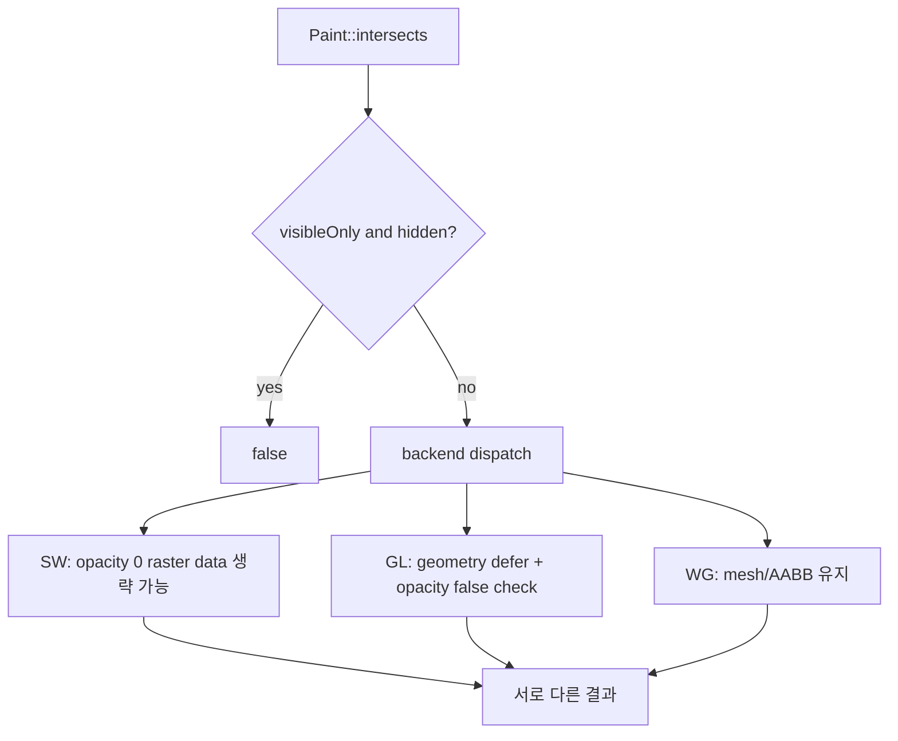

# Issue #4560 — API: define opacity-independent intersection behavior

- 링크: https://github.com/thorvg/thorvg/issues/4560
- 상태: Open, [PR #4570](https://github.com/thorvg/thorvg/pull/4570)으로 API 일부 반영 (2026-07-19 확인)
- 분석 기준: `main` @ [`6d5933c`](https://github.com/thorvg/thorvg/commit/6d5933c9d1aca94635c6ad8129f3530ae554d423)
- 난이도: 66/100
- 초심자 추천: 조건부 — 멘토와 backend별 test matrix부터 작성
- 관련 영역: public C++/C API, hit testing, opacity/visibility, SW·GL·WG render data
- 배울 수 있는 것: 기하 상태와 draw visibility 분리, backend 의미 일치, public behavior 변경 검증

## 난이도 산정

| 요소 | 점수 | 근거 |
|---|---:|---|
| 재현·증거 불확실성 | 3/20 | public 의도와 backend별 불일치가 코드에서 직접 확인된다 |
| 변경 범위 | 18/25 | public/C API, 공통 dispatch, SW·GL·WG data lifecycle과 test가 대상이다 |
| 구현 복잡도 | 19/25 | opacity 0에서 생략된 geometry를 hit testing용으로 유지·갱신해야 한다 |
| 교차 영향 위험 | 17/20 | 기존 hit-test 결과와 투명 paint의 성능·메모리 비용이 바뀐다 |
| 검증 부담 | 9/10 | engine·paint type·opacity transition·visibility 조합 검증이 필요하다 |
| **합계** | **66/100** | 조건문 하나가 아니라 geometry cache와 public 의미를 맞추는 작업이다 |

- 실현 가능성: **중간** — 목표 API는 선명하지만 opacity 0 최적화와 hit geometry의 소유권 설계가 필요하다.

## 이슈 요약

intersection은 “현재 pixel이 보이는가”가 아니라 paint의 기하 영역과 겹치는지를 답하고, 표시 여부는 `Paint::visible(false)`와 `visibleOnly`로만 선택하자는 정책 이슈다. [PR #4570](https://github.com/thorvg/thorvg/pull/4570)이 `visibleOnly` overload와 C API를 추가했지만, 분석 기준 main에서 opacity 0의 실제 결과는 backend마다 아직 다를 수 있다.

## main 코드 조사

공통 [`Paint::Impl::intersects()`](https://github.com/thorvg/thorvg/blob/6d5933c9d1aca94635c6ad8129f3530ae554d423/src/renderer/tvgPaint.cpp#L282)은 `visibleOnly && hidden`만 거른 뒤 renderer에 위임한다.

```cpp
bool Paint::Impl::intersects(const RenderRegion& region, bool visibleOnly)
{
    if (visibleOnly && hidden) return false;
    if (renderer) {
        bool ret;
        PAINT_METHOD(ret, intersects(region, visibleOnly));
        return ret;
    }
    return false;
}
```

하지만 backend data lifecycle은 같지 않다.

- SW [`prepareCommon()`](https://github.com/thorvg/thorvg/blob/6d5933c9d1aca94635c6ad8129f3530ae554d423/src/renderer/cpu_engine/tvgSwRenderer.cpp#L825)은 opacity 0 task를 ready 처리해 raster geometry를 만들지 않을 수 있고, invalid task의 intersection은 false다.
- GL [`prepare()`](https://github.com/thorvg/thorvg/blob/6d5933c9d1aca94635c6ad8129f3530ae554d423/src/renderer/gpu_engine/gl/tvgGlRenderer.cpp#L1316)은 opacity 0에서 geometry update를 미루며, [`intersectsShape/Image()`](https://github.com/thorvg/thorvg/blob/6d5933c9d1aca94635c6ad8129f3530ae554d423/src/renderer/gpu_engine/gl/tvgGlRenderer.cpp#L1400)는 `shape->opacity == 0`을 명시적으로 false 처리한다.
- WG는 mesh/AABB data를 유지하는 경로여서 같은 paint가 기하 교차로 판정될 수 있다.



## 원인 가설

GL의 `shape->opacity == 0` 조건만 지워도 해결되지 않는다. 최초 opacity 0 paint는 GL geometry 자체가 아직 준비되지 않았을 수 있고, SW도 raster task가 invalid일 수 있다. intersection에 필요한 geometry/cache를 draw visibility 최적화와 분리해야 모든 backend가 같은 의미를 낼 수 있다.

## 수정 방향 계획

1. 기존 `intersects(x, y, w, h)`와 `visibleOnly` overload의 정확한 opacity/hidden 계약을 문서와 test로 먼저 고정한다.
2. engine별로 opacity 0에서 어떤 hit data가 남는지 표로 만든다.
3. 기하 cache를 항상 갱신할지, intersection 요청 시 lazy build할지 비용을 비교한다.
4. GL/SW의 opacity-only early return과 dirty flag lifecycle을 함께 바꾼다.
5. C++ overload와 `tvg_paint_intersects_region()` C API의 결과를 같은 fixture로 검사한다.

## 초심자 test matrix

다음 조합을 CPU·GL·WG × Shape·Picture에 적용한다.

| transition/state | `visibleOnly=false` | `visibleOnly=true` |
|---|---|---|
| 최초 opacity 0 | geometry 기준 기대값 | geometry 기준 기대값 |
| nonzero → 0 | 최초 case와 동일 | 최초 case와 동일 |
| opacity 0에서 transform/path 변경 | 새 geometry 반영 | 새 geometry 반영 |
| `visible(false)` | geometry 반영 | false |

현재 구현 결과를 먼저 기록하고, 합의된 기대값과 다른 칸만 수정 대상으로 만든다.

## 위험/검증

- 투명 paint도 geometry를 유지하면 CPU 시간과 memory가 늘 수 있다.
- opacity transition 중 dirty flag가 사라지면 #4549와 같은 “나중에 나타나지 않음” 회귀가 생길 수 있다.
- mask/blend의 최종 합성 결과는 intersection 계약에 포함하지 않는다는 API note를 유지한다.
- stable 기본 overload의 결과가 바뀌므로 release note와 C/C++ parity가 필요하다.

## 참고 자료

- [Issue #4560](https://github.com/thorvg/thorvg/issues/4560)
- [관련 PR #4570](https://github.com/thorvg/thorvg/pull/4570)
- [Paint intersection public API](https://github.com/thorvg/thorvg/blob/6d5933c9d1aca94635c6ad8129f3530ae554d423/inc/thorvg.h#L590)
- [공통 intersection dispatch](https://github.com/thorvg/thorvg/blob/6d5933c9d1aca94635c6ad8129f3530ae554d423/src/renderer/tvgPaint.cpp#L282)
- [GL intersection 구현](https://github.com/thorvg/thorvg/blob/6d5933c9d1aca94635c6ad8129f3530ae554d423/src/renderer/gpu_engine/gl/tvgGlRenderer.cpp#L1400)
- [C API intersection binding](https://github.com/thorvg/thorvg/blob/6d5933c9d1aca94635c6ad8129f3530ae554d423/src/bindings/capi/tvgCapi.cpp#L281)
