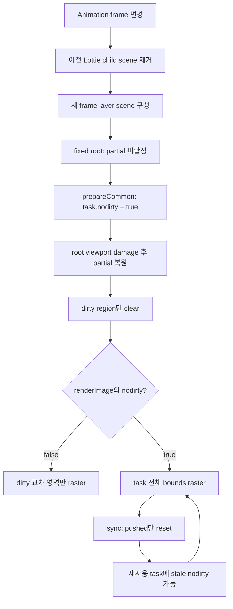

# Issue #4566 — CPU Lottie flicker with `LottieAssetResolver`

- 링크: https://github.com/thorvg/thorvg/issues/4566
- 상태: Open, SW partial-rendering 범위로 재분류 (2026-07-19)
- 분석 기준: ThorVG `main` @ [`6d5933c`](https://github.com/thorvg/thorvg/commit/6d5933c9d1aca94635c6ad8129f3530ae554d423)
- 난이도: 58/100
- 초심자 추천: 조건부 추천 — partial on/off 픽셀 회귀 test는 추천, renderer 상태 수정은 멘토 검토 권장
- 관련 영역: CPU/SW renderer, `RenderDirtyRegion`, `SwTask` 상태 수명, Lottie fixed scene, resolver bitmap 재사용
- 배울 수 있는 것: partial redraw 불변식, frame-local 상태와 persistent render data 구분, 전체 buffer differential test

## 난이도 산정

| 요소 | 점수 | 근거 |
|---|---:|---|
| 재현·증거 불확실성 | 8/20 | CPU-only 증상과 실패한 example 수정으로 backend 범위는 좁지만, 정확한 task 상태 전이는 픽셀 test로 고정해야 한다 |
| 변경 범위 | 11/25 | 핵심 수정 후보는 SW task lifecycle에 집중되지만 Lottie asset-resolver 회귀 fixture가 함께 필요하다 |
| 구현 복잡도 | 14/25 | 코드 변경은 작을 수 있어도 fixed scene, 비동기 prepare/render/sync, 재사용 render data의 수명을 이해해야 한다 |
| 교차 영향 위험 | 16/20 | `nodirty` 의미를 바꾸면 Lottie뿐 아니라 모든 SW SmartRender scene의 full/partial draw 선택이 달라진다 |
| 검증 부담 | 9/10 | 연속 frame 전체 픽셀, SmartRender on/off, 겹침·투명도·thread 수 조합을 비교해야 한다 |
| **합계** | **58/100** | 작은 상태 초기화 후보 뒤에 공용 SW partial-rendering 불변식과 회귀 위험이 있다 |

- 실현 가능성: **높음** — 원인 영역과 최소 수정 후보는 좁혀졌지만, merge 가능한 결론은 partial/full-render 결과가 frame마다 동일하다는 회귀 test로 증명해야 한다.

## 이슈 요약

`LottieAssetResolver`를 사용한 animation이 CPU engine에서만 깜빡이는 문제다. [이슈 본문](https://github.com/thorvg/thorvg/issues/4566)은 증상이 “only observable in cpu engine”이라고 명시한다. GL/WG와 달리 SW backend만 dirty region 기반 partial redraw를 수행하므로 이 backend 차이가 첫 분기점이다.

기존 분석의 example loop 가설은 직접 원인으로 볼 수 없다. [thorvg.example PR #52](https://github.com/thorvg/thorvg.example/pull/52)는 exact loop boundary를 수정했지만 maintainer가 “개선이 보이지 않는다”고 검토했고, PR은 merge되지 않은 채 닫혔다. frame 범위를 지키는 것은 별도 품질 개선일 수 있으나 #4566의 CPU-only flicker를 설명하거나 해결하지 못한다.

## main 코드 조사

### 1. SW 기본 모드가 partial rendering을 사용한다

[`EngineOption::SmartRender`](https://github.com/thorvg/thorvg/blob/6d5933c9d1aca94635c6ad8129f3530ae554d423/inc/thorvg.h#L119)는 바뀐 canvas 영역만 갱신하는 partial redraw로 정의돼 있다. SW renderer는 [`EngineOption::Default`에서도 dirty-region 지원을 켠다](https://github.com/thorvg/thorvg/blob/6d5933c9d1aca94635c6ad8129f3530ae554d423/src/renderer/cpu_engine/tvgSwRenderer.cpp#L918).

```cpp
auto byDefault = (op == EngineOption::Default);
dirtyRegion.support = (byDefault || (op & EngineOption::SmartRender));
```

[`preRender()`](https://github.com/thorvg/thorvg/blob/6d5933c9d1aca94635c6ad8129f3530ae554d423/src/renderer/cpu_engine/tvgSwRenderer.cpp#L318)은 dirty region만 clear한다. 이후 [`renderImage()`](https://github.com/thorvg/thorvg/blob/6d5933c9d1aca94635c6ad8129f3530ae554d423/src/renderer/cpu_engine/tvgSwRenderer.cpp#L378)은 일반 task를 committed dirty region과 교차한 사각형에만 raster한다.

partial frame이 올바르려면 다음 불변식이 지켜져야 한다.

> dirty region만 지웠다면 모든 paint도 그 region 안에서만 써야 한다. paint 하나가 밖까지 쓰면, 그 밖의 상위 paint는 다시 그려지지 않아 보존 pixel이 깨질 수 있다.

### 2. Lottie는 자식 partial 수집을 의도적으로 끈다

Lottie는 frame 변경 때 [`LottieComposition::clear()`](https://github.com/thorvg/thorvg/blob/6d5933c9d1aca94635c6ad8129f3530ae554d423/src/loaders/lottie/tvgLottieModel.h#L1227)로 이전 root child scene을 비우고 새 layer scene을 만든다. root scene은 [`LottieBuilder::build()`](https://github.com/thorvg/thorvg/blob/6d5933c9d1aca94635c6ad8129f3530ae554d423/src/loaders/lottie/tvgLottieBuilder.cpp#L1767)에서 fixed size로 설정된다.

```cpp
// turn off partial rendering for children
to<SceneImpl>(comp->root->scene)->size({comp->w, comp->h});
```

fixed scene의 [`SceneImpl::update()`](https://github.com/thorvg/thorvg/blob/6d5933c9d1aca94635c6ad8129f3530ae554d423/src/renderer/tvgScene.h#L86)은 자식을 prepare하는 동안 `renderer->partial(true)`로 partial mode를 끄고, 끝에서 root viewport 전체를 damage한다. 자식별 dirty region 대신 Lottie viewport 하나를 갱신하려는 최적화다.

### 3. `nodirty`가 update cycle 밖까지 남을 수 있다

SW의 [`prepareCommon()`](https://github.com/thorvg/thorvg/blob/6d5933c9d1aca94635c6ad8129f3530ae554d423/src/renderer/cpu_engine/tvgSwRenderer.cpp#L825)은 prepare 시점에 partial이 꺼져 있으면 task의 `nodirty`를 `true`로 저장한다.

```cpp
task->dirtyRegion = &dirtyRegion;
task->nodirty = dirtyRegion.deactivated();
```

이 값은 [`renderImage()`의 full-task 경로](https://github.com/thorvg/thorvg/blob/6d5933c9d1aca94635c6ad8129f3530ae554d423/src/renderer/cpu_engine/tvgSwRenderer.cpp#L411)를 선택한다.

```cpp
if (fulldraw || task->nodirty || task->pushed || dirtyRegion.deactivated()) {
    raster(surface, task->image, task->transform, task->curBox, task->opacity);
} else {
    // committed dirty region과 겹치는 부분만 raster
}
```

문제는 [`SwRenderer::sync()`](https://github.com/thorvg/thorvg/blob/6d5933c9d1aca94635c6ad8129f3530ae554d423/src/renderer/cpu_engine/tvgSwRenderer.cpp#L269)이 살아 있는 task의 `pushed`만 초기화하고 `nodirty`는 그대로 둔다는 점이다.

```cpp
if ((*p)->disposed) delete(*p);
else (*p)->pushed = false;
```

resolver image는 [`LottieBuilder::updateImage()`](https://github.com/thorvg/thorvg/blob/6d5933c9d1aca94635c6ad8129f3530ae554d423/src/loaders/lottie/tvgLottieBuilder.cpp#L964)에서 한 번 resolve된 `Picture`를 이후 frame에 다시 사용한다. Paint가 유지하는 SW render data도 함께 재사용될 수 있다. fixed scene prepare 중 설정된 `nodirty`가 다음 partial cycle까지 남고 새 prepare에서 덮이지 않는 경로가 있다면, task는 dirty rectangle 밖까지 raster한다. 이는 CPU에서만 나타나는 flicker와 코드 구조가 일치한다.



## 원인 판단

- **배제된 가설:** example의 `progress == 1.0`만 고치는 방법. 실제 PR에서 개선되지 않았고 CPU-only라는 backend 차이도 설명하지 못한다.
- **확인된 범위:** SW dirty-region partial rendering. 기본 SW와 GL/WG의 구현 차이, Lottie fixed scene의 partial 제어가 증상과 직접 대응한다.
- **핵심 결함 후보:** `SwTask::nodirty`가 frame/update-local 결정인데 persistent task field로 남고, `sync()`에서 cycle 종료 처리가 없다.
- **아직 필요한 증명:** `nodirty` reset 전후의 첫 mismatch frame·좌표와 실제 dirty rectangles를 test로 기록해야 한다. 이슈가 Open이므로 코드 읽기만으로 특정 한 줄을 확정 수정이라고 단정하지 않는다.

## 수정 방향 계획

첫 수정 후보는 `sync()`에서 살아 있는 task의 frame-local 상태를 함께 초기화하는 것이다. 아래는 **현재 main 코드가 아니라 검증할 후보**다.

```cpp
if ((*p)->disposed) {
    delete(*p);
} else {
    (*p)->pushed = false;
    (*p)->nodirty = false;  // 다음 update가 현재 cycle의 값을 다시 결정
}
```

진행 순서는 다음이 안전하다.

1. 기존 `test/resources/resolver.json`과 image resolver를 이용해 여러 frame을 실제 `SwCanvas`에 그리는 최소 test를 만든다.
2. `EngineOption::Default`의 partial 결과와 `EngineOption::None` + full clear 결과를 매 frame 전체 buffer로 비교한다.
3. 첫 mismatch frame에서 dirty rectangles, `nodirty`, `pushed`, task bounds를 임시 계측해 stale 상태 전이를 증명한다.
4. `sync()` reset 후보를 적용한 뒤 mismatch가 사라지는지 확인한다.
5. fixed Lottie만 맞추지 말고 일반 Shape/Picture, scene 겹침, opacity 0→255, clip/mask에서도 SmartRender 결과가 full render와 같은지 확인한다.
6. 상태 reset이 너무 넓다면 task generation을 두거나 prepare되지 않은 task의 full-render 선택을 별도로 제한한다.

## 초심자 검증 가이드

가장 좋은 첫 기여는 fix 추측보다 “partial 결과는 full redraw와 동일하다”를 고정하는 pixel test다.

```cpp
// 의사 코드: 같은 frame을 두 정책으로 그리고 전체 pixel을 비교한다.
auto smart = SwCanvas::gen(EngineOption::Default);
auto oracle = SwCanvas::gen(EngineOption::None);

for (float frame : {0.0f, 1.0f, 30.0f, 60.0f, 90.0f, 119.0f, 0.0f}) {
    smartAnimation->frame(frame);
    oracleAnimation->frame(frame);

    smart->draw(false);   // dirty region clear/redraw
    oracle->draw(true);   // 매번 전체 clear/redraw를 정답으로 사용
    smart->sync();
    oracle->sync();

    REQUIRE(smartBuffer == oracleBuffer);
}
```

실제 test에서는 다음을 함께 기록한다.

| 축 | 최소 case | 확인할 것 |
|---|---|---|
| engine option | `Default`, `None` | partial에서만 mismatch가 나는가 |
| frame 순서 | 순차, 큰 jump, 마지막→0 | 특정 경계가 아니라 task 재사용 횟수와 연관되는가 |
| layer 겹침 | background / resolver image / foreground | dirty 밖 full raster가 다른 layer를 덮는가 |
| alpha | 0, 중간값, 255 | opacity 전환에서 이전 pixel이 남거나 사라지는가 |
| thread | 1, 기본, 다중 | scheduling timing과 무관한 상태 결함인가 |

buffer가 다르면 첫 mismatch의 `(frame, x, y, expected, actual)`을 출력한다. 영상 눈검사보다 최초 실패 지점을 재현하기 쉽고 CI 회귀 test로 남길 수 있다.

## 위험/검증

- `nodirty`는 fixed/effect scene이 자식 damage 수집을 끄는 데 필요한 값이다. prepare와 render 사이에서 너무 일찍 reset하면 반대 방향의 clipping artifact가 생긴다.
- `sync()`는 renderer 전체의 cycle 경계다. reset은 disposed task, prepare되지 않은 retained task, draw 실패/생략 경로까지 검토해야 한다.
- image뿐 아니라 `renderShape()`도 같은 `nodirty` 분기를 사용하므로 Shape 회귀 test가 필요하다.
- `draw(true)`만 반복하면 `fulldraw`가 partial 경로를 우회해 bug를 숨긴다. SmartRender 쪽은 첫 frame 이후 반드시 `draw(false)` 경로를 검사한다.
- 최적화 수정의 합격 기준은 “깜빡임이 덜 보임”이 아니라 모든 비교 frame의 전체 pixel 일치다.

## 참고 자료

- [Issue #4566](https://github.com/thorvg/thorvg/issues/4566)
- [개선되지 않아 닫힌 thorvg.example PR #52](https://github.com/thorvg/thorvg.example/pull/52)
- [EngineOption과 SmartRender 설명](https://github.com/thorvg/thorvg/blob/6d5933c9d1aca94635c6ad8129f3530ae554d423/inc/thorvg.h#L119)
- [Lottie image resolver와 Picture 재사용](https://github.com/thorvg/thorvg/blob/6d5933c9d1aca94635c6ad8129f3530ae554d423/src/loaders/lottie/tvgLottieBuilder.cpp#L964)
- [Lottie fixed root scene](https://github.com/thorvg/thorvg/blob/6d5933c9d1aca94635c6ad8129f3530ae554d423/src/loaders/lottie/tvgLottieBuilder.cpp#L1767)
- [fixed Scene의 partial 제어와 viewport damage](https://github.com/thorvg/thorvg/blob/6d5933c9d1aca94635c6ad8129f3530ae554d423/src/renderer/tvgScene.h#L86)
- [SW task prepare와 `nodirty`](https://github.com/thorvg/thorvg/blob/6d5933c9d1aca94635c6ad8129f3530ae554d423/src/renderer/cpu_engine/tvgSwRenderer.cpp#L825)
- [SW partial clear와 image raster 분기](https://github.com/thorvg/thorvg/blob/6d5933c9d1aca94635c6ad8129f3530ae554d423/src/renderer/cpu_engine/tvgSwRenderer.cpp#L318)
- [`RenderDirtyRegion::commit()`](https://github.com/thorvg/thorvg/blob/6d5933c9d1aca94635c6ad8129f3530ae554d423/src/renderer/tvgRender.cpp#L375)
- [기존 Lottie Asset Resolver test](https://github.com/thorvg/thorvg/blob/6d5933c9d1aca94635c6ad8129f3530ae554d423/test/testLottie.cpp#L291)
