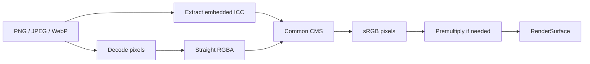

# Issue #4569 — consistent color-profile handling across image loaders

- 링크: https://github.com/thorvg/thorvg/issues/4569
- 상태: Open, umbrella issue (2026-07-19 확인)
- 분석 기준: `main` @ [`6d5933c`](https://github.com/thorvg/thorvg/commit/6d5933c9d1aca94635c6ad8129f3530ae554d423)
- 난이도: 90/100
- 초심자 추천: 비추천 — 하위 이슈로 분해한 fixture/adapter 일부만 추천
- 관련 영역: static/external PNG·JPEG·WebP, ICC, CMS, Meson, alpha 처리
- 배울 수 있는 것: ICC profile, format metadata, 공통 loader abstraction, optional dependency 설계

## 난이도 산정

| 요소 | 점수 | 근거 |
|---|---:|---|
| 재현·증거 불확실성 | 13/20 | 누락은 확인되나 목표 profile 수준, fallback, 실제 사용 수요가 미정이다 |
| 변경 범위 | 25/25 | 6개 decoder path, 공통 계층, build, 문서, test가 대상이다 |
| 구현 복잡도 | 23/25 | profile 추출·검증·변환·alpha·오류 정책이 필요하다 |
| 교차 영향 위험 | 19/20 | 색 결과, 성능, binary size, embedded/WASM build에 영향을 준다 |
| 검증 부담 | 10/10 | 형식·profile·static/external 전체 golden corpus가 필요하다 |
| **합계** | **90/100** | 이미지 decoder 전반의 출력 색 계약을 새로 세우는 umbrella 과제다 |

- 실현 가능성: **중간** — 단계별 구현은 가능하지만 하나의 PR/초심자 과제로 끝낼 범위가 아니다.

## 이슈 요약

PNG, JPEG, WebP의 embedded color profile을 static loader와 external library loader에서 일관되게 처리하자는 이슈다. 단순히 ICC byte를 읽는 것으로 끝나지 않고, 모든 loader가 같은 목표 색공간의 pixel을 반환하도록 공통 계약·CMS·build option·golden test가 필요하다.

이슈가 언급한 static PNG iCCP 작업은 관련 [PR #4568](https://github.com/thorvg/thorvg/pull/4568)에 있으나 분석 기준 main에는 아직 없다. 현재 main을 이미 color-managed 상태로 가정하면 범위를 잘못 산정하게 된다.

## main 코드 조사

[`src/loaders/meson.build`](https://github.com/thorvg/thorvg/blob/6d5933c9d1aca94635c6ad8129f3530ae554d423/src/loaders/meson.build#L1)는 `static=true`면 내장 decoder를, 아니면 external library를 먼저 선택하고 찾지 못하면 내장 decoder로 fallback한다.

```meson
if png_loader
    if get_option('static')
        subdir('png')
    else
        subdir('external_png')
        if not png_dep.found()
            subdir('png')
        endif
    endif
endif
```

동일 구조가 JPEG/WebP에도 있어 실제로 6개 경로를 감사해야 한다.

- static PNG의 [`LodePNGInfo`](https://github.com/thorvg/thorvg/blob/6d5933c9d1aca94635c6ad8129f3530ae554d423/src/loaders/png/tvgLodePng.h#L130)는 profile/chromaticity/gamma field가 없고 ancillary iCCP를 보존하지 않는다.
- external PNG는 simplified `png_image_*` decode만 사용하며 profile 변환 경계가 없다.
- static JPEG는 APP marker의 ICC 조각을 조립하지 않고, external TurboJPEG도 decode만 수행한다.
- static WebP decoder는 `ICCP_FLAG`를 인식하지만 metadata를 surface까지 전달하지 않고, external WebP도 ICCP 추출 계층이 없다.
- ThorVG [`ColorSpace`](https://github.com/thorvg/thorvg/blob/6d5933c9d1aca94635c6ad8129f3530ae554d423/inc/thorvg.h#L100)는 채널 순서와 alpha premultiplication을 나타낼 뿐 ICC 색공간을 표현하지 않는다.
- `meson_options.txt`에는 공통 CMS enable/disable option이 없다.



## 원인 가설

format별 decoder가 profile metadata를 버리고 공통 color-management 경계가 없는 것이 static/external loader의 색 불일치 원인이라는 가설이다. 가장 작은 공통 계약은 “각 decoder가 embedded profile을 해석해 sRGB pixel을 반환한다”이다. profile object를 renderer까지 운반하는 대안은 현재 `RenderSurface`/`ColorSpace` 계약과 public API까지 크게 넓어진다.

alpha 순서도 중요하다. CMS는 일반적으로 straight RGB에 적용하므로 WebP처럼 premultiplied output을 요청하는 경로는 `straight decode → color transform → premultiply` 순서를 보장해야 한다. 무조건 unpremultiply하면 alpha 0/저alpha에서 정밀도와 halo 문제가 생길 수 있다.

## 수정 방향 계획

1. 목표 색공간, no-profile fallback, malformed profile 정책과 golden corpus 정의
2. optional CMS와 Meson `cms=true/false` 성격의 build integration
3. static/external PNG profile extraction adapter
4. static/external JPEG APP2 ICC profile 조립 adapter
5. static/external WebP ICCP extraction adapter
6. alpha 순서, 성능, binary size, WASM/embedded 검증

## 초심자 시작 가이드

전체 CMS architecture 대신 단일 format의 metadata fixture부터 맡는 것이 안전하다.

1. embedded ICC가 있는 작은 PNG와 같은 pixel의 no-profile PNG를 준비하고, profile 종류·byte 길이·hash를 기대값으로 기록한다.
2. static/external loader 각각에서 “profile 발견 여부”와 decoded straight RGBA를 renderer 진입 전에 관찰하는 test 경계를 찾는다.
3. 두 loader가 같은 profile metadata를 공통 adapter에 넘긴다는 실패 test를 먼저 만든다. 이 단계에서는 색 변환 구현까지 넓히지 않는다.
4. 이후 trusted CMS로 만든 sRGB golden과 opaque/반투명 pixel을 비교해 transform 단계의 별도 하위 이슈로 넘긴다.

전체 CMS architecture는 초심자 과제로 적합하지 않다.

## 위험/검증

- no profile, valid sRGB/v2/v4 profile, malformed/truncated profile fixture를 format별로 둔다.
- static/external loader가 같은 decoded pixel tolerance를 만족하는지 비교한다.
- opaque, 반투명 edge, alpha 0 pixel로 transform/premultiply 순서의 halo를 검사한다.
- CMS on/off fallback과 error 정책을 확인한다.
- native, static, WASM/embedded build와 binary size, decode time, memory를 측정한다.
- profile parsing은 untrusted input이므로 size/decompression limit와 malformed-data test가 필요하다.

## 참고 자료

- [Issue #4569](https://github.com/thorvg/thorvg/issues/4569)
- [관련 static PNG PR #4568](https://github.com/thorvg/thorvg/pull/4568)
- [PNG 3 specification — iCCP](https://www.w3.org/TR/png-3/#11iCCP)
- [WebP container — ICC profile](https://developers.google.com/speed/webp/docs/riff_container#color_profile)
- [ICC.1 v4 specification](https://www.color.org/icc_specs2.xalter)
- [Little CMS](https://www.littlecms.com/)
- [ThorVG loader selection](https://github.com/thorvg/thorvg/blob/6d5933c9d1aca94635c6ad8129f3530ae554d423/src/loaders/meson.build#L1)
