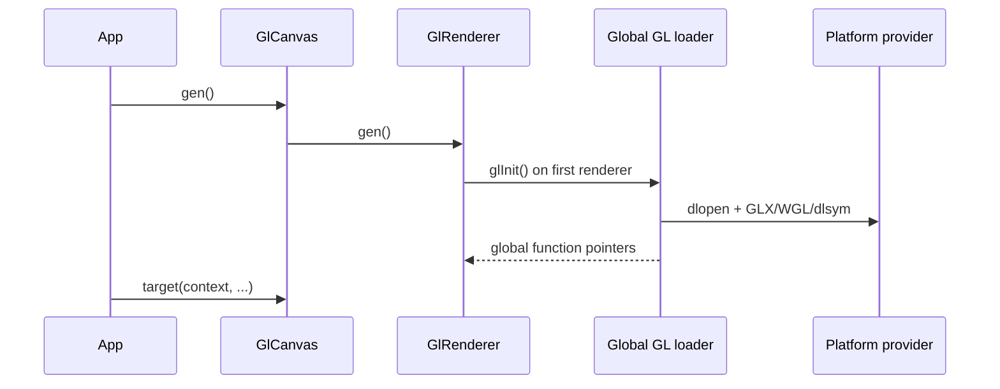

# Issue #4574 — custom GL GetProcAddress for `GlCanvas::gen()`

- 링크: https://github.com/thorvg/thorvg/issues/4574
- 상태: Open (2026-07-19 확인)
- 분석 기준: `main` @ [`6d5933c`](https://github.com/thorvg/thorvg/commit/6d5933c9d1aca94635c6ad8129f3530ae554d423)
- 난이도: 81/100
- 초심자 추천: 비추천
- 관련 영역: public C++/C API, global GL loader, context/lifetime, GLX/EGL/WGL/Wayland
- 배울 수 있는 것: proc-address loading, ABI 유지, context ownership, process-global state

## 난이도 산정

| 요소 | 점수 | 근거 |
|---|---:|---|
| 재현·증거 불확실성 | 10/20 | 현재 platform 결합은 확인되지만 지원할 context/provider 계약과 재현 환경은 미정이다 |
| 변경 범위 | 20/25 | C++/C API, renderer, loader, platform context code가 대상이다 |
| 구현 복잡도 | 21/25 | resolver 전달뿐 아니라 global function table과 혼용 정책이 핵심이다 |
| 교차 영향 위험 | 20/20 | ABI, 다중 canvas/context, WGL/GLX/EGL/WebGL 전부에 영향이 간다 |
| 검증 부담 | 10/10 | 플랫폼별 custom/default loader와 lifetime 검증이 필요하다 |
| **합계** | **81/100** | 작은 overload 요청 뒤에 전역 GL loader의 소유권 재설계가 숨어 있다 |

- 실현 가능성: **중간** — 기존 API를 유지한 overload는 가능하지만 resolver lifetime·혼용·platform ABI 정책이 먼저 필요하다.

## 이슈 요약

애플리케이션이 사용하는 GL/EGL provider에서 직접 function address를 구해 ThorVG에 전달할 수 있도록 `GlCanvas::gen()`에 custom resolver를 추가하자는 이슈다. EGL/Wayland, custom loader, host engine과 ThorVG가 서로 다른 GL symbol provider를 선택하는 환경에서 유용하다.

다만 Wayland 자체는 GL proc-address API를 정의하지 않는다. EGL context를 쓰는 Wayland 앱에서는 `eglGetProcAddress()`가 자연스럽지만, 현재 GLX 경로가 모든 환경에서 반드시 실패한다고 재현 없이 단정해서는 안 된다.

## main 코드 조사

현재 [`GlCanvas::gen()`](https://github.com/thorvg/thorvg/blob/6d5933c9d1aca94635c6ad8129f3530ae554d423/src/renderer/tvgCanvas.cpp#L192)은 [`GlRenderer::gen()`](https://github.com/thorvg/thorvg/blob/6d5933c9d1aca94635c6ad8129f3530ae554d423/src/renderer/gpu_engine/gl/tvgGlRenderer.cpp#L1448)을 부르고, 첫 renderer에서 process-global [`glInit()`](https://github.com/thorvg/thorvg/blob/6d5933c9d1aca94635c6ad8129f3530ae554d423/src/renderer/gpu_engine/gl/tvgGl.cpp#L501)을 한 번 실행한다.

```cpp
// 현재 renderer 생성 시점의 전역 초기화
if (_rendererCnt == -1) {
    if (!glInit()) return nullptr;
    _rendererCnt = 0;
}
++_rendererCnt;
```

`target(context, ...)`보다 `gen()`이 먼저 loader와 GL query를 실행하므로 생성 시점에 호환되는 current context가 필요하다.



플랫폼별 현재 선택은 다음과 같다.

- Windows desktop GL: `opengl32.dll` + `wglGetProcAddress`
- Linux desktop GL: `libGL` + `glXGetProcAddress`
- Linux/Windows GLES: `libGLESv2` symbol lookup, context helper는 EGL
- macOS: OpenGL framework `dlsym`
- Emscripten: 별도 dynamic loading 없음

## 원인 가설

ThorVG가 platform별 loader를 `gen()` 시점에 고정하고 GL function pointer 표를 process-global로 공유하는 것이 host의 EGL/Wayland 또는 custom provider와 결합하기 어려운 원인이다. overload만 추가하면 동일 GL 초기화 생명주기 동안 “첫 resolver가 승리”한다. 두 canvas가 다른 provider/resolver를 요청할 때 다음 중 하나를 명확히 골라야 한다.

1. process당 resolver 하나만 허용하고 다른 resolver는 오류로 거부
2. 모든 renderer가 동일 resolver/provider를 공유한다고 API에 명시
3. function table을 renderer/context별로 소유하도록 큰 구조 변경

callback 자체는 eager `gen()` 동안만 호출할 수 있어도, 반환된 function address가 속한 library/provider와 context의 호환성은 canvas 수명 동안 유지돼야 한다. custom 경로에서 ThorVG가 사용자 소유 library를 `dlclose()`해서도 안 된다.

## 수정 방향 계획

기존 함수를 바꾸지 않고 overload와 별도 C 함수를 추가해야 source/ABI 호환을 지킬 수 있다. 아래는 **설계 논의용 의사 API**다.

```cpp
using GlProcResolver = GlProc (*)(const char* name, void* data);

static GlCanvas* gen(EngineOption op = EngineOption::Default) noexcept;
static GlCanvas* gen(GlProcResolver resolver, void* data,
                     EngineOption op = EngineOption::Default) noexcept;
```

C API도 기존 `tvg_glcanvas_create()` signature를 바꾸지 말고 `tvg_glcanvas_create_with_resolver()` 같은 별도 entry point가 안전하다. 실제 `GlProc` 표현은 WGL/GLX/EGL의 function-pointer ABI를 검토해 정해야 한다.

## 초심자 시작 가이드

구현보다 먼저 다음 표를 작성해야 한다.

| case | 누가 context를 생성? | resolver | function table 소유자 | library lifetime |
|---|---|---|---|---|
| default GLX/WGL | ThorVG/host 계약 확인 | 내부 | 전역 | ThorVG |
| EGL/Wayland | host | custom EGL | 전역 또는 renderer | host |
| 두 canvas, 같은 provider | host | 동일 | 정책 결정 | host |
| 두 canvas, 다른 provider | host | 서로 다름 | 지원/거부 결정 | 각 host |

이 표 없이 callback parameter만 연결하면 다중 canvas에서 재현하기 어려운 crash가 생길 수 있다.

## 위험/검증

- default와 custom resolver가 동일한 필수 symbol 집합을 채우는지 확인한다.
- null resolver, 누락 symbol, callback failure에서 깨끗하게 `nullptr`를 반환한다.
- callback/user-data 호출 횟수와 사용 수명을 확인한다.
- 같은 resolver를 쓰는 두 canvas와 다른 resolver를 요청하는 두 canvas를 모두 시험한다.
- canvas destroy 후 재초기화와 provider library lifetime을 검사한다.
- WGL, GLX/X11, EGL/Wayland desktop GL, GLES/EGL, macOS, Emscripten build/run을 포함한다.
- C++와 C API의 source/ABI 회귀를 별도 확인한다.

## 참고 자료

- [Issue #4574](https://github.com/thorvg/thorvg/issues/4574)
- [GlCanvas public API](https://github.com/thorvg/thorvg/blob/6d5933c9d1aca94635c6ad8129f3530ae554d423/inc/thorvg.h#L2382)
- [ThorVG platform GL loader](https://github.com/thorvg/thorvg/blob/6d5933c9d1aca94635c6ad8129f3530ae554d423/src/renderer/gpu_engine/gl/tvgGl.cpp#L45)
- [GLX_ARB_get_proc_address](https://registry.khronos.org/OpenGL/extensions/ARB/GLX_ARB_get_proc_address.txt)
- [EGL `eglGetProcAddress`](https://registry.khronos.org/EGL/sdk/docs/man/html/eglGetProcAddress.xhtml)
- [EGL 1.5 specification](https://registry.khronos.org/EGL/specs/eglspec.1.5.pdf)
- [WGL `wglGetProcAddress`](https://learn.microsoft.com/en-us/windows/win32/api/wingdi/nf-wingdi-wglgetprocaddress)
- [EGL_EXT_platform_wayland](https://registry.khronos.org/EGL/extensions/EXT/EGL_EXT_platform_wayland.txt)
