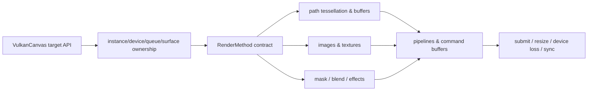

# #474 — Create Vulkan renderer

- Link: https://github.com/thorvg/thorvg/issues/474
- 난이도: 94/100
- 실현 가능성: 낮음
- 초심자 추천: 비추천
- 분석 기준: `main` working tree `f989b27892ba`
- 관련 영역: GPU renderer backend, public Canvas API, Vulkan resource/synchronization
- 배울 수 있는 것: `RenderMethod` 추상화, tessellation, shader/pipeline, GPU 자원 수명과 동기화

## 이슈 요약

OpenGL 외에 Vulkan renderer를 추가하자는 backend 신설 요청이다. current main에는 CPU, GL, WebGPU 엔진이 있고 Vulkan 전용 Canvas나 renderer는 없다. 새 backend는 surface 하나를 만드는 수준이 아니라 public target API, geometry, shaders, masks/composition, blend/effect, partial rendering, Meson과 플랫폼 수명 주기를 모두 구현해야 한다.

## 난이도 산정

| 항목 | 점수 | 근거 |
|---|---:|---|
| 재현·증거 불확실성 (0-20) | 14 | 버그가 아니라 기능 제안이며 지원 플랫폼·Vulkan 버전·API ownership 명세가 없다. |
| 변경 범위 (0-25) | 25 | public API부터 renderer 전체, shader, build, test와 examples까지 새로 필요하다. |
| 구현 복잡도 (0-25) | 25 | command buffer, descriptor, pipeline, synchronization, tessellation과 composition을 연결해야 한다. |
| 교차 영향 위험 (0-20) | 20 | API/ABI, GPU lifetime, optional backend build와 여러 플랫폼에 영향을 준다. |
| 검증 부담 (0-10) | 10 | 다중 OS/GPU vendor의 validation layer와 backend pixel comparison이 필요하다. |
| **합계** | **94** | **개별 기여가 아니라 독립 backend 프로젝트 규모다.** |

## main 코드 조사

### 확인된 사실

- [`inc/thorvg.h`](https://github.com/thorvg/thorvg/blob/f989b27892bab31f224f810a54782055eba1e3bc/inc/thorvg.h)의 공개 Canvas는 `SwCanvas`, `GlCanvas`, `WgCanvas`이며 `VulkanCanvas`는 없다.
- [`tvgRender.h`](https://github.com/thorvg/thorvg/blob/f989b27892bab31f224f810a54782055eba1e3bc/src/renderer/tvgRender.h)의 `RenderMethod`는 shape/image prepare, render, compositor, mask, blend, effect, damage와 sync를 모두 pure virtual contract로 요구한다.
- [`gpu_engine/gl`](https://github.com/thorvg/thorvg/tree/f989b27892bab31f224f810a54782055eba1e3bc/src/renderer/gpu_engine/gl)과 [`gpu_engine/wg`](https://github.com/thorvg/thorvg/tree/f989b27892bab31f224f810a54782055eba1e3bc/src/renderer/gpu_engine/wg)는 context, geometry, shader, render target, texture와 renderer를 각각 독립 구현한다.
- [`tvgCanvas.cpp`](https://github.com/thorvg/thorvg/blob/f989b27892bab31f224f810a54782055eba1e3bc/src/renderer/tvgCanvas.cpp)는 backend compile guard별 `gen()`, target과 renderer ref-count/lifetime을 연결한다.
- source/Meson 검색상 Vulkan source, compile option, public type은 없다.

새 backend가 통과해야 할 경계는 다음과 같다.

### 아직 가설인 부분

- **가설 A:** 현대 GPU resource model 관점에서는 GL보다 WG backend가 더 가까운 설계 참고가 될 수 있다. 그러나 Vulkan API의 직접 ownership과 swapchain은 WebGPU wrapper와 다르다.
- **가설 B:** 외부에서 생성한 Vulkan device/surface를 받는 target API가 ThorVG의 기존 GPU Canvas 관례와 맞을 가능성이 높다. 실제 public signature는 ABI 검토와 maintainer 합의 전에는 정할 수 없다.
- **가설 C:** 단색 shape vertical slice는 가능하지만 기존 mask/blend/effect feature matrix를 만족하기 전에는 정식 backend로 간주하기 어렵다.

## 수정 방향과 실현 가능성

1. 지원 OS, 최소 Vulkan version, 외부/내부 context ownership, swapchain 책임을 문서로 먼저 확정한다.
2. backend-disabled build와 public API ABI 검토를 포함한 `VulkanCanvas` skeleton을 설계한다.
3. clear → 단색 triangle → 단색 tessellated Shape의 vertical slice를 validation layer 오류 없이 만든다.
4. image/gradient → clip/mask → blend/composition → effects → partial rendering 순서의 feature matrix를 채운다.
5. CPU reference image와 GL/WG/Vulkan 출력을 같은 scene으로 비교하고 vendor matrix를 운영한다.

**판정:** 설계·구현·검증이 여러 달 규모가 될 수 있다. 초심자는 backend scaffold의 문서/테스트 보조는 가능하지만 이슈 ownership은 현실적이지 않다.

## backend 비교

| 항목 | GL | WG | 새 Vulkan에서 필요한 것 |
|---|---|---|---|
| target | display/surface/context/FBO | instance/adapter/device + surface/texture | instance/device/queue/surface/swapchain 책임 정의 |
| 명령 모델 | GL state + draw call | command encoder/pass | command pool/buffer + submit/fence |
| resource binding | uniform/texture binding | bind group/pipeline | descriptor set/layout/pipeline |
| 동기화 | context 중심의 암시적 요소 | WebGPU validation model | barrier, semaphore, fence와 queue ownership |
| ThorVG contract | 구현 완료 | 실험적 구현 | `RenderMethod` 전 메서드 구현 필요 |

## 참고 자료

- [이슈 #474](https://github.com/thorvg/thorvg/issues/474)
- [`inc/thorvg.h`](https://github.com/thorvg/thorvg/blob/f989b27892bab31f224f810a54782055eba1e3bc/inc/thorvg.h)
- [`src/renderer/tvgRender.h`](https://github.com/thorvg/thorvg/blob/f989b27892bab31f224f810a54782055eba1e3bc/src/renderer/tvgRender.h)
- [`src/renderer/tvgCanvas.cpp`](https://github.com/thorvg/thorvg/blob/f989b27892bab31f224f810a54782055eba1e3bc/src/renderer/tvgCanvas.cpp)
- [`src/renderer/gpu_engine/gl/`](https://github.com/thorvg/thorvg/tree/f989b27892bab31f224f810a54782055eba1e3bc/src/renderer/gpu_engine/gl)
- [`src/renderer/gpu_engine/wg/`](https://github.com/thorvg/thorvg/tree/f989b27892bab31f224f810a54782055eba1e3bc/src/renderer/gpu_engine/wg)
- [`meson_options.txt`](https://github.com/thorvg/thorvg/blob/f989b27892bab31f224f810a54782055eba1e3bc/meson_options.txt)
