import PdfSlides from '../../../components/PdfSlides.astro';

# Core2026 - 3

## 1. 발표 자료 공유 및 개요

> [!NOTE]
> OSSCA 2026 ThorVG C++ 세미나 공유 자료를 풀어쓴 내용입니다.
>
> ThorVG v1.1의 C++ 사용 방식을 개인적으로 분석한 것이며,
>
> 기초적인 부분을 키워드 단위로 소개하는 것이 목표입니다.

<PdfSlides
  src="blog-assets/Mentoring/CPP/motion-slide-export.pdf"
  title="ThorVG C++ 발표 자료"
/>

### 1.1 ThorVG와 C++

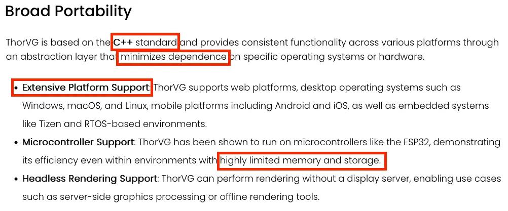

- ThorVG는 벡터 그래픽을 처리하는 경량 렌더링 엔진

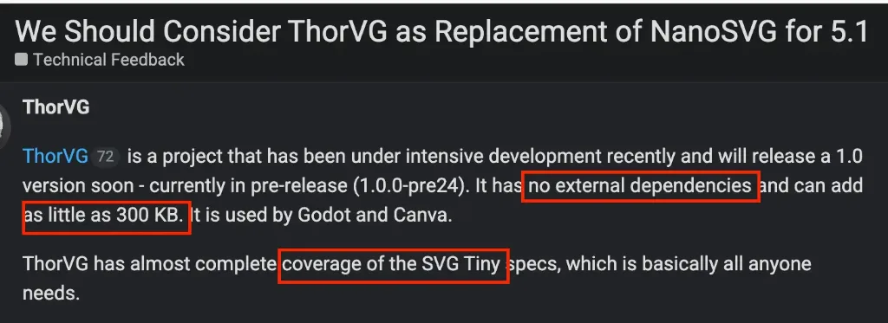

- ThorVG의 최소화된 의존성과 경량성은 라이브러리 선택의 기준

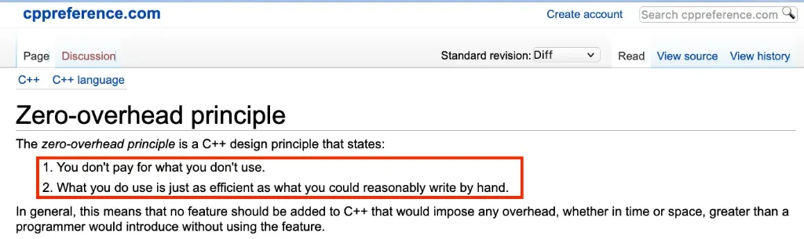

- [C++ zero-overhead 설계 원칙](https://en.cppreference.com/cpp/language/Zero-overhead_principle)
  - 사용하지 않는 것에는 비용을 지불 x


ThorVG는 필요한 모듈만 골라 빌드할 수 있으며, 사용하지 않는 기능은 컴파일 단계에서 제외됩니다.
덕분에 불필요한 비용을 줄일 수 있어 C++의 zero-overhead 원칙과도 잘 맞습니다.

<details className="guide-details">
<summary>2. Build: Meson과 Module</summary>

## 2. Build: Meson과 Module

### 2.1 ThorVG의 모듈 구성

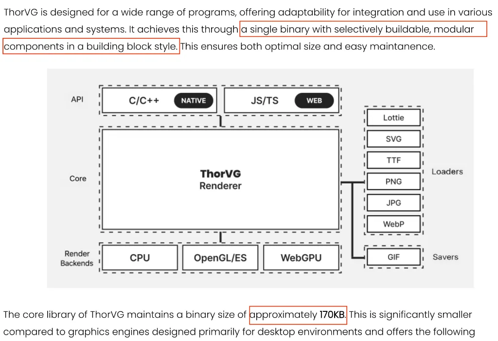

- **선택적으로 빌드할 수 있는 모듈형 구조**
  - API, 렌더 백엔드, 로더와 세이버를 빌딩 블록처럼 조합
  - 필요한 구성 요소만 하나의 바이너리에 포함하고, 선택하지 않은 모듈은 컴파일 대상에서 제외
- **작은 바이너리 크기**
  - ThorVG 코어 라이브러리의 바이너리 크기는 KB 단위로, 제한된 환경에도 가볍게 통합

### 2.2 Meson 옵션으로 모듈 선택하기

```python
# source/thorvg/meson_options.txt
option(
  'engines',
  type: 'array',
  choices: ['cpu', 'gl', 'wg', 'all'],
  value: ['cpu'],
)

# source/thorvg/src/renderer/meson.build
if cpu_engine
  subdir('cpu_engine')
endif

if gl_engine or wg_engine
  subdir('gpu_engine')
endif
```
-  **subdir** -> 하위 디렉터리만 빌드에 포함

```python
# source/thorvg/meson_options.txt
option(
  'loaders',
  type: 'array',
  choices: [
    '', 'svg', 'png', 'jpg', 'lottie',
    'ttf', 'otf', 'webp', 'all',
  ],
  value: ['svg', 'lottie', 'ttf'],
)

# source/thorvg/src/loaders/meson.build
if png_loader
  if get_option('static')
    subdir('png')
  else
    subdir('external_png')
  endif
endif
```

- `loaders` 옵션:
  - 필요한 포멧만 선택
  - 로더는 빌드 방식에 따라 내장 구현(**static**) 또는 외부 라이브러리(**external**) 구현을 선택
    - **static**: ThorVG 내부 구현을 사용
    - **external**: libpng, libjpeg 같은 외부 라이브러리를 사용 -> 동적 링크로 바이너리 사이즈를 더 줄일 가능성

### 2.3 Meson 옵션에서 `config.h`까지

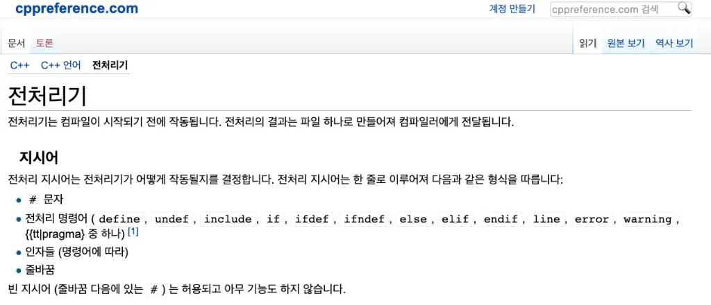

- meson 옵션 -> 전처리기를 통해 thorvg 소스 코드를 선택적으로 빌드

```python
# source/thorvg/meson.build
if all_engines or 'cpu' in engines
  config_h.set10('THORVG_SW_RASTER_SUPPORT', true)
endif
```

- `config_h.set` 함수를 통해 `config.h`에 포함되어질 매크로를 지정
- `config.h` 는 자동 생성되며 소스 코드에서 포함되어 사용

```cpp
/*
 * Autogenerated by the Meson build system.
 * Do not edit, your changes will be lost.
 */
#pragma once

#define THORVG_CPU_ENGINE_SUPPORT 1
#define THORVG_FILE_IO_SUPPORT 1
#define THORVG_GL_ENGINE_SUPPORT 1
#define THORVG_JPG_LOADER_SUPPORT 1
#define THORVG_LOTTIE_EXPRESSIONS_SUPPORT 1
#define THORVG_LOTTIE_LOADER_SUPPORT 1
#define THORVG_OPENMP_SUPPORT 1
#define THORVG_OTF_LOADER_SUPPORT 1
#define THORVG_PARTIAL_RENDER_SUPPORT 1
#define THORVG_PNG_LOADER_SUPPORT 1
#define THORVG_SFNT_LOADER_SUPPORT 1
#define THORVG_SVG_LOADER_SUPPORT 1
#define THORVG_THREAD_SUPPORT 1


/*
 * 생성된 config.h를 포함한 소스 코드
 */
#ifdef THORVG_SW_RASTER_SUPPORT
// Software rasterizer implementation
#endif
```

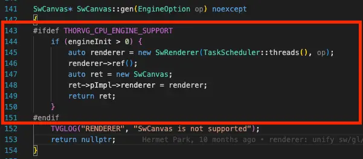

- 전처리기는 `#ifdef` 조건에 맞지 않는 코드를 컴파일러 입력에서 제외
- **결과:**
  - 사용하지 않는 엔진 코드가 컴파일되지 x
  - 사용하지 않는 로더 코드가 링크되지 x
  - 바이너리 크기와 의존성 감소 O


### 2.4 전처리, 컴파일, 링크

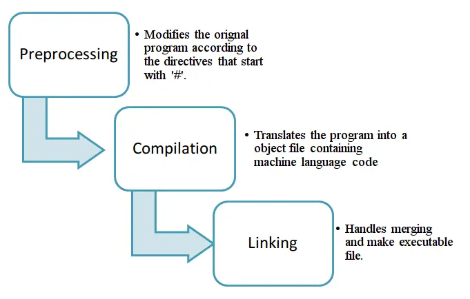

Meson은 이 과정에 앞서 빌드 옵션을 해석하고, 
컴파일할 소스와 의존성을 결정한 뒤 `config.h`를 생성합니다. 


이후 선택된 소스 코드는 다음 단계를 거쳐 바이너리로 변환됩니다.

- **Preprocessing(전처리)**
  - 전처리기가 `#include`로 헤더를 포함하고 매크로를 치환하며, `#if`와 `#ifdef` 같은 조건부 컴파일 지시문을 처리
  - ThorVG에서는 `config.h`에 정의된 기능 매크로를 기준으로 비활성화된 코드 블록이 제거된다. 제거된 코드는 컴파일러에 전달되지 X
- **Compilation(컴파일)**
  - 컴파일러가 전처리된 각 번역 단위를 분석하고 기계어가 담긴 오브젝트 파일로 변환
  - Meson이 빌드 대상에서 제외한 엔진이나 로더의 소스 파일은 이 단계에 들어오지 않으므로 오브젝트 파일도 생성되지 X
- **Linking(링크)**
  - 링커가 오브젝트 파일과 필요한 라이브러리의 심볼을 연결하여 실행 파일이나 공유 라이브러리를 생성
  - 앞 단계에서 제외된 기능은 연결할 오브젝트 코드가 없으므로 최종 바이너리에도 포함되지 않는다. 정적 라이브러리는 링커 대신 아카이버가 오브젝트 파일을 묶어 생성

> [이미지 출처](https://isocpp.org/blog/2013/11/compiling-and-linking)

</details>

<details className="guide-details">
<summary>3. Build: Shared와 Static Library</summary>

## 3. Build: Shared와 Static Library

### 3.1 Shared Library와 Static Library

| Shared Library | Static Library |
| --- | --- |
| <br />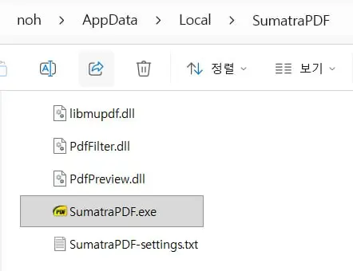 | 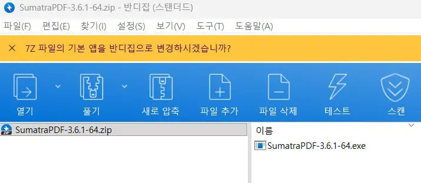 |
| **FFmpeg 배포 사례**<br />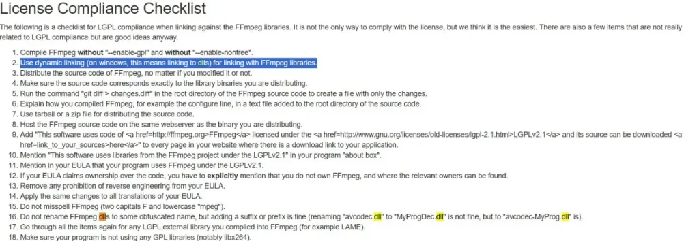 | **Godot 단일 실행 파일 사례**<br />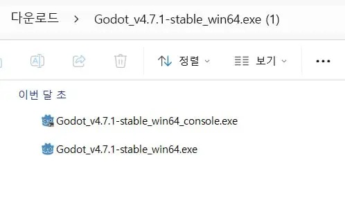 <br/>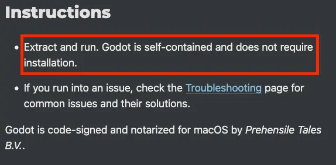 |

- **Shared Library**:
  - Linux: `.so`, macOS: `.dylib`, Windows: `.dll`
    - 실행 시 동적 로더가 심볼을 해석
    - 여러 프로세스가 라이브러리 코드를 공유
    - ABI가 호환되면 실행 파일을 다시 링크하지 않고 라이브러리만 교체
    - 배포 시 라이브러리 파일과 검색 경로를 함께 관리

- **Static Library**:
  - Unix 계열: `.a`, Windows: `.lib`
    - 링크 시 필요한 코드가 최종 실행 파일에 포함
    - 단일 실행 파일로 배포하기 쉬움
    - 실행 파일 크기가 커짐
    - 여러 실행 파일이 같은 코드를 각각 포함

- 선택 기준:
  - 독립적인 단일 바이너리 -> Static Library 검토
  - 업데이트, 코드 공유, 플러그인 구조 -> Shared Library 검토

### 3.2 `default_library` 옵션

```meson
lib_type = get_option('default_library')

if lib_type == 'shared'
  compiler_flags += ['-DTVG_EXPORT', '-DTVG_BUILD']
else
  compiler_flags += ['-DTVG_STATIC']
endif
```

- Meson의 `default_library` 값으로 Shared 또는 Static 선택
- Shared 빌드:
  - 외부에 공개할 심볼을 구분
  - `TVG_EXPORT`, `TVG_BUILD` 같은 매크로를 설정
- Static 빌드:
  - DLL export/import 처리가 필요하지 X
  - `TVG_STATIC` 매크로를 설정 O

### 3.3 `pkg-config`로 예제 연결하기

```bash
# 생산자: ThorVG 설치
meson install -C builddir

# 설치 결과 예시
# $PREFIX/lib/pkgconfig/thorvg-1.pc

# 소비자: pkg-config 검색 경로 지정
PKG_CONFIG_PATH="$PREFIX/lib/pkgconfig" \
  meson setup build-demo
```

```meson
# source/thorvg.example/src/meson.build
thorvg_dep = dependency('thorvg-1')
```

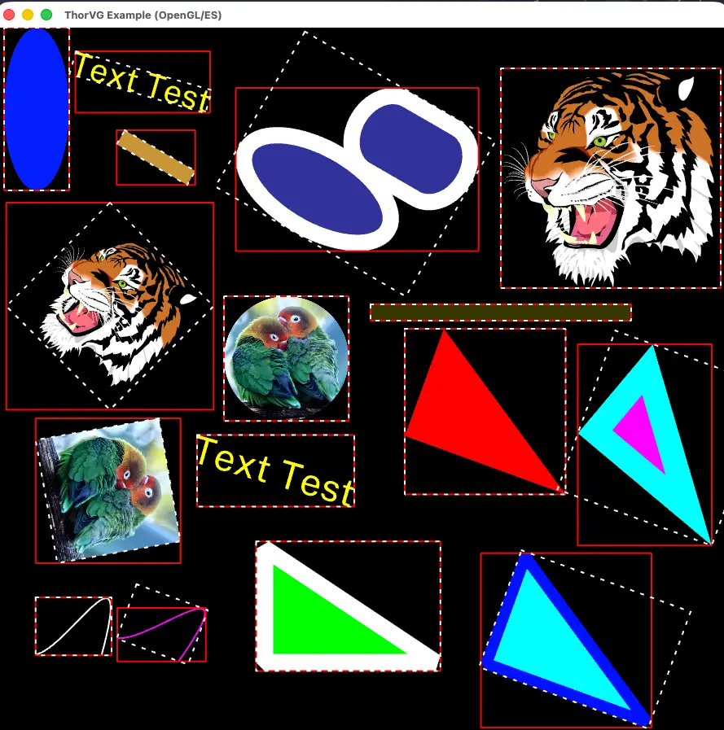

- 예제 프로젝트 연결 과정:
  - `PKG_CONFIG_PATH`에 `thorvg-1.pc`가 있는 경로 등록
  - Meson의 `dependency('thorvg-1')`로 ThorVG 탐색

- Shared Library
  - ThorVG만 다시 빌드하고 설치
  - 예제 애플리케이션을 다시 빌드하지 않고 새 라이브러리로 실행

</details>

<details className="guide-details">
<summary>4. Build: C API와 ABI</summary>

## 4. Build: C API와 ABI

### 4.1 API와 ABI

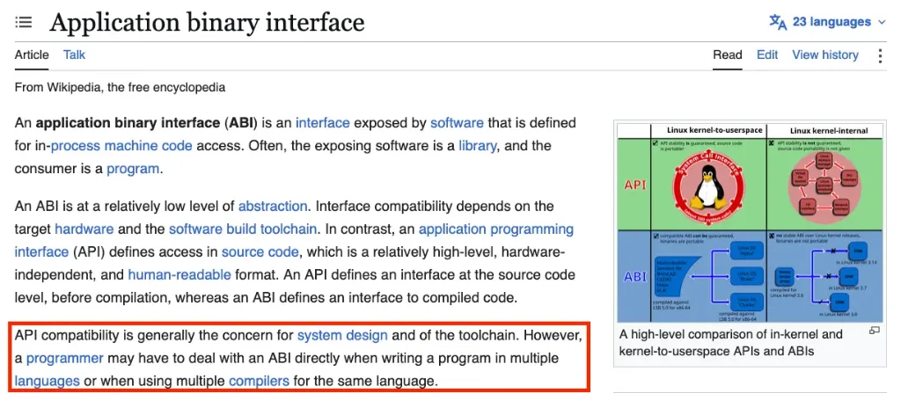

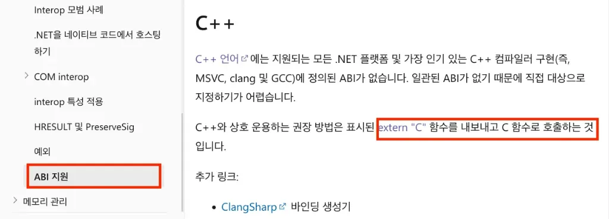

- API(Application Programming Interface):
  - 헤더에 선언된 함수, 타입, 상수의 사용 규약
- ABI(Application Binary Interface):
  - 호출 규약, 심볼 이름을 정의
    - 타입의 크기와 메모리 배치를 정의
    - 레지스터와 스택을 통한 인자 전달 방식을 정의
  - 서로 다른 언어의 API 문법은 호환되지 않아도 ABI를 사용하면 연동 가능


> Wikipedia: [API](https://en.wikipedia.org/wiki/Application_programming_interface), [ABI](https://en.wikipedia.org/wiki/Application_binary_interface),


### 4.2 C++ 이름 맹글링과 `extern "C"`

```bash
nm libthorvg.so | grep gen
# _ZN3tvg5Shape3genEv

c++filt _ZN3tvg5Shape3genEv
# tvg::Shape::gen()
```

```cpp
// bindings/capi/tvgCapi.cpp
extern "C" {

TVG_API Tvg_Result tvg_engine_init(unsigned threads)
{
    return static_cast<Tvg_Result>(
        Initializer::init(threads)
    );
}

}
```

- 맹글링: C++ 컴파일러는 다음 정보를 심볼 이름에 인코딩
  - 네임스페이스
  - 클래스
  - 함수 이름
  - 매개변수 타입
  - 오버로딩 정보
- 맹글링 규칙은 ABI와 컴파일러에 따라 달라질 수 있다.

- `extern "C"`:
  - 선언에 C 언어 링크 규약을 적용
  - C++ 맹글링 비활성화
  - 다른 언어의 FFI가 고정된 C 심볼 이름으로 함수를 검색 가능하게

> Microsoft Learn: [C API와 ABI 경계의 이식성](https://learn.microsoft.com/en-us/cpp/cpp/portability-at-abi-boundaries-modern-cpp?view=msvc-170)

### 4.3 ThorVG 바인딩 사례

- C API 직접 호출:
  - C# / Unity
    - P/Invoke의 `DllImport`로 `tvg_*` 함수를 선언
    - 사례: `thorvg/thorvg.unity`
  - Swift / Apple 플랫폼
    - C interop으로 `tvg_engine_init()` 같은 함수를 호출
    - 사례: `thorvg/thorvg.swift`
  - Rust
    - `bindgen`으로 C 헤더의 바인딩을 생성
    - 사례: `LottieFiles/dotlottie-rs`
- C ABI 중간 계층 사용:
  - Dart / Flutter
    - `dart:ffi`와 C++ 중간 계층을 사용
    - 사례: `thorvg/thorvg.flutter`
  - Kotlin / Android
    - JNI의 `external fun`과 C++ 중간 계층을 사용
    - 사례: `thorvg/thorvg.android`
- WebAssembly 바인딩:
  - TypeScript / Web
    - Emscripten `embind`로 C++ API를 노출
    - 사례: `thorvg/thorvg.web`

</details>

<details className="guide-details">
<summary>5. C++: Struct, Class와 Memory Layout</summary>

## 5. C++: Struct, Class와 Memory Layout

### 5.1 `struct`와 `class`

```cpp
struct S {
    int x;  // public
};

class C {
    int x;  // private
};

struct D : S {};  // public inheritance
class E : S {};   // private inheritance

struct TVG_API Paint
{
protected:
    virtual ~Paint();
};
```

- 멤버와 상속의 기본 접근 권한
  - `struct` : `public`
  - `class` : `private`

- ThorVG 공개 API는 `struct`를 주로 사용 필요하면, `protected` 또는 `private`를 명시

### 5.2 여섯 개의 특수 멤버 함수

```cpp
struct T
{
    T();                            // 기본 생성자
    ~T();                           // 소멸자

    T(const T& other);              // 복사 생성자
    T& operator=(const T& other);   // 복사 대입 연산자

    T(T&& other);                   // 이동 생성자
    T& operator=(T&& other);        // 이동 대입 연산자
};
```

- **특수 멤버 함수:** 기본 생성자 · 소멸자 · 복사 생성자 · 복사 대입 연산자 · 이동 생성자 · 이동 대입 연산자
- **복사:** 원본과 복사본이 각각 유효한 상태
- **이동:** 새 객체로 자원 소유권 이전 · 이동된 원본은 유효하지만 상태는 미지정
- **원칙:** Rule of Zero · Rule of Three · Rule of Five
  - 직접 자원을 관리하지 않는 타입은 Rule of Zero를 우선 검토. 소멸자, 복사, 이동 중 하나를 직접 구현해야 한다면 나머지 연산의 동작도 함께 확인

### 5.3 매크로와 pImpl

```cpp
// inc/thorvg.h
#define _TVG_DECLARE_PRIVATE(A) \
protected: \
    A(const A&) = delete; \
    const A& operator=(const A&) = delete; \
    A()

#define _TVG_DECLARE_PRIVATE_BASE(A) \
    _TVG_DECLARE_PRIVATE(A); \
public: \
    struct Impl; \
    Impl* pImpl
```

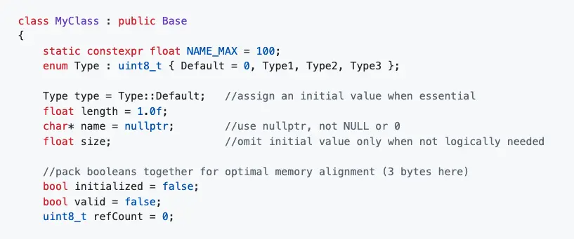

- **선언 제한:** 복사 생성자와 복사 대입 연산자 삭제 · 생성자 접근 범위 제한
- **pImpl 구성:** `Impl` 전방 선언 · `pImpl` 포인터 선언
- **설계 의도:** `gen()`을 통한 객체 생성 · 구현 세부 정보 은닉 · 내부 구현 타입 의존성 제거 · 잘못된 복사와 직접 생성 방지
- **주의 사항:** 선언 탐색의 어려움 · 별도 할당과 포인터 간접 참조 · 구현 복잡도 증가 -> pImpl 은 인테페이스 측면에서만, 엔진 내부에서는 오버엔지니어링

매크로와 pImpl은 공개 API의 경계를 안정적으로 유지하는 데 사용합니다. 추가 비용과 복잡성이 있으므로 엔진 내부 구현에서는 오버엔지니어링을 피하고 있는 것을 확인할 수 있습니다.

### 5.4 `union`으로 저장 공간 공유하기

```cpp
// source/thorvg/src/renderer/tvgRender.h
struct RenderSurface
{
    union {
        pixel_t* data;
        uint32_t* buf32;
        uint8_t* buf8;
    };

    uint32_t stride;
    uint32_t w;
    uint32_t h;
    ColorSpace cs;
    uint8_t channelSize;
};

union {
    SwLinear linear;
    SwRadial radial;
};
```

`union`의 모든 멤버는 같은 저장 공간을 공유합니다. 크기는 가장 큰 멤버의 크기와 정렬 조건에 따라 결정됩니다.

- **버퍼 접근:** 동일한 픽셀 버퍼를 `pixel_t*` · `uint32_t*` · `uint8_t*`로 해석
- **그라디언트 저장:** 선형·방사형 그라디언트 데이터의 저장 공간 -> 상속 등의 표현보다, 타입 확인 -> 적절한 변수 사용
- **별도 관리 정보:** 활성 멤버 태그 · 채널 크기 · 색 공간 또는 그라디언트 타입


### 5.5 멤버 순서, 정렬, 패딩

```cpp
struct A
{
    char c1;    // offset 0:  1 byte + padding 7 bytes
    double d;   // offset 8:  8 bytes
    char c2;    // offset 16: 1 byte + tail padding 7 bytes
};

struct B
{
    double d;   // offset 0: 8 bytes
    char c1;    // offset 8: 1 byte
    char c2;    // offset 9: 1 byte + tail padding 6 bytes
};

// 일반적인 64비트 ABI에서는 다음 결과가 나올 수 있다.
static_assert(sizeof(A) == 24);
static_assert(sizeof(B) == 16);
```

객체의 멤버는 각 타입의 정렬 조건을 충족해야 합니다. 컴파일러는 이를 위해 멤버 사이와 객체 끝에 패딩을 삽입할 수 있으며, 같은 멤버를 가져도 선언 순서에 따라 객체 크기가 달라질 수 있습니다.

- **확인 방법:** `sizeof(T)` · `alignof(T)` · `offsetof(T, member)` · GCC/Clang의 `-Wpadded`

> [데이터 구조 정렬](https://en.wikipedia.org/wiki/Data_structure_alignment)

### 5.6 GPU 메모리 레이아웃

```cpp
// gpu_engine/gl/tvgGlCommon.h
alignas(16) float nStops[4] = {};
alignas(16) float startPos[2] = {};
alignas(8) float stopPos[2] = {};
```

```cpp
// gpu_engine/wg/tvgWgShaderTypes.h
uint8_t _padding[
    256 - sizeof(WgShaderTypeMat4x4f)
] {};

static_assert(sizeof(WgShaderType) == 256);
```

CPU 구조체의 배치와 GPU 셰이더가 기대하는 배치는 일치해야 합니다.

- **확인 대상:** OpenGL uniform buffer의 `std140` · WebGPU 버퍼 오프셋과 구조체 정렬 · 256바이트 단위의 동적 uniform buffer 오프셋 정렬
- **구현 방법:** `alignas`로 정렬 지정 · 패딩 배열 선언 · `static_assert`로 크기 검증

</details>

<details className="guide-details">
<summary>6. C++: Inheritance, Virtual과 Casting</summary>

## 6. C++: Inheritance, Virtual과 Casting

### 6.1 `Paint` 상속 구조

```cpp
struct TVG_API Paint
{
    virtual Type type() const noexcept = 0;

protected:
    virtual ~Paint();
};

struct TVG_API Shape : Paint { /* ... */ };
struct TVG_API Scene : Paint { /* ... */ };
struct TVG_API Picture : Paint { /* ... */ };
struct TVG_API Text : Paint { /* ... */ };
```

- **공개 타입:** `Paint` · `Shape` · `Scene` · `Picture` · `Text`

`Paint`는 추상 기반 타입이며 `type()`은 순수 가상 함수입니다. 소멸자는 `protected` 가상 함수로 선언하여 사용자가 `Paint*`에 직접 `delete`를 호출하지 못하도록 제한합니다.

### 6.2 가상 함수 사용 범위

```cpp
struct TVG_API Paint
{
    Result translate(float x, float y) noexcept;
    Result rotate(float degree) noexcept;
    Result scale(float factor) noexcept;
    Result opacity(uint8_t opacity) noexcept;
    Result clip(Shape* clipper) noexcept;
    Result blend(BlendMethod method) noexcept;

    virtual Type type() const noexcept = 0;

protected:
    virtual ~Paint();
};
```

가상 함수는 파생 타입에서 오버라이드할 수 있으며, 기반 타입의 포인터나 참조로 호출해도 실제 객체 타입의 함수가 실행됩니다.

- **가상 함수:** 타입 식별용 `type()` · 소멸자
- **비가상 함수:** 공개 변환 함수 · 상태 변경 함수

ThorVG의 `Paint`는 가상 함수의 범위를 타입 식별과 소멸에 한정합니다.

### 6.3 타입 태그와 `PAINT_METHOD`

```cpp
// source/thorvg/src/renderer/tvgPaint.cpp
#define PAINT_METHOD(ret, METHOD) \
    switch (paint->type()) { \
        case Type::Shape: \
            ret = to<ShapeImpl>(paint)->METHOD; \
            break; \
        case Type::Scene: \
            ret = to<SceneImpl>(paint)->METHOD; \
            break; \
        case Type::Picture: \
            ret = to<PictureImpl>(paint)->METHOD; \
            break; \
        default: \
            ret = {}; \
            break; \
    }

PAINT_METHOD(ret, render(renderer, flag));
```

`PAINT_METHOD`는 `paint->type()`으로 실제 타입을 확인한 뒤 해당 구현 타입으로 변환하여 비가상 멤버 함수를 호출합니다.

- **구현 타입:** `ShapeImpl` · `SceneImpl` · `PictureImpl` · `TextImpl`
- **적용 함수:** `bounds` · `duplicate` · `render` · `update`
- **장점:** 렌더링 관련 내부 함수 비공개 · 사용자에게 불필요한 구현 세부 정보 은닉 · 잘못된 API 사용 방지

### 6.4 구현 서브클래스

```cpp
// source/thorvg/src/renderer/tvgShape.h
struct ShapeImpl : Shape
{
    Paint::Impl impl;
    RenderShape rs;
    uint8_t opacity;

    bool render(RenderMethod* renderer, /* ... */);
    bool update(RenderMethod* renderer, /* ... */);
    RenderRegion bounds();
    Result fill(Fill* fill);
    void resetPath();
};
```

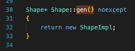

`ShapeImpl`은 `Shape`를 상속하며, `Shape::gen()`이 반환하는 `Shape*`의 실제 객체가 될 수 있습니다.

- **주요 데이터:** `Paint::Impl` · `RenderShape` · opacity · 렌더링과 업데이트에 필요한 내부 상태
- **내부 함수:** 비가상 `render()` · `update()` · `bounds()` · `fill()` · `resetPath()`

### 6.5 `static_cast`

```cpp
// source/thorvg/src/common/tvgAllocator.h
return static_cast<T*>(std::malloc(size));
```

```cpp
switch (paint->type()) {
    case Type::Shape:
        ret = to<ShapeImpl>(paint)->render(renderer, flag);
        break;
    default:
        break;
}
```

`static_cast`는 컴파일러가 정의된 변환 관계를 확인할 수 있을 때 사용합니다.

- **주요 용도:** 정수와 실수 변환 · `void*`와 객체 포인터 변환 · 기반 타입과 파생 타입 간 변환
- **다운캐스트 주의:** 실제 동적 타입 검사 없음 · 잘못된 변환 후 사용 시 정의되지 않은 동작

ThorVG의 `to<T>()`는 `type()` 태그로 실제 타입을 먼저 확인한 뒤 대응하는 구현 타입으로 변환합니다. RTTI의 `dynamic_cast` 대신 명시적인 타입 태그를 사용하는 방식입니다.

### 6.6 `reinterpret_cast`

```cpp
// cpu_engine/tvgSwRle.cpp
cellsMax = reinterpret_cast<SwCell*>(
    reinterpret_cast<char*>(rw.buffer) + rw.bufferSize
);
```

```cpp
// cpu_engine/tvgSwRasterC.h
PIXEL_T* dst;

auto val64 =
    (uint64_t(val) << 32) |
    uint64_t(val);

*reinterpret_cast<uint64_t*>(dst) = val64;
```

`reinterpret_cast`는 포인터나 정수의 비트 표현을 다른 타입으로 해석할 때 사용하며, 타입 간 의미 있는 값 변환은 수행하지 않습니다.

- **ThorVG 사례:** 바이트 단위 오프셋을 이용한 버퍼 끝 주소 계산 · 32비트 픽셀 두 개를 64비트 값으로 기록
- **확인 조건:** 대상 주소의 정렬 · 객체 수명 · strict aliasing 규칙 · 읽기·쓰기 범위 · 대상 CPU의 접근 제약

### 6.7 vtable과 가상 소멸자

| vtable 구조 | 가상 소멸자 예시 |
| --- | --- |
| 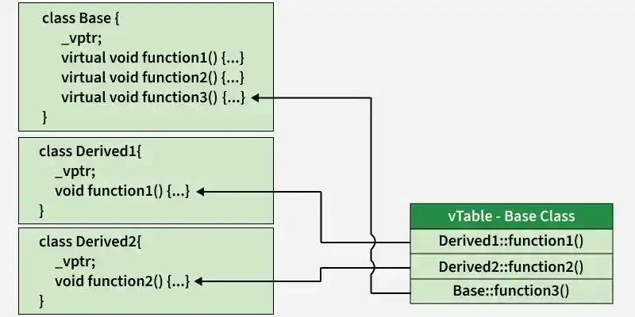 | 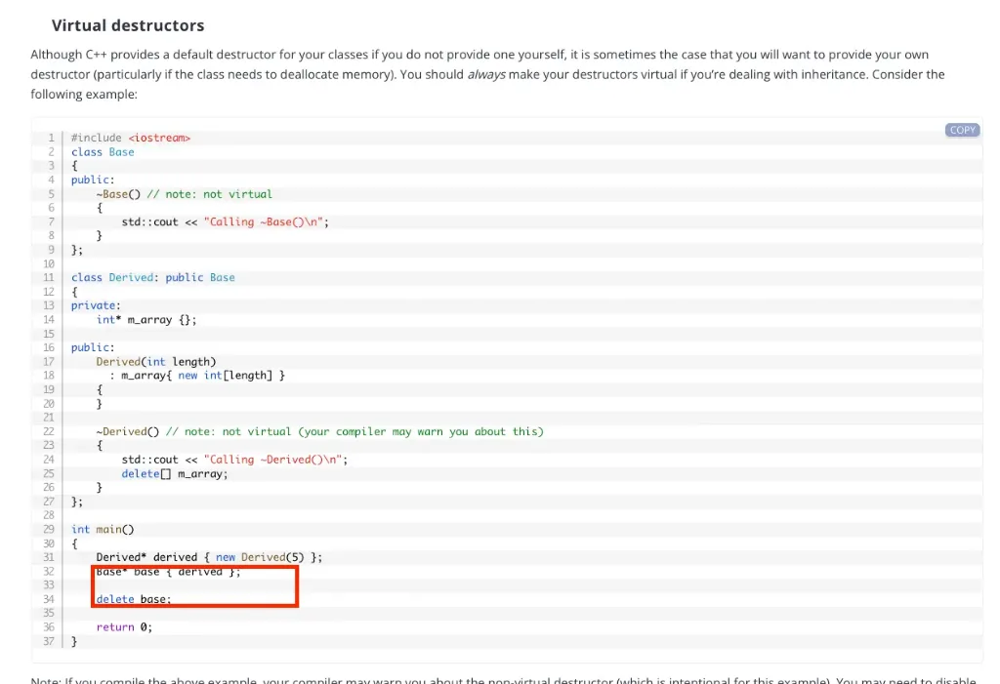 |

- **일반적인 구현 요소:** 클래스 단위의 vtable · 객체 단위의 vptr
- **호출 특성:** vtable을 통한 간접 호출

가상 함수는 객체의 동적 타입에 따라 호출 대상을 결정하는 동적 디스패치를 제공합니다. 일반적인 C++ 구현에서는 vptr와 vtable을 사용하지만, 이는 C++ 언어 표준이 아니라 ABI에서 정하는 구현 방식입니다.

> **언어 규칙 — [ISO/IEC JTC1/SC22/WG21, N5046, §11.7.3 `[class.virtual]`, 문단 10](https://www.open-std.org/jtc1/sc22/wg21/docs/papers/2026/n5046.pdf)**  
> “The interpretation of the call of a virtual function depends on the type of the object for which it is called.”  
> 가상 함수 호출은 객체의 동적 타입에 따라 해석된다는 규정입니다.
>
> **ABI 구현 사례 — [Itanium C++ ABI, §3.2.2 Virtual Table Components](https://itanium-cxx-abi.github.io/cxx-abi/abi.html#vtable-components)**  
> “For each virtual function declared in a class C, we add an entry to its virtual table.”  
> Itanium C++ ABI가 가상 함수의 virtual table 항목을 구체적으로 정의하는 부분입니다.

- **주의:** 상속 계층의 생성 순서 `기반 클래스 → 파생 클래스` · 소멸 순서 `파생 클래스 → 기반 클래스` · 생성자와 소멸자 내부에서는 더 파생된 클래스의 override 호출 없음

> **생성·소멸 중 가상 함수 호출 — [ISO/IEC JTC1/SC22/WG21, N5046, §11.9.5 `[class.cdtor]`, 문단 4](https://www.open-std.org/jtc1/sc22/wg21/docs/papers/2026/n5046.pdf)**  
> “the function called is the final overrider in the constructor's or destructor's class”  
> 생성자나 소멸자에서 호출한 가상 함수는 현재 생성·소멸 중인 클래스의 final overrider를 호출한다는 규정입니다. 생성과 소멸의 순서는 [N5046, §11.9.3 `[class.base.init]`, 문단 15](https://www.open-std.org/jtc1/sc22/wg21/docs/papers/2026/n5046.pdf)에서 확인할 수 있습니다.
>
> **순수 가상 함수 호출 — [ISO/IEC JTC1/SC22/WG21, N5046, §11.7.4 `[class.abstract]`, 문단 6](https://www.open-std.org/jtc1/sc22/wg21/docs/papers/2026/n5046.pdf)**  
> “the effect of making a virtual call to a pure virtual function directly or indirectly ... is undefined”  
> 생성자나 소멸자에서 현재 객체의 순수 가상 함수를 직접 또는 간접적으로 호출하면 정의되지 않은 동작입니다.

</details>

<details className="guide-details">
<summary>7. C++: Pointer와 Reference</summary>

## 7. C++: Pointer와 Reference

### 7.1 엔진 전역 수명: `init()`과 `term()`

```cpp
/**
     * @brief Initializes the ThorVG engine runtime.
     *
     * ThorVG requires an active runtime environment for rendering operations.
     * This function sets up an internal task scheduler and creates a specified number
     * of worker threads to enable parallel rendering.
     *
     * @param[in] threads The number of worker threads to launch.
     *                    A value of 0 indicates that only the main thread will be used.
     *
     * @return Result indicating success or failure of initialization.
     *
     * @note This function uses internal reference counting to allow multiple init() calls.
     *       However, the number of threads is fixed during the first successful initialization
     *       and cannot be changed in subsequent calls.
     *
     * @see Initializer::term()
     */
    static Result init(uint32_t threads = 0) noexcept;

    /**
     * @brief Terminates the ThorVG engine.
     *
     * Cleans up resources and stops any internal threads initialized by init().
     *
     * @retval Result::InsufficientCondition Returned if there is nothing to terminate (e.g., init() was not called).
     *
     * @note The initializer maintains a reference count for safe repeated use.
     *       Only the final call to term() will fully shut down the engine.
     * @see Initializer::init()
     */
    static Result term() noexcept;
```

```cpp
Result Initializer::init(uint32_t threads) noexcept
{
    if (engineInit++ > 0) return Result::Success;

    if (!_buildVersionInfo(nullptr, nullptr, nullptr)) return Result::Unknown;

    if (!LoaderMgr::init()) return Result::Unknown;

    TaskScheduler::init(threads);

    return Result::Success;
}


Result Initializer::term() noexcept
{
    if (engineInit == 0) return Result::InsufficientCondition;

    if (--engineInit > 0) return Result::Success;

#ifdef THORVG_CPU_ENGINE_SUPPORT
    if (!SwRenderer::term()) return Result::InsufficientCondition;
#endif

#ifdef THORVG_GL_ENGINE_SUPPORT
    if (!GlRenderer::term()) return Result::InsufficientCondition;
#endif

#ifdef THORVG_WG_ENGINE_SUPPORT
    if (!WgRenderer::term()) return Result::InsufficientCondition;
#endif

    TaskScheduler::term();

    if (!LoaderMgr::term()) return Result::Unknown;

    return Result::Success;
}
```

```cpp
TEST_CASE("Basic initialization")
{
    REQUIRE(
        Initializer::init() == Result::Success
    );
    REQUIRE(
        Initializer::term() == Result::Success
    );
}

TEST_CASE("Multiple initialization")
{
    REQUIRE(
        Initializer::init() == Result::Success
    );
    REQUIRE(
        Initializer::init() == Result::Success
    );

    REQUIRE(
        Initializer::term() == Result::Success
    );
    REQUIRE(
        Initializer::term() == Result::Success
    );
}
```

`Initializer::init()`과 `Initializer::term()`은 쌍으로 호출해야 합니다. 중첩 초기화는 참조 카운터로 관리하며 실제 종료는 마지막 `term()` 호출에서 수행합니다.

- **초기화·종료 대상:** `LoaderMgr` · `TaskScheduler` · 엔진 전역 상태
- **호출 규칙:** `init()`과 `term()`의 동일한 호출 횟수

### 7.2 `gen()`과 객체 소유권

```cpp
REQUIRE(
    Initializer::init() == Result::Success
);

{
    auto canvas = std::unique_ptr<SwCanvas>(
        SwCanvas::gen()
    );

    uint32_t buffer[100 * 100] = {};

    canvas->target(
        buffer,
        100,
        100,
        100,
        ColorSpace::ARGB8888
    );

    canvas->add(Shape::gen());
    canvas->update();
    canvas->draw();
}

REQUIRE(
    Initializer::term() == Result::Success
);
```

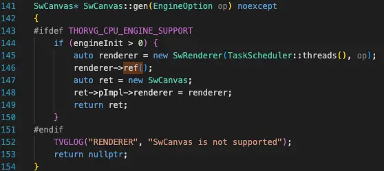

```cpp
// thorvg/inc/thorvg.h
struct TVG_API SwCanvas final : Canvas
{
    ~SwCanvas() override;  // public
};

struct TVG_API Paint
{
protected:
    virtual ~Paint();
};
```

ThorVG의 주요 객체는 `gen()` 정적 팩터리 함수로 생성하며, 현재 API는 raw pointer를 반환합니다.

- **Canvas**
  - 생성자 접근 권한: `protected`
  - 소멸자 접근 권한: `public`
  - 수명 관리: 사용자
  - 사용 사례: `std::unique_ptr`을 활용한 자동 해제
- **Paint**
  - 생성자 접근 권한: `protected`
  - 소멸자 접근 권한: `protected`
  - 추가 이후의 참조와 수명 관리: `Canvas` 또는 `Scene`
  - 컨테이너 소멸 이후의 참조 유지: `ref()`
  - 참조 해제: `unref()`

실제 선언에서 `Canvas`와 `SwCanvas`는 생성자가 `protected`, 소멸자가 `public`이며, `Paint`는 생성자와 소멸자가 모두 `protected`입니다. 따라서 객체는 `gen()`으로 생성하고 타입별 소유권 규칙에 맞게 해제해야 합니다. `Canvas`는 `delete` 또는 `std::unique_ptr`를 사용하고, `Paint`는 `Paint::rel()` 또는 `Canvas`·`Scene`의 소유권 관리 API를 사용합니다.

`Paint`의 일반적인 수명은 `Shape::gen()`으로 생성 → `Shape*` 반환 → `scene->add(shape)`로 추가 → 컨테이너의 참조 보유 → `remove()` 또는 컨테이너 소멸로 참조 감소 → 참조 카운트가 0이면 삭제되는 흐름입니다.

사용자는 `ref()`와 `unref()` API를 통해 필요한 참조를 직접 유지하고 해제할 수 있습니다.

### 7.3 raw pointer와 `std::unique_ptr`

```cpp
SwCanvas* canvas = SwCanvas::gen();

if (error) {
    // 이 경로에서 delete가 누락되면 메모리 누수
    return;
}

delete canvas;
```

```cpp
auto canvas = std::unique_ptr<SwCanvas>(
    SwCanvas::gen()
);

if (error) {
    // 함수가 끝날 때 canvas 자동 삭제
    return;
}
```

- **raw pointer:** 소유권 정보 없음 · API 규칙에 따른 삭제 책임 · 조기 반환과 예외 경로의 해제 누락 가능성
- **`std::unique_ptr`:** 타입으로 표현된 단독 소유권 · 스코프 종료 시 자동 해제 · 이동을 통한 소유권 전달

ThorVG에서도 이전에는 `std::unique_ptr`를 반환했습니다.

> Scott Meyers, 『Effective Modern C++』, Item 18 — [“Use `std::unique_ptr` for exclusive-ownership resource management.”](https://www.oreilly.com/library/view/effective-modern-c/9781491908419/ch04.html)
>
> 팩터리 함수가 `std::unique_ptr`를 반환하면 반환값의 단독 소유권이 타입에 드러납니다. 호출자는 그대로 단독 소유권을 유지하거나 필요할 때 `std::shared_ptr`로 전환할 수 있으므로, 팩터리가 호출자의 최종 소유권 방식을 미리 제한하지 않습니다. 이 전환은 [C++ Working Draft N5046, §20.4.2.2.1 `[util.smartptr.shared.const]`](https://www.open-std.org/jtc1/sc22/wg21/docs/papers/2026/n5046.pdf)에 `shared_ptr(unique_ptr<Y, D>&& r)` 생성자로 규정되어 있습니다.

```diff
- static std::unique_ptr<Shape> gen();
+ static Shape* gen();

- Result push(std::unique_ptr<Paint> paint);
+ Result push(Paint* paint);
```

- **API 변경 전:** 2024년 11월 이전의 `std::unique_ptr` 기반 `gen()`과 `push()`
- **API 변경 후:** `ed01ef71` 커밋의 raw pointer 기반 API

> 참고: [commit `ed01ef71` — api: revise the spec](https://github.com/thorvg/thorvg/commit/ed01ef717e983f7c53e1cdfb0a68b02ae4b19375)
>
> **api: revise the spec**
>
> Remove the requirement for unique_ptr in the function prototypes.  
> This change will simplify the API usage, making it more streamlined  
> and user-friendly. However, memory management will now be the  
> responsibility of the user.

### 7.4 스코프와 RAII

```cpp
{
    std::scoped_lock lock(mutex);

    auto canvas = std::unique_ptr<SwCanvas>(
        SwCanvas::gen()
    );

    // canvas 작업
}
// canvas가 삭제되고 lock이 해제된다.
```

- **스코프:** 선언 지점에서 생성 · 선언의 역순으로 소멸 · 정상 종료와 조기 반환, 예외 전파 시에도 소멸자 호출
- **RAII:** 생성자에서 자원 획득 · 소멸자에서 자원 해제 · 잠금과 파일, 버퍼, 객체 소유권 관리
- **관련 표준 타입:** `std::unique_ptr` · `std::scoped_lock` · `std::lock_guard` · `std::vector` · `std::fstream`

ThorVG 내부에서도 같은 패턴으로 잠금의 수명을 관리합니다.

```cpp
// tvgLottieExpressions.cpp
{
    ScopedLock lock(_lockKey);
    // 보호되는 작업
}
// ScopedLock 소멸자가 잠금을 해제한다.
```

### 7.5 `tvg::malloc`

```cpp
// source/thorvg/src/common/tvgAllocator.h
template<typename T = void>
static inline T* malloc(size_t size)
{
    return static_cast<T*>(
        std::malloc(size)
    );
}
```

- **할당 함수:** `tvg::malloc` · `tvg::calloc` · `tvg::realloc` · `tvg::free`
- **목적:** 엔진 내부 할당 지점 통일 · 커스텀 할당자로의 교체 용이성

이 함수들은 표준 C 메모리 할당 함수 위에 얇은 계층을 제공합니다.

> 참고: [commit `b77f3ca0` — common: introduced designated memory allocators](https://github.com/thorvg/thorvg/commit/b77f3ca0242bb81f38519d44f232c7a9c4ed7db5)
>
> **common: introduced designated memory allocators**
>
> Support the bindings to be more integrable with a system's coherent memory management.
>
> Pleaes note that thorvg now only allow the desinated memory allocators here:
>
> `malloc` → `tvg::malloc`  
> `calloc` → `tvg::calloc`  
> `realloc` → `tvg::realloc`  
> `free` → `tvg::free`

### 7.6 Memory Coding Convention

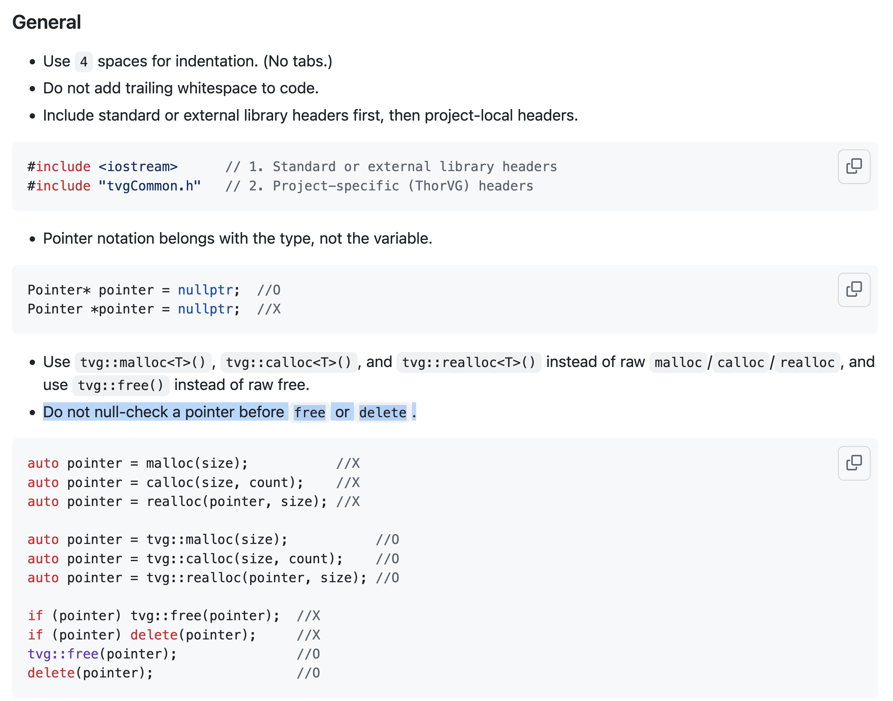

> [!NOTE]
> 표준 `delete`와 `std::free()`를 사용한다면 해제 전에 단순히 `nullptr`인지 확인하는 코드는 일반적으로 불필요합니다. `std::free(nullptr)`는 아무 동작도 하지 않으며, null pointer에 대한 `delete`는 객체의 소멸자를 호출하지 않습니다. 표준 라이브러리의 deallocation 함수가 null pointer로 호출되더라도 효과가 없습니다.
>
> 다만 이미 해제한 포인터를 다시 해제하는 double free는 안전하지 않으며, 사용자 정의 `operator delete`나 별도의 해제 API는 각 계약을 확인해야 합니다.
>
> `delete`와 `std::free()`는 호출자의 포인터 변수를 자동으로 `nullptr`로 바꾸지 않습니다. 해제 후에도 같은 변수를 다시 사용할 가능성이 있다면 `nullptr`로 설정해야 하는지 확인해야 합니다. 변수가 곧 스코프를 벗어난다면 불필요하며, 다른 복사본에 남은 dangling pointer까지 해결해 주지는 않습니다.
>
> **공식 근거 — [ISO/IEC JTC1/SC22/WG14, N3096, §7.24.3.3 `free`, 문단 2](https://www.open-std.org/jtc1/sc22/wg14/www/docs/n3096.pdf)**  
> “If ptr is a null pointer, no action occurs.”
>
> **공식 근거 — [ISO/IEC JTC1/SC22/WG21, N5046, §6.8.6.5.3 `[basic.stc.dynamic.deallocation]`, 문단 4](https://www.open-std.org/jtc1/sc22/wg21/docs/papers/2026/n5046.pdf)**  
> “if so, and if the deallocation function is one supplied in the standard library, the call has no effect.”  
> null pointer에 대한 `delete`의 소멸자 및 deallocation 동작은 같은 문서의 [§7.6.2.9 `[expr.delete]`, 문단 5~6](https://www.open-std.org/jtc1/sc22/wg21/docs/papers/2026/n5046.pdf)에 규정되어 있습니다.

</details>
