import ColorMismatchComparison from "./ColorMismatchComparison.astro";

# Core2026 - 3

> [!IMPORTANT]
> Static PNG Loader 이슈 처리 사례를 통해 Image Loader 이슈 작업 방식에 대해 알아봅시다.


## 1. Loader & LoaderMgr

### 1.1 Build Option

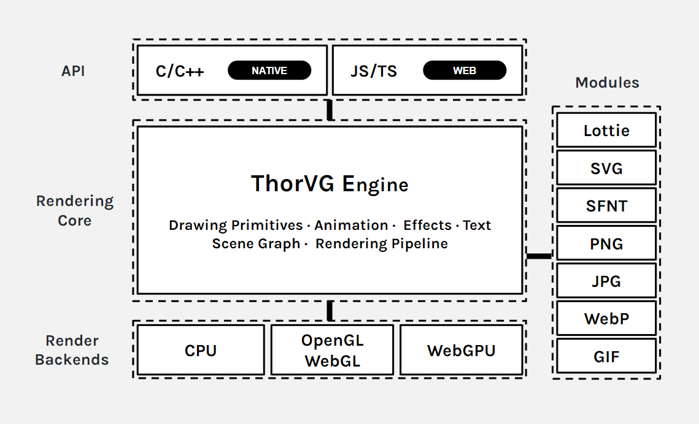

ThorVG의 **Loader**는 포맷별 모듈로 분리됩니다.

```meson
option('loaders',
   type: 'array',
   choices: ['', 'svg', 'png', 'jpg', 'lottie', 'ttf', 'otf', 'webp', 'media', 'all'],
   value: ['svg', 'lottie', 'ttf'],
   description: 'Enable File Loaders in thorvg')
```

`-Dloaders=`로 빌드에 포함할 파일 포맷을 선택합니다.

```meson
option('static',
   type: 'boolean',
   value: false,
   description: 'Force to use static linking modules in thorvg')
```

`-Dstatic=false`이면 시스템에 설치된 라이브러리를 우선 사용합니다.

> [!NOTE]
> static 옵션을 꺼도 **external lib**이 존재하지 않으면 **static** 모듈이 선택됩니다.

PNG Loader의 선택 조건입니다.

```meson
if png_loader
    if get_option('static')
        subdir('png')
    else
        subdir('external_png')
        if not png_dep.found()
            subdir('png')
        endif
    endif
endif
```

| 설정과 환경 | 선택되는 구현 |
|---|---|
| `static=true` | ThorVG 커스텀 Static PNG Loader |
| `static=false`, 시스템 libpng  o | External PNG Loader |
| `static=false`, 시스템 libpng  x | Static PNG Loader로 fallback |

### 1.2 경량 엔진 관점에서의 이점

- 필요한 포맷만 빌드에 포함
- 시스템 라이브러리가 있으면 외부 구현 사용
- 불필요한 코드 제외로 바이너리 크기 절감

### 1.3 Loader Manager와 Loader들

`Loader` 클래스는 디코더 wrapper가 아니라 모든 포맷이 따르는 공통 Base, LoaderMgr 에 의해 생성, 공유, 소멸됩니다.

```text
Loader
├─ ImageLoader ── w, h, playable, paint(), bitmap()
│  ├─ BitmapLoader ── RenderSurface
│  │  └─ PngLoader (+ Task)
│  └─ AnimLoader ── frame, duration, segment
└─ FontLoader ── glyph, metrics, transform
```

```cpp
struct Loader
{
    INLIST_ITEM(Loader);

    // Use either hashkey(data) or hashpath(path)
    uintptr_t hashkey = 0;
    char* hashpath = nullptr;

    FileType type;               // current loader file type
    atomic<uint16_t> sharing{};  // reference count
    Ownership owner = Ownership::Borrow;
    bool readied = false;        // read done already
    bool cached = false;         // cached for sharing

    //...
};
```

- `open()`: 입력 처리 가능 여부 확인 (파일 존재 여부, 파일 오픈여부 등 유효성)
- `read()`: Open한 데이터를 한 번만 읽음
    - TaskScheduler 에 요청 (실제 디코딩 시작, 멀티스레딩)
        - 비동기 처리는 `PngLoader`처럼 `Task`를 함께 상속한 구현에서만 사용
    - 엔진에 사용할 비트맵 데이터로 변환
- `sharing`: cache hit, `Picture::duplicate()`


#### LoaderMgr

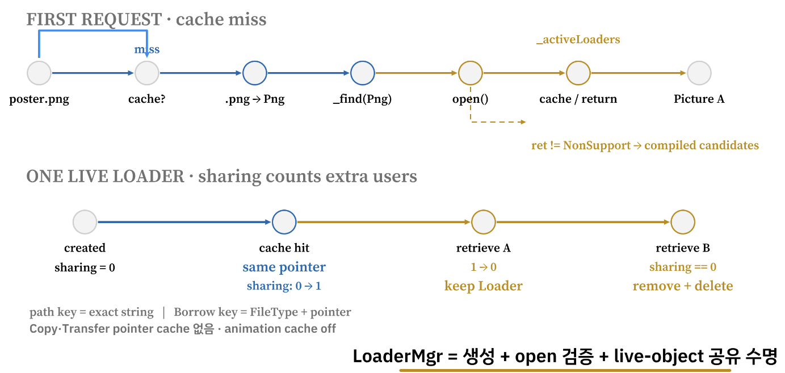


```text
LoaderMgr::loader("poster.png")
    │
    ├─ 같은 path의 live cache가 있는가? ── yes ─► 같은 Loader 공유
    │
    └─ no
       ├─ extension → FileType::Png
       ├─ _find(Png) → new PngLoader
       ├─ PngLoader::open(path, ops)로 실제 입력 검증
       ├─ 성공하면 path cache에 넣고 반환
       └─ InvalidArguments라면 컴파일된 다른 후보를 순서대로 확인
```

- `LoaderMgr`: Loader의 생성·검증·공유·폐기
- `_activeLoaders` -> Loader 객체의 공유 목록 (전역)
  - 메모리 cache key: pointer 주소


## 2. Static PNG Loader

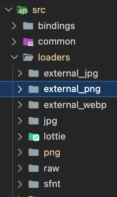

- **External**: 시스템의 외부 라이브러리 사용
- **Static**: 자체 구현 또는 필요한 부분만 가져온 오픈소스 사용

### 2.1 Static Loader 구현을 위한, 오픈소스 도입 히스토리

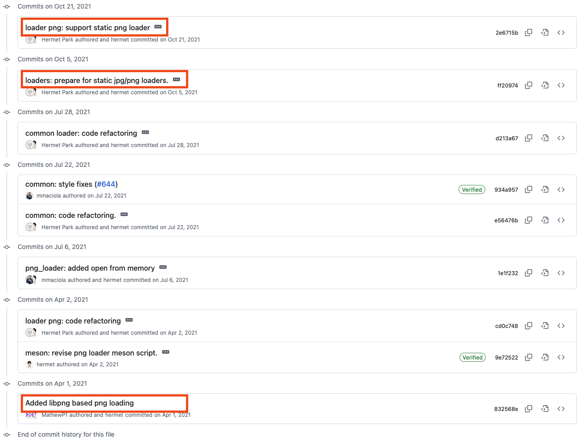

External 구현에 **libpng**를 도입한 뒤, Static 구현에는 [LodePNG](https://github.com/lvandeve/lodepng)를 통합했습니다.

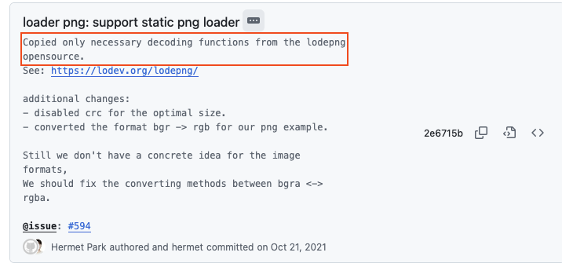

- LodePNG 전체가 아닌 디코더 부분만 통합
- 사용하지 않는 기능 제거
- ThorVG의 색 공간과 메모리 정책에 맞게 수정

| Color Space 커스텀 | 사용하지 않는 기능 제거 | 메모리 할당 커스텀 |
|---|---|---|
| 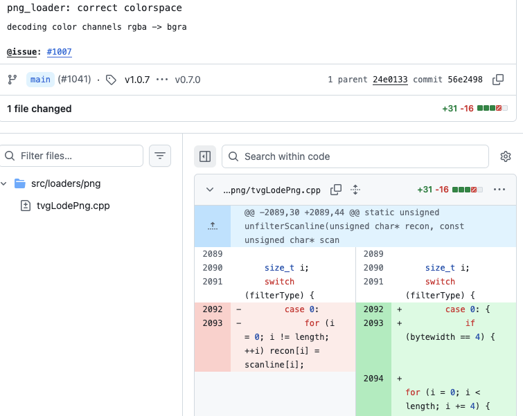 | 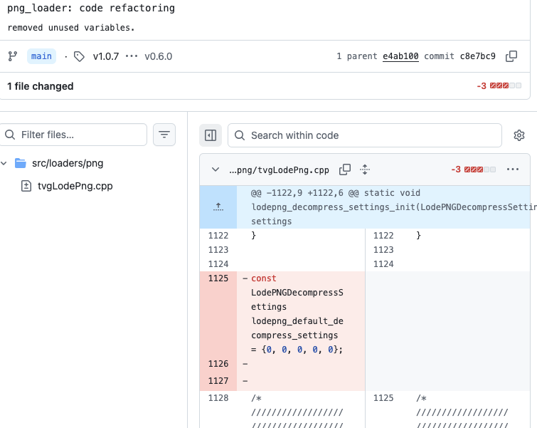 | 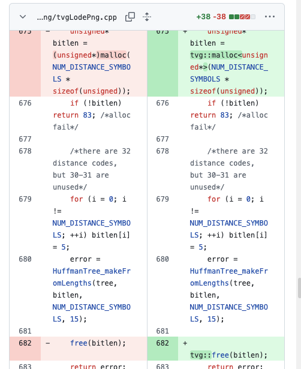 |


| 시점 | 변경 | 의미 |
|---|---|---|
| 2021-04 | [libpng 기반 PNG loading](https://github.com/thorvg/thorvg/commit/832568e07ae69ac33ad32928527d15d4422c6ba6) | External PNG Loader의 출발점 |
| 2021-10 | [static JPG/PNG loader 준비](https://github.com/thorvg/thorvg/commit/ff209746322c5e5730ead362e852b7880b46f3e9) | static/external 선택 구조 마련 |
| 2021-10 | [LodePNG 기반 static loader](https://github.com/thorvg/thorvg/commit/2e6715ba41173f44855701eb984bdecc07090117) | 필요한 decoder subset만 통합 |
| 2021-11 | [RGBA/BGRA 경로 보정](https://github.com/thorvg/thorvg/commit/56e2498466bd99778a0702878e522cd711903fac) | 출력 pixel 표현을 ThorVG에 맞춤 |
| 2023-08 | [강제 색 채널 변환 되돌림](https://github.com/thorvg/thorvg/commit/3601d3db3abc71bece530ac76e94404321ff2025) | renderer 공통 변환과 역할 중복 제거 |
| 2025-02 | [지정 메모리 할당자 도입](https://github.com/thorvg/thorvg/commit/b77f3ca0242bb81f38519d44f232c7a9c4ed7db5) | `tvg::malloc/free`로 메모리 경계 통일 |
| 2026-07 | [PR #4568](https://github.com/thorvg/thorvg/pull/4568) | iCCP profile을 읽어 sRGB로 변환 |


### 2.2 PngLoader

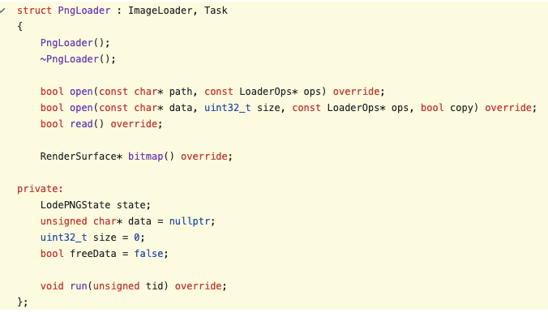

- `PngLoader`: `BitmapLoader`와 `Task` 상속
- PNG 디코딩: `TaskScheduler`를 통한 비동기 처리


#### open

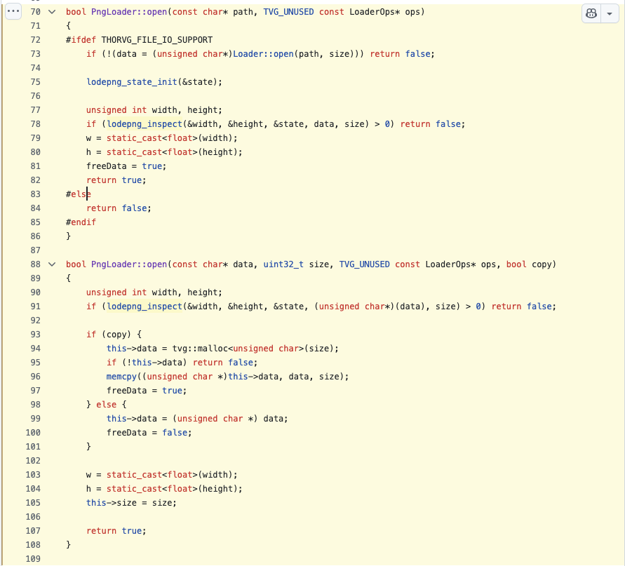

두 가지 경로가 있습니다.

- 파일 경로 `open`: `Picture::load()`에서 사용
- 메모리 data `open`: Lottie 에서 PNG를 base64로 인코딩한 뒤 JSON에 포함시켜 전달할 때 사용

두 함수는 실제 디코딩은 수행하지 않으며 역할은 다음과 같습니다.

- 디코더 라이브러리에서 width, height, 포맷 정보를 query하여 관리
- width, height를 통해 디코딩된 데이터가 저장될 버퍼 준비

#### read

```cpp
void PngLoader::run(unsigned tid)
{
    auto width = static_cast<unsigned>(w);
    auto height = static_cast<unsigned>(h);

    state.info_raw.colortype = LCT_RGBA;   // request this image format

    if (lodepng_decode(&surface.buf8, &width, &height, &state, data, size)) {
        TVGERR("PNG", "Failed to decode image");
    }

    if (state.info_png.iccp_defined) {
        lodepng_toSrgb(surface.buf8, width, height, &state.info_png);
    }

    surface.stride = width;
    surface.w = width;
    surface.h = height;
    surface.cs = ColorSpace::ABGR8888S;
    surface.channelSize = sizeof(uint32_t);
}

bool PngLoader::read()
{
    if (!data || w == 0 || h == 0) return false;
    if (!Loader::read()) return true;

    TaskScheduler::request(this);
    return true;
}
```

실제 디코딩은 **TaskScheduler**에 요청합니다.
- surface .buf8 에 비트맵 정보를 저장하며 SW, GL, WG 각 렌더 백엔드에서 사용

> [!NOTE]
> 몇몇 Loader는 TaskScheduler를 사용하지 않음 (Thread Safe 와 관련있을 것으로 추정)
>
> `PngLoader::bitmap()`은 `done()`으로 worker 완료를 기다린 뒤 surface를 반환합니다.
>
> ```cpp
> RenderSurface* PngLoader::bitmap()
> {
>     done();
>     return BitmapLoader::bitmap();
> }
> ```


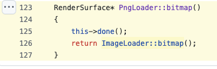


- **gl, wg → texture**

#### Picture::update

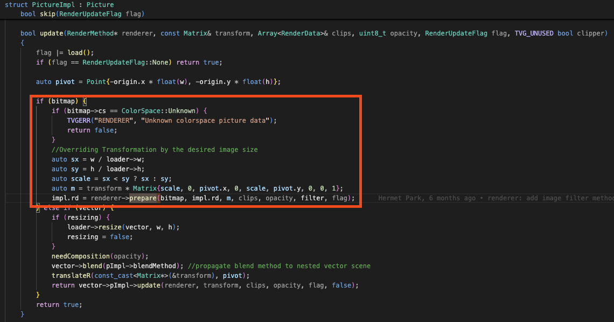


#### WG Prepare -> Texture

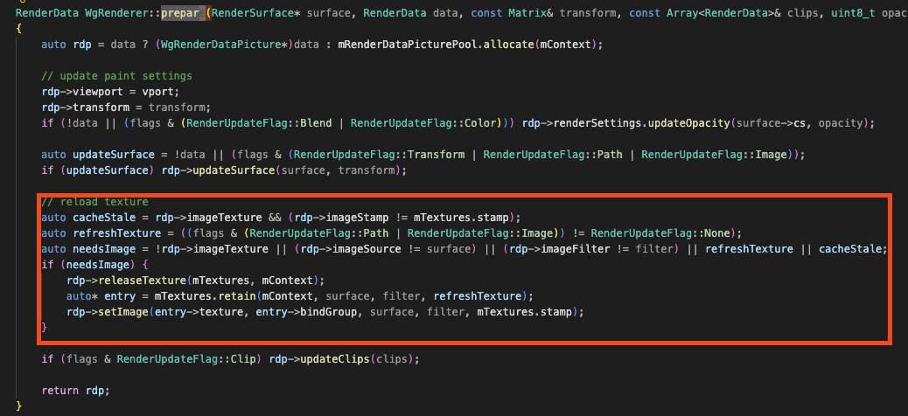

#### GL Prepare -> Texture

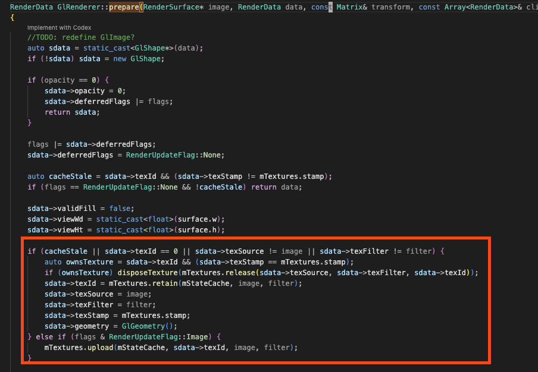


## 3. Loader 이슈 처리 사례

- 사례: Static PNG Loader의 색상 불일치하다는 이슈
- 현상: 동일한 PNG의 렌더링 결과에서 색상 차이 발생


<ColorMismatchComparison />

### 3.1 이슈 파일 분석하기

가설: ThorVG가 이슈 파일의 PNG 스펙 일부를 지원하지 않음, 별도의 툴 -> 파일 내부 조사

`pngcheck`로 이슈 파일의 청크를 확인합니다.

```text
// 색상 차이가 발생하는 이슈 케이스
➜ png-color git:(nor-s/png-color) ✗ pngcheck -v image-test.png
File: image-test.png (19816 bytes)
  chunk IHDR at offset 0x0000c, length 13
    458 x 442 image, 32-bit RGB+alpha, non-interlaced
  chunk iCCP at offset 0x00025, length 3151
    profile name = ICC Profile, compression method = 0 (deflate)
    compressed profile = 3138 bytes
  chunk cICP at offset 0x00c80, length 4
:   Display P3
    White x = 0.3127 y = 0.329, Red x = 0.68 y = 0.32
    Green x = 0.265 y = 0.69, Blue x = 0.15 y = 0.06
    Full range
  chunk eXIf at offset 0x00c90, length 138: EXIF metadata, big-endian (MM) format
  chunk pHYs at offset 0x00d26, length 9: 5669x5669 pixels/meter (144 dpi)
  chunk iTXt at offset 0x00d3b, length 470, keyword: XML:com.adobe.xmp
    uncompressed, no language tag
    no translated keyword, 449 bytes of UTF-8 text
  chunk iDOT at offset 0x00f1d, length 28: illegal unknown, public chunk
ERRORS DETECTED in image-test.png
```

정상 파일의 청크 구성입니다.

```text
// 색상 차이가 없는 케이스
File: deps.png (3943610 bytes)
  chunk IHDR at offset 0x0000c, length 13
    2182 x 13604 image, 32-bit RGB+alpha, non-interlaced
  chunk bKGD at offset 0x00025, length 6
    red = 0x00ff, green = 0x00ff, blue = 0x00ff
  chunk IDAT at offset 0x00037, length 8192
    zlib: deflated, 32K window, default compression
  chunk IDAT at offset 0x02043, length 8192
  chunk IDAT at offset 0x0404f, length 8192
  chunk IDAT at offset 0x0605b, length 8192
```

- 차이점: 이슈 파일에는 `iCCP`, `cICP` 색상 정보 청크가 포함됨

> [!NOTE]
> PNG(Portable Network Graphics)는 **무손실 압축 방식**을 지원하는 단일 이미지 파일 포맷입니다. 파일 안의 **일련의 청크**로 이미지 정보를 전달합니다.
>
> **필수 청크**
>
> - **IHDR**: width, height, bit depth, color type 등
> - **IDAT**: 이미지 데이터
> - **PLTE**: 색상 목록
> - **IEND**: 마지막 청크 표시
>
> **색과 관련된 보조 청크**
>
> - **cICP**: ITU-T H.273의 색 공간, transfer function, matrix coefficient를 지정
> - **iCCP**: 압축된 ICC color profile
> - **sRGB**: 표준 sRGB color space가 사용되었음을 표시
> - **cHRM + gAMA**: 원색과 white point의 색도 좌표, gamma 지정

- 원인: 당시 ThorVG의 compact LodePNG에는 색상 profile 변환 경로가 없었음
  - 필수 청크 통합/보조 청크 제외 -> 미지원 된 기능

### 3.2 PNG 색과 관련된 보조 청크

> [!NOTE]
> 용어 정리
>
> - **색 공간**: RGB 숫자가 어떤 실제 색을 뜻하는지 정한 규칙
> - **색 프로필**: 이미지의 색 공간 특성을 기록한 데이터
> - **iCCP**: 압축된 ICC profile을 저장하는 PNG 청크
> - **ICC Profile**: 색 입력 장치나 색 출력 장치의 특성을 기록한 데이터 집합

- 같은 RGB 값도 색 공간에 따라 실제 색이 달라짐
- 디자인 도구는 색상 profile을 PNG 보조 청크에 저장
- IDAT의 RGB 값만으로는 제작자가 의도한 색을 재현할 수 없음

```cpp
/*
Color profile related chunk types: cICP, iCCP, sRGB, gAMA, cHRM, sBIT

LodePNG does not apply any color conversions on pixels in the encoder or
decoder and does not interpret these color profile values. It merely passes
on the information. If you wish to use color profiles and convert colors,
a separate color management library should be used. There is also a limited
library for this in lodepng_util.h.

Only one color information source should be handled, in this priority:
1: cICP
2: iCCP
3: sRGB
4: gAMA and cHRM
*/
```

cICP, iCCP, sRGB, gAMA, cHRM은 PNG 색상 profile 관련 청크입니다.
- 한가지 중 선택해서 사용
- 우선순위: cICP > iCCP > sRGB > gAMA + cHRM

#### iCCP 안에는 무엇이 있는가

기존 RGB 를 일정 수학적 변환으로 sRGB로 변환하는 정보를 가지고 있음
- `rXYZ`, `gXYZ`, `bXYZ`로 source RGB → XYZ matrix 구성
- `rTRC`, `gTRC`, `bTRC` curve로 encoded RGB를 linear RGB로 복원
- `wtpt`와 optional `chad` tag로 white point와 chromatic adaptation 처리

3차원 변환 행렬이 계산의 주가 되며


LodePNG 의 이런 변환 함수를 ThorVG 에서 사용가능하게 하는것이 이번 이슈의 목표


### 3.3 LodePNG 작업과 PR #4568

[lodepng_util.h](https://github.com/lvandeve/lodepng/blob/master/lodepng_util.h)의 iCCP 처리 코드에서 ThorVG에 필요한 부분만 적용했습니다.

PR: [loader/png: added sRGB conversion for embedded ICC profiles #4568](https://github.com/thorvg/thorvg/pull/4568)

| 적용 전 | 적용 후 | macOS Preview |
|---|---|---|
| 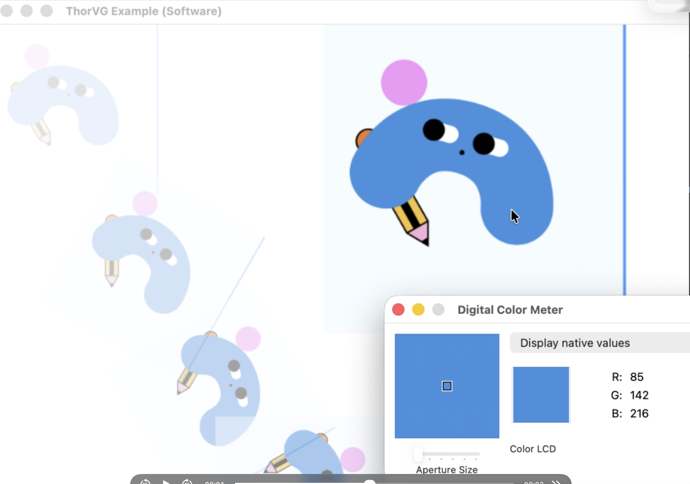 | 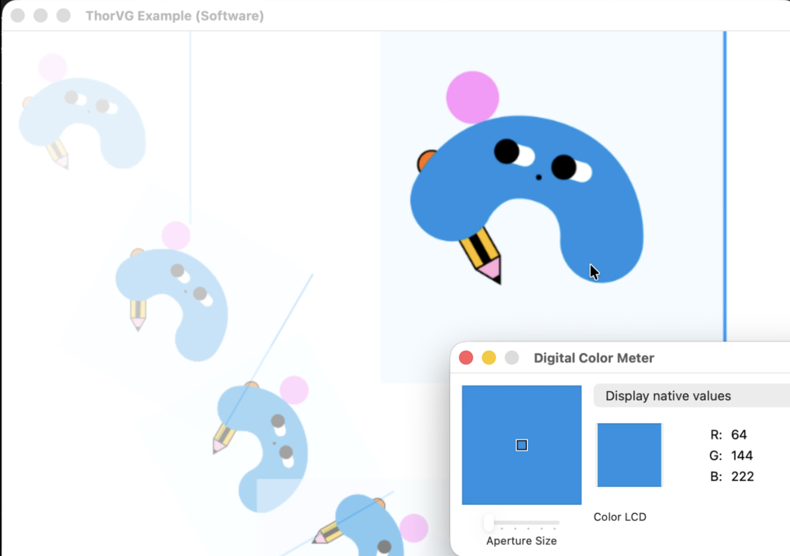 | 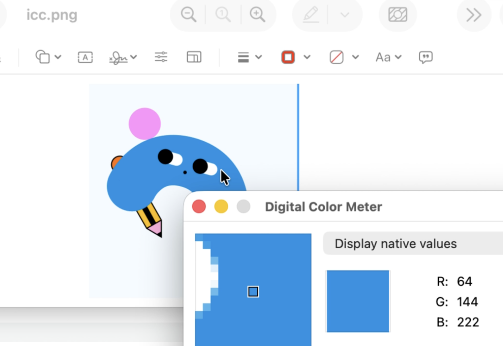 |

#### 진행한 작업들

1459 라인인 오픈소스를 최종적으로 456 라인으로 코드 정리
- 전체적인 코드흐름을 읽고 필요한 부분만 통합
- ThorVG 의 Math 함수들 사용 (ex. 행렬 연산)
- 실제적인 사용 사례가 적은 코드 제거 (Grayscale)
- ThorVG 의 메모리 함수 사용
- 중복된 로직 제거
- LodePNG 에서 테스트 되지 않은 영역 제거


### 4. 결론

```text
이슈 파일 분석
→ 포맷 스펙 분석
→ 문제 해결 방향 정하기
→ 오픈소스 코드 분석과 필요한 부분 통합
```

- 포맷과 파일 스펙을 먼저 확인
- 재현 테스트로 해결 기준 고정 (최종 Display 색 일치)
- 오픈소스 내부 구현을 이해하고 필요한 범위만 통합
